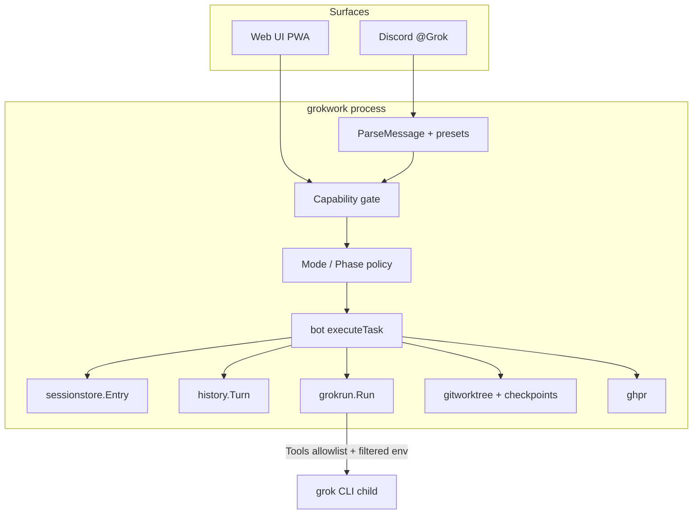
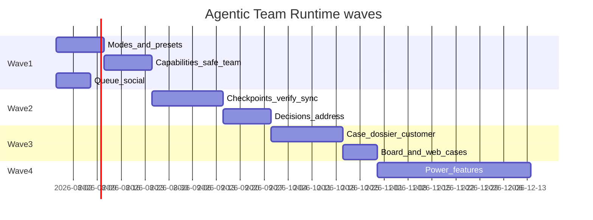
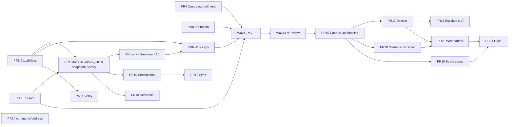

# Agentic Team Runtime — IDE-free developers + non-IT investigation/support

| Field | Value |
|-------|-------|
| **Status** | Draft (rev 6 — product decisions locked; ready for Trust train) |
| **Author** | — |
| **Date** | 2026-07-22 (rev 6 decision lock) |
| **Repo** | `github.com/acoshift/grokwork` |
| **Audience** | Senior engineers familiar with this codebase |
| **Related** | `Claude.md`, `TODO.md`, `docs/design-full-workflow-web-ui.md`, `docs/design-crash-safe-active-runs.md`, `docs/design-per-user-github-identity.md`, **`docs/design-no-pr-mode.md`** (shipped) |
| **Advisor** | Fable xhigh 2026-07-22 — **go-with-changes** (rev 4). Rev 5 = code recheck, not a second design pass. |

---

## Overview

**Grok Work** (`grokwork`) is a single Go process that bridges Discord and the `grok` CLI. Users tag `@Grok <task>` in a mapped channel; the bot runs Grok Build headless against a local checkout (per-thread git worktree + branch `grok/discord/<threadId>` or `grok/web/<unitId>`), streams replies into a Discord thread, opens PRs via `gh`, polls CI, and serves a private-network admin web UI. The core invariant is:

> **One Discord thread (or web unit) = one git worktree = one managed branch = one Grok session.**

Today every freeform task inherits the **remote-work contract** (`remoteWorkPromptPrefix` in `internal/bot/bot.go`): commit, push, open a PR, do not merge. Yolo is often on. That is correct for engineers shipping fixes, but unsafe and incomplete for two audiences that now need first-class product support:

1. **IDE-free developers** — phone, Discord, PWA — who need ship confidence (checkpoints, verify, sync, decision cards) without VS Code/Cursor.
2. **Non-IT team members** (support, CS, ops, product, founders, SE) who need to **investigate** customer problems and draft customer-safe answers without git/PR literacy — and without accidental code writes or PR opens.

This design repositions grokwork as the **team agent runtime**: a shared execution unit with human authority at each gate. The unit stays the same (`sessionstore.Entry` + worktree + session). What changes is a first-class **session mode** (investigate / explain / fix / case), a **capability model** (roles × actions, fail-closed), **hard tool/policy gates** enforced by the bot (not prompt alone), and a phased delivery of trust, IDE-free confidence, and mixed-team case lifecycle.

---

## Code baseline recheck (rev 7 — 2026-07-23)

Rev 5 snapshot is **historical**. Trust (Wave 1), IDE-free (Wave 2), Support/CS cases (Wave 3 + web board/intake/session panel), and related polish are largely on `main` as of 2026-07-23.

### Implementation status vs this design

| Design item | Status | Evidence |
|-------------|--------|----------|
| **Session `Mode`** (investigate/explain/fix/case) | **Shipped** | `Entry.Mode` / Phase / case fields; freeform + `/start` + web start |
| **RunPolicy hard gates** in `executeTask` | **Shipped** | `run_policy.go`; AllowPR/tools/env gates; K27 ShipMode × Mode |
| **Capabilities / SafeTeamMode** | **Shipped** | `capabilities.go`; project config UI; K16 unmapped default |
| **Queue as social object** | **Shipped** | Author/intent; `/queue` `/dequeue` `/cancel-mine` |
| **K19 policy/RoleIDs snapshot** | **Shipped** | taskItem + journal Snap* fields; live tighten |
| **history.Turn RunKind** | **Shipped** | RunKind/Mode/Phase on turns |
| **Filtered Grok child env (Layer A / K26)** | **Shipped** | denylist + omit GH_TOKEN when !IncludeGHToken; Layer B allowlist still deferred |
| **Attribution trailers (PR8)** | **Shipped (Tier A)** | `discordUserGitHub` map + `BuildAttributionBlock` on ship prompts; host remains pusher |
| **Checkpoints / `/undo`** | **Shipped** | `refs/grok-cp/…`; `/checkpoint` `/undo` `/restore` |
| **Verify harness** | **Shipped** | project `verifyCommands`; `/verify`; config UI; session `LastVerify` panel |
| **`/sync`** | **Shipped** | fetch + merge origin primary |
| **Decision cards** | **Shipped** | `DECISION:` blocks → Discord buttons → OpenQuestions |
| **Case / dossier / customer update** | **Shipped** | Discord case cmds + web board / create / session panel / phase POSTs |
| **Discord `/comments` + `/address`** | **Shipped** | Wired to `ghpr` + `StartAddressReview` |
| **Task presets `/start`** | **Shipped** | `/start investigate\|fix\|explain` + web start modes |
| **`Options.Tools` / tools-off rewrite** | **Shipped** | investigate tool allowlist on task runs |
| **Crash-safe resume** | **Shipped (other design)** | `runjournal` + `ResumeActiveRuns` |
| **No-PR / direct-to-primary** | **Shipped (other design)** | `DirectToPrimary`, `ShipMode` |
| **Team PR reviews (web)** | **Shipped** | `reviewstore` + web PR reviews |
| **Discord `/review`** | **Partial** | Request map shipped; not full GH review-request radar |
| **Web in-flight turn stream** | **Shipped** | session partial live reply |
| **Web auth + project ACL** | **Partial** | OAuth optional; feature flags; project visibility |
| **Audit log** | **Partial** | Web mutations + session/case actions; not full tool audit |
| **Bulk issue Fix, commit-review, idle fetch** | **Shipped** | Orthogonal polish |
| **OS agent sandbox** | **Design only** | `docs/design-agent-sandbox.md` |
| **Wave 4 power** | **Deferred** | fork-fix, conflict clinic, SafeOps, ephemeral previews |

### Critical composition rule (new since rev 4)

**`Entry.ShipMode` (pr \| direct) is orthogonal to session `Mode` (investigate \| fix \| case \| …).**

| Session Mode (this design) | ShipMode=pr | ShipMode=direct |
|----------------------------|-------------|-----------------|
| fix / case fixing | remote-work PR prefix + PR cards | remote-work **direct** prefix + post-run bot integrate (existing) |
| investigate / explain / case investigate | AllowPR=false, no PR cards, no direct ship | **Same** — never push primary from investigate |
| case closed | reject runs | reject runs |

Implement `RunPolicy` so `AllowPR` / post-run ship path is:

```text
effectiveShip = (RunPolicy.AllowPR || RunPolicy.AllowDirectShip) && Entry.ShipMode
```

Investigate must set both **AllowPR=false** and **AllowDirectShip=false** (or equivalent) so yolo + `directToPrimary` cannot ff-push support investigations onto primary. Rev 4 RunPolicy table used “AllowPR” alone — **extend to ship-aware gates** when implementing PR1 (see Key Decision **K27**).

### What “ready for Wave 1” still means

Advisor go-with-changes stands. **Nothing in the Trust train has been implemented.** Start order unchanged:

```text
PR4 ∥ PR5 ∥ PR8 ∥ PR7 → PR1 → PR3 → PR6
```

PR1 must compose with **shipped** `ShipMode` / `remoteWorkPromptPrefixMode(branch, direct)`.

---

## Background & Motivation

### Current architecture (verified in code — rev 5)

| Layer | Location | Behavior |
|-------|----------|----------|
| Wiring | `main.go` | `config.Load` → `sessionstore.New` → `history.New` → `bot.New` → `web.New` |
| Message gate | `bot.onMessage` → `checkMessageAccess` | not-bot → guild → mention → channel→project → **per-project allowlist** (fail-closed when both lists empty) |
| Parse | `prompt.go` `ParseMessage` | `/help` `/projects` `/reset` `/status` `/cancel` `/fix-ci` `/claim` `/hand-off` `/brief` `/label` `/board` `/link` `/unlink` **`/review`** + `KindTask` freeform. **No** `/start` `/queue` `/case` `/investigate` `/address` `/comments` `/checkpoint` `/verify` `/sync` |
| Unit | `sessionstore.Entry` | SessionID, Cwd, branch, owner/co-owners, Goal, Label, Issues[], PRs[], Origin/CreatedBy, **ShipMode/ShippedSHA/PrimaryBranch** — **no** Mode/Phase/case |
| Run state | `Bot.states` + `runjournal` | One `runJob` + FIFO queue (max 5); durable journal + crash resume (`ResumeActiveRuns`) |
| Prompt contract | `remoteWorkPromptPrefixMode(branch, direct)` | PR path: commit/push/`gh pr create`. Direct path: commit on managed branch; bot integrates to primary post-run. Always no merge of GitHub PRs |
| Grok exec | `grokrun.Run` | **`cmd.Env = os.Environ()`**; `Options.Tools` / `NoSubagents` exist; **task runs do not set Tools** (yolo from config) |
| Access model | `AccessAllowed` + `WebAuth` | Discord binary allowlist. Web: viewer/member/admin + `WebAuthFeatures{GitHubWrites,Merge,StartSessions,PRReviews}` |
| Reviews | `reviewstore` + web | Team PR reviews (Discord-attributed, stale-on-push); separate from session Mode |
| Preserve pattern | `preservePRFields` chain | Ownership, brief, label, issues, workflow **including ShipMode fields** |
| Lifecycle | `sessionstore.Label` | `open → in_progress → blocked → needs_review → done \| abandoned` (+ direct-mode revive on re-run) |
| Board | `/board` | running/queued/waiting/stale + label filters |
| Dual surface | `StartTask` / Fix / Address / commit-review | Web starts + **in-flight turn** on session detail; Discord still primary stream |

### Pain points (still true)

1. **No investigate mode.** Freeform “why is X broken?” can still commit and open a PR (or **direct-ship to primary** if project `directToPrimary`) under yolo.
2. **No case lifecycle.** Support has no intake → investigate → answer/escalate → close path on one unit.
3. **No customer-safe output channel.** Eng brief and model prose mix internal paths and customer language.
4. **Weak IDE-free confidence.** No bot-owned git checkpoints/`/undo`, no project verify harness, no `/sync`.
5. **Binary allowlist.** No capability flags for “investigate but never githubWrites / never direct ship.”
6. **Queue is not a social object.** Authors and intent previews not first-class (`TODO.md` P0 still open).
7. **Safe team mode incomplete.** No filtered Grok child env, no concurrency caps product, no attribution trailers; audit is web-centric only.

### Product definition

| Interpretation | Decision |
|----------------|----------|
| “Another coding agent with chat” | **Rejected** — team runtime with gates |
| Separate support-ticket product / second store | **Rejected** — cases are sessions with mode/phase |
| Prompt-only “please don’t open PRs” | **Rejected** — bot must enforce `allowPR=false` |
| Multi-Grok debate / auto-merge / public SaaS | **Non-goals** (unchanged) |

---

## Goals & Non-Goals

### Goals

1. **Session modes** with different prompt contracts **and** hard bot gates (tools, PR allow, yolo, github writes).
2. **Capability model** mapping Discord roles / web membership → fail-closed action flags per project.
3. **Investigate + explain** usable by non-IT without PR literacy; dossier and customer-safe drafts as first-class artifacts.
4. **Case lifecycle** on the same unit: intake → investigate → answered | escalate → fix → ship → closed.
5. **IDE-free ship confidence** for builders: checkpoints/undo, verify harness, sync, decision cards, review address loop.
6. **Queue as social object** (author, intent preview, `/queue`, `/dequeue`, `/cancel-mine`).
7. **Safe team mode completion** so allowlists can widen: env filter, rate/concurrency, attribution.
8. **Preserve the unit**: one thread = one worktree = one branch = one session; channel→project remains SoT; bot never merges; local paths never in Discord.
9. **Phased delivery** (Waves 1–4) with independently reviewable PRs; Wave 1–2 do not require case support to ship value. Wave 3 is a **product sketch** re-reviewed before PR15 (K14).

### Non-Goals

- In-browser IDE / full file editor.
- Multi-Grok debate per thread.
- Bot auto-merge (or non-IT merge).
- Freeform prod shell for support.
- Auto-email / auto-SMS customers (draft only; human sends).
- Second support-ticket store or Zendesk/Linear replacement.
- Public multi-tenant SaaS.
- In-chat project switching.
- Full Linear `issueUpdate` state machine (native Linear↔GitHub remains SoT for PR→Done).
- Perfect tool sandbox (OS bubblewrap) in Wave 1 — env filter + CLI tool allowlists first.
- True per-user GitHub write identity (see `design-per-user-github-identity.md` Tier B); Wave 1 uses **attribution only**.

---

## Key Decisions

| # | Decision | Rationale |
|---|----------|-----------|
| **K1** | **Modes live on `sessionstore.Entry.Mode`**; empty Mode = legacy fix behavior | Backward compatible; no second store; Patch preserves across `Set` rebuilds via `preserveModeCaseFields`. |
| **K2** | **Bot enforces gates; model proposes.** Full `RunPolicy` (pre-run + post-run) is applied in `executeTask`; prompt is not a control plane | Prompt-only is fail-open under yolo; `remoteWorkPromptPrefix` must not be the only control. |
| **K3** | **Cases are sessions with `Mode=case` + `Phase`**, not a separate ticket DB | Keeps one unit, one worktree, one board surface; Linear remains optional external card. |
| **K4** | **Escalation reuses the same thread/worktree by default** | Avoids losing dossier context; eng claims ownership and switches **Phase** to `fixing`; optional `/fork-fix` later if isolation needed. |
| **K5** | **Three artifacts on one session:** Dossier (internal) · Eng brief (existing) · Customer update (external-safe) | Dual cards prevent leaking branch/paths/PRs to customers. |
| **K6** | **Capability flags are fail-closed per project** | Empty/unset capabilities for non-builders deny write/PR/start-fix; investigate can be enabled without githubWrites. |
| **K7** | **Investigate/explain: `AllowPR=false` + restricted tools + yolo off + omit `GH_TOKEN` from child env** even if global yolo is true | Defense in depth: tools allowlist alone is insufficient if shell/`gh` remain available under host token. |
| **K8** | **Checkpoints are bot-owned git** on managed branches only; restore requires managed branch + session Cwd match + ref under that thread’s `refs/grok-cp/<threadId>/` namespace | Model must not invent undo; ref namespace is separate from `IsManagedBranch` (branch names only today). |
| **K9** | **Verify harness is project-defined commands the bot runs**, not model self-report | Trust the exit code of `make test` / project scripts; Verify card is deterministic. |
| **K10** | **Queue social metadata ships in Wave 1 before case support** | Multi-person thrash is the current P0; cases need a trustworthy queue. |
| **K11** | **CustomerRef is opaque** (hash/token or external id string); never require PII in session fields | Support pastes ticket id; raw email/phone stay out of `sessions.json` / Discord when possible. |
| **K12** | **Effective auth = membership ∩ project capabilities ∩ (web: WebAuthFeatures)** | Discord: allowlist + caps. Web: project visibility + caps **AND** global `WebAuthFeatures` for overlapping flags. Neither surface alone elevates. |
| **K13** | **`history.Turn.RunKind` (+ Mode/Phase) records mode/preset** for analytics; lands with PR1 | North-star metrics need durable turn classification from the first modes run; do not defer to Wave 3. |
| **K14** | **Wave 4 power features are stubs until gates land.** Wave 1 = **Trust + investigate gates only** (user decision rev 6). **Wave 3 is next product priority after Trust** (Support/CS persona) — re-review before PR15 still required, but do not defer indefinitely; do not pre-build case fields in Wave 1. | Avoid preserve-chain tax in Wave 1; Support/CS is the near-term non-eng persona. |
| **K15** | **Empty Mode freeform = fix** only when actor has **both** `StartSessions` **and** `GithubWrites` (or SafeTeamMode off → builder default). **No half-fix:** `StartSessions` without `GithubWrites` is **coerced fully to investigate policy** (user decision rev 6) — never fix-policy with `AllowPR=false`. Non-empty Mode: freeform inherits session Mode/Phase policy. | Custom templates could grant StartSessions alone. Coerce is safer UX than reject for mis-mapped support roles; shipped builtins still pair StartSessions+GithubWrites on builder. |
| **K16** | **SafeTeamMode unmapped allowlisted users → `safeTeamDefaultTemplate` (default `investigator`)** — never builder-under-safe, never silent eng elevation. Eng roles/users must be explicitly mapped to `builder` (or higher). | Security-critical fail-closed story; builder default only when SafeTeamMode is **off** (backward compat). Config UI warns on unmapped members. **Rollout:** enabling SafeTeamMode demotes every unmapped member immediately and K19 re-check tightens already-queued tasks — intended; document in rollout. |
| **K17** | **`Mode=case` is retained for the entire case lifecycle** through intake → investigate → answered → fixing → shipping → closed. Eng work does **not** switch Mode to `fix`. `Mode=fix` is only for non-case eng threads. | Prevents losing Phase/dossier/CustomerRef/case cards. `/start fix` on a case is escalate semantics (Phase→fixing) or rejected with hint to `/escalate` — never clears Mode. |
| **K18** | **Phase vs Label are dual axes.** Suppression of PR-driven auto-label **must live inside `sessionstore.Entry.SuggestAutoLabel` / `ApplyAutoLabel`** (all call sites: executeTask rebuild, ClearLabelManual, PR poller), not poller-only. When `Mode=case && Phase=closed`, auto-label is **skipped entirely** (terminal Label set by `/close` once). **Do not** rely on `LabelManual=true` to freeze close — `ApplyAutoLabel` deliberately lets terminal PR states override the manual lock today. | ≥3 call sites would restomp `answered→in_progress` without package-level gates. |
| **K19** | **Policy snapshotted at enqueue** on `taskItem` + `runjournal.TaskRecord`: Mode, Phase, RunKind, AllowPR, **and `RoleIDs []string` (Discord roles at message time)** + Author*. Execute builds RunPolicy from Snap*; re-check = **live config/membership × snapshotted RoleIDs** (not a live Discord member fetch — rate limits, crash-resume, web-origin lack guild roles). Discord role *revocation* between enqueue and execute is **not** detected; template-map/config revocation **is**. Promote Phase **before** snapshot on intake/answered freeform. | `Actor` is `{ID, DisplayName}` only today; without RoleIDs on the task, post-queue re-resolve cannot apply role templates. |
| **K20** | **Investigate/case still use a managed worktree** (same as today via `resolveRunCwd`) | Aligns K4 escalate same-unit; evidence files stay on branch. Dirty-tree warn when `!AllowPR`. No-worktree investigate deferred. |
| **K21** | **Investigate tool allowlist is config + host probe; fail-closed** | Unverified CLI tool names must not ship as hard-coded product constants. Probe `GrokBin`; if unknown, refuse investigate starts or tools-off (`Options.Tools = &""` — rewrite already at `grokrun` run.go). **Citation:** `tools_test.go` today only exercises `read_file,grep` patterns — do not claim `web_search` appears there. |
| **K22** | **`/fix-ci` on Mode=case Phase=shipping|fixing** allowed for owner/co-owner/builder with `StartSessions`+`GithubWrites`; Mode and Phase unchanged (still case). Same gates as freeform fix under case shipping. | Closes CI loop without detaching case identity. |
| **K23** | **Wave 3 Linear on case intake is bind-only** (no auto-create Linear issue) | Matches TODO Linear L1; create issue remains L2 later. |
| **K24** | **Web-native cases are first-class** (`grok/web/` units); Discord cards are optional when `DiscordURL` empty | Same Entry model; web cases list is primary presentation when no Discord thread. |
| **K25** | **Mode/hard-gate plumbing lands as one mergeable trust unit** (PR1 includes hard gates + K19 snapshot fields + history RunKind, not prompt-only); `defaultMode` for support channels must not enable until capabilities wired (PR6) | Prevents half-shipped investigate that still opens PRs. |
| **K26** | **Env filter scope: denylist prefixes always-on (cheap); full allowlist mode is per-project or explicit global, not “any SafeTeamMode ⇒ host-wide strip”** | Enabling SafeTeamMode on one support project must not break eng builds (ANDROID_HOME, JAVA_HOME, GOPRIVATE, npm tokens). Log **dropped env var names** on each filtered run. `GrokEnvAllowlist` is **additive** to the baseline. |
| **K27** | **`ShipMode` (pr/direct) is orthogonal to session `Mode`.** Investigate/explain never allow PR create **or** direct-to-primary integrate. Fix/case-fixing honor stamped `ShipMode` via existing `remoteWorkPromptPrefixMode` + `direct_ship` path. | No-PR mode shipped after this design was drafted (`design-no-pr-mode.md`). Without K27, support investigate on a directToPrimary project can still ff-push main. |

---

## Proposed Design

### Positioning

```
Not "another coding agent"
→ Team agent runtime: shared execution unit + human authority at each gate

Discord  = run + social authority (claim, queue, decisions, case cards)
Web      = ship board + cases list + start + config capabilities
Linear   = optional external card (bind only; no second owner)
GitHub   = PR protection + merge SoT (bot never merges)
```

### High-level architecture



### Core product split: session modes

| Mode | Who | Prompt contract | Hard gates | Artifacts |
|------|-----|-----------------|------------|-----------|
| **`fix`** (default legacy) | Eng | Current `remoteWorkPromptPrefix`: commit/push/PR | Full write RunPolicy if capability | Brief, PR cards, completion |
| **`investigate`** | Support, CS, ops, eng exploring | Read-only investigation preamble; **no PR steps** | Read-only RunPolicy (K7) | Dossier |
| **`explain`** | Support/CS | Customer-safe draft preamble; no code write | Read-only RunPolicy | Customer update draft |
| **`case`** | Support-led lifecycle | **Phase-dependent** (intake → … → closed); Mode never becomes `fix` mid-case (K17) | `RunPolicy` derived from **Phase** + caps | Case + dossier + customer + (when fixing/shipping) brief/PR |

Empty `Mode` on existing sessions = **legacy fix** (K15). New sessions may set mode from `/start`, channel `defaultMode`, or `/case`.

**Case Mode retention (K17):** While `Mode=case`, eng may ship code under `Phase=fixing|shipping` with AllowPR enabled. Session keeps case metadata, dossier, CustomerRef, and case cards. Detaching case identity requires `/close` or a future explicit `/detach-case` (non-goal for Wave 3).

### Support → eng journey

```mermaid
sequenceDiagram
    participant Cust as Customer
    participant Sup as Support
    participant Bot as grokwork
    participant Eng as Engineer
    participant GH as GitHub

    Cust->>Sup: Report problem
    Sup->>Bot: @Grok /case high "Checkout fails on iOS"
    Bot->>Bot: Mode=case Phase=intake Case card
    Sup->>Bot: @Grok /investigate (logs/screenshots)
    Bot->>Bot: Phase=investigate allowPR=false dossier
    alt Known answer
        Sup->>Bot: @Grok /answer or /explain
        Bot->>Bot: Mode stays case; Phase=answered; Customer update card
        Sup->>Cust: Paste customer-safe text
        Sup->>Bot: @Grok /close resolved
    else Needs code
        Sup->>Bot: @Grok /escalate
        Bot->>Bot: Mode stays case; Phase=fixing; escalation package
        Eng->>Bot: @Grok /claim
        Eng->>Bot: freeform fix task OR /start fix (→ escalate semantics, Mode=case)
        Note over Bot: RunPolicy from Phase=fixing: AllowPR if GithubWrites
        Bot->>GH: PR via gh
        Bot->>Bot: Phase=shipping; PR cards + CI; Mode still case
        Note over GH: Human merges on GitHub
        Eng/Sup->>Bot: @Grok /customer-update + /close
    end
```

Three artifacts, one session:

| Artifact | Audience | Storage | Discord |
|----------|----------|---------|---------|
| **Dossier** | Internal (support+eng) | `Entry.Dossier` size-capped JSON | Pinned/updated dossier card (`DossierMsgID`) |
| **Eng brief** | Engineers | existing Goal + brief scrape | Existing brief card |
| **Customer update** | External-safe | `Entry.CustomerUpdate` | Separate card (`CustomerUpdateMsgID`); no paths/branches/PR URLs unless explicitly allowed |

---

## Capability model

### Roles (logical)

| Role | Typical Discord | Typical web | Intent |
|------|-----------------|-------------|--------|
| **Viewer** | — | `WebRoleViewer` | Read boards/cases/sessions only |
| **Investigator** | Support/CS role | member + investigate caps | Read code/logs via Grok; dossier; no PR |
| **Operator** | Ops role | member + safeOps | Safe runbooks, staging-only later |
| **Builder** | Eng role | member + startSessions + githubWrites | Full fix mode |
| **Approver** | Lead / EM | member + approve gates | Decision cards, later tiered tool approve |
| **Admin** | Admin | `WebRoleAdmin` | Config, capability map, allowlists |

These are **templates**, not a second identity system. Mapping:

1. **Discord:** project `allowedRoleIds` / `allowedUserIds` remain the membership gate (`AccessAllowed`). New optional `projects.<name>.capabilities` maps role ID or user ID → capability flags.
2. **Web:** existing `WebAuth` roles + `WebAuthFeatures`; project membership still filters visible projects (`ProjectsVisibleTo`). Capability checks for bot-start from web reuse the same project capability resolution with Discord user id from OAuth.

### Capability flags (fail-closed)

```go
// internal/config/capabilities.go (new)

// Project-scoped action flags. Names overlap WebAuthFeatures intentionally;
// effective web permission is AND (K12). Prefer speaking of projectCaps.* vs
// webAuth.features.* in code comments.

type Capabilities struct {
    Investigate        bool `json:"investigate,omitempty"`
    DraftCustomerReply bool `json:"draftCustomerReply,omitempty"`
    FileEscalation     bool `json:"fileEscalation,omitempty"`
    // RequestChange, SafeOps: schema-reserved for Wave 4 (tiered tools / runbooks).
    // Wave 1–3: no command gates read these flags — setting them is a no-op.
    RequestChange bool `json:"requestChange,omitempty"`
    SafeOps       bool `json:"safeOps,omitempty"`
    StartSessions bool `json:"startSessions,omitempty"` // freeform / fix starts
    GithubWrites  bool `json:"githubWrites,omitempty"`  // PR/push contract allowed
    Merge         bool `json:"merge,omitempty"`         // web merge only; never auto for non-IT
    Approve       bool `json:"approve,omitempty"`       // decision cards / later tool tiers
    AdminProject  bool `json:"adminProject,omitempty"`  // project settings
}

// Built-in templates always registered; projects may override via CapabilityTemplates.
// Full literals — ship these as defaults in config/capabilities.go (PR5).
// Multiple matching roles: OR of bool fields (any role granting a flag wins).
// Wave 1: StartSessions and GithubWrites are always paired on builder/approver/admin
// (K15 — no half-fix middle state).
var BuiltinCapabilityTemplates = map[string]Capabilities{
    "investigator": {
        Investigate: true, DraftCustomerReply: true, FileEscalation: true,
    },
    "operator": {
        // Wave 1: investigate-only; SafeOps runbooks are Wave 4.
        Investigate: true, DraftCustomerReply: true,
    },
    "builder": {
        Investigate: true, StartSessions: true, GithubWrites: true,
    },
    "approver": {
        Investigate: true, DraftCustomerReply: true, FileEscalation: true,
        StartSessions: true, GithubWrites: true, Approve: true,
    },
    "admin": {
        Investigate: true, DraftCustomerReply: true, FileEscalation: true,
        StartSessions: true, GithubWrites: true, Merge: true, Approve: true,
        AdminProject: true,
    },
}
```

#### Template registry + config shape

```go
// On ProjectConfig:
SafeTeamMode              *bool                    `json:"safeTeamMode,omitempty"`
SafeTeamDefaultTemplate   string                   `json:"safeTeamDefaultTemplate,omitempty"` // default "investigator" (K16)
DefaultMode               string                   `json:"defaultMode,omitempty"`
CapabilityTemplates       map[string]Capabilities  `json:"capabilityTemplates,omitempty"` // name → flags (extends builtins)
CapabilityByRole          map[string]string        `json:"capabilityByRole,omitempty"`    // Discord role ID → template name
CapabilityByUser          map[string]string        `json:"capabilityByUser,omitempty"`    // Discord user ID → template name
VerifyCommands            []VerifyCommand          `json:"verifyCommands,omitempty"`
InvestigateTools          string                   `json:"investigateTools,omitempty"`

type VerifyCommand struct {
    Name      string `json:"name"`
    Command   string `json:"command"`
    TimeoutMs int    `json:"timeoutMs,omitempty"` // default 600000
}
```

**JSON example (support project under SafeTeamMode):**

```json
{
  "path": "/repos/app",
  "allowedUserIds": ["111", "222"],
  "allowedRoleIds": ["role-support", "role-eng"],
  "safeTeamMode": true,
  "safeTeamDefaultTemplate": "investigator",
  "defaultMode": "case",
  "capabilityByRole": {
    "role-support": "investigator",
    "role-eng": "builder"
  },
  "capabilityByUser": {
    "222": "approver"
  },
  "capabilityTemplates": {
    "approver": {
      "investigate": true,
      "startSessions": true,
      "githubWrites": true,
      "approve": true
    }
  },
  "verifyCommands": [
    {"name": "unit", "command": "make test", "timeoutMs": 600000}
  ]
}
```

**Unknown template name** → zero Capabilities + audit `capability.deny` (fail-closed).  
**Builtin merge:** project `capabilityTemplates` overlay builtins by name; missing keys use builtin.

#### Resolution order (`ResolveCapabilities`)

```
1. Membership gate (must pass first):
   - Discord: config.AccessAllowed(project, userID, roleIDs)
   - Web: CanAccessProject(project, userID, webRole)  // admin sees all; else user on AllowedUserIDs

2. Template selection (first hit wins):
   a. CapabilityByUser[userID]
   b. CapabilityByRole[roleID] for any of roleIDs — **OR** of bool fields across matched templates
   c. If SafeTeamMode: SafeTeamDefaultTemplate (default "investigator")  // K16
   d. If !SafeTeamMode: builtin "builder"  // backward compat for eng-only deploys

3. Expand template name → Capabilities (builtins ∪ project.CapabilityTemplates).
   Unknown name → zero caps.

4. Web-only AND with global WebAuthFeatures (K12) for overlapping flags:
   - projectCaps.StartSessions  &= webAuth.features.StartSessions   (when webAuth.enabled)
   - projectCaps.GithubWrites   &= webAuth.features.GitHubWrites
   - projectCaps.Merge          &= webAuth.features.Merge
   Discord path does not apply WebAuthFeatures (those are web route gates).

5. WebRoleAdmin elevates project AdminProject + full caps for config routes;
   Merge still requires WebAuthFeatures.Merge + human branch protection.
   WebRoleViewer forces StartSessions/GithubWrites/Merge false regardless of template.
```

**Web without Discord guild roles:** OAuth gives Discord **user id** only. `ProjectsVisibleTo` already keys on user IDs. For web:

- Prefer `CapabilityByUser[discordUserID]`.
- Optional: cache guild role IDs at OAuth login (future) into session cookie; until then role-based templates do **not** apply on pure web starts — operators must map eng users by user ID or accept `safeTeamDefaultTemplate`.
- Document this limitation in config UI help.

#### Enforcement points

| Action | Gate |
|--------|------|
| Freeform when Mode empty → fix policy | **`StartSessions` AND `GithubWrites`** (K15). If StartSessions only → reject or coerce to investigate; never half-fix |
| Freeform under Mode=investigate/case (non-fixing) | `Investigate` (investigate policy; K15/K19 freeform rules) |
| Freeform under Mode=case Phase=fixing\|shipping | `StartSessions` AND `GithubWrites` |
| `/start investigate`, `/investigate` | `Investigate` |
| `/start fix` (non-case) | `StartSessions` AND `GithubWrites` |
| `/start fix` on Mode=case | Same as `/escalate` (FileEscalation **or** GithubWrites) — **Mode stays case** (K17) |
| `/fix-ci` | `StartSessions` AND `GithubWrites`; owner/co-owner/mod; Mode=case only when Phase ∈ {fixing, shipping} (K22) |
| `/explain`, `/customer-update` | `DraftCustomerReply` |
| `/escalate` | `FileEscalation` **or** `GithubWrites` (eng self-escalate) |
| `/case` | `Investigate` or `FileEscalation` |
| AllowPR true on run | `GithubWrites` **and** RunPolicy.AllowPR from Mode/Phase |
| Web merge button | projectCaps.Merge **AND** WebAuthFeatures.Merge |
| `/undo` restore | Owner/co-owner/mod **or** Approve; restore preconditions (K8) |
| RequestChange / SafeOps | **No gates in Wave 1–3** (flags reserved; Wave 4) |

#### SafeTeamMode unmapped default (K16)

| SafeTeamMode | Map entry | Effective template |
|--------------|-----------|-------------------|
| off / nil | any / none | `builder` (compat) |
| on | user or role mapped | that template |
| on | unmapped allowlisted | `safeTeamDefaultTemplate` (**default `investigator`**) |

**Acceptance:** SafeTeamMode + allowlisted user with no map **cannot** freeform-fix (no StartSessions/GithubWrites). Config UI lists “unmapped members” when SafeTeamMode is on. Eng channels must map `role-eng` → `builder` before enabling SafeTeamMode.

**Rollout shock (document in config UI):** flipping SafeTeamMode **on** for an existing eng project instantly demotes every unmapped allowlisted member to investigator and K19 execute-time re-check **tightens already-queued tasks** (AllowPR/GH_TOKEN off). That is intentional fail-closed behavior — operators must map eng roles **before** enabling.

### Project config extensions — clone/marshal checklist

**Critical footgun (verified):** `ProjectsMap.MarshalJSON`, `cloneProjectsMap`, and Unmarshal object path use an **explicit field list**. New fields silently drop on web config save unless every path is updated.

**PR 5 must update all of:**

| Path | File |
|------|------|
| `ProjectConfig` struct tags | `project.go` |
| `UnmarshalJSON` object branch | `project.go` |
| `MarshalJSON` `outObj` + assignment | `project.go` |
| `cloneProjectsMap` field copy (deep-copy maps/slices) | `project.go` |
| `ProjectItem` / `Snapshot` if UI needs them | `config.go` |
| Round-trip test: set SafeTeamMode, DefaultMode, CapabilityBy*, VerifyCommands, InvestigateTools → Save → Load equal | `project_test.go` / `config_test.go` |
| Global: `MaxConcurrentRuns*`, `GrokEnvAllowlist/Denylist`, `GrokEnvFilter` on root Config clone/Snapshot | `config.go` |

```go
// Config additions (root)
MaxConcurrentRuns     *int     `json:"maxConcurrentRuns,omitempty"`     // nil → 4
MaxConcurrentRunsUser *int     `json:"maxConcurrentRunsUser,omitempty"` // nil → 2
GrokEnvFilter         *bool    `json:"grokEnvFilter,omitempty"`         // true → Layer B host-wide (K26); nil/false → per-project only
GrokEnvAllowlist      []string `json:"grokEnvAllowlist,omitempty"`      // ADDITIVE to baseline
GrokEnvDenylist       []string `json:"grokEnvDenylist,omitempty"`       // Layer A prefixes always applied
```

---

## Data model changes

### Field introduction by wave (K14 — no Wave-3 tax in Wave 1)

| Wave | Entry / history fields | Preserve / clamp |
|------|------------------------|------------------|
| **1 (Trust)** | `Mode` only on Entry (Phase may be written by tests but unused in product UX). `history.Turn`: `RunKind`, `Mode`, `Phase`, `Preset`. taskItem/journal: K19 snapshot + Author* + **RoleIDs** | `preserveModeCaseFields` covers **Mode** (and Phase if present). No Timeline/Dossier/case MsgIDs |
| **2 (IDE-free)** | `Checkpoints[]`, `OpenQuestions[]`, `VerifyMsgID` | extend preserve for those three |
| **3 (Support — re-review before PR15)** | `Phase` (product), Severity, Customer*, Reporter*, IntakeSource, case/dossier/customer MsgIDs, Dossier, CustomerUpdate, Resolution*, Escalated*, **Timeline[]**, ClampCaseFields | full preserve list + clamp write path |

Do **not** add Timeline, Dossier, ClampCaseFields, or case card fields in PR1/PR9. Every Entry field pays the preserve-chain tax on day one.

### `sessionstore.Entry` extensions

```go
// internal/sessionstore/store.go — fields added to Entry

// --- Wave 1 ---
// Mode: "" | "investigate" | "explain" | "fix" | "case"
// Empty = legacy eng/fix behavior (K15).
Mode string `json:"mode,omitempty"`

// --- Wave 2 ---
// Checkpoints metadata (bot-owned); full ref names under git notes/tags.
Checkpoints []CheckpointMeta `json:"checkpoints,omitempty"`
// OpenQuestions promoted from brief scrape or decision cards.
OpenQuestions []OpenQuestion `json:"openQuestions,omitempty"`
VerifyMsgID   string         `json:"verifyMsgId,omitempty"`

// --- Wave 3 (sketch — re-review before PR15; do not land in Wave 1) ---
// Phase for Mode=case (ignored otherwise):
// intake | investigate | answered | fixing | shipping | closed
Phase string `json:"phase,omitempty"`

// Case metadata (Mode=case; optional reuse for investigate-only threads).
Severity       string `json:"severity,omitempty"`       // low|medium|high|critical
CustomerTitle  string `json:"customerTitle,omitempty"`  // short human title
CustomerRef    string `json:"customerRef,omitempty"`    // opaque external id
ReporterID     string `json:"reporterId,omitempty"`
ReporterName   string `json:"reporterName,omitempty"`
IntakeSource   string `json:"intakeSource,omitempty"`   // discord|web|linear

// Discord message ids for cards (edit-in-place like BriefMsgID / PRStatusMsgID).
CaseMsgID           string `json:"caseMsgId,omitempty"`
DossierMsgID        string `json:"dossierMsgId,omitempty"`
CustomerUpdateMsgID string `json:"customerUpdateMsgId,omitempty"`

// Structured dossier (size-capped on write; see caps below).
Dossier *Dossier `json:"dossier,omitempty"`

// Customer-safe draft text (plain language; no local paths).
CustomerUpdate string `json:"customerUpdate,omitempty"`

// Resolution
Resolution     string `json:"resolution,omitempty"` // answered|fixed|duplicate|wontfix|escalated_external
ResolutionNote string `json:"resolutionNote,omitempty"`
ResolvedAt     string `json:"resolvedAt,omitempty"`
ResolvedBy     string `json:"resolvedBy,omitempty"`
EscalatedAt    string `json:"escalatedAt,omitempty"`
EscalatedBy    string `json:"escalatedBy,omitempty"`

// Append-only small events (cap N entries / total bytes). Wave 3 only.
Timeline []TimelineEvent `json:"timeline,omitempty"`
```

Supporting types:

```go
type Dossier struct {
    Summary      string   `json:"summary,omitempty"`
    ReproSteps   []string `json:"reproSteps,omitempty"`
    Environment  string   `json:"environment,omitempty"` // app version, OS — no secrets
    Evidence     []string `json:"evidence,omitempty"`    // attachment names / issue refs
    Hypotheses   []string `json:"hypotheses,omitempty"`
    KnownBugHits []string `json:"knownBugHits,omitempty"` // issue URLs or #N
    NextActions  []string `json:"nextActions,omitempty"`
    UpdatedAt    string   `json:"updatedAt,omitempty"`
}

type TimelineEvent struct {
    At     string `json:"at"`
    Kind   string `json:"kind"` // intake|mode|phase|run|escalate|close|checkpoint|verify|decision
    Actor  string `json:"actor,omitempty"`
    Detail string `json:"detail,omitempty"` // short; clamp 280 runes
}

type CheckpointMeta struct {
    ID        string `json:"id"`        // short id
    Ref       string `json:"ref"`       // e.g. refs/grok-cp/<threadId>/<id>
    SHA       string `json:"sha"`
    Label     string `json:"label,omitempty"`
    CreatedAt string `json:"createdAt"`
    CreatedBy string `json:"createdBy,omitempty"`
}

type OpenQuestion struct {
    ID       string `json:"id"`
    Text     string `json:"text"`
    Status   string `json:"status,omitempty"` // open|answered|dismissed
    AskedAt  string `json:"askedAt,omitempty"`
    Answer   string `json:"answer,omitempty"`
}
```

**Size caps (write-path enforcement):**

| Field | Cap | On overflow |
|-------|-----|-------------|
| Dossier JSON | 32 KiB encoded | **Reject** Patch with error (caller Discord: “dossier too large”) |
| CustomerUpdate | 4 KiB / 2000 runes | Truncate runes + ellipsis; log warn |
| Timeline | 50 events | Drop **oldest** after sort by `At` ascending, then Kind, then index |
| Checkpoints meta | 20 entries | Drop oldest by CreatedAt |
| OpenQuestions | 15 | Reject new open question |
| CustomerTitle | 200 runes | Truncate |
| CustomerRef | 128 runes | Reject invalid |

```go
// sessionstore/case_clamp.go
// ClampCaseFields mutates e in place. Called from:
// - Store.Patch wrapper used by bot case mutations (or bot calls before Patch return)
// - preserveModeCaseFields after copy (defensive)
// Concurrent Discord card edits: all writers use sessions.Patch (single mu) so races
// serialize; last writer wins on overlapping fields — acceptable for cards.
func ClampCaseFields(e *Entry) error
func AppendTimeline(e *Entry, ev TimelineEvent) // clamps Detail, drops oldest
```

Unit tests: oversize dossier JSON; timeline 51 → 50 keeping newest; stable sort.

### Preservation on `Set` rebuilds

Today `executeTask` rebuilds a **partial** `Entry` and calls `preservePRFields` → ownership / brief / label / issues / workflow (`pr_status.go`, `bot.go` ~post-run Set). **Any new field not preserved is wiped** after the first completed run (same class as Origin — fixed by `preserveWorkflowFields`).

Also note: post-preserve, executeTask **re-reads fresh Goal/BriefMsgID** from store to win a race with concurrent brief updates. Case fields do not need that race path if mutations only use `Patch`; rebuild path must still preserve.

```go
// pr_status.go — chain extension:
func preservePRFields(next *sessionstore.Entry, prev sessionstore.Entry) {
    preserveOwnershipFields(next, prev)
    preserveBriefFields(next, prev)
    preserveLabelFields(next, prev)
    preserveIssueFields(next, prev)
    preserveWorkflowFields(next, prev)
    preserveModeCaseFields(next, prev) // NEW — grow per wave (K14)
}

// preserveModeCaseFields: copy-if-next-empty for scalars;
// for pointers/slices copy if next is nil or empty length.
// NEVER drop Timeline/Checkpoints/OpenQuestions/Dossier on rebuild when next omits them.
// Intentional clear uses Patch with explicit zero + sentinel, not full Set rebuild.
func preserveModeCaseFields(next *sessionstore.Entry, prev sessionstore.Entry) {
    if next == nil {
        return
    }
    // Wave 1: Mode only (Phase if present from tests)
    // Wave 2: + VerifyMsgID, Checkpoints, OpenQuestions
    // Wave 3: + Phase product fields, case metadata, dossier, customer, resolution, timeline, msg IDs
}
```

**Preserve field lists by wave** (mirror `TestPreservePRFields` / workflow preserve):

| Wave | Fields that must survive executeTask `Set` |
|------|--------------------------------------------|
| **1** | `Mode` (+ `Phase` if any test sets it) |
| **2** | + `VerifyMsgID`, `Checkpoints`, `OpenQuestions` |
| **3** | + `Phase`, `Severity`, `CustomerTitle`, `CustomerRef`, `ReporterID`, `ReporterName`, `IntakeSource`, `CaseMsgID`, `DossierMsgID`, `CustomerUpdateMsgID`, `Dossier`, `CustomerUpdate`, `Resolution`, `ResolutionNote`, `ResolvedAt`, `ResolvedBy`, `EscalatedAt`, `EscalatedBy`, `Timeline` |

**Semantics:**

| Operation | Mechanism |
|-----------|-----------|
| Mode (Wave 1) mutations | **`sessions.Patch` only** (or ensure shell Entry exists first — see case intake) |
| Case intake `/case` | **Create shell Entry if missing** (same pattern as `handleLabel` in `label.go`), then Patch — `Store.Patch` returns miss for absent keys |
| Mode/phase/dossier/customer mutations | **`sessions.Patch` only** after Entry exists |
| executeTask completion Set | partial rebuild + full preserve chain |
| `/reopen` | Patch: clear Resolution*, Phase→investigate or fixing; do not wipe Dossier |
| Intentional dossier replace | Patch sets new `Dossier` pointer (non-nil) — preserve must **not** overwrite non-nil next |
| Label/ownership handlers that `Set` whole Entry | Must load full entry first or use Patch — prefer Patch-only for new code |

**Debt note:** reduce full-Set rebuild surface over time; out of scope for Wave 1 but every new field pays the preserve tax until then.

### `history.Turn` extensions

```go
// history.Turn additions
RunKind  string `json:"runKind,omitempty"`  // fix|investigate|explain|case|fix_ci|address|verify|preset:<name>
Mode     string `json:"mode,omitempty"`     // session mode at turn time (from policy snapshot)
Phase    string `json:"phase,omitempty"`
Preset   string `json:"preset,omitempty"`
```

### Queue / taskItem / runjournal policy snapshot (K19)

**Ownership split across PRs (avoid double-listing):**

| PR | Adds to taskItem / TaskRecord |
|----|-------------------------------|
| **PR4** (queue social) | `AuthorID`, `AuthorName`, `IntentPreview` only — no RunPolicy fields (PR4 can land before PR1) |
| **PR1** (modes + hard gates) | Full policy snapshot: `SnapMode`, `SnapPhase`, `SnapRunKind`, `SnapAllowPR`, `SnapPolicyVer`, **`RoleIDs`**, plus wire `snapshotPolicy` at enqueue |

```go
// bot.taskItem + runjournal.TaskRecord additions (persisted for resume)

// PR4 — social queue:
AuthorID      string `json:"authorId,omitempty"`
AuthorName    string `json:"authorName,omitempty"`
IntentPreview string `json:"intentPreview,omitempty"` // first ~80 runes of prompt

// PR1 — policy snapshot at claim/enqueue (immutable for this task):
SnapMode      string   `json:"snapMode,omitempty"`
SnapPhase     string   `json:"snapPhase,omitempty"`
SnapRunKind   string   `json:"snapRunKind,omitempty"`
SnapAllowPR   bool     `json:"snapAllowPR,omitempty"`
SnapPolicyVer int      `json:"snapPolicyVer,omitempty"` // bump when RunPolicy fields change
RoleIDs       []string `json:"roleIds,omitempty"`       // Discord role IDs at enqueue (K19)
```

**Where RoleIDs come from:**

| Origin | Source at enqueue |
|--------|-------------------|
| Discord message | `m.Member.Roles` (same as `checkMessageAccess`) |
| Web start | empty slice — resolve via `CapabilityByUser` only (documented web limitation) |
| Crash resume | value persisted on `TaskRecord` (never re-fetch Discord member) |

**Rule:** `executeTask` builds base `RunPolicy` **from the snapshot** (SnapMode/Phase/RunKind), not from live Entry Mode/Phase that may have changed while queued. Live Entry is still updated for cards after the run.  
**Queue display** uses `Author*` + `IntentPreview` + `SnapRunKind`.

**Execute-time re-check (fail-closed, after snapshot load):**

1. Live **membership**: if actor no longer `AccessAllowed(project, actor.ID, item.RoleIDs)` / web project access → fail closed (do not run). Use **snapshotted RoleIDs**, not a live guild member API fetch.
2. Live **capabilities**: `ResolveCapabilities(project, actor.ID, item.RoleIDs)` against **current** config templates/maps (so config revocation applies) × snapshotted roles.
   - If `!GithubWrites` (or !StartSessions when SnapRunKind needs write): force `AllowPR=false`, `IncludeGHToken=false`, `Yolo=false`, investigate-safe tools **and** set post-run presentation fields to the investigate-safe row (`RefreshPR=false`, `PostCompletion` dossier/none, etc.) — **even if `SnapAllowPR` was true**.
   - If StartSessions without GithubWrites under a “wanted fix” SnapRunKind: treat as K15 — fail closed with “policy tightened · use /investigate” **or** coerce fully to investigate policy (same presentation flip). Prefer **fail closed** when SnapRunKind was fix/fix_ci.
   - Discord note: “Policy tightened since queue · running without PR writes.”
   - Keep SnapMode/Phase/RunKind for history/intent display (do not rewrite what the user asked).
3. **Not detected:** Discord role removal between enqueue and execute (RoleIDs frozen). That is accepted; the attack that matters is config/template elevation or demotion, which live config re-resolve covers.
4. `/cancel` still uses live ownership rights.

**Enqueue order for promote-then-snapshot (required; Wave 3 case phases):**

For freeform or `/investigate` on `Mode=case` when Phase is `intake` (or when freeform re-opens from `answered` — see freeform table):

1. Ensure Entry exists (create shell if missing).
2. `sessions.Patch`: set `Phase=investigate` (and Label `open`→`in_progress` if needed); append Timeline (Wave 3).
3. **Then** `snapshotPolicy` (so `SnapPhase` is `investigate`, never `intake` card-only); copy `RoleIDs`.
4. **Then** `claimOrEnqueue`.

Never snapshot while Phase is still `intake` for a task that will invoke Grok. Phase=`intake` is **command/card only** (no Grok); Grok-running tasks always snapshot after Phase is a runnable phase.

### Migration

- No DB migration: `sessions.json` is schemaless JSON; missing fields = empty.
- Old sessions without Mode continue as fix (K15).
- Optional one-time: none required.

---

## Mode policy & enforcement

### Phase vs Label precedence (K18)

Today `sessionstore.Label` is the eng/ship lifecycle (`open → in_progress → blocked → needs_review → done | abandoned`) with auto rules in `SuggestAutoLabel` / `ApplyAutoLabel` / `applyAutoLabelOnRunStart` driven by **PR state and run start**, not support phase. Board filters by Label/activity (`board.go`). Case Phase must not fight this without an explicit rule.

| Axis | SoT for | Values | Board surface |
|------|---------|--------|---------------|
| **Phase** | Case lifecycle | intake, investigate, answered, fixing, shipping, closed | `/board cases`, web cases list, case card |
| **Label** | Eng/ship collaboration | open, in_progress, blocked, needs_review, done, abandoned | `/board` activity/label (existing), ship board |

**Placement (required):** Mode/Phase-aware suppression lives **inside** `sessionstore.Entry.SuggestAutoLabel` and `ApplyAutoLabel` (`label.go`), not only in the PR poller. Call sites that must honor the same rules without duplication:

1. `executeTask` rebuild (`entry.ApplyAutoLabel(entry.SuggestAutoLabel(false))`)
2. `ClearLabelManual`
3. PR poller path

`SuggestAutoLabel` today promotes to `in_progress` when `SessionID != ""` alone — case phases will live on Entry in the same package, so no import cycle.

**Precedence rules when `Mode=case`:**

1. **Case cards and `/board cases` group by Phase only** — never by Label alone.
2. **PR-driven auto-label is suppressed** while Phase ∈ {`intake`, `investigate`, `answered`}:
   - Still allow run-start: `open` → `in_progress` on first investigate/fix run.
   - Do **not** promote to `needs_review` solely because a stale/legacy PR exists on the unit.
   - Implement in `SuggestAutoLabel`: if `Mode==case` and Phase ∉ {fixing, shipping, closed}, skip PR-based promotion.
3. **When Phase ∈ {`fixing`, `shipping`}:** existing PR auto-label rules apply (in_progress → needs_review on open PR, done on all PRs terminal — but see close rule).
4. **Phase=`answered`:** case handler sets Label → **`blocked`** (waiting on customer/human). Never map answered to both blocked and done.
5. **Phase=`closed`:** `/close` sets Label once → `done` if Resolution ∈ {answered, fixed, duplicate}; → `abandoned` if Resolution ∈ {wontfix, escalated_external}. Discord note if PR still OPEN. **`SuggestAutoLabel` / `ApplyAutoLabel` return early (no-op) when `Mode=case && Phase=closed`** so a leftover PR later merging cannot flip Label through the manual lock. **Do not use `LabelManual=true` as the freeze strategy** — terminal PR override of LabelManual is existing intentional behavior (`label.go`) and would re-open flapping.
6. **`LabelManual`:** still respected for non-case eng threads and for open case phases (manual block). Case **close** does not depend on it.
7. **Mode=`investigate` or `explain` (not case):** Label auto as today for eng exploration (run start → in_progress); no Phase. Stale-PR → needs_review still suppressed if Mode=investigate (optional: treat investigate like “not shipping”).

**Unit-test matrix (required):**

| Scenario | Expected Label | Expected Phase |
|----------|----------------|----------------|
| case intake only | open | intake |
| case investigate run | in_progress | investigate |
| case answered | blocked | answered |
| case fixing + PR open | needs_review (auto) | fixing→shipping |
| case closed (fixed) while PR still OPEN | **done** (stays done if PR later MERGED) | closed |
| case closed (wontfix) + leftover PR merges | **abandoned** (not flipped to done) | closed |
| investigate mode + stale PR on branch | not forced needs_review solely by stale PR | n/a |
| LabelManual + eng investigate run | Label unchanged | n/a |

### Policy table (bot-side) — RunPolicy from Mode **and** Phase

AllowPR / AllowDirectShip and presentation are derived primarily from **Phase when Mode=case**, else from Mode (K17). **ShipMode** on Entry then selects PR vs direct path when shipping is allowed (K27).

| Mode / Phase | AllowPR | AllowDirectShip | Tools | Yolo | IncludeGHToken | Prefix | RefreshPR | PostCompletion | Direct integrate | AllowUpload |
|--------------|---------|-----------------|-------|------|----------------|--------|-----------|----------------|------------------|-------------|
| fix (or Mode empty) | if GithubWrites | if GithubWrites | unrestricted (nil) | config | yes | remote-work **or** direct (from ShipMode) | if ShipMode=pr | eng git card | if ShipMode=direct | yes |
| investigate | **false** | **false** | read allowlist | **false** | **no** | investigate | **no** (warn-only) | dossier-oriented | **never** | no |
| explain | **false** | **false** | minimal / tools-off | **false** | **no** | explain | no | suppress / customer card | **never** | no |
| case/intake | false | false | n/a (card only) | n/a | n/a | no grok | no | n/a | no | no |
| case/investigate | false | false | read allowlist | false | no | investigate+case | no (warn-only) | dossier card | **never** | no |
| case/answered | false | false | explain tools | false | no | explain | no | customer card | **never** | no |
| case/fixing | if GithubWrites | if GithubWrites | full | config | yes | remote-work/direct + escalation | if pr | eng git card | if direct | yes |
| case/shipping | if GithubWrites | if GithubWrites | full | config | yes | remote-work/direct | if pr | eng git card | if direct | yes |
| case/closed | false | false | n/a | n/a | n/a | reject freeform | no | n/a | no | no |

### Full `RunPolicy` applied in `executeTask` (K2)

**Verified rev 5:** `executeTask` stamps `ShipMode` via `ensureShipMode`, then prepends `remoteWorkPromptPrefixMode(wtBranch, direct)`, always `Yolo: b.cfg.YoloEnabled()`, **never sets `Options.Tools`**, and post-run still does PR refresh / completion / brief for non-cancelled runs (direct path integrates via `direct_ship` when applicable). `cmd.Env = os.Environ()`.

```go
type RunPolicy struct {
    Mode, Phase, RunKind string
    AllowPR              bool // gh pr create path allowed
    AllowDirectShip      bool // bot integrate-to-primary allowed (K27); both false for investigate
    Yolo                 bool
    Tools                *string // nil = unrestricted; &"" = tools-off rewrite; else allowlist
    DenyTools            []string // extra --deny flags (MCP, shell names when known)
    NoSubagents          bool
    IncludeGHToken       bool // child env (K7)
    Prefix               string // from remoteWorkPromptPrefixMode or investigate/explain
    // Post-run presentation (must be gated, not only pre-run opts):
    RefreshPR            bool // call refreshPRAfterTask for card bind (ShipMode=pr only)
    RefreshPRWarnOnly    bool // if model/branch has PR URL, Discord warn + audit; do not bind
    PostCompletion       string // "eng" | "dossier" | "customer" | "none"
    RefreshBrief         bool
    RefreshBriefGoalOnly bool
    AllowUpload          bool
    AllowDirectIntegrate bool // run direct_ship path; false for investigate even if project directToPrimary
    AutoCheckpoint       bool // Wave 2
    DirtyTreeWarn        bool // git status after run when !AllowPR && !AllowDirectShip
}

// executeTask outline (compose with existing ShipMode):
shipMode := b.ensureShipMode(...) // sticky; do not clear on investigate
pol := b.runPolicyFromSnapshot(item) // K19
pol = b.applyLiveCapabilityTighten(pol, actor, project)
direct := shipMode == ShipModeDirect && pol.AllowDirectShip
prompt = pol.Prefix // investigate/explain OR remoteWorkPromptPrefixMode(branch, direct)
opts := grokrun.Options{
    Yolo: pol.Yolo, Tools: pol.Tools, NoSubagents: pol.NoSubagents,
    Env: b.childEnv(pol), // omit GH_TOKEN when !pol.IncludeGHToken (needs Options.Env — PR7)
}
// after run:
if pol.AllowDirectIntegrate && direct { /* existing direct_ship path */ }
else if pol.RefreshPR { b.refreshPRAfterTask(...) }
else if pol.RefreshPRWarnOnly { b.warnUnexpectedPR(...) }
// ... completion/brief as today, gated by pol
```

**PR discovery when !AllowPR:** do **not** call `refreshPRAfterTask` for binding. If reply text contains PR URLs or `gh pr` output, post a short warning + audit `session.unexpected_pr` — do not invent TrackedPR rows for support threads. Existing PRs already on Entry (escalated case that had prior work) remain visible on eng brief when Phase becomes fixing/shipping.

**Yolo off ≠ read-only alone:** acceptance tests require **both** `Yolo==false` and `Tools != nil` for investigate.

**Worktree (K20):** investigate/case still use `resolveRunCwd` → managed worktree/branch. Enables escalate-on-same-unit. Optional no-worktree read-against-main is **out of scope**.

### Prompt prefixes

```go
func promptPrefixForPolicy(pol RunPolicy, branch string, shipMode string) string {
    if pol.AllowPR || pol.AllowDirectShip {
        direct := shipMode == sessionstore.ShipModeDirect && pol.AllowDirectShip
        // existing shipped helper — do not reintroduce remoteWorkPromptPrefix without Mode
        p := remoteWorkPromptPrefixMode(branch, direct)
        if pol.Phase == PhaseFixing {
            p = escalationPackage() + p
        }
        return p
    }
    if pol.Mode == ModeExplain || pol.Phase == PhaseAnswered {
        return explainPromptPrefix()
    }
    return investigatePromptPrefix(branch) // fail-safe when neither ship path allowed
}
```

**`investigatePromptPrefix`:** worktree isolation; do not commit/push/PR; read code/logs; dossier JSON block; repo-relative paths only; known-bug search when possible.

**`explainPromptPrefix`:** customer-safe only; `CUSTOMER_UPDATE:` block; no branches/paths/hostnames/secrets.

### Investigate tools strategy (K21)

Do **not** ship unverified tool name strings as frozen product constants.

1. **Code default** (best-effort, overridable): start from names verified in-repo — today `grokrun/tools_test.go` only exercises patterns around `read_file,grep`. Prefer project config or host probe over inventing `web_search` / `list_directory` as product constants.
2. **Project override:** `projects.*.investigateTools` comma-separated.
3. **Host probe (Wave 1 gate):** on bot start or first investigate, run a probe against `cfg.GrokBin` (e.g. help/tools list if available). Persist effective allowlist in memory. If probe fails → **refuse** investigate starts with operator-visible error, **or** fail-closed to `Tools=&""` (tools-off rewrite already in `grokrun` ~run.go) + NoSubagents — never unrestricted nil.
4. **Defense in depth:** set `NoSubagents: true`; pass `--deny` for MCP meta-tools and any known write/shell tool names once confirmed (`run_terminal_command`, `bash`, etc. if present on host CLI).
5. **Env:** `IncludeGHToken=false` for investigate/explain (K7).

### Freeform behavior under Mode (K15)

| Session state | Freeform `@Grok <task>` | Capability required |
|---------------|-------------------------|---------------------|
| Mode empty | Run as **fix** policy **only if** StartSessions **and** GithubWrites | both required (or !SafeTeamMode → builder default grants both) |
| Mode empty, StartSessions only | **Coerce to investigate** (D2) — never fix-with-AllowPR=false | Investigate (coerced) |
| Mode=fix | fix policy | StartSessions **and** GithubWrites |
| Mode=investigate | **investigate** policy (inherit) | Investigate |
| Mode=explain | explain policy | DraftCustomerReply |
| Mode=case, Phase=intake | **Promote then run:** Patch Phase→investigate **first**, then snapshot investigate policy, then enqueue (see K19 order). Mode stays **case**. | Investigate |
| Mode=case, Phase=investigate | investigate policy; Mode stays case | Investigate |
| Mode=case, Phase=answered | **Re-open:** Patch Phase→investigate (Label blocked→in_progress), timeline `phase`, **then** snapshot + enqueue investigate policy — unless prompt is clearly `/explain` path. Mode stays case. | Investigate |
| Mode=case, Phase=fixing or shipping | **fix** policy; Mode stays **case** | StartSessions **and** GithubWrites |
| Mode=case, Phase=closed | **Reject** with “`@Grok /reopen` first” | — |

Parse rules unchanged: bare `investigate timeout` stays `KindTask` (see `prompt_test.go`); runs under **session policy**, not KindInvestigate. KindInvestigate is only `/investigate` or `/start investigate`.

**Support user with only Investigate** sending freeform on empty-Mode channel: deny StartSessions path; if `defaultMode=investigate|case`, new sessions get that Mode and freeform is allowed under Investigate.

**Custom templates:** validation on config save should warn if `StartSessions && !GithubWrites` (K15 half-fix).

### Mode transitions (K17)

| Command / event | Effect |
|-----------------|--------|
| `/start investigate` | If Mode=case: **refuse** (“use `/investigate` — keeps case”); else Mode=investigate |
| `/start fix` on **non-case** | Mode=fix |
| `/start fix` on **Mode=case** | **Does not set Mode=fix.** Same as `/escalate`: Phase→fixing if not already; reply “staying on case · phase fixing”. If Phase already fixing/shipping, queue fix task only. |
| `/case …` | Mode=case, Phase=intake (card only; no Grok until investigate) |
| `/investigate` (Mode=case) | **Mode stays case.** Phase→investigate (Patch **before** snapshot); queue task under investigate policy if prompt non-empty |
| `/investigate` (Mode empty or investigate) | Mode=investigate (if empty); queue under investigate policy. **Never** set Mode=investigate when Mode was case |
| `/answer` / explain success | Phase→answered; Label→blocked |
| Freeform on Phase=answered | Phase→investigate (re-open); Label blocked→in_progress; timeline; then snapshot+enqueue (see freeform table) |
| Freeform on Phase=intake | Phase→investigate first; then snapshot+enqueue (K19 order) |
| `/escalate` | Phase→fixing; EscalatedAt/By; escalation package on next fix run; Mode stays case |
| First PR open while case + Phase fixing | Phase→shipping (Label auto may → needs_review) |
| `/fix-ci` while case shipping/fixing | Queue CI fix; Mode/Phase unchanged (K22); needs StartSessions+GithubWrites |
| `/close` | Phase→closed; Resolution*; Label terminal once (K18); **auto-label skip while closed** — not LabelManual |
| `/reopen [investigate\|fixing]` | Phase→arg (default investigate); clear Resolution* |
| `/detach-case` | **Not in Wave 3** — would convert to Mode=fix keeping worktree; document as later |

Invalid transitions: plain error, no silent no-op. **Ban:** any path that sets Mode=`fix` **or** Mode=`investigate` while leaving a case mid-lifecycle without `/close` or future detach — case identity is Mode=case until close.

---

## Discord UX

### New / extended commands

Primary UX remains **`@Grok` + text** (no slash-command requirement).

| Command | Kind | Capability | Behavior |
|---------|------|------------|----------|
| `/start <preset> [prompt]` | new KindStart | per preset | Sets mode + optional first task |
| `/investigate [prompt]` | KindInvestigate | Investigate | **If Mode=case:** keep Mode=case, Phase→investigate (Patch before snapshot), queue under investigate policy. **Else:** Mode=investigate; queue. Never clear Mode=case |
| `/explain [prompt]` | KindExplain | DraftCustomerReply | Customer-safe draft |
| `/case [severity] <title>` | KindCase | Investigate | Intake case card |
| `/escalate [note]` | KindEscalate | FileEscalation | Phase fixing + package |
| `/answer [note]` | KindAnswer | DraftCustomerReply | Phase answered |
| `/customer-update [text]` | KindCustomerUpdate | DraftCustomerReply | Set/refresh customer card |
| `/close [resolution] [note]` | KindClose | owner/co/mod or Investigator on own case | Close case |
| `/queue` | KindQueue | allowlist | List queue with authors |
| `/dequeue N` | KindQueue | owner/mod or own item | Remove queue item |
| `/cancel-mine` | KindQueue | author | Cancel own queued items |
| `/undo` / `/restore [id]` | KindUndo | owner/co/mod | Restore checkpoint |
| `/checkpoint [label]` | KindCheckpoint | owner/co or Builder | Create checkpoint now |
| `/verify [name]` | KindVerify | allowlist | Run project verify commands |
| `/sync` | KindSync | Builder | Fetch + merge/rebase origin base |
| `/comments` | KindComments | Builder | List unresolved review threads — **web PR detail already lists**; Discord command not shipped |
| `/address` | KindAddress | Builder | Queue address-review — **web `StartAddressReview` shipped**; Discord command not shipped |
| `/board cases` | board filter | allowlist | Case-oriented board |

**Presets for `/start`:**

| Preset | Mode | Prompt blurb |
|--------|------|--------------|
| `investigate` | investigate | Read-only root-cause |
| `fix` | fix | Standard remote-work |
| `fix-ci` | fix | Existing CI triage prompt path |
| `review` | investigate | Review-oriented read; no PR |
| `minimal` | fix | Minimal-diff fix preamble |
| `explain` | explain | Customer-safe |

### ParseMessage changes

```go
// prompt.go — new Kinds
const (
    // ... existing ...
    KindStart
    KindInvestigate
    KindExplain
    KindCase
    KindEscalate
    KindAnswer
    KindCustomerUpdate
    KindClose
    KindQueue
    KindUndo
    KindCheckpoint
    KindVerify
    KindSync
    KindComments
    KindAddress
)
```

Parsing rules (match existing style: leading `/` for args; bare words that would steal freeform stay tasks — e.g. `"investigate timeout"` remains `KindTask` unless `/investigate` or `/start investigate`):

- `/start investigate why …` → KindStart, Prompt includes preset + rest.
- `/case high Checkout broken` → severity + title.
- `/board cases` → existing KindBoard with activity/filter `cases`.

Update `HelpText()` accordingly (group: Run · Case · Ship · Team).

### Cards

| Card | Trigger | Content |
|------|---------|---------|
| **Case card** | `/case`, phase changes | Title, severity, phase, reporter, CustomerRef, owner, link to dossier |
| **Dossier card** | post-investigate run, `/dossier` | Summary, repro, hypotheses, known bugs, next actions |
| **Customer update card** | explain/answer/customer-update | Customer-safe text only; copy hint |
| **Verify card** | `/verify` | Command, exit code, truncated log, pass/fail |
| **Queue line** | enqueue | `Queued (#2) by @bob: "add tests only"` |
| **Decision card** | model `DECISION:` block or OpenQuestions | Discord buttons (Wave 2) |
| Existing brief / PR / completion | unchanged for fix | Mode badge on brief when non-fix |

Card edits follow existing patterns: store MsgID on Entry; edit in place; pin when useful (brief-style). Cap message length `maxMsg` (1900).

### Queue as social object

```go
// On enqueue success (handleTask path):
reply: fmt.Sprintf("Queued (#%d) by **%s**: %q", pos, authorName, clamp(intent, 80))

// /queue
// 1. (running) alice: "fix flaky test"
// 2. bob: "add tests only"
// 3. you: "investigate timeout"
```

Rules:

- Max pending per user per thread (default 2) under safeTeamMode.
- Same-user follow-up **replaces** last queued item by that user (TODO.md).
- `/cancel-mine` removes all own queued items; does not cancel active run (use `/cancel` with rights).
- Status: `Running · queue 2 (alice, bob)`.

### Ownership interaction with cases

- First actor on `/case` owns (existing `ensureSessionOwner`).
- Support may `/hand-off @eng` on escalate.
- Eng `/claim` on escalated case is expected.
- Cancel/reset rights unchanged (owner, co-owner, Discord mod).

---

## Web UX

Align with project-first IA (`docs/design-full-workflow-web-ui.md`): `/projects/{name}` workspace.

| Surface | Behavior |
|---------|----------|
| **Project overview** | Counts: open cases, investigating, waiting eng, shipping |
| **Cases list** | `/projects/{p}/cases` filter by phase/severity; row → session |
| **Session detail** | Mode/phase badge; dossier panel; customer update; timeline; verify results |
| **Start session** | Mode dropdown: fix / investigate / case; capability-gated |
| **Ship board** | Unchanged for PRs; optional “from case” badge when Mode=case |
| **Config project** | DefaultMode, SafeTeamMode, capability templates, verify commands |
| **Plain-language status** | Support projection: “Looking into it” / “Fix in review” / “Resolved” mapped from phase+label+PR state |

SSE live regions: cases list and session case panel use `class="live-region"` contract (layout.tmpl). Tests pin markup in `web_test.go`.

**Routes (additive):**

```
GET  /projects/{p}/cases
GET  /projects/{p}/cases/partial   # SSE fragment
POST /projects/{p}/sessions/start  # existing start + mode param
POST /sessions/{id}/mode
POST /sessions/{id}/phase          # escalate/close with CSRF + capability
GET  /sessions/{id}                # show dossier/customer panels
```

Local paths may appear in private web UI; never in Discord.

---

## IDE-free ship confidence (Wave 2)

### Checkpoints + undo (K8)

**Bot-owned only.** Note: `IsManagedBranch` today only checks **branch name** prefixes (`grok/discord/`, `grok/web/`). Checkpoint **refs** need a separate namespace check.

```text
ref namespace: refs/grok-cp/<threadId>/<checkpointId>
```

**Restore preconditions checklist (all must pass; else refuse + audit):**

1. Session exists; `Entry.Cwd` is non-empty and is the unit worktree path for `threadID`.
2. Current branch = `Entry.WorktreeBranch` and `gitworktree.IsManagedBranch(branch)`.
3. Checkpoint id exists in `Entry.Checkpoints` **and** ref path is exactly `refs/grok-cp/<thisThreadId>/<id>` (no cross-thread ref by typo).
4. Resolved SHA matches stored `CheckpointMeta.SHA` (or soft-warn if diverge).
5. Actor is owner/co-owner/mod or has Approve capability.
6. Force-push: **default off**; only if `allowForcePushRestore` + Approver — not in Wave 2 default path.

Flow:

1. Before each fix run (optional `autoCheckpoint: true`) or `@Grok /checkpoint [label]`: `git rev-parse HEAD`, create ref, append `CheckpointMeta`, audit `git.checkpoint`.
2. `@Grok /undo` → latest checkpoint hard reset **local only**.
3. `@Grok /restore <id>` → specific id after checklist.
4. Discord: confirm destructive restore when dirty tree.
5. Audit every restore (`git.checkpoint_restore`).

### Verify harness

```go
func (b *Bot) runVerify(threadID string, names []string) (VerifyResult, error)
// cwd = session.Cwd; timeout per VerifyCommand; capture stdout/stderr capped 8KiB
// post Verify card; append Timeline; audit
```

Does not call Grok. Model may *recommend* `/verify` in completion text.

### `/sync`

- `git fetch origin`
- Determine base branch (existing `ghpr` base-ref helpers / project default `main`)
- `git merge origin/<base>` or rebase (project setting); on conflict → stop with conflict file list (Conflict Clinic is Wave 4).

### Decision cards

Model emits:

```
DECISION:
id: q1
prompt: Should we bump the API timeout to 30s?
options: Yes|No|Need more data
```

Bot posts Discord buttons (`interactions.go` pattern from action_bar). On click: append to OpenQuestions, queue follow-up prompt with answer. Capability: anyone allowlisted may answer unless `strictOwnerDecisions`.

### Review address loop

- `/comments` → `ghpr` unresolved review threads (web Address path already exists: `address_start.go`).
- `/address` → `StartAddressReview`-style task on same unit.
- Wire Discord commands to existing bot methods; avoid dual implementations.

---

## Support loop details (Wave 3)

> **Sketch status (K14 / advisor):** Wave 3 is product-speculative. **Re-review this section before PR15.** Do not land Timeline/Dossier/case fields in Wave 1.

### Intake (`/case`)

```
@Grok /case high Checkout fails on iOS 15
@Grok /case medium ref:ZD-12345 Login loop after password reset
```

Creates/updates session:

- **If no Entry for thread:** create a **shell Entry** first (same pattern as `handleLabel` in `label.go` — `Store.Patch` returns miss for absent keys and cannot create). Then Patch Mode/Phase/metadata.
- Mode=case, Phase=intake
- Severity, CustomerTitle, optional CustomerRef (`ref:…`)
- Case card; Label open
- Timeline `intake`
- No Grok run until `/investigate` or freeform promote (K19)

Attachments on subsequent messages remain supported (existing attachments pipeline).

### Investigate + dossier

Run Grok with investigate policy. Bot parses optional fenced JSON:

```json
{
  "summary": "...",
  "reproSteps": ["..."],
  "hypotheses": ["..."],
  "knownBugHits": ["#42"],
  "nextActions": ["..."]
}
```

Merge into `Entry.Dossier` (replace fields that are non-empty). Refresh dossier card.

### Known-bug check

Prompt instructs search of issues + code comments. Optional bot assist: if project GitHub catalog configured, `gh issue list --search` with sanitized keywords (cap results). Links go to dossier KnownBugHits — not customer card.

### Escalation package

`/escalate [note]` builds a fixed English block injected into the next fix prompt:

- CustomerTitle, Severity, CustomerRef
- Dossier summary + next actions
- Reporter + Discord jump link
- “Convert this case to a code fix on the **same branch/worktree**; do not create a parallel investigation.”

Phase=fixing; Label in_progress; mention optional eng role if configured.

### Customer-safe reply + sanitizer

`/explain` or post-answer generation fills `CustomerUpdate` **only after sanitizer pass**. Dual cards:

- Eng brief may say “PR #88 fixes timeout in checkout service”
- Customer card: “We’ve fixed a timeout some customers hit at checkout. Please update to version … / retry …”

**Sanitizer algorithm (`bot.SanitizeCustomerUpdate(raw string) (clean string, hits []string)`):**

1. Extract `CUSTOMER_UPDATE:` block if present; else treat full model text as candidate.
2. Deny-list (case-insensitive regex / substring), replace each hit with `` [redacted] ``:
   - Absolute paths: `(^|[\s`"'])/(Users|home|var|tmp|private)/` and Windows `^[A-Za-z]:\\`
   - Worktree/data: `data/worktrees`, `grok/discord/`, `grok/web/`
   - Tokens/secrets: `GH_TOKEN`, `GITHUB_TOKEN`, `sk-`, `xox`, `Bearer ` + long token-ish
   - Hostnames: project-configured optional; default strip known internal suffixes if configured
   - Discord snowflakes in angle-mention form optional strip for customer card
3. If any hit: Discord warn author (“Customer update redacted N items”); audit detail counts (not secrets).
4. **Never** post raw model output to customer card without pass.
5. Unit tests: fixtures with `/Users/…`, `data/worktrees/…`, `grok/discord/123`, fake tokens → all redacted; clean prose unchanged.

### Plain-language status projection

| Internal | Support-facing |
|----------|----------------|
| Phase intake/investigate | “We’re looking into this” |
| Phase answered | “We have an answer — see customer update” |
| Phase fixing | “Engineering is working on a fix” |
| Phase shipping + checks pending | “Fix is in review / testing” |
| Phase shipping + MERGED | “Fix shipped” |
| Phase closed | “Resolved” |

Used by `/status` when Mode=case for investigators, and web cases list.

### Board filter

`/board cases` lists Mode=case sessions for the channel’s project, grouped by phase. Web `/projects/{p}/cases` is the durable list.

---

## Safe team mode (Wave 1 completion)

Completes `TODO.md` slice C in service of widening allowlists.

### Filtered Grok child env (policy-specific) — K26

```go
// grokrun.Options
Env []string // if non-nil, use instead of os.Environ()

// bot.childEnv(pol RunPolicy):
// Layer A — always (cheap, host-wide): strip denylist prefixes
//   AWS_, AZURE_, GOOGLE_, OPENAI_, ANTHROPIC_, DISCORD_*, GROK_WORK_* secrets,
//   Discord bot token env, etc.
// Layer B — full allowlist mode (only when project or global flag says so; K26):
//   Allowlist baseline: PATH, HOME, USER, LANG, TERM, TMPDIR, GROK_* (non-secret)
//   GrokEnvAllowlist is ADDITIVE to baseline (operator extends, never replaces silently)
//   optional SSH_AUTH_SOCK only when pol.IncludeGHToken (fix needs push)
// When pol.IncludeGHToken (fix / case fixing|shipping):
//   pass host GH_TOKEN / GITHUB_TOKEN / git credentials as today
// When !pol.IncludeGHToken (investigate / explain / case investigate|answered):
//   OMIT GH_TOKEN, GITHUB_TOKEN, and push-oriented git auth env always (even if Layer B off)
//   Bot process ghpr poller still has host creds — acceptable (not in child)
// Observability: log dropped env var NAMES (not values) at info on each filtered run
```

**Scope (K26 — do not host-wide strip on one support project):**

| Trigger | Effect |
|---------|--------|
| Always | Layer A denylist + omit GH_TOKEN when `!pol.IncludeGHToken` |
| `projects.*.safeTeamMode` **or** per-project env-filter flag | Layer B allowlist for **that project’s** Grok children only |
| Root `grokEnvFilter: true` | Layer B for **all** projects (operator explicit; document eng-build risk) |
| Root `grokEnvFilter: false` | Layer A only host-wide |

**Expected first symptom of mis-scoped Layer B:** eng builds fail missing `ANDROID_HOME` / `JAVA_HOME` / `GOPRIVATE` / npm tokens. Fix: add names to `GrokEnvAllowlist` (additive) or disable host-wide filter. Do **not** implement “any project SafeTeamMode ⇒ Layer B for every eng fix on the host.”

### Rate / concurrency

- Global `MaxConcurrentRuns` checked in `claimOrEnqueue` (count active jobs across `states`).
- Per-user cap via actor ID on taskItem.
- Reject with clear Discord/web error.

### Attribution trailers (Tier A)

Align `design-per-user-github-identity.md` Tier A:

- Inject into remote-work prefix: Co-authored-by / Prompter / Discord thread URL.
- PR body footer with prompter + jump link.
- Host remains pusher only.

### Audit

Extend `internal/audit` actions:

```go
ActionSessionMode      = "session.mode"
ActionCaseIntake       = "case.intake"
ActionCaseEscalate     = "case.escalate"
ActionCaseClose        = "case.close"
ActionCheckpoint       = "git.checkpoint"
ActionCheckpointRestore= "git.checkpoint_restore"
ActionVerify           = "verify.run"
ActionCapabilityDeny   = "capability.deny"
```

Discord-origin denials can log at debug; web denials already audit-friendly.

---

## Wave 4 — Power (stubs only until gates land)

Designed for later; not in Wave 1–3 PR plan beyond placeholders in config:

| Feature | Note |
|---------|------|
| Ephemeral preview URLs | Needs sandbox host; capability SafeOps |
| Voice → task (STT) | Discord voice message → prompt; same modes |
| Needs-you personal feed | Watchers + OpenQuestions + review requests |
| Tiered tool policy | allow / notify / approve (Approver buttons) |
| Bound connectors | Logs/metrics; secrets never in Discord |
| Multi-env policy | dev/staging/prod tool and command allowlists |
| Safe runbooks | Allowlisted scripts only for Operator |
| Conflict clinic | Structured conflict resolution UX after `/sync` |
| Ephemeral sandboxes for investigate | Separate from main worktree; still one session id |

---

## API / Interface changes

### Prefer extending existing start paths (no parallel entrypoint)

Do **not** invent a second `StartWithMode` parallel to `StartTask` / `StartFix` / `StartAddressCI`. Extend existing types:

```go
// task_start.go — extend StartTaskOpts (and FixStartOpts where relevant)
type StartTaskOpts struct {
    // existing: Project, UnitID, ChannelID, Prompt, Actor, BindIssues, BindPRs, Origin, ...
    Mode          string // investigate|fix|explain|case; empty → project DefaultMode or fix
    Preset        string // investigate|fix|fix-ci|review|minimal|explain
    Severity      string // case intake
    CustomerRef   string
    CustomerTitle string
}

// Snapshot policy onto taskItem inside StartTask / handleTask before claimOrEnqueue (K19).
// Copy RoleIDs from Discord member or leave empty for web (K19).
```

Case mutations (create shell Entry if missing, then Patch — not Patch-only on absent keys):

```go
// ensureSessionShell mirrors handleLabel: create Entry if Get misses, then Patch.
func (b *Bot) ensureSessionShell(threadID string, seed sessionstore.Entry) error
func (b *Bot) EscalateCase(threadID string, actor Actor, note string) error
func (b *Bot) CloseCase(threadID string, actor Actor, resolution, note string) error
func (b *Bot) ReopenCase(threadID string, actor Actor, phase string) error
func (b *Bot) CreateCheckpoint(threadID string, actor Actor, label string) (sessionstore.CheckpointMeta, error)
func (b *Bot) RestoreCheckpoint(threadID string, actor Actor, id string) error
func (b *Bot) RunVerify(threadID string, actor Actor, names []string) (VerifyResult, error)
```

### Command dispatch

`onMessage` should use a **Kind → handler map** (or thin switch) as Kind count grows. Parsing notes:

| Command | Parse |
|---------|--------|
| `/queue` | list |
| `/dequeue N` | N 1-based index into pending queue (not including running) |
| `/cancel-mine` | remove all queued items with AuthorID=actor |
| `/close [resolution] [note…]` | resolution token optional; rest = note |
| `/start <preset> [prompt…]` | first field preset; remainder prompt |
| `/case [severity] [ref:ID] <title…>` | severity; optional `ref:`; rest title |

`KindQueue` covers `/queue`, `/dequeue`, `/cancel-mine` (args discriminate).

### Policy helper

```go
// Full RunPolicy — see Mode policy section (pre-run + post-run fields).
func (b *Bot) runPolicyFromSnapshot(item taskItem) RunPolicy
func (b *Bot) snapshotPolicy(threadID string, actor Actor, runKind string) error // fills item snap fields
func (b *Bot) childEnv(pol RunPolicy) []string
```

### Config accessors

```go
func (c *Config) ResolveCapabilities(project, userID string, roleIDs []string) Capabilities
func (c *Config) ResolveCapabilitiesWeb(project, userID string, webRole WebRole) Capabilities // K12 AND
func (c *Config) ProjectDefaultMode(name string) string
func (c *Config) ProjectVerifyCommands(name string) []VerifyCommand
func (c *Config) SafeTeamMode(project string) bool
func (c *Config) SafeTeamDefaultTemplate(project string) string // default "investigator"
```

---

## Alternatives Considered

### Alt 1 — Separate support-ticket store + optional link to session

- **Pros:** Familiar ticket semantics; independent lifecycle.
- **Cons:** Breaks one-unit invariant; dual boards; sync hell with Linear/Zendesk; two owners.
- **Decision:** **Rejected** (K3). Cases are sessions with mode/phase.

### Alt 2 — Prompt-only investigate (“please don’t commit”)

- **Pros:** Zero code paths.
- **Cons:** Yolo + remote-work prefix still pushes PRs; unsafe for non-IT.
- **Decision:** **Rejected** (K2, K7). Hard gates required.

### Alt 3 — New Discord forum channel type as case SoT

- **Pros:** Native Discord UX.
- **Cons:** Weak structured fields; hard for web board; loses worktree binding.
- **Decision:** **Rejected** as SoT; Discord remains presentation; Entry remains SoT.

### Alt 4 — OS-level sandbox before modes

- **Pros:** Strong isolation.
- **Cons:** macOS deploy friction; multi-week; blocks product value.
- **Decision:** **Defer** to Wave 4; ship env filter + tool allowlists first.

### Alt 5 — Always create new worktree on escalate

- **Pros:** Clean eng branch.
- **Cons:** Loses local evidence files; splits session history.
- **Decision:** **Same thread default** (K4); optional `/fork-fix` later.

### Alt 6 — Expand web roles only; Discord stays binary allowlist

- **Pros:** Smaller Discord change.
- **Cons:** Support lives in Discord first; binary allowlist forces eng-level access.
- **Decision:** **Capability map on project** for both surfaces (K6, K12).

### Alt 7 — Encode case states only in Label (no Phase field)

- **Pros:** Single lifecycle field; less dual-SoT risk with `SuggestAutoLabel`.
- **Cons:** Eng board semantics (`needs_review` = PR ready) conflict with support (“answered waiting on customer” is not eng review). Prefix hacks (`case_answered`) break existing board filters and auto-label.
- **Decision:** **Rejected.** Keep Phase for cases; Label for ship (K18). Strengthens K3.

### Alt 8 — Separate support bot process / token

- **Pros:** Hard process isolation; different Discord app for support channel.
- **Cons:** Dual deploy, dual config, split sessionstore, loses same-thread escalate to eng without cross-process protocol; ops cost high for one team host.
- **Decision:** **Rejected.** Single process + capabilities + RunPolicy (K6, K7).

---

## Security & Privacy Considerations

| Threat | Severity | Mitigation |
|--------|----------|------------|
| Non-IT opens PR / pushes prod code | **High** | AllowPR=false + no GithubWrites + tools allowlist + yolo off + **omit GH_TOKEN from child** (K7) |
| Support leaks local paths / secrets to customer card | **High** | Sanitizer algorithm + tests; never raw model on customer card |
| Capability misconfig → eng tools for all | **High** | K16 investigator default under SafeTeamMode; unmapped UI warning; audit |
| Host cloud credentials in Grok child | **High** | Filtered env; denylist; policy-specific GH_TOKEN |
| Mode/Phase collision drops case data | **High** | K17 Mode=case retained; preserveModeCaseFields full list |
| Customer PII in sessions.json | **Med** | Opaque CustomerRef; discourage email/phone in title |
| Undo force-push destroys remote | **Med** | Default local-only restore; force-push off; restore checklist (K8) |
| Prompt injection in customer logs attached to investigate | **Med** | Read-only tools; no GH_TOKEN; human owns external send |
| Cross-thread checkpoint restore | **Med** | Ref namespace must match threadId (K8) |
| Queue DoS / thrash | **Low** | Max queue 5; per-user queue cap; same-user replace |
| Web CSRF / role bypass | **Med** | Web auth CSRF; caps ∩ WebAuthFeatures (K12) |

**Never:** auto-email customers; put secrets in Discord; grant Merge to Investigator template; print `config.json` tokens.

---

## Observability

### Metrics (north star)

> **Work units resolved per project-week** (merged PR **or** case closed without code) with human action.

Leading indicators:

| Metric | Source |
|--------|--------|
| Time-to-first-PR-or-dossier | history RunKind + Entry timestamps |
| Waiting-on-human cleared &lt;48h | OpenQuestions + label blocked + board waiting |
| Multi-actor sessions | distinct UserIDs per thread history |
| Capability denials | audit `capability.deny` |
| Verify pass rate | Verify cards / audit |
| Investigate→escalate conversion | Timeline kinds |

### Logging

- Existing `log.Printf` for errors; audit JSONL for mutations.
- Run journal already covers crash-safe runs.
- Mode/phase changes → Timeline + optional audit.
- **PR1/2 requirement:** extend task start log (today roughly `task: running grok…`) with `mode= phase= allowPR= runKind= thread= project=` from policy snapshot. No fancy metrics pipeline in Wave 1.
- **PR21:** optional StatusSnapshot counters (cases open, investigate runs, capability denials/hour) — north-star “resolved per project-week” is a **manual/ops query** over history+sessions JSON until then (document grep/jq recipe in operator docs; no cron required for MVP).

### Alerting (operator)

- Spike in capability denials → misconfigured role map.
- Concurrent run saturation → raise caps or host size.
- Verify command always failing → broken project config.

---

## Rollout Plan

### Feature flags / config

| Flag | Default | Notes |
|------|---------|-------|
| `projects.*.safeTeamMode` | false | Opt-in per project; map eng roles **before** enable (K16 demotion) |
| `projects.*.defaultMode` | `""` (fix) | Support channel → `case` or `investigate` — **only after PR6** |
| Layer A env denylist | always on (PR7) | Cheap; host-wide |
| Layer B env allowlist | per-project when SafeTeamMode **or** project flag; host-wide only if `grokEnvFilter: true` | K26 — not “any SafeTeamMode ⇒ all projects” |
| Case commands | Wave 3; capability-gated | Harmless if unused earlier |
| Auto-checkpoint | false | Opt-in builders |

### Staged rollout

1. **Internal eng project:** modes + queue social + Layer A env + optional per-project Layer B; defaultMode empty; eng roles mapped if SafeTeamMode on.
2. **One support-mapped channel (after PR6):** defaultMode=case; investigator capabilities; no GithubWrites for support role. Expect demotion of unmapped members + queue tighten (K16).
3. **Widen allowlist** only after week of zero accidental PRs from support users.
4. **Verify + checkpoints** for eng IDE-free loop.
5. **Re-review Wave 3 sketch** before PR15; then case UX.
6. **Wave 4** only after gates proven.

### Rollback

- Set `defaultMode` empty; disable SafeTeamMode → legacy builder default for unmapped.
- Commands remain but can no-op if capabilities empty and safeTeamMode off (builder default).
- No schema migration to reverse; fields ignored when empty.
- Git checkpoints: refs left in place (harmless); idle cleanup can prune with worktree.

### Latency / load targets

| Path | Target |
|------|--------|
| Capability resolve | &lt;1ms in-process |
| Investigate first token | same as today (model-bound) |
| Verify card | within command timeout; default 10m max |
| Dossier Patch | &lt;50ms disk write |
| Concurrent runs | config default 4 host-wide |

Storage: dossier 32KiB × sessions; checkpoints refs negligible; timeline 50 × ~300B ≈ 15KiB/session.

---

## Risks

| Risk | Severity | Mitigation |
|------|----------|------------|
| Model ignores investigate prompt and edits files | Med | Tools + NoSubagents + no GH_TOKEN + dirty warn + yolo off |
| Preserve-field bug drops mode/case data | **High** | Wave-scoped preserve lists + tests; create shell before Patch |
| Mode/Phase vs `/start fix` data loss | **High** | K17 — Mode=case retained; transition table |
| Label flapping vs case Phase | **High** | K18 inside SuggestAutoLabel + closed skip; not LabelManual |
| SafeTeamMode enabled without eng role maps | **High** | K16 + unmapped UI warning; acceptance test; rollout shock note |
| Config clone drops new ProjectConfig fields | **High** | PR5 marshal/clone checklist |
| Queue policy race / missing RoleIDs | **High** | K19 snapshot + RoleIDs on taskItem/journal |
| Env filter breaks eng builds host-wide | **High** | K26 per-project Layer B; log dropped names |
| Half-fix StartSessions without GithubWrites | **High** | K15 reject/coerce; template save warning |
| Support UX still too eng-centric | Med | Plain-language status; case board; dual cards |
| Capability templates too complex for admins | Med | Builtins + JSON example; UI templates |
| Checkpoint restore confuses after push | Med | Checklist + default no force-push |
| Scope creep Wave 3/4 into Wave 1 | Med | K14 wave field table; re-review before PR15 |

---

## Product decisions locked (rev 6)

| # | Question | Decision | Spec impact |
|---|----------|----------|-------------|
| **D1** | Wave 1 optimize for | **Trust + investigate gates only** | PR train: modes, RunPolicy, env Layer A, caps, social queue. No case UX, no IDE-free checkpoints in Wave 1. |
| **D2** | StartSessions without GithubWrites | **Coerce to investigate** | K15: full investigate policy (not reject). Discord note optional: “running as investigate (no write caps).” |
| **D3** | Primary non-eng persona (1–2 mo) | **Support / CS** investigating customer bugs | After Trust, prioritize Wave 3 re-review → case + investigate + escalate + customer drafts (not ops runbooks first). |
| **D4** | SafeTeamMode unmapped default | **Investigator** (K16 as written) | Map eng roles to builder before enabling. |
| **D5** | Env filter first ship | **Layer A denylist + omit GH_TOKEN on investigate** | Defer full Layer B allowlist; PR7 ships Layer A + IncludeGHToken gate only. |
| **D6** | Investigate × directToPrimary | **Hard block direct ship** (K27) | AllowDirectShip=false for investigate/explain. |
| **D7** | After modes: address loop | **Discord `/comments` + `/address` parity** | PR14 after Trust (web address already exists); not blocked on SafeTeamMode alone. |

## Open Questions (remaining)

Implementation-only; do not block Trust train start:

1. **Exact Grok CLI tool name strings** after host probe of production `GrokBin` (K21).
2. **Decision card free-text:** buttons first; modal later (Wave 2).
3. **Coerce notice copy:** whether Discord always announces coerce (D2) or only on first coerce per thread.

---

## References

- `Claude.md` — architecture, web conventions, Discord conventions
- `TODO.md` — design principles; Safe team mode; queue discipline; templates; non-goals
- `docs/design-full-workflow-web-ui.md` — dual-surface, auth, sessions, preserve fields
- `docs/design-crash-safe-active-runs.md` — runjournal, claim/enqueue, recovery
- `docs/design-per-user-github-identity.md` — attribution Tier A vs true identity Tier B
- `docs/design-no-pr-mode.md` — shipped ShipMode / directToPrimary (compose with K27)
- Code anchors:
  - `internal/bot/prompt.go` — `ParseMessage`, `HelpText`
  - `internal/bot/bot.go` — `remoteWorkPromptPrefix`, `executeTask`, `claimOrEnqueue`, `taskItem`
  - `internal/sessionstore/store.go` — `Entry`, `Patch`
  - `internal/grokrun/run.go` — `Options.Tools`, `cmd.Env = os.Environ()`
  - `internal/config/project_members.go` — `AccessAllowed`
  - `internal/config/webauth.go` — `WebRole`, `WebAuthFeatures`
  - `internal/gitworktree` — managed branch prefixes, `IsManagedBranch`
  - `internal/bot/address_start.go` — address CI / review start patterns
  - `internal/bot/board.go` — board filters
  - `internal/audit` — JSONL audit actions

---

## Phased delivery summary

| Wave | Theme | Outcomes | Build status |
|------|-------|----------|--------------|
| **1** | Trust + modes | Modes/presets, capabilities, safe team env/caps/attribution, queue social object, history RunKind | **Approved for build** |
| **2** | IDE-free confidence | Checkpoints/undo, verify, sync, decision cards, `/comments`+`/address` | Approved after Wave 1 |
| **3** | Mixed-team wedge | Case intake, dossier, escalate, customer update, plain status, cases board | **Sketch — re-review before PR15** (K14) |
| **4** | Power | Preview URLs, STT, connectors, tiered tools, multi-env, runbooks, conflict clinic, sandboxes | Stubs only until gates proven |



---

## PR Plan

Each PR is independently reviewable and mergeable. Order is dependency-aware.
*(Rev 4: advisor PR-plan fixes — split Wave-3 tax out of Wave 1, K19 snapshot ownership, PR1 deps, K26 env scope.)*

### Wave 1 minimum merge set (trust MVP)

Must land before support `defaultMode` or SafeTeamMode widen:

**`PR4 ∥ PR5 ∥ PR8 ∥ PR7` → PR1 → PR3 → PR6`**

- PR1 includes hard gates + K19 policy snapshot (RoleIDs) + history RunKind (no separate PR9 in Wave 1).
- Do **not** enable support-channel `defaultMode=case|investigate` until **PR6** is live (K25).
- Do **not** land Timeline / ClampCaseFields / case fields until **PR15** after Wave-3 re-review (K14).

---

### PR 1 — Mode + hard RunPolicy gates + K19 snapshot + history RunKind

- **Title:** `bot: Mode, full RunPolicy hard gates, policy snapshot, history RunKind`
- **Files/components:**
  - `internal/sessionstore` — `Mode` field; `preserveModeCaseFields` for **Mode only** (Wave 1); **do not break ShipMode preserve**
  - `internal/bot/bot.go` — `RunPolicy` (**AllowPR + AllowDirectShip**, K27), `runPolicyFromSnapshot`, prefix via `remoteWorkPromptPrefixMode` only when ship allowed, `Yolo`/`Tools`/`NoSubagents`, **gate** `refreshPRAfterTask` / `direct_ship` / `postCompletionSummary` / brief / upload per policy; `applyLiveCapabilityTighten` (caps fully in PR6; PR1 Mode-only or allow-all stub)
  - `taskItem` / `runjournal.TaskRecord` — **K19 snapshot fields** (SnapMode/Phase/RunKind/AllowPR/AllowDirectShip/PolicyVer/**RoleIDs**); wire at enqueue
  - `internal/history` — Turn `RunKind`, `Mode`, `Phase`, `Preset` (K13)
  - `internal/bot` — `investigatePromptPrefix`, dirty-tree warn, unexpected-PR warn
  - `internal/grokrun` — consume `Options.Env` from PR7; Tools already present
  - task start log: `mode= shipMode= allowPR= allowDirect= runKind=`
  - **Regression tests:** Mode=investigate on `directToPrimary` project must **not** call integrate-to-primary; Mode empty + direct still ships as today
- **Dependencies:** **PR5** (capability types if tighten stubs need them), **PR7** (`Options.Env` + Layer A omit GH_TOKEN). Graph is authoritative.
- **Description:** **Hard gates in this PR** (K2, K7, K19, K25, **K27**) — not prompt-only. Acceptance: Mode=investigate → Tools non-nil, Yolo false, prefix ≠ remote-work, no new PR cards, **no direct ship**, completion not eng-diff (or none), GH_TOKEN omitted when IncludeGHToken false; RoleIDs on journal. Empty Mode = legacy fix **preserving ShipMode**. **Do not expose to support channels until PR6.** No Timeline/Dossier/case fields.

*(Former separate “PR2 hard gates” and Wave-1 half of “PR9 history” are folded into PR1.)*

### PR 3 — `/start` presets + freeform policy table + HelpText

- **Title:** `bot: @Grok /start presets; freeform inherits Mode; K15 half-fix reject`
- **Files/components:**
  - `prompt.go` / tests — KindStart; freeform rules tests (K15)
  - handleStart; uses PR1 `snapshotPolicy` at enqueue
  - HelpText
- **Dependencies:** PR 1
- **Description:** Presets set Mode; freeform inherits session policy. StartSessions without GithubWrites → **coerce investigate (D2)**. `/start fix` on case deferred to PR15 semantics or early stub “use /escalate”.

### PR 4 — Queue as social object

- **Title:** `bot: queue author/intent, same-user replace, /queue /dequeue /cancel-mine`
- **Files/components:**
  - `claimOrEnqueue` — **same-user follow-up replaces last queued item by that AuthorID**; max pending per user (default 2 under SafeTeamMode when available)
  - taskItem AuthorID/Name, IntentPreview; enqueue reply text
  - runjournal persist **author/intent only** (no Snap* fields — those land in PR1)
  - KindQueue handlers; status/board queue display
- **Dependencies:** none (parallel); land in Wave 1 set
- **Description:** TODO.md P0 queue discipline. Explicit behavior change vs today (always append ≤5).

### PR 5 — Capability model + SafeTeamMode + templates + marshal checklist

- **Title:** `config: capabilities, SafeTeamMode K16, templates, clone/marshal round-trip`
- **Files/components:**
  - `capabilities.go`, ProjectConfig fields, **Unmarshal/Marshal/cloneProjectsMap/Snapshot** all paths
  - Builtin templates + CapabilityTemplates map; unknown → zero; K15 pair warning on save
  - ResolveCapabilities + ResolveCapabilitiesWeb (K12)
  - Unmapped members warning in web config; SafeTeamMode demotion copy
  - audit capability.deny
  - tests: SafeTeamMode unmapped cannot freeform-fix (wired fully in PR6)
- **Dependencies:** none
- **Description:** K16 default template investigator; builder only when mapped or SafeTeamMode off.

### PR 6 — Wire capabilities to starts + freeform gates

- **Title:** `bot: gate freeform/fix/investigate by capabilities; live tighten uses RoleIDs`
- **Files/components:**
  - before claimOrEnqueue / handleStart / StartTask
  - deny matrices Discord + web; K15 reject path
  - finish `applyLiveCapabilityTighten` against live config × snapshotted RoleIDs
- **Dependencies:** PR 1, PR 3, PR 5
- **Description:** Investigators investigate; cannot freeform fix under SafeTeamMode. **Support defaultMode may enable after this PR.**

### PR 7 — Filtered Grok env + concurrency caps (**required for Wave 1**)

- **Title:** `grokrun: Layer A child env + omit GH_TOKEN; run caps` (D5)
- **Files/components:**
  - `Options.Env`; `childEnv(pol)` **Layer A denylist always**; omit GH_TOKEN/GITHUB_TOKEN when !IncludeGHToken
  - log dropped env **names**
  - MaxConcurrent* claim checks (light)
  - Discord token never in child
  - tests
  - **Layer B full allowlist deferred** (not Wave 1 MVP)
- **Dependencies:** none (lands before/with PR1; PR1 depends on this)
- **Description:** K7 + D5. Do not enable host-wide Layer B in this PR.

### PR 8 — Attribution trailers (Tier A)

- **Title:** `bot: PR/commit attribution prompter + thread URL trailers`
- **Files/components:** remote-work prefix / PR body; optional Discord→GitHub login map; tests
- **Dependencies:** none
- **Description:** design-per-user-github-identity Tier A.

### PR 10 — Checkpoints + `/checkpoint` `/undo` `/restore`

- **Title:** `gitworktree/bot: checkpoints with restore checklist`
- **Files/components:** refs/grok-cp; CheckpointMeta; restore preconditions (K8); audit; Wave-2 preserve
- **Dependencies:** PR 1
- **Description:** IDE-free undo; default no force-push.

### PR 11 — Verify harness + Verify card

- **Title:** `bot: project verifyCommands + /verify card`
- **Files/components:** VerifyCommand on ProjectConfig (marshal!); runVerify; audit
- **Dependencies:** PR 5
- **Description:** K9.

### PR 12 — `/sync` with origin base

- **Title:** `bot: /sync fetch + merge origin base`
- **Files/components:**
  - `internal/bot` + `gitworktree`/`ghpr` base ref
  - conflict stop message (clinic later)
- **Dependencies:** PR 10 recommended (checkpoint before sync)
- **Description:** IDE-free stay current with main.

### PR 13 — Decision cards (Discord buttons)

- **Title:** `bot: DECISION blocks → Discord buttons → OpenQuestions`
- **Files/components:**
  - `internal/bot/stream.go` / post-run parse
  - `internal/bot/interactions.go`
  - `sessionstore.OpenQuestions` + Wave-2 preserve
- **Dependencies:** PR 1 (history RunKind already present)
- **Description:** Human authority for model questions.

### PR 14 — `/comments` + `/address` Discord commands

- **Title:** `bot: Discord /comments and /address wired to ghpr + address_start`
- **Files/components:**
  - `internal/bot/prompt.go`, handlers
  - reuse **existing** `StartAddressReview` / `StartAddressCI` (`address_start.go`) + web PR review list patterns
- **Dependencies:** web address already shipped — this is Discord parity only
- **Description:** Close review loop in Discord for IDE-free eng. Do not reimplement address prompt builders.

### PR 15 — Case intake + Phase + Phase-vs-Label + case card (**after Wave-3 re-review**)

- **Title:** `bot: /case intake, Phase, K18 in SuggestAutoLabel, case card, shell Entry`
- **Files/components:**
  - `sessionstore` — full case fields, Phase constants, **Timeline**, **ClampCaseFields**
  - `preserveModeCaseFields` Wave-3 field list + tests
  - **K18 inside `SuggestAutoLabel`/`ApplyAutoLabel`** including Phase=closed skip
  - KindCase; handleCase; **ensureSessionShell** then Patch; case card
- **Dependencies:** Wave 1 set (PR1, PR5–6); product re-review signed off
- **Description:** Support lifecycle (K3, K11, K17, K18). Mode=case retained until close. Create shell Entry if missing.

### PR 16 — Dossier structured + investigate card refresh

- **Title:** `bot: dossier JSON parse, Dossier card, /investigate command`
- **Files/components:** dossier parse/clamp; post-investigate refresh; optional `gh issue list`
- **Dependencies:** PR 1 (gates), PR 15
- **Description:** Structured internal artifact (K5).

### PR 17 — Escalate + same-thread fix; `/start fix` case semantics

- **Title:** `bot: /escalate package; Phase=fixing; /start fix on case ≠ Mode=fix`
- **Files/components:**
  - escalate handler; escalation prompt injection
  - `/start fix` on Mode=case → Phase fixing only (K17)
  - freeform under Phase fixing → fix RunPolicy, Mode stays case
  - `/fix-ci` allowed shipping/fixing (K22)
  - timeline + audit
- **Dependencies:** PR 15–16, PR 6
- **Description:** Support→eng without new worktree (K4); Mode never drops to fix mid-case.

### PR 18 — Customer update + explain + dual cards + close + sanitizer

- **Title:** `bot: /explain /customer-update /answer /close + SanitizeCustomerUpdate`
- **Files/components:**
  - explain prefix; CUSTOMER_UPDATE parse; **sanitizer algorithm + unit fixtures**
  - customer card; close Resolution + Label terminal; **auto-label skip while closed** (K18)
  - plain-language `/status` for cases
- **Dependencies:** PR 15
- **Description:** External-safe output (K5); never raw model on customer card.

### PR 19 — Board cases + web cases list

- **Title:** `web/bot: /board cases; /projects/{p}/cases list + SSE`
- **Files/components:** board Phase filter; web routes/templates; web_test pins
- **Dependencies:** PR 15
- **Description:** Cases group by Phase not Label.

### PR 20 — Web start with mode + session case panels

- **Title:** `web: StartTaskOpts.Mode; session dossier/customer panels`
- **Files/components:** extend StartTaskOpts (no StartWithMode); capability-aware UI; web-native cases (K24)
- **Dependencies:** PR 6, PR 16, PR 18
- **Description:** Dual-surface parity.

### PR 21 — Operator docs + config UI polish + light metrics

- **Title:** `docs/config: safe team + modes guide; unmapped members UI; StatusSnapshot counters`
- **Files/components:** README; templates UX; optional counters; jq recipe for north-star
- **Dependencies:** Wave 1 + support train
- **Description:** Rollout readiness; no Wave 4.

---

### PR dependency graph



**Suggested merge trains (rev 6 — user decisions):**

1. **Trust train (Wave 1 MVP — D1):** `PR4 ∥ PR5 ∥ PR8 ∥ PR7` → **PR1** (hard gates + K19 + K27 + history) → PR3 → PR6. Enable support `defaultMode` only after PR6.
2. **Support train next (D3 — after Trust + Wave-3 re-review):** PR15 → PR16 → PR17 → PR18 → PR19 → PR20 → PR21  
   *Do not wait for full IDE-free train before Support if CS needs investigate/case.*
3. **IDE-free / Discord address (parallel after Trust):** PR14 (D7 Discord address parity) then PR10–PR13 as capacity allows.

Calendar gantt is indicative only; no staffing assumption. Prefer thin reviewable PRs over calendar pressure. **PR9 removed** — history RunKind in PR1; Timeline/Clamp in PR15.

---

## Success criteria (acceptance)

Wave 1 done when:

- [ ] Mode=investigate run: Tools non-nil, Yolo false, no new PR cards, completion not eng-diff, **no GH_TOKEN in child env**, Discord token absent.
- [ ] **K27:** Mode=investigate on `directToPrimary` project never integrates to primary; empty Mode + direct still ships as today.
- [ ] ShipMode preserve still works after Mode preserve lands.
- [ ] SafeTeamMode + unmapped allowlisted user **cannot** freeform-fix (K16).
- [ ] Builder freeform still opens PRs (or direct-ships) as today when mapped/caps allow.
- [ ] K15/D2: StartSessions without GithubWrites **coerces to investigate** (not half-fix, not silent fix).
- [ ] Queue shows author + intent; same-user replace; `/cancel-mine` works.
- [ ] K19: RoleIDs + Snap* on journal; execute re-check uses live config × snapshotted roles.
- [ ] Mode survives `executeTask` session `Set` (Wave-1 preserve list only).
- [ ] K26: one project SafeTeamMode does **not** Layer-B-strip eng projects host-wide.
- [ ] Support `defaultMode` **not** enabled until PR6.
- [ ] No Timeline/Dossier/case fields in Wave 1 merge.

Wave 2 done when:

- [ ] `/checkpoint` + `/undo` restores only under restore checklist (K8).
- [ ] `/verify` runs project command and posts pass/fail card without Grok.
- [ ] `/address` queues review fixes from Discord.

Wave 3 done when (after re-review):

- [ ] Full path: `/case` → `/investigate` → dossier → `/escalate` → eng freeform → PR → `/customer-update` → `/close` on **one thread id** with **Mode=case entire time**.
- [ ] `/case` creates shell Entry when missing.
- [ ] `/start fix` on case does not clear Mode.
- [ ] Customer card has no absolute paths (sanitizer tests).
- [ ] `/board cases` and web cases list group by Phase; Label rules per K18 matrix (SuggestAutoLabel + closed skip).
- [ ] Closed case + leftover PR merge does **not** flip Label via auto-label.

---

## Advisor consult record (rev 4)

| Item | Resolution |
|------|------------|
| Verdict | **go-with-changes** (Fable xhigh, 2026-07-22) |
| K19 RoleIDs | Snapshot on taskItem/journal; re-check = live config × snap roles |
| K18 LabelManual on close | **Rejected** — skip auto-label when Phase=closed inside sessionstore |
| K15 half-fix | Reject (default) or full coerce to investigate |
| Case intake Patch-only | **ensureSessionShell** create first |
| PR9 Wave-1 tax | Split: history→PR1; Timeline/Clamp→PR15 |
| Snapshot ownership | PR4 author/intent; PR1 Snap*+RoleIDs |
| PR1 deps | PR5 + PR7 (graph authoritative) |
| Env filter blast radius | K26 Layer A always; Layer B per-project |
| Wave 3 | Sketch; re-review before PR15 |
| K21 web_search citation | Corrected |

## Code recheck record (rev 5)

| Item | Finding |
|------|---------|
| Trust train built? | **No** — Mode/RunPolicy/caps/social queue/env filter/attribution not in tree |
| Orthogonal shipped | No-PR ShipMode, reviewstore + web reviews, web live turn, crash resume, address-on-web, bulk Fix, markdown |
| New decision | **K27** — ShipMode × session Mode composition |
| PR14 | Discord parity only; web address already exists |
| TODO.md | Still accurate that queue social, env filter, attribution, templates, Discord address remain open |
| Action | Spec remains the build plan; start Trust train; do not assume partial implementation |

## Product decision record (rev 6)

| ID | Decision |
|----|----------|
| D1 | Wave 1 = Trust + investigate gates only |
| D2 | StartSessions w/o GithubWrites → coerce investigate |
| D3 | Next non-eng persona = Support/CS → Wave 3 after Trust |
| D4 | SafeTeamMode unmapped → investigator |
| D5 | Env = Layer A + omit GH_TOKEN on investigate (no Layer B yet) |
| D6 | K27 hard block direct ship on investigate |
| D7 | Discord `/comments`+`/address` after modes |

---

*End of design document (Draft rev 6 — 2026-07-22; product decisions locked).*
