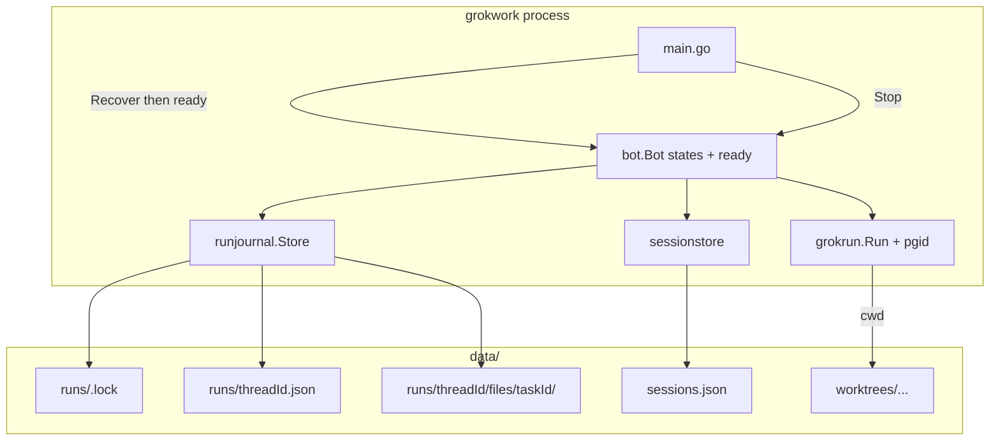
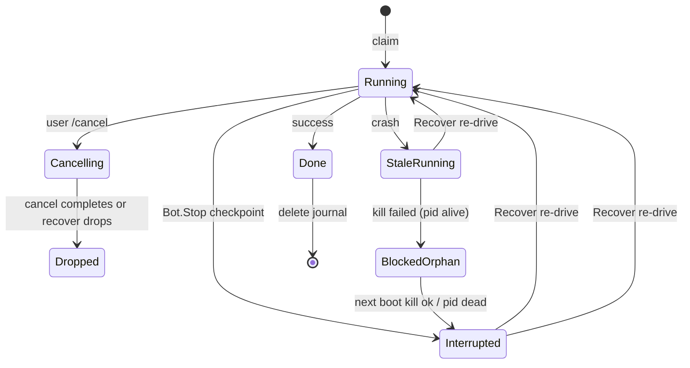

# Crash-safe active runs (auto-resume on restart)

| Field | Value |
|-------|-------|
| **Status** | Draft (rev 4 — user decisions locked) |
| **Author** | — |
| **Date** | 2026-07-20 |
| **Repo** | `github.com/acoshift/grokwork` |
| **Audience** | Senior engineers familiar with this codebase |
| **Related** | `Claude.md`, `TODO.md`, `docs/design-full-workflow-web-ui.md`, `internal/commitreview` (stale-job pattern) |

---

## Overview

**grokwork** bridges Discord (and the admin web UI) to the `grok` CLI. Active run state lives only in RAM today: `Bot.states` (`sync.Map` of `threadState` with one `*runJob` and a FIFO `[]taskItem`) is never written to disk. On process restart—crash, deploy, launchctl, Ctrl+C—every in-flight Grok run and every queued follow-up is forgotten. Worktrees and `data/sessions.json` reload, but nothing re-drives work; Discord “Working…” messages can stick forever; orphan `grok` children may keep thrashing the same worktree without a parent streaming their output.

This design adds a **durable per-thread run journal**, **graceful shutdown**, a **boot readiness gate**, and **startup recovery** so that after restart the process auto-resumes active runs and drains queues in order—with a visible “Resumed after restart” note in Discord when presentation is available—without splitting the core invariant (one thread = one worktree = one branch = one Grok session) and without inventing new infrastructure (no Redis).

---

## Background & Motivation

### Current architecture (verified in code)

| Layer | Location | Behavior |
|-------|----------|----------|
| Wiring | `main.go` | `config.Load` → `sessionstore.New` → `history.New` → `bot.New` → `web.New`; SIGINT/SIGTERM → `webSrv.Shutdown()` only |
| Active run state | `internal/bot/bot.go` | `Bot.states` → `threadState{job *runJob, queue []taskItem}`; mutations only via `claimOrEnqueue` / `finishRun` / `replaceJob` |
| Claim / queue | `claimOrEnqueue` | If `st.job != nil`, append to queue (max `maxFollowupQueue = 5`); else claim |
| Drain loop | `drainTaskQueue` (`ci_triage.go`) | `executeTask` → `finishRun` → optional next; used by Discord `handleTask`, `StartTask`, CI auto-fix |
| Dual-surface start | `StartTask` (`task_start.go`) | Web + Discord-optional path; same `taskItem` + `claimOrEnqueue` + `go drainTaskQueue` |
| Grok exec | `internal/grokrun/run.go` | `exec.CommandContext(ctx, …)` + `--prompt-file`/`--verbatim`; `--resume <id>` or `-s <new>`; no `Setpgid` |
| Session persistence | `sessionstore.Store` | `data/sessions.json`; SessionID written **after** `grokrun.Run` returns (`executeTask` ~986+) |
| Owner/label early bind | `bindThreadOwnerActor`, `applyAutoLabelOnRunStart` | Pre-run session writes exist, but not full run intent |
| Attachments | `attachments.go` + `executeTask` | Discord downloads under `data/attachments/<msgId>`, `defer RemoveAll` after run; **queued** follow-ups keep only `*MessageCreate` in RAM until drain |
| Shutdown | `main.go` | No `bot.Stop()`, no cancel of runJobs, no wait for children |
| Partial precedent | `web/commits.go` `maybeFailStaleJob` | Soft-fail commit-review jobs stuck “running” after 30m; **does not** auto-resume Discord/web Grok tasks |
| Busy detection | `isThreadBusy` | RAM-only: `st.job != nil \|\| len(st.queue) > 0` (idle cleanup starts in `bot.New` with ~30s initial delay) |
| Progress interval | `stream.go` | `progressInterval = 4s` |

### Pain points

1. **Lost work on restart**: queued follow-ups never start; active runs vanish from the bot’s perspective even if the worktree and Grok session still exist on disk.
2. **Orphan `grok` processes**: parent exit does not kill children (`CommandContext` kills only the direct child on ctx cancel, not the process group; SIGTERM to the parent from launchd does not propagate). Multiple restarts can leave multiple orphans on the same cwd.
3. **Zombie Discord UX**: progress message stays “Working in **proj**…” with Cancel button; no completion card, no “Starting queued follow-up…”.
4. **SessionID lag**: new sessions get an id via `-s` inside `grokrun.Run` for activity watching, but `sessions.json` only learns it after the full run completes—so a mid-run crash leaves no durable SessionID for resume unless a prior turn already saved one.
5. **Attachments are ephemeral**: Discord downloads only at `executeTask` time; queued tasks never materialize files to disk; resume cannot rely on `data/attachments/<msgId>`.

### Product definition of “seamless”

| Interpretation | Decision |
|----------------|----------|
| Zero user-visible interruption | **Rejected** — lost stdout pipe makes true reattach impractical |
| Auto-continue with status note | **Accepted** — re-drive with `--resume` when possible; announce resume in thread |

---

## Goals & Non-Goals

### Goals

1. **Survive restart**: active run + FIFO queue (≤5) are durable and auto-resumed after process start without re-@Grok.
2. **Preserve the unit**: one Discord/web thread = one worktree = one managed branch = one Grok session.
3. **Dual-surface**: same recovery for Discord-origin (`handleTask`) and web-origin (`StartTask`, Fix/Address/Continue).
4. **One Grok per thread**: after recovery, never start a second concurrent `grok` on the same thread/worktree.
5. **Honest re-drive**: prefer kill orphan + re-issue task with `--resume` over fake “reattach”.
6. **Discord coherence**: edit or replace stuck status messages; post a short “Resumed after restart” line; drain queue with the existing “Starting queued follow-up…” path.
7. **Fail closed where needed**: never leak local project paths into Discord; recovery skips threads whose project is no longer in config; claim/enqueue fails if journal create fails.
8. **Local durability only**: JSON under `data/` using existing store patterns (`sessionstore`, `commitreview.Store`).
9. **Boot safety**: no user/system `claimOrEnqueue` until recovery finishes (readiness gate).

### Non-Goals

- Reattaching to an orphan’s live stdout stream (pipes die with the parent).
- Exactly-once git/PR side effects (Grok may re-commit / re-push / re-open; model judgment + existing remote prompt already tolerate updates).
- Cross-host failover / multi-replica bot (single process assumption remains; see single-instance lock).
- Persisting full streaming transcript mid-token for perfect stream continuity.
- Auto-resume of commit-review jobs (already soft-failed; separate product surface).
- Changing max queue size or ownership model.
- Windows process-group support (deploy target is macOS/Linux + launchd).

---

## Key Decisions

| # | Decision | Rationale |
|---|----------|-----------|
| **K1** | **Separate run journal** at `data/runs/<threadId>.json` (not embed full queue in `sessions.json`) | Run payloads include prompt text, attachment metadata, Discord message IDs; `sessions.json` is rewritten wholesale on every `Set`/`Patch` and is the collaboration metadata store. Isolating run state matches `commitreview`’s per-job files and avoids bloating every session read. |
| **K2** | **Always kill orphans + re-drive** (never reattach stdout) | Parent has no pipe to orphan after restart. PID is for detection/kill only. Re-drive uses the same `executeTask` path with journaled prompt + `--resume` when SessionID is known. |
| **K3** | **“Seamless” = auto-continue + status note** | Users see “Resumed after restart · **proj**…” then normal Working/Done UX. Zero-interruption is impossible without reattach. |
| **K4** | **Persist full task intent**, not a minimal stub | Re-drive must rebuild `taskItem` from serializable fields only (`m` is always nil on recovery). Minimal stubs lose Fix prompts and reply context. |
| **K5** | **Pre-bind SessionID before `cmd.Start`** | Existing `sessions.json` SessionID → resume; else generate id, journal it, use `-s` via `ForceNewSession`, ensure session entry exists so Patch/Set can hold SessionID before first turn completes. Same id drives `updates.jsonl` watching. |
| **K6** | **Crash and clean restart share one recovery path** | Clean shutdown marks runs `interrupted` and cancels children; crash leaves `running` with stale heartbeat. Startup treats both as “needs recovery.” |
| **K7** | **Materialize attachments at claim/enqueue** (not only at execute) | Queued Discord tasks have no files on disk today. Download/copy into `data/runs/<threadId>/files/<taskId>/` **before** claim/enqueue returns success so a crash while queued still has durable files. |
| **K8** | **Feature flag `resumeActiveRuns` (`*bool`; nil → true after recovery ships)** | PR1–2 may leave default false while plumbing lands; **PR3/PR4 flips default true** after unit smoke tests (no multi-day soak). Explicit `false` still disables. Process-group kill on cancel can ship ungated in PR2. |
| **K9** | **Clean stop = cancel + re-drive (same as crash)** | Do not wait out the full Grok turn on SIGTERM. Cancel process group, checkpoint `interrupted`, recover on next boot. Matches crash path; keeps ShutdownTimeout under launchd `ExitTimeOut`. |
| **K10** | **Boot readiness gate before any claim** | `RecoverActiveRuns` runs **synchronously** while `ready=false` so no user/system `claimOrEnqueue`. Gateway may be **Open** during Recover (so resume UX can post); inbound tasks still get `ErrNotReady` until `SetReady`. Prevents double-Grok races. |
| **K11** | **Materialize I/O outside `threadState.mu`** | HTTP downloads / REST resolve must not hold the per-thread mutex. Two-phase: materialize → then lock + claim/Save; on Save fail delete files. |
| **K12** | **Successful orphan kill unblocks re-drive** | `blocked_orphan` is only sticky while PID is still alive. After kill succeeds (or PID already dead), promote Active to `interrupted` and re-drive. |
| **K13** | **Interruption / resume copy is fixed English** | Discord and prompt notes use constants only (e.g. `Resumed after restart · **proj**…`); no i18n. |
| **K14** | **Dual completion cards allowed in v1** | Re-drive may post a second completion card; empty-delta suppression is later polish only. |
| **K15** | **Failed recovery journals are deleted** | After Discord/history error for terminal fail (`maxResumeAttempts`, missing project, etc.), **Delete** journal + files so the thread is idle; history retains the last error. |

---

## Proposed Design

### High-level flow

```mermaid
sequenceDiagram
    participant User
    participant Bot
    participant Journal as RunJournal
    participant Grok as grok CLI
    participant Disc as Discord

    Note over Bot,Disc: boot: Discord Open ready=false → Recover → resume UX → SetReady → web

    User->>Bot: @Grok task / StartTask (requires ready)
    Bot->>Bot: materialize files OUTSIDE st.mu
    Bot->>Journal: lock claim/enqueue + Save (fail → delete files)
    Bot->>Disc: Working… (statusMsgId)
    Bot->>Journal: statusMsgId, sessionId, pid
    Bot->>Grok: exec (resume or -s ForceNewSession)
    Note over Bot,Grok: progressLoop; heartbeat optional
    Grok-->>Bot: stream / exit
    Bot->>Journal: promote queue or delete file
    Bot->>Disc: Done / completion

    Note over Bot: SIGTERM or crash
    Bot->>Grok: group kill (cancel path)
    Bot->>Journal: interrupted (clean) / stale running (crash)

    Note over Bot: process restart
    Bot->>Journal: scan data/runs/*.json (ready=false)
    Bot->>Grok: kill orphans; on success promote blocked_orphan→interrupted
    Bot->>Disc: Resumed after restart (gateway already open)
    Bot->>Bot: rehydrate taskItems (m=nil) + go drainTaskQueue
    Bot->>Bot: ready=true
```

### Component diagram



### 1. Durable run journal

#### Location

```
data/runs/.lock                      # single-instance lock (PID + start time)
data/runs/<threadId>.json            # one file per thread with non-terminal work
data/runs/<threadId>/files/<taskId>/...  # durable attachments for that task
```

**Why not only `sessions.json`:**  
`Entry` is collaboration metadata (owner, goal, PRs, labels). Embedding multi-KB prompts + queues couples unrelated write paths, enlarges every dashboard list load, and risks partial writes during high-frequency heartbeats. Per-thread run files mirror `commitreview.Store` (`data/commit-reviews/<id>.json` with tmp+rename).

**Why not a global WAL:**  
Per-thread files map 1:1 to the domain unit; recovery is a directory scan; no log replay engine needed.

#### Package

New package: `internal/runjournal` (top-level, like `sessionstore` / `commitreview`).

Atomic write pattern (copy from `commitreview.Store.Save`): write `*.tmp` then `os.Rename`.

#### Schema

```go
// internal/runjournal/journal.go (sketch)

type Status string

const (
    StatusPending      Status = "pending"       // queued follow-up
    StatusRunning      Status = "running"       // active drain item
    StatusCancelling   Status = "cancelling"    // user /cancel in flight (NOT used for Stop checkpoint)
    StatusInterrupted  Status = "interrupted"   // clean Stop checkpoint → re-drive
    StatusBlockedOrphan Status = "blocked_orphan" // PID still alive after kill wait; no re-drive this boot; next boot retries
    StatusDone         Status = "done"          // terminal (file usually deleted)
    StatusFailed       Status = "failed"        // terminal hard failure
)

type Actor struct {
    ID          string `json:"id,omitempty"`
    DisplayName string `json:"displayName,omitempty"`
}

type TaskRecord struct {
    ID              string   `json:"id"` // uuid; stable across restarts
    Status          Status   `json:"status"`
    Prompt          string   `json:"prompt"`          // user-facing prompt only (no remoteWork prefix)
    Project         string   `json:"project"`
    ProjectCwd      string   `json:"projectCwd"`      // main checkout path at claim time (re-validated on resume)
    Source          string   `json:"source"`          // discord | web
    Origin          string   `json:"origin,omitempty"`
    Actor           Actor    `json:"actor"`
    CreatedBy       string   `json:"createdBy,omitempty"`
    CreatedByName   string   `json:"createdByName,omitempty"`
    DiscordURL      string   `json:"discordUrl,omitempty"`
    // Discord continuity (serializable only — no *MessageCreate)
    TriggerMsgID    string   `json:"triggerMsgId,omitempty"` // original user message when known
    StatusMsgID     string   `json:"statusMsgId,omitempty"`  // Working… message
    // Attachments: durable paths under data/runs/.../files/<taskId>/
    // Materialized at claim/enqueue; empty means task never had attachments.
    AttachmentPaths []string `json:"attachmentPaths,omitempty"`
    // Referenced-message text folded once at claim/enqueue (or first execute if claim had m).
    // On recovery, apply without Discord fetch.
    ReferencedPrompt string `json:"referencedPrompt,omitempty"`
    CreatedAt       string `json:"createdAt"`
    StartedAt       string `json:"startedAt,omitempty"`
    Attempt         int    `json:"attempt"` // increments on each re-drive
}

type Journal struct {
    ThreadID     string       `json:"threadId"`
    Version      int          `json:"version"` // schema version = 1
    Active       *TaskRecord  `json:"active,omitempty"`
    Queue        []TaskRecord `json:"queue,omitempty"` // FIFO, max 5
    SessionID    string       `json:"sessionId,omitempty"` // best-known Grok session
    WorktreeCwd  string       `json:"worktreeCwd,omitempty"`
    Branch       string       `json:"branch,omitempty"`
    GrokPID      int          `json:"grokPid,omitempty"`
    Host         string       `json:"host,omitempty"` // hostname; ignore foreign hosts
    HeartbeatAt  string       `json:"heartbeatAt,omitempty"`
    Generation   uint64       `json:"generation"` // process boot id
    BlockedReason string      `json:"blockedReason,omitempty"`
    UpdatedAt    string       `json:"updatedAt"`
}
```

#### Lifecycle & write timing

| Event | Journal mutation |
|-------|------------------|
| Materialize attachments (before claim/enqueue returns) | Files under `files/<taskId>/`; paths on `TaskRecord` |
| `claimOrEnqueue` claims | Create/overwrite journal: `Active` = running task; `Attempt=1`; **fail claim if Save fails** |
| `claimOrEnqueue` enqueues | Append `TaskRecord{Status:pending}` with durable paths; **fail enqueue if Save fails** |
| Status message posted | Patch `Active.StatusMsgID` (best-effort) |
| Session id pre-bound | Patch `SessionID` + ensure `sessions` entry holds SessionID |
| Worktree resolved | Patch `WorktreeCwd`, `Branch` (best-effort) |
| `grok` started | Patch `GrokPID` via `OnStartPID` after `cmd.Start` |
| Progress / other patches | Prefer piggyback on existing saves; optional lightweight heartbeat (see § Heartbeats) |
| User `/cancel` | `Active.Status=cancelling` only (not used for Stop) |
| Run finishes cleanly | Promote queue head → Active, or `Delete` journal + files |
| Clean `Stop` | Always checkpoint Active as **`interrupted`** (never leave `cancelling` from Stop); clear PID after group kill |
| Recovery re-drive | `Attempt++`, Status `running`, clear StatusMsgID for new Working message |
| Orphan kill fails | Status `blocked_orphan`; no re-drive this boot; Discord notify |
| Orphan kill succeeds after was blocked | Promote Active → `interrupted`; clear GrokPID; re-drive (K12) |

**Invariant:** journal file exists ⇔ thread has non-terminal active work, pending queue, or `blocked_orphan`. Terminal success → delete file + `files/`.

#### Status truth table (cancel vs stop vs crash)

| Prior event | Journal Active status at death | Recovery action |
|-------------|--------------------------------|-----------------|
| User `/cancel` in flight (ctx cancel, drain not yet finished) | `cancelling` | **Drop active** (user intent: stop this run); keep queue; drain queue only |
| User cancel completed; `finishRun` already promoted next | Active = next task (`running`/`pending`) or file deleted | Re-drive next / idle |
| Clean `Bot.Stop` | always written as **`interrupted`** (even if cancel was used to stop children) | **Re-drive** active + queue |
| Crash / SIGKILL mid-run | `running` (stale) | **Re-drive** after orphan kill |
| Crash during user cancel | may still be `cancelling` | Drop active (conservative: honor cancel intent) |
| Orphan PID still alive after wait | `blocked_orphan` | No re-drive this boot; **next boot retries kill** |
| Orphan kill succeeds (or PID already dead) while status was `blocked_orphan` | promote → `interrupted` | **Re-drive** (self-heal; do not stick on `blocked_orphan`) |
| `Attempt > maxResumeAttempts` (or hard fail) | `failed` | Notify Discord; **Delete journal + files** (K15); history keeps last error |

**Implementer rule:** `Stop` must **never** leave Active as `cancelling`. Sequence: signal cancel → wait/kill → Save(`interrupted`) → exit. Only `cancelCurrentRun` (user) sets `cancelling`.

**`blocked_orphan` rule (K12):** sticky only while the orphan is still alive after kill wait. Successful kill or already-dead PID **must** clear `GrokPID` and set Active status to `interrupted` (if Active non-nil) so the normal re-drive path runs. Never `continue` solely because status was previously `blocked_orphan`.

#### Integration points

```go
type Store interface {
    Load(threadID string) (Journal, bool, error)
    Save(j *Journal) error
    Delete(threadID string) error
    List() ([]Journal, error)
    TaskFilesDir(threadID, taskID string) string
    HasWork(threadID string) bool // non-terminal Active or Queue or blocked_orphan
    TryLock(pid int, startedAt time.Time) error // data/runs/.lock
    Unlock() error
}
```

Keep **`claimOrEnqueue` / `finishRun` / `replaceJob` as sole RAM mutators**. Journal Save happens under `st.mu`; **network I/O does not** (K11).

#### Two-phase claim/enqueue (materialize outside lock)

```go
// Callers (handleTask / StartTask) build a durable TaskRecord first:
//
// Phase A — NO st.mu (may take tens of seconds for Discord HTTP):
//   taskID := newUUID()
//   paths, refPrompt, err := materializeTaskFiles(ctx, threadID, taskID, m, webPaths)
//   if err != nil { return err }  // never touch RAM queue
//   rec := TaskRecord{ID: taskID, Prompt: ..., AttachmentPaths: paths, ReferencedPrompt: refPrompt, ...}
//
// Phase B — under st.mu only:
//   claim or enqueue into threadState from rec → taskItem
//   if resumeEnabled: Save(journal); on Save error → roll back RAM; unlock; RemoveAll(files/taskID); return err
//
// On materialize failure: never mutate RAM. On Save failure: delete already-written files/<taskID>/.

func (b *Bot) claimOrEnqueue(threadID string, job *runJob, item taskItem, rec TaskRecord) (claimed bool, queuePos int, err error) {
    if !b.Ready() {
        return false, 0, ErrNotReady
    }
    if b.stopping.Load() {
        return false, 0, ErrShuttingDown
    }
    // rec.AttachmentPaths / ReferencedPrompt already filled outside this function.
    st.mu.Lock()
    defer st.mu.Unlock()
    // ... existing queue logic using item (derived from rec) ...
    if b.resumeEnabled() {
        if err := b.persistJournalLocked(threadID, st); err != nil {
            // roll back RAM mutation (pop queue or clear job)
            // caller MUST RemoveAll(TaskFilesDir(threadID, rec.ID)) after unlock
            return false, 0, fmt.Errorf("durable queue: %w", err)
        }
    }
    return ...
}
```

**Do not** hold `st.mu` across `downloadAttachments`, `resolveReferencedMessage`, or filesystem copies of large trees. Those run in phase A only. Under lock: slice append, pointer assign, JSON Save (small, local disk).

**Journal write policy:**

| Write kind | On failure |
|------------|------------|
| Claim / enqueue create or update | **Fail the operation** — return error to Discord/web; roll back RAM; **`RemoveAll(files/<taskId>/)`** if phase A wrote files |
| Heartbeat / StatusMsgID / PID patches | Best-effort log at error level; optional `StatusSnapshot.DurabilityDegraded` |
| Stop checkpoint `interrupted` | Retry once; log fatal if still failing (recovery will see stale `running` and still re-drive) |

#### Heartbeats (I/O)

Do **not** rewrite the full journal every 4s solely for `HeartbeatAt` unless no other field has advanced. Prefer:

1. Piggyback `HeartbeatAt` on StatusMsgID / PID / session / worktree patches.
2. If process is alive and no patch for >30s, write a lightweight heartbeat once.
3. Optional future: separate `data/runs/<threadId>.hb` touch file — not required for v1.

Stale-running detection for operators can use `UpdatedAt` from any save, not only heartbeats.

### 2. Graceful shutdown

#### Today

```go
// main.go
<-stop
_ = webSrv.Shutdown()
// Discord dg.Close() via defer; no bot stop
```

#### Proposed

```go
// main.go (sketch)
<-stop
log.Printf("shutting down…")
// Default ShutdownTimeout = 15s; must stay under launchd ExitTimeOut (recommend ≥30s in plist)
shutdownCtx, cancel := context.WithTimeout(context.Background(), b.ShutdownTimeout())
defer cancel()
b.Stop(shutdownCtx)
_ = webSrv.Shutdown()
// defer dg.Close()
```

#### `Bot.Stop(ctx)` (K9)

1. Set `b.stopping` so new claims reject with `ErrShuttingDown`.
2. For each active `st.job`: call `job.cancel()` — this **must** trigger the unified `grokrun` process-group teardown (see §2.1), not only Go’s default `CommandContext` child kill.
3. Wait on `drainWG` until empty or ctx deadline.
4. For any journal still listing `GrokPID`, call `KillProcessGroup(pid)` again (belt and suspenders).
5. For every journal with work: set Active status **`interrupted`** (never `cancelling`), clear `GrokPID`, Save.
6. Release `data/runs/.lock`.

**Do not** wait for Grok to finish the turn cleanly. Cancel + re-drive on next boot matches crash (K9).

#### launchd / operator timeout

| Setting | Recommendation |
|---------|----------------|
| `Bot.ShutdownTimeout` | **15s** default (config optional) |
| launchd `ExitTimeOut` | **≥ 30s** so Stop + web shutdown + `dg.Close` can finish |
| `KeepAlive` | On true, new process may start while old children die → Recover’s orphan kill is the safety net |
| `ThrottleInterval` | Avoid tight restart loops during debugging |

Log when Stop hits deadline: `stop: timeout; journals marked interrupted where possible; orphans left for Recover`.

#### 2.1 Process groups and unified cancel (`grokrun`)

Today:

```go
cmd := exec.CommandContext(ctx, opt.GrokBin, args...)
// no SysProcAttr — ctx cancel kills only cmd.Process, not tool grandchildren
```

Proposed (Unix only):

```go
cmd.SysProcAttr = &syscall.SysProcAttr{Setpgid: true}

// Single helper used by: ctx cancel (/cancel, Stop, timeout), and Recover orphan kill.
func killProcessGroup(pid int) {
    // SIGTERM to group (-pid), wait grace (e.g. 2s), then SIGKILL to group
}

// On ctx.Done while process running:
//   1. killProcessGroup(cmd.Process.Pid)
//   2. cmd.Wait()
//   3. contextResult → Cancelled=true (existing path when ctx.Err()!=nil)
// Do not double-kill in a way that races Wait; serialize in one goroutine.
```

**Every cancel path that stops a run** goes through this helper:

| Path | Mechanism |
|------|-----------|
| User `/cancel` / action bar | `job.cancel()` → ctx cancel → group kill + Wait |
| `Bot.Stop` | same `job.cancel()` then journal `interrupted` |
| Run timeout (`Options.Timeout`) | same ctx cancel path |
| `RecoverActiveRuns` orphan | `killProcessGroup(journal.GrokPID)` before re-drive |

**Interaction with `CommandContext`:** Prefer **not** relying on CommandContext’s implicit kill alone. Either:

- Use `exec.Command` + manual `Wait` and listen on `ctx.Done` to call `killProcessGroup`, or  
- Keep `CommandContext` but **also** on cancel call `killProcessGroup` first so grandchildren die; accept that the direct child may receive signals twice — Wait still returns once.

Result semantics: one `Result{Cancelled: true}` when ctx was cancelled (existing `contextResult`). External group kill without ctx cancel (Recover on orphan) does not produce a Result in the dead process—only the new process cares.

**macOS PID verification:** no `/proc`. On Recover, if PID alive (`kill -0`):

1. Best-effort: `ps -p <pid> -o command=` contains grok bin name or worktree path fragment.  
2. If verification ambiguous but PID is one we wrote to the journal on this host, still signal the group (we started it).  
3. If still alive after grace+SIGKILL wait (~2–5s total): mark `blocked_orphan`, post Discord: “Could not stop previous Grok process (pid …); not re-driving to avoid double work. Will retry on next restart after the process exits.” Next boot retries kill; if PID is gone, promote to `interrupted` and re-drive (K12). Operator may also kill the process manually.

**Windows:** out of scope.

### 3. Startup recovery and readiness gate (K10)

#### Boot order (required)

Prefer **Discord gateway open before Recover** so resume announcements and status heals can succeed for Discord-origin threads, while claims stay gated:

```
1. config.Load, sessionstore.New, history.New
2. b := bot.New(...)          // idle timer ok; isThreadBusy journal-aware (PR1); ready=false
3. runjournal.TryLock(...)    // fail fast if another live grokwork holds lock
4. Create discord session, b.Register(dg), dg.Open()
   // Gateway up; onMessage still rejects tasks via !Ready() → ErrNotReady
5. b.RecoverActiveRuns(ctx)   // SYNC; ready remains false
   // May post "Resumed after restart", heal StatusMsgID, go drainTaskQueue
   // Drain/executeTask: Discord() non-nil for presentation; claims still gated
6. b.SetReady(true)
7. Start web ListenAndServe   // mutating routes require Ready()
```

**Invariant:** no successful `claimOrEnqueue` from user/system paths until step 6.

- Inbound `@Grok` during steps 4–5: soft reply “Bot is starting up, try again in a moment” (or silent drop with log)—must not claim.
- Web starts after ready (simplest). If web must listen earlier for health only, refuse task-start POSTs until `Ready()`.
- **Drain may begin before `SetReady`** (recovery `go drainTaskQueue`); that is intentional. Only *new* claims are gated.
- **Fallback** if Open must follow Recover (e.g. test harness): Recover records `pendingResumeUX []threadID`; `onReady` flushes announce + status heal. Grok re-drive still correct without UX. Production path uses Open-before-Recover.

Idle cleanup: journal-aware `isThreadBusy` from PR1. Optionally defer idle start until after `SetReady`.

#### Recovery algorithm

```
generation = newBootGeneration()
// ready == false for entire function; Discord() may already be non-nil

for each journal in runjournal.List():
  if journal.Host != "" && journal.Host != hostname:
    log skip foreign host; continue
  if !cfg has project:
    mark failed, notify if Discord up, Delete journal+files (K15); continue

  // --- orphan handling (nil-safe: GrokPID is on Journal; Active may be nil) ---
  needsKill := journal.GrokPID != 0 ||
    (journal.Active != nil && journal.Active.Status == StatusBlockedOrphan)
  if needsKill:
    if journal.GrokPID != 0:
      killProcessGroup(journal.GrokPID); wait until dead or timeout
    if journal.GrokPID != 0 && pidStillAlive(journal.GrokPID):
      if journal.Active != nil:
        journal.Active.Status = StatusBlockedOrphan
      journal.BlockedReason = "orphan pid still alive"
      Save; notify Discord if up; continue  // do NOT rehydrate drain
    // kill succeeded OR pid already dead OR no PID but was blocked_orphan
    journal.GrokPID = 0
    journal.BlockedReason = ""
    if journal.Active != nil && journal.Active.Status == StatusBlockedOrphan:
      journal.Active.Status = StatusInterrupted  // K12: eligible for re-drive
      Save

  if journal.Active == nil && len(journal.Queue) == 0:
    Delete journal; continue

  // user cancel intent — only if Active non-nil
  if journal.Active != nil && journal.Active.Status == StatusCancelling:
    journal.Active = nil
    if len(journal.Queue) == 0:
      Delete; continue
    Save

  // NOTE: do NOT skip on blocked_orphan here — that case either continued
  // (still alive) or was promoted to interrupted above.

  if journal.Active != nil && journal.Active.Attempt >= maxResumeAttempts:
    fail Active, notify, history error; drop Active; Delete journal if Queue empty else Save (K15)

  tasks = []
  if journal.Active != nil && journal.Active.Status in {running, interrupted, pending}:
    journal.Active.Attempt++
    tasks = append(tasks, *journal.Active)
  tasks = append(tasks, journal.Queue...)

  if len(tasks) == 0:
    Delete; continue

  rebuild taskItems via rehydrateTaskItem (m=nil)
  // internal recoverClaim skips Ready check; still writes journal
  go b.drainTaskQueue(...)   // ALWAYS async; drainWG inside drainTaskQueue
  // Resume UX now (Discord open) or enqueue pendingResumeUX for onReady flush:
  post/heal "Resumed after restart" for Discord-origin when s != nil

// after all journals processed:
// SetReady(true) is called by main after Recover returns
```

#### Rehydrate `taskItem` (required contract)

Recovery **never** has `*discordgo.MessageCreate`. Mapping:

| `TaskRecord` field | `taskItem` field |
|--------------------|------------------|
| Prompt | `parsed.Prompt` (`KindTask`) |
| Project + re-resolved cwd from config (prefer config path over stale ProjectCwd if project still exists) | `proj` |
| Source, Origin, CreatedBy*, DiscordURL, Actor | same |
| AttachmentPaths | `attachmentPaths` (durable) |
| TriggerMsgID | stored on item or only used at history write |
| — | `m = nil` always |
| — | `s = b.Discord()` (may be nil at recover time; executeTask already falls back) |

#### `executeTask` branches for `m == nil` / recovery

| Concern | Behavior |
|---------|----------|
| Referenced message | **Single-apply invariant:** `Prompt` is user text only; `ReferencedPrompt` is the optional folded reply block. If `ReferencedPrompt != ""`, always `combine(Prompt, ReferencedPrompt)` and **never** call `resolveReferencedMessage` (live or recovery). If `ReferencedPrompt == ""` and `m != nil` with a reference, resolve once for this execute only (legacy path); prefer materialize path that fills `ReferencedPrompt` in phase A so live and resume share one code path. |
| Attachments | **Always prefer** `item.attachmentPaths` when non-empty (skip Discord download). If paths non-empty but files missing → fail with “attachments lost…”. If paths empty → no attachments (not an error). |
| History MessageID | Use `TriggerMsgID` when `m == nil`. |
| Owner / label | Existing `bindThreadOwnerActor` / `applyAutoLabelOnRunStart` with Actor. |
| Interruption note | If `Attempt > 1`, prefix user prompt with fixed English constant (K13), e.g. `Previous attempt was interrupted by process restart; continue without duplicating completed steps.` (before remoteWork prefix). |
| Session | Pre-bind algorithm (§8). |

**Populate `ReferencedPrompt` in materialize phase A** when Discord `m` is present (resolve referenced message once into the folded block string). Do not also leave the same text inside `Prompt`.

#### Orphan process detection

| Signal | Use |
|--------|-----|
| `GrokPID` in journal | `kill -0`; if alive → `killProcessGroup` |
| Verification | macOS: `ps` command line best-effort; do not require `/proc` |
| Fallback without PID | Optional fragile `pgrep`; primary path is journal PID |
| After wait still alive | `blocked_orphan` — **refuse re-drive this boot**; next boot retries |
| After wait dead / kill ok | clear PID; if Active was `blocked_orphan` → **`interrupted`** and re-drive (K12) |

**Never** start a re-drive while a journal PID is still alive. After successful kill, re-drive is required (do not leave sticky `blocked_orphan`).

#### Single-instance / Generation (Issue 11)

| Mechanism | Behavior |
|-----------|----------|
| `data/runs/.lock` | Written at boot with `{pid, startedAt, host}`. If lock PID is **alive** and is another process, **refuse start** (log fatal / exit non-zero) or refuse Recover + task starts. If lock PID is dead, adopt lock. |
| `Generation` | Monotonic boot id stored on every journal Save. Heartbeat/PID patches from a dying process with old generation are ignored if `j.Generation != b.bootGen` after Recover rewrote journals. |
| Operator invariant | One grokwork per `dataDir`; lock enforces it |

#### Concurrency safety

- Recovery is single-threaded at boot with `ready=false`.
- After `SetReady(true)`, normal `claimOrEnqueue` enforces one job per thread.
- Host-wide concurrent Grok count: out of scope.

### 4. Re-drive semantics

#### Prompt assembly (same as live path)

**Invariant:** `Prompt` = user text only; `ReferencedPrompt` = optional reply block (never duplicated into `Prompt`).

```
userPart = Prompt
if ReferencedPrompt != "":
  userPart = combine(userPart, ReferencedPrompt)   // exactly once; no resolveReferencedMessage
if AttachmentPaths:
  userPart = promptWithAttachments(userPart, files)
if Attempt > 1:
  userPart = interruptionNote + userPart
full = remoteWorkPromptPrefix(wtBranch) + issueBindingPrompt(issues) + userPart
```

Do **not** store the expanded remote prefix in the journal.

#### Session resume

See §8 pre-bind algorithm. Summary:

| Case | grokrun flags |
|------|----------------|
| Known SessionID from journal or sessions | `--resume <id>` (`ForceNewSession=false`) |
| New id pre-bound this attempt | `-s <id>` (`ForceNewSession=true`) |
| Attempt > 1 | interruption note + resume when id known |

**Idempotency of git/gh:** Accept duplicate commits/PR attempts (medium risk). Mitigation: `--resume` + interruption note + remote prompt “update existing PR”. Bot still runs `refreshPRAfterTask`.

#### History / completion on re-drive (Issue 17)

- `recordTurnActor`: include `Attempt` in history if easy (optional field `attempt` on `history.Turn`) or prefix Error/Prompt with `resumed after restart (attempt N)`.
- Completion card (**K14**): v1 **allows dual cards** on re-drive. Empty-delta suppression is later polish only — do not block v1 on it.

### 5. Queue durability and attachment materialization (K7)

#### Materialization rules (authoritative)

1. **Two-phase (K11):** Phase A (no `st.mu`): allocate `taskID`, download/copy, resolve `ReferencedPrompt`. Phase B (under `st.mu`): claim/enqueue + journal Save. See §1 integration points.
2. **Discord path — phase A on claim and on enqueue** (attachments and/or referenced attachments):
   - Download into `data/runs/<threadId>/files/<taskId>/`.
   - Resolve referenced message once → `ReferencedPrompt` only (not into `Prompt`).
   - Write `AttachmentPaths` on `TaskRecord`.
   - **Do not** depend on `data/attachments/<msgId>` for resume.
3. **Web path — phase A:** copy `StartTaskOpts.AttachmentPaths` into `files/<taskId>/` and rewrite paths (same two-phase pattern).
4. **Fail-closed on missing files at execute:** only when journal lists non-empty `AttachmentPaths` but files are gone. Empty paths = no attachments.
5. **CDN expiry:** materialize at enqueue; optional re-download by `TriggerMsgID` is secondary only.
6. **Cleanup:**
   - On Save/claim failure after phase A: **`RemoveAll(files/<taskId>/)`** immediately.
   - On task terminal status: delete that task’s files dir.
   - On journal delete: delete whole thread tree.
   - Optional boot GC: remove `files/<taskId>/` dirs with no referencing journal record.

#### Minimum `TaskRecord` fields for web Fix / Address / Continue re-drive

Checklist implementers must persist (from `StartTaskOpts` / Fix builders):

- [x] `Prompt` (full Fix/Address/Continue prompt text already built by web path)
- [x] `Project` (+ cwd re-resolved from config)
- [x] `Source` (`web` / `discord`)
- [x] `Origin`
- [x] `Actor` (ID + DisplayName)
- [x] `CreatedBy` / `CreatedByName`
- [x] `DiscordURL` (when known)
- [x] `AttachmentPaths` (usually empty for web today; still supported)
- [x] `ID`, `Attempt`, `Status`

Web does not need `TriggerMsgID` / `ReferencedPrompt` unless Discord-linked.

### 6. Discord continuity

| Concern | Approach |
|---------|----------|
| Stuck “Working…” | On recovery, if `StatusMsgID` set, edit to `Interrupted · process restarted · **proj**` then new Working message with action bar |
| Announce | Fixed English (K13): `Resumed after restart · **proj**…` (optional `· attempt N`); same family of constants as Working/Done headers |
| Queue notice | Existing “Starting queued follow-up…” |
| Gateway timing | Production boot: **Open before Recover** so announce/heal use a live session. If Discord still nil, soft-degrade streamer + queue `pendingResumeUX` for `onReady` flush—Grok still re-drives. |
| No Discord (web-origin) | Soft-degrade (`present=false`) as today |
| Action bar Cancel | New Working message; CustomID still thread-scoped |
| `blocked_orphan` (PID still alive) | Distinct message; no Working streamer; no re-drive |
| `blocked_orphan` cleared next boot | Resume announce + normal Working after promote to interrupted |

Fresh `streamPoster` every attempt — no mid-stream resume.

### 7. Crash vs clean restart



### 8. Early SessionID persistence (detail)

Current: non-empty `Options.SessionID` ⇒ `--resume`; empty + stream + OnActivity ⇒ unexported `newSessionID()` + `-s`, **bot not notified**; sessions.json only after Run returns. `Patch` returns false if entry missing.

#### Pre-bind algorithm (before `grokrun.Run`)

```
1. sid := journal.SessionID
2. if sid == "" {
     if e, ok := sessions.Get(threadID); ok && e.SessionID != "" {
       sid = e.SessionID
     }
   }
3. forceNew := false
4. if sid == "" {
     sid = grokrun.NewSessionID()  // exported
     forceNew = true
   }
5. // Ensure sessions entry exists so SessionID is durable before Run returns.
   // Order relative to bindThreadOwnerActor / applyAutoLabelOnRunStart:
   // those may already Set/Patch an entry on first task — call pre-bind AFTER owner bind
   // so Patch succeeds; if still missing, Set minimal Entry{SessionID, Project, ...}.
   sessions: Patch SessionID if empty, or Set minimal entry with sid
   journal: SessionID = sid; Save (best-effort patch after claim already saved)
6. grokrun.Options{
     SessionID: sid,
     ForceNewSession: forceNew,  // true → -s sid; false → --resume sid
     OnStartPID: func(pid int) { journal.GrokPID = pid; Save },
   }
7. The -s / resume id MUST equal sid used for watchSessionTools / updates.jsonl
   (same as today’s runSessionID invariant).
```

```go
type Options struct {
    // ...
    SessionID       string
    ForceNewSession bool // when true with SessionID set → -s; when false → --resume
    OnStartPID      func(pid int)
}
```

Export `NewSessionID`. `OnSessionID` optional if pre-bind always sets id before Start.

### 9. Feature flag / config

```go
// ResumeActiveRuns: explicit false → off; nil or true → on (after PR3/4 default flip).
// Effective default: true once recovery ships (K8). PR1–2 may use false while plumbing-only.
ResumeActiveRuns *bool `json:"resumeActiveRuns,omitempty"`
```

`ResumeActiveRunsEnabled()`: after PR3/4, **nil means true** (unlike early PR1 plumbing). Operators set `"resumeActiveRuns": false` to disable.

**When flag false:**

| Behavior | Detail |
|----------|--------|
| Journal writes | Off |
| New claims durable? | No |
| `RecoverActiveRuns` re-drive | Off |
| **Flag-off boot GC (required)** | Still run a **light** boot path: for each leftover journal, best-effort `killProcessGroup(GrokPID)`, then **`Delete` journal + `files/`** (no re-drive). Log count: `resume: flag off; purged N leftover journals`. Prevents permanent busy worktrees and orphan thrash after rollback/testing. |
| Operator | May also `rm -rf data/runs/` as documented rollback |

Process-group kill on live `/cancel` may remain always-on after PR2 (independent of resume flag).

### 10. Idle cleanup interaction

Ship **journal-aware `isThreadBusy` in PR1**:

```go
func (b *Bot) isThreadBusy(threadID string) bool {
    if ramBusy { return true }
    // Only when resume is enabled: leftover journals under flag-off are purged at boot
    // (see §9), so they must not pin worktrees forever.
    if b.resumeEnabled() && b.runs != nil && b.runs.HasWork(threadID) {
        return true
    }
    return false
}
```

With resume on: journal presence ⇒ busy through Recover/re-drive. With resume off: boot GC removes journals; idle cleanup can prune after GC.

### 11. StatusSnapshot / dashboard

- Once rehydrated, existing `ActiveRuns` works.
- Optional: `Ready bool`, `DurabilityDegraded bool`, journal queue depth.
- Surface `blocked_orphan` threads for operators.

### 12. Drain WaitGroup and sync vs async (Issue 14)

- Register `drainWG.Add(1)` at the **start of `drainTaskQueue` only**; `Done` in defer. Covers Discord `handleTask` (sync call), `StartTask` (`go`), recovery (`go`), CI queue.
- Recovery **always** `go drainTaskQueue` so `RecoverActiveRuns` can finish and set ready / open Discord without waiting for long runs.
- `Stop` waits on `drainWG` with timeout.

---

## API / Interface Changes

### `main.go`

```
load stores → bot.New → TryLock
→ Discord Register + Open          // ready still false; tasks get ErrNotReady
→ RecoverActiveRuns (sync)         // resume UX + go drain; kill orphans
→ SetReady(true)
→ start web
// on signal:
Bot.Stop(ctx) → web.Shutdown → dg.Close
// flag off: TryLock → purge leftover journals (kill PID + Delete) → SetReady → Discord/web
```

### `internal/bot`

| Symbol | Change |
|--------|--------|
| `Bot` | `runs *runjournal.Store`, `ready atomic.Bool`, `stopping atomic.Bool`, `drainWG`, `bootGen` |
| `New` | open runjournal; journal-aware `isThreadBusy` available immediately |
| `Ready` / `SetReady` | new |
| `Stop(ctx)` | new — cancel, wait, interrupted checkpoint |
| `RecoverActiveRuns(ctx)` | new — sync, before ready |
| `claimOrEnqueue` | require Ready; materialize attachments; fail on journal Save error |
| `finishRun` / `replaceJob` / `clearQueue` | journal side effects |
| `executeTask` | m==nil paths; durable attachments; pre-bind SessionID; Attempt note |
| `cancelCurrentRun` | journal → `cancelling` + group kill via ctx |
| `rehydrateTaskItem` | new helper |
| `drainTaskQueue` | owns `drainWG` |

### `internal/grokrun`

| Symbol | Change |
|--------|--------|
| `Options` | `ForceNewSession`, `OnStartPID` |
| `Run` | Setpgid; unified group kill on cancel; Wait semantics |
| `NewSessionID` | export |
| `KillProcessGroup` | export for Recover |

### `internal/config`

| Symbol | Change |
|--------|--------|
| `ResumeActiveRuns *bool` | nil → true after PR3/4 (K8); explicit false disables |
| `ShutdownTimeoutMs` optional | default 15000 |
| Snapshot / settings UI | toggle + help (PR4) |

### No public Discord slash command changes

---

## Data Model Changes

### New files

| Path | Purpose |
|------|---------|
| `data/runs/.lock` | Single-instance lock |
| `data/runs/<threadId>.json` | Journal |
| `data/runs/<threadId>/files/<taskId>/*` | Durable attachments |

### `sessions.json`

No new fields required. SessionID written earlier via pre-bind. Optional later: history `attempt` field.

### Migration

- No historical migration; missing journal = idle.
- Mid-upgrade restart loses in-flight work once; subsequent runs durable.

### Retention

```go
const maxResumeAttempts = 3
```

Delete journal + files on idle success. On terminal failure (**K15**): notify Discord (if up), append history error, then **Delete** journal + files so the thread is idle—do not retain failed journals for debug.

`blocked_orphan` (PID still alive): keep journal until next boot retry or operator kill; after kill succeeds, re-drive or eventually Delete on success/fail path above.

---

## Alternatives Considered

### Alt A — Embed run state in `sessionstore.Entry`

**Pros:** Single file, one `Patch` API.  
**Cons:** Large prompts inflate lists; heartbeats rewrite entire map; couples metadata with execution.  
**Verdict:** Rejected (K1).

### Alt B — True reattach to orphan PID

**Pros:** True seamless continuation.  
**Cons:** Stdout not adoptible; extreme complexity.  
**Verdict:** Rejected (K2).

### Alt C — Soft-fail only (commit-review style)

**Pros:** Tiny.  
**Cons:** No auto-resume.  
**Verdict:** Fallback only when `Attempt > max` or `blocked_orphan`.

### Alt D — SQLite / Redis job queue

**Pros:** Multi-process later.  
**Cons:** New infra vs local JSON patterns.  
**Verdict:** Rejected for single-process bot.

### Alt E — Only graceful shutdown drain (no crash journal)

**Pros:** Simple.  
**Cons:** Misses crash/launchd kill.  
**Verdict:** Insufficient alone.

### Alt F — Queue stubs in `sessions.json` + prompt blobs on disk

**Pros:** Smaller session entries than full embed.  
**Cons:** Two-phase consistency; still couples session list to run GC. Separate `data/runs/` is clearer.  
**Verdict:** Rejected; journal file already is the blob.

### Alt G — Rely on launchd/systemd `KillMode=process` / kill process group externally

**Pros:** No Go Setpgid.  
**Cons:** launchd default often kills only the main process (`ExitTimeOut` then SIGKILL of the job may not match our tree); bot still needs in-process group kill for `/cancel` and worktree safety. Ops docs still recommend ExitTimeOut ≥ 30s.  
**Verdict:** Complement, not substitute, for in-process `killProcessGroup`.

---

## Security & Privacy Considerations

| Threat | Mitigation |
|--------|------------|
| Journal contains prompts / paths | Mode `0600`; dirs `0700` |
| Path leak to Discord | Project **name** only in messages |
| Attachments retention | Delete with task terminal / journal delete |
| Host field | Skip resume if hostname mismatch |
| Process kill | Only journal PIDs we started; best-effort `ps` verify on macOS |
| Second process | `.lock` refuse start |

---

## Observability

| Event | Example |
|-------|---------|
| Not ready reject | `task: reject not-ready thread=%s` |
| Journal claim fail | `runjournal: claim save thread=%s: %v` |
| Recovery | `recover: journals=%d generation=%d` |
| Orphan kill | `recover: kill pid=%d thread=%s` |
| Blocked | `recover: blocked_orphan thread=%s pid=%d` |
| Re-drive | `recover: redrive thread=%s attempt=%d session=%s` |
| Stop timeout | `stop: timeout active=%d` |

Optional metrics later. No metrics stack in v1.

---

## Rollout Plan

| Stage | Flag / behavior | Exit criteria |
|-------|-----------------|---------------|
| **PR1** | Journal + materialize + busy/ready plumbing; Recover no-op; default **false** (plumbing only) | Unit tests; claim fails on disk error; busy-with-journal |
| **PR2** | Process groups + `Bot.Stop` → `interrupted`; ShutdownTimeout; lock | Ctrl+C cancels group; no orphan after clean stop |
| **PR3** | Full `RecoverActiveRuns` + SessionID pre-bind + rehydrate; **flip default true** after smoke | Unit/fake-grok suite green; smoke below |
| **PR4** | Config UI + operator docs (ExitTimeOut, single-instance `data/`) + polish; **confirm default true** | Settings toggle works; help text documents rollback |

**No multi-day soak gate** (user decision). Default-on lands with recovery once smoke passes.

### Smoke tests before default-on (PR3)

Required before merging PR3 with `ResumeActiveRunsEnabled` nil→true:

1. **Unit / fake-grok suite** for recover, claim durability, blocked_orphan promote, ready gate (CI).  
2. **Optional manual:** start a long `@Grok` (or fake sleep bin), restart process (Ctrl+C + start or launchctl), confirm Discord shows resume note and run finishes.  
3. Spot-check: `/cancel` then restart does not re-drive cancelled active; queue still runs.

### Rollback

1. `"resumeActiveRuns": false` in `config.json`  
2. Delete `data/runs/` if stuck  
3. Old binary ignores journals

---

## Risks

| Risk | Severity | Mitigation |
|------|----------|------------|
| Double Grok if claim during recovery | **High** | K10 readiness gate; Recover before web |
| Double Grok if orphan kill fails | **High** | `blocked_orphan`; refuse re-drive |
| Double Grok second process | **Medium** | `.lock` + Generation |
| Grok duplicates commits/PRs | **Medium** | `--resume` + note |
| Attachment loss while queued | **High** (addressed) | Materialize at claim/enqueue (K7) |
| Journal full-disk silent loss | **Medium** | Fail claim/enqueue on Save error |
| launchd SIGKILL mid-Stop | **Low** | Crash path re-drive; ExitTimeOut ≥ 30s |
| Partial fidelity if flag on mid-PR | **Medium** | Default stays false until PR3 recovery + smoke; then default true |
| Duplicate history/completion cards | **Low** | **K14** dual cards allowed v1; optional attempt tag |

---

## Tests

Stdlib `testing` only; fake grok bin pattern from existing bot tests.

| Test | Focus |
|------|-------|
| runjournal Save/Load/List/lock | store |
| claim/enqueue persists; Save error rolls back | durability |
| materialize attachments on enqueue (no execute) | K7 |
| `isThreadBusy` journal-only | idle |
| Ready gate rejects StartTask | K10 |
| rehydrateTaskItem m=nil applies ReferencedPrompt + paths | Issue 3 |
| Recover order: interrupted then queue | FIFO |
| Recover drops `cancelling` active | truth table |
| Recover `blocked_orphan` no drain when pid alive | kill fail |
| Recover after kill success promotes interrupted + drain | K12 |
| Materialize outside lock; Save fail deletes files | K11 |
| Flag-off purges leftover journals | busy/idle |
| Stop writes `interrupted` not `cancelling` | truth table |
| Pre-bind ForceNewSession vs resume | SessionID |
| Fake grok: seeded session → `--resume`; new → `-s` | PR3 tests |
| Fake grok: attachment path survives “crash” | files dir |
| unix build-tag process group kill | pgid |
| drainWG: Stop waits for drainTaskQueue | shutdown |

### Manual checklist

1. Long `@Grok` → launchctl restart → resume note → Done  
2. Two queued follow-ups (with attachment on #2) → restart → order preserved; files present  
3. `/cancel` → restart → cancelled not re-driven; queue runs  
4. Web Fix → restart → continues  
5. Force stuck PID → `blocked_orphan` message  
6. StartTask during synthetic not-ready → error  

---

## Open Questions

All product open questions resolved (rev 4). Retained for implementers as a decision log:

| # | Topic | Resolution |
|---|--------|------------|
| 1 | Default flip timing | **Default true in PR3/4** after smoke tests; **no multi-day soak** (K8). |
| 2 | Interruption note wording | **English constant only** (K13), e.g. `Resumed after restart · **proj**…`. |
| 3 | Clean shutdown wait vs cancel | **K9** cancel + re-drive for clean stop and crash. |
| 4 | Shared network `data/` | **Operator invariant** — one live process per `dataDir`; Host + `.lock` enforce; document, no product multi-host mode. |
| 5 | ForceNewSession vs callback-only | **ForceNewSession pre-bind** (§8). |
| 6 | Failed recovery journals | **Delete after Discord/history error** (K15); history keeps last error. |
| 7 | Second completion card | **Allow dual cards in v1** (K14); empty-delta suppression later polish only. |

---

## References

- `main.go` — wiring and signals  
- `internal/bot/bot.go` — state machine, `executeTask`, cancel  
- `internal/bot/task_start.go` — `StartTask`  
- `internal/bot/ci_triage.go` — `drainTaskQueue`  
- `internal/bot/attachments.go` — download helpers  
- `internal/bot/stream.go` — `progressInterval`  
- `internal/bot/idle_cleanup.go` — `isThreadBusy`  
- `internal/grokrun/run.go` — exec, session flags  
- `internal/sessionstore/store.go` — `Patch`/`Set`  
- `internal/commitreview/job.go` — atomic JSON jobs  
- `internal/web/commits.go` — `maybeFailStaleJob`  
- `docs/design-full-workflow-web-ui.md`  
- `Claude.md`  

---

## PR Plan

### PR 1 — Run journal, materialization, busy/ready plumbing

- **Title:** `runjournal: durable queue + attachment materialize + journal-aware busy`
- **Files/components:**  
  - `internal/runjournal/` (store, lock, tests)  
  - `internal/bot/bot.go` — two-phase materialize (I/O outside `st.mu`) then claim/enqueue + Save; **fail claim on Save error + RemoveAll files**; `isThreadBusy` uses `HasWork` only when flag on; `Ready`/`SetReady`; `ReferencedPrompt` in phase A only  
  - `internal/bot/attachments.go` — helpers for durable dir  
  - `internal/config` — `ResumeActiveRuns *bool` (plumbing: treat nil as false until PR3, or gate writes on explicit true only)  
- **Dependencies:** none  
- **Description:** No auto-resume yet. Durable claim/enqueue when flag on. Unit tests: disk-full claim failure + file cleanup; busy-with-journal; no mutex during fake slow materialize.

### PR 2 — Process groups, unified cancel, Bot.Stop

- **Title:** `grokrun: process groups; bot: Stop checkpoints interrupted`
- **Files/components:**  
  - `internal/grokrun/run.go` — Setpgid, `killProcessGroup` on all ctx cancels, `OnStartPID`, export `NewSessionID`/`KillProcessGroup`  
  - `internal/bot` — `Stop`, `drainWG` inside `drainTaskQueue`, user cancel → `cancelling`  
  - `main.go` — `Stop` on signal; optional `ShutdownTimeoutMs`  
  - journal: Stop writes **`interrupted`** only  
- **Dependencies:** PR 1  
- **Description:** Clean shutdown cancels runs with group kill and checkpoints. `/cancel` uses same kill path. No Recover yet.

### PR 3 — Recovery + default-on after smoke

- **Title:** `bot: RecoverActiveRuns; resumeActiveRuns default true`
- **Files/components:**  
  - `internal/bot/recover.go` + rehydrate helper + tests  
  - `main.go` — **Discord Open (ready=false) → Recover sync → SetReady → web**  
  - `executeTask` — pre-bind (§8), Attempt note (K13 constant), prefer durable paths, single-apply ReferencedPrompt  
  - `grokrun.Options.ForceNewSession`  
  - Discord resume announce (K13) + status heal + `blocked_orphan` promote (K12)  
  - flag-off leftover journal purge; terminal fail **Delete** journal (K15)  
  - `internal/config` — **`ResumeActiveRunsEnabled`: nil → true**  
- **Dependencies:** PR 1, PR 2  
- **Description:** Full crash-safety. After CI unit/fake-grok suite + optional manual restart smoke (see Rollout), merge with **default true**. Dual completion cards OK (K14). Tests: resume/`-s`/attachments/ready gate/cancelling vs interrupted/blocked_orphan promote/Save-fail file delete/failed journal deleted.

### PR 4 — Config UI, operator docs, polish (confirm default true)

- **Title:** `resume: config UI + operator docs (default on)`
- **Files/components:**  
  - `internal/web` settings toggle (show effective default true)  
  - config help / Snapshot: ExitTimeOut ≥ 30s, single-instance `data/`, rollback  
  - optional `history.Turn` attempt field  
  - blocked_orphan dashboard visibility  
- **Dependencies:** PR 3  
- **Description:** Operator-facing controls and docs. Confirms default-on from PR3; no separate multi-day soak PR. Empty-delta completion-card polish **out of scope**.

*(Former PR5 “default after soak” removed — default flip is part of PR3 with smoke only.)*

---

*End of design document (rev 4 — user decisions locked).*
