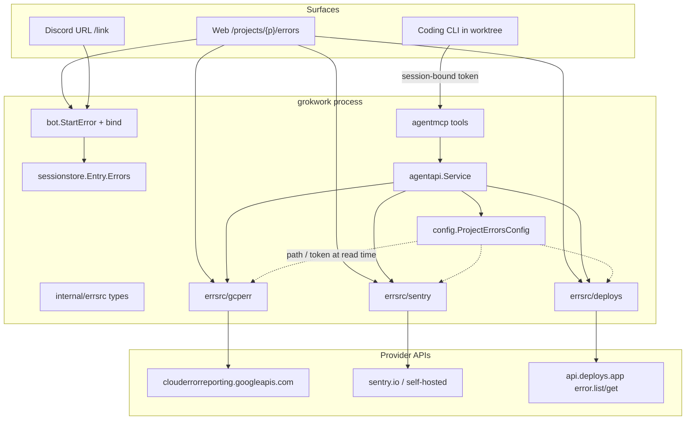

# Design: Production error-source integrations (GCP Error Reporting, Sentry, deploys.app)

| Field | Value |
|-------|--------|
| Author | grokwork |
| Date | 2026-08-16 |
| Status | Accepted (open questions resolved 2026-08-16; advisor scrutinize 2026-08-16: fix-then-ship, two majors applied) |
| Scope | L1 unless marked L2 |
| Sibling | [design-clickup-integration.md](docs/design-clickup-integration.md), [design-project-storage-gcs.md](docs/design-project-storage-gcs.md) |

## Overview

Mapped projects already bind **engineering tickets** (GitHub / Linear / ClickUp) onto a session and look them up in-session through the session-bound `grokwork` MCP server. They cannot yet answer the adjacent question: **what is blowing up in production, show me the stack, start a fix.**

This design adds a **shared error-source layer** plus three thin, in-repo HTTP consumers — Google Cloud Error Reporting, Sentry, and deploys.app `error.list` / `error.get`. The load-bearing product rule is the same as Linear: **in-session agents look up error groups only through grokwork MCP**. They never receive provider credentials and must not call provider HTTP APIs themselves.

L1 is read + bind + investigate/fix. No write-back (resolve/mute), no ingest, no webhooks, no Go module for `github.com/deploys-app/api`, no `gcloud` exec for Error Reporting.

## Background & Motivation

Today a builder who sees a Sentry issue, a GCP Error Reporting group, or a deploys.app error has to paste a stack into Discord or a session prompt. That is the wrong place for it:

- Stacks routinely contain request payloads, customer ids, and tokens. Discord is the leak surface the rest of the product already refuses (local paths, customer files, audit free text).
- The agent cannot re-fetch a live group. A pasted stack goes stale the moment the next occurrence lands.
- There is no project-scoped list of “what is on fire,” so the workspace cannot start a session from an error the way `/projects/{p}/linear/{id}` starts one from a ticket.

Linear/ClickUp L1 is the template (`internal/linear`, `internal/clickup`, `agentmcp` tools, `StartFix`, Integrations tab) but **error groups are not tickets**. They have fingerprints, occurrence counts, last-seen clocks, and sample stacks — not Fixes/Refs keywords, not GitHub-merge automation, not a shared `maxTrackedIssues = 5` budget with `#42`. Forcing them into `sessionstore.TrackedIssue` would pollute `IssueKey`, `PRBodyLine`, `FindByIssue`, and the session “Bound issues” list.

grokwork already has a mapped project named `deploys` (the deploys.app product). The integration is **generic**: any grokwork project can point at a deploys.app project + optional default deployment. `internal/deploy` is grokwork’s **own** deploy pipeline (`docs/design-deploy-pipeline.md`) and is not this feature.

## Goals & Non-Goals

### Goals (L1)

1. **Opt-in per project, per provider** — `projects.<name>.errors.{gcp,sentry,deploys}.enabled`, same shape as `projects.<name>.linear`.
2. **Web list + detail** under `/projects/{p}/errors…` with **Fix with Grok** (primary) and **Investigate** (secondary).
3. **In-session MCP** — per-provider `…_list` / `…_get`. Agent never sees the key. Same attach rules as Linear.
4. **Session bind** via a new `TrackedError` (not `TrackedIssue`). Goal stamped with title + stable id on **create** (and only if empty on reuse). Stack is **not** stored on the session; the agent re-gets via MCP.
5. **Discord URL bind** (PR 5, independently skippable) — parse only verified full URLs. Bind card = title + count + last seen + link. **No stack on Discord.**
6. **Secrets stay off Discord and audit detail.** Form write-only; `APIKeySet`-style badges; env fallback at read time.

### Non-goals (explicit)

| Out of scope | Why |
|--------------|-----|
| Write-back (Sentry resolve, GCP resolve, deploys `error.update`) | Same as Linear L1 / ClickUp L1. L2. |
| Ingest / create (`error.create`, Sentry envelope, GCP report) | grokwork is a consumer, not a reporter. |
| Webhooks → Discord | Linear L3 analogue. |
| Replacing cases | A production error may *start* a case or a fix session; it is not a support case. |
| Merging GitHub PRs | Existing ship / `directToPrimary` rules stay. |
| `github.com/deploys-app/api` as a Go module | `go.mod` is stdlib + a handful. Thin in-repo client, contract referenced from `/Users/acoshift/Projects/deploys-app/api`. |
| Exec `gcloud` for Error Reporting | Small REST surface; mint an OAuth2 token and `net/http`. GCS wraps `gcloud` because the storage CLI is the house pattern for a large wildcard-expanding surface — that reason does not apply here. |
| Live `/search` over provider APIs | Visibility-before-ranking + per-kind cap would be new work. L1 skips search. |
| Cross-project error board | Project-first IA. L2. |
| Grok investigate attaching MCP | `--deny MCPTool` stays. Claude investigate gets a read-only mint. The default CTA is **Fix with Grok** (MCP attaches on grok and claude). Investigate-on-grok still shows a banner (Key Decision 19). |
| Agent-supplied `baseURL` / project id / credentials | Operator config only. SSRF. |
| New capability predicate / “startSessions-class” gate | Builtin `investigator` has no `StartSessions`. Investigate POST matches `POST /projects/{p}/start`. |

## Key Decisions

| # | Decision | Rationale |
|---|----------|-----------|
| 1 | **Shared package `internal/errsrc` + three subpackages**, not three Linear-shaped siblings and not a generic `errors_get` MCP tool | Web list/detail, `TrackedError`, and URL parse share `Group` / `ListQuery`. HTTP details stay isolated. MCP stays per-provider so the agent cannot pick the wrong backend. |
| 2 | **Per-provider MCP tools + per-provider caps** (`GCPErrorsRead`, `SentryRead`, `DeploysErrorsRead`) | Matches `LinearRead` / `ClickUpRead`. A mint can drop a provider. |
| 3 | **Catalog filter at mint (L1)** — `prepareAgentMCP` clears unused **error** caps **between** `mcpCapsForRun` and `Mint` | Linear today lists tools whenever the cap is on, then the call errors “not enabled.” Clearing unused error caps reuses `ToolDefsFor` with no catalog API change. Do **not** also strip Linear/ClickUp in L1. Caps are snapshotted; mid-run config edits cannot add tools. |
| 4 | **`Entry.Errors []TrackedError`**, not `TrackedIssue`, not goal-string-only | Errors are not tickets (no Fixes/Refs, no shared max-5 with `#42`). Goal-only loses reuse picker, session card, and MCP “what is bound.” Scalars only so `Entry.clone` is `slices.Clone`. **No stack on the record** (size + PII + clone). |
| 5 | **One workspace nav item “Errors”** with `?src=` tabs, not three nav items | Linear and ClickUp are different products. Three error sources are one job. Workspace nav is already long (`layout.tmpl` ~5110). Tab labels: **deploys.app** / **Sentry** / **GCP** (the existing **Deploys** item is grokwork’s own pipeline). Sidebar-only — phone tab bar has no Linear/ClickUp slot either. |
| 6 | **L1 write-back: no** | Same as Linear/ClickUp L1. Humans triage in the provider console. |
| 7 | **Discord never dumps a stack** | Stacks can carry PII. Web (private network) may render the sample. Agent gets the stack via MCP; prompt contract forbids pasting full stacks / PII into Discord. |
| 8 | **No `github.com/deploys-app/api` module** | Mirror Linear/ClickUp: thin `net/http` client. Their repo is the contract reference. |
| 9 | **GCP auth = OAuth2 access token via SA JSON JWT or ADC, never `gcloud`** | Documented method scopes are `https://www.googleapis.com/auth/cloud-platform` and `https://www.googleapis.com/auth/stackdriver-integration` — **not** `cloud-platform.read-only`. JWT `scope` is `cloud-platform`. ADC order: `credentialsFile` → `GOOGLE_APPLICATION_CREDENTIALS` → well-known ADC file → metadata. A configured path that fails to read **must not** fall through. Config stores a **path**, never key contents. Existence is not checked at load (`validateStorageCredentialsFile`). |
| 10 | **deploys.app first end-to-end (implementation order)** | User owns the API; contract is local and complete; no GCP IAM / Sentry org needed to write the first live client. Shared web/bot surface **freezes in PR 2**. PR 3/4 wait for PR 2 on `main`. **Ship dark:** this train does **not** enable the integration on grokwork project `deploys` (or any project). Operators turn a provider on when they want. |
| 11 | **Discord bind is URL-only** | Sentry short ids (`APP-1A`) collide with Linear/ClickUp `PREFIX-N`. Bare numeric ids collide with GitHub. No free-text parsers. Auto-bind is `bindErrorsFromText` in `executeTask`, not only `/link`. |
| 12 | **Fix with Grok is the visual primary; Investigate is secondary.** Gates stay like `/start` | Detail page primary button = **Fix with Grok** (attaches MCP on grok and claude, so the stack is fetchable). Investigate stays a secondary action. Investigate POST = mux `requireFeature("startSessions")` + `requireMember` only — **no** bot capability gate (builtin `investigator` has no `StartSessions`; `StartWebTask` investigate is membership-only). Fix POST = those **plus** `requireCanStartFix` (`CanShip`). Hidden button is not a gate. |
| 13 | **No host-wide `errorSources` flag** | Per-provider `enabled` is the flag. `agentMCP: false` already kills MCP attach. |
| 14 | **`StartError` Kind/Mode/Goal** — Investigate enqueues `KindStartInvestigate`; Fix enqueues `KindStartFix`; reuse is **shared** (same worktree); Goal set on create and only if empty on reuse | `StartFix` today enqueues `KindTask` and never writes `Goal`. `ensureSessionMode` is first-writer-wins, so Investigate-first would stamp `ModeInvestigate` and a later `KindTask` would stay non-ship. `KindStartFix` forces `reqMode=ModeFix` in `resolveRunPolicy` (`bot.go` ~2549) so the Fix run is remote-work. That case does **not** reset `forceInv`; the claim holds because `snapshotPolicyOntoItem` (`bot.go` ~2685) stamps `snapMode=ModeFix` / `forceInv=false` / `snapRunKind=RunKindFix`, so the `forceInv := item.snapRunKind == RunKindInvestigate` recomputation at `bot.go:2538` is false. Pin `TestStartErrorInvestigateThenFixIsRemoteWork`. |
| 15 | **deploys.app web locator is query `?location=&name=`** | `error.get` is a 4-tuple. Project-wide list rows already carry both fields. `{id}` stays one ServeMux segment. `sameError` for deploys is location+resource+id (or `ErrorKey` only). MCP bare-id may use configured defaults; the web must not. |
| 16 | **Sentry get uses the org-scoped issue endpoint; post-check is project slug only** | Fetch `GET {base}/api/0/organizations/{org}/issues/{issueId}/` (and `…/events/latest/`) with `{org}` from **config**, same as the existing shortids lookup. A cross-org issue 404s at Sentry. The unscoped `GET /api/0/issues/{id}/` is org-token-wide (worse on a user token, which the form allows) and the issue payload has `project.slug` but **no organization field** — parsing `permalink` for containment is fragile on self-hosted. After every get, refuse unless `project.slug` matches config (same 404 body as unseen). Never take org/project from tool args. `count` is a JSON **string** → `int64`. |
| 17 | **GCP get-one = `groupStats.list?groupId=` + `events.list` with the same `timeRange.period`** | `projects.groups.get` returns no count/lastSeen/sample. Events without the list’s period can be empty while the group still shows hits. `{id}` is one segment; `/` in a group id is unsupported. |
| 18 | **Containment matrix is Linear/Files, not “everything 404”** | ACL → existing `forbiddenProject` **403** (unknown vs denied strings differ; we do **not** close the project-name probe). `{src}` disabled/unknown → 404. Landing with zero providers → **200 explainer** (`TestPagesRender`). Enabled + no key → **200 explainer**. Missing group on an enabled provider → 404, same body as a group the token cannot see. |
| 19 | **Default CTA is Fix; Grok Investigate still gets a visible stack banner** | Fix attaches MCP on grok and claude, so the common path is not banner-gated. Grok investigate still cannot attach MCP (`mcpCapsForRun` + `--deny MCPTool`) and the start prompt does not embed the sample. If someone clicks Investigate on a grok-default host (or a grok-stamped session), show a banner on that button **and** the resulting session page. Copy is **role-honest**: a non-builder (`!CanShip`) cannot pick Claude (`requireCanSelectModel`) and cannot click Fix (`requireCanStartFix`) — do not offer those actions to them. Do **not** stamp Investigate onto Claude in L1; keep the host default agent. Builtin investigators on a grok-default host get an empty diagnosis; that gap is accepted, not papered over. |
| 20 | **No parent `errsrc.ParseURL` dispatcher** | Subpackages return `errsrc` types, so they import `errsrc`. A parent dispatcher that imports the subpackages is a compile cycle (`errsrc → errsrc/deploys → errsrc`). Each subpackage exports its own `ParseURL` → `errsrc.Ref`. Cross-provider dispatch lives in `internal/bot` next to `bindErrorsFromText` / `handleLink` (PR 5), where all three subpackages are already imported. MCP `*_get` calls **only** its own subpackage parser — a deploys URL handed to `sentry_get_issue` must error. |

## Proposed Design

### Architecture



The agent process never holds a provider secret. The minted MCP token is identification bound to `threadID` + `project` + snapshotted `agentauth.Caps` (`internal/agentauth/cred.go`). Provider keys stay in `config.Config` (or env) and are read only inside `agentapi` / web handlers.

### Shared package vs siblings

```
internal/errsrc/            // Provider, Group, GroupDetail, Event, ListQuery, ListResult, Ref, CapSample
internal/errsrc/gcperr      // GCP Error Reporting v1beta1 REST + ParseURL
internal/errsrc/sentry      // Sentry REST + ParseURL
internal/errsrc/deploys     // deploys.app POST /error.list and /error.get + ParseURL
```

`internal/errsrc` is **types + stack-cap helpers**, not a generic facade the agent calls and **not** a URL dispatcher (Key Decision 20 — parent dispatch would import-cycle the subpackages). Callers that talk to one backend import that subpackage (web list for `?src=sentry` imports `errsrc/sentry`). Mapping into `TrackedError` / MCP DTOs lives in `sessionstore` / `agentapi`.

Rejected: three top-level siblings (`internal/gcperr`, `internal/sentry`, `internal/deployserr`) — the web Errors page and bind card would each re-declare the same `Group`. Rejected: one `errors_get` MCP tool with a `provider` argument — the agent then guesses the backend. Rejected: a parent `errsrc.ParseURL` dispatcher — compile cycle.

`internal/errsrc/deploys` is not `internal/deploy`. Import paths stay distinct; comments at package docs say so.

### Shared types (`internal/errsrc`)

```go
package errsrc

const (
    ProviderGCP     = "gcp"
    ProviderSentry  = "sentry"
    ProviderDeploys = "deploys"
)

const SampleMaxRunes = 8000 // same ceiling as linearDescMaxRunes

type Group struct {
    Provider    string
    ID          string
    ShortID     string // Sentry APP-1A; empty otherwise
    Title       string
    Culprit     string // Sentry culprit / GCP service / deploys kind
    Status      string
    Level       string // Sentry level; empty otherwise
    Count       int64
    UserCount   int64 // Sentry; 0 otherwise
    FirstSeen   time.Time `json:",omitzero"`
    LastSeen    time.Time `json:",omitzero"`
    URL         string    // provider console permalink
    Fingerprint string
    Location    string // deploys location (required to re-get)
    Resource    string // deploys deployment name; optional GCP service
}

type Event struct {
    Timestamp time.Time `json:",omitzero"`
    Message   string    // capped
    Culprit   string
    Extra     string // deploys pod / object pointer; no secrets
}

type GroupDetail struct {
    Group
    Sample   string  // representative stack, already capped
    Recent   []Event // bounded, newest first
}

type ListQuery struct {
    Status    string // provider-native; empty = provider default (open / unresolved / PERIOD_1_DAY)
    Sort      string
    Limit     int
    Cursor    string
    Service   string // GCP serviceFilter.service / deploys name override
    TimeRange string // GCP PERIOD_* only
}

type ListResult struct {
    Groups     []Group
    NextCursor string
}
```

`CapSample(s string) string` is the single rune cap (UTF-8 safe, same idea as `agentapi.capRunes`). Clients may receive a larger payload; they cap **before** returning to MCP or templates.

Each subpackage exports `ParseURL(raw string) (ref Ref, ok bool)` for **its** verified URL family only. Cross-provider dispatch is `bot.parseErrorURL` (PR 5) — try deploys, then Sentry, then GCP; first hit wins. MCP `*_get` calls only its own subpackage parser. **No free-text path. No dispatcher in `internal/errsrc`.**

`Ref` is `{Provider, ID, ShortID, Location, Resource, ProjectHint}` and lives in the parent package so subpackages can return it without importing each other. `ProjectHint` is the provider project/org from the URL (GCP `?project=`, deploys `?project=`, Sentry org slug) — used only to refuse a URL that names a different provider project than this grokwork project is configured for.

### Containment (load-bearing)

Mux `requireAuth` **plus in-handler** `ensureProjectAccess`. That is Linear/Files. The status matrix is **not** “everything 404”:

| Condition | Status | Body |
|-----------|--------|------|
| `ensureProjectAccess` fail (unknown project **or** no membership) | **403** via existing `forbiddenProject` | Distinct strings (`unknown project %q` vs `forbidden: no access to project %q`). We do **not** close the project-name probe — same as `/projects/{p}/linear` and `/projects/{p}/files`. |
| `{src}` disabled, or not in `gcp\|sentry\|deploys` | **404** | Same string for unknown and disabled src (`Error source not enabled`). |
| `GET /projects/{p}/errors` with **zero** providers enabled | **200** explainer | Files-page shape: chrome + “configure on Integrations.” `TestPagesRender` hits this URL on the default fixture (no `errors` block). |
| Provider enabled, cannot resolve (no token / no GCP projectId) | **200** explainer | Linear `linearList` when enabled with no key. Not a 500. |
| Provider-project on a URL / fetched issue disagrees with config | refuse **without fetching** (URL) or after get (Sentry numeric id) | Web: 404, same body as unseen group. MCP: `not found`. |
| Missing / unseen group id on an **enabled** provider | **404** | Same body as a group the token cannot see. Do not leak “exists but forbidden.” |

`?src=` is a data filter on a page that is already project-scoped. It cannot name another grokwork project.

`{src}` and `{id}` are Go 1.22+ `ServeMux` single segments (`PathValue` is decoded). Emit `url.PathEscape` when linking. `{id}` **cannot** contain `/` (would need `{id...}`; L1 does not).

### MCP attach (unchanged policy, new caps)

`bot.mcpCapsForRun` / `prepareAgentMCP` (`internal/bot/agent_plane.go`):

| Run | Agent | MCP |
|-----|-------|-----|
| ship / fix | grok or claude | attach, `DefaultShipCaps` then **strip disabled error providers** |
| investigate | claude | attach, `DefaultInvestigateCaps` then strip |
| investigate | grok | **no attach** (`--deny MCPTool` stays) |
| tools-off / explain | any | no attach |
| `agentMCP: false` | any | no attach |

```go
// agentauth.Caps — add three bools. DefaultShipCaps and DefaultInvestigateCaps
// grant all three. Strip of *disabled* error providers happens at mint (PR 2).
type Caps struct {
    // …existing…
    ClickUpRead       bool
    LinearRead        bool
    GCPErrorsRead     bool
    SentryRead        bool
    DeploysErrorsRead bool
}
```

Exact insertion point — **between** `mcpCapsForRun` and `Mint`. Do **not** strip Linear/ClickUp in L1.

```go
// prepareAgentMCP (internal/bot/agent_plane.go), after mcpCapsForRun, before Mint:
caps, attach := mcpCapsForRun(agent, pol)
if !attach {
    return "", "", false
}
// Error-source catalog filter. Linear/ClickUp stay on the Default* set
// (call still errors "not enabled") — do not change that in L1.
if !b.cfg.ProjectGCPErrorsEnabled(project) {
    caps.GCPErrorsRead = false
}
if !b.cfg.ProjectSentryEnabled(project) {
    caps.SentryRead = false
}
if !b.cfg.ProjectDeploysErrorsEnabled(project) {
    caps.DeploysErrorsRead = false
}
raw, cred, err := b.agent.Auth.Mint(threadID, project, actorID, "", caps, ttl)
```

`ToolDefsFor` already filters on caps, so a Sentry-only project never sees `gcp_errors_list`. Caps are snapshotted on the cred; a mid-run config edit cannot add tools.

PR 1 turns the three Default* flags on (tools unregistered — harmless) and extends `TestDefaultInvestigateCapsAreReadOnly` to require the new reads stay on and writes stay off. Add `TestDefaultShipCapsIncludeDeploysErrorsRead` (and Sentry/GCP siblings). Strip lands in PR 2 with the first live tools.

### MCP tools

```
gcp_errors_list     { timeRange?, order?, limit?, service? }
gcp_errors_get      { ref }          // group id or verified console URL
sentry_list_issues  { query?, sort?, limit? }
sentry_get_issue    { ref }          // numeric id, shortId, or verified URL
deploys_errors_list { status?, sort?, limit?, location?, name? }
deploys_errors_get  { ref }          // id, location/name/id, or verified console URL
```

List tools default to the project’s configured scope (GCP `projectId` + optional `service`; Sentry org/project from **config only**; deploys project from **config only** + optional location/name). Optional location/name on `deploys_errors_list` **narrow** the configured project; they cannot name another deploys.app project.

Get tools parse `ref` with the same URL/id helpers as Discord. Ambiguous or empty → error, no speculative search. **Never** take org / GCP project / deploys.app project from tool args.

MCP-facing DTOs live in `internal/agentapi` (mirror `LinearIssue` / `LinearIssueRow`): list rows have **no sample stack**; get includes `sample` capped at `errsrc.SampleMaxRunes`. `SessionGet` gains `Errors []sessionstore.TrackedError` so the agent can see what is bound and then `*_get`.

`agentMCPPromptContract` (`internal/bot/agent_plane.go`) grows three blocks, only when the corresponding cap is on:

```
Sentry refs (issue URL, numeric id, or short id) go to sentry_get_issue — not issues_list, and not Sentry HTTP.
Do not invent Sentry auth tokens or DSNs. Do not change Sentry status.
Do not paste full stacks or request payloads into Discord; summarize.
```

Same shape for GCP and deploys. Existing “do not invent HTTP calls to the admin UI” line stays.

Dispatch: `agentmcp.Call` → `agentapi.Service.ListGCPErrors` / `GetGCPError` / … Function fields on `Service` for tests, same as Linear:

```go
GCPErrorsEnabled   func(project string) bool
GCPErrorsConfig    func(project string) config.ProjectGCPErrorsConfig // clone; no secret contents
GCPErrorsNew       func(cfg gcperr.Options) *gcperr.Client

SentryEnabled func(project string) bool
SentryAPIToken func(project string) string
SentryNew     func(opts sentry.Options) *sentry.Client
// …deploys equivalent
```

Wiring in `bot.initAgentPlane` (today: `LinearEnabled: b.cfg.ProjectLinearEnabled`, …).

### Fix / Investigate (`bot.StartError`)

Do **not** extend `StartFix`’s `TrackedIssue` switch and do **not** copy its `KindTask` enqueue. `StartFix` (`internal/bot/fix_start.go`) always passes `KindTask` into `startWebTask` / `startWebNativeUnit` and `bindFixIssue` never writes `Entry.Goal`. That combination is exactly wrong for Investigate-then-Fix.

Add `bot.StartError` next to `StartFix`. Reuse/create skeleton (Discord-or-web-native, picker, rate limit) can be copied; the Kind / Goal / bind contract cannot.

```go
type ErrorIntent string
const (
    ErrorIntentInvestigate ErrorIntent = "investigate"
    ErrorIntentFix         ErrorIntent = "fix"
)

type ErrorStartOpts struct {
    Provider string // errsrc.Provider*
    Intent   ErrorIntent
    Project  string
    Actor    Actor
    ForceNew bool
    ThreadID string // picker
    ID, ShortID, Title, URL, Status, Fingerprint, Location, Resource string
    Count    int64
    LastSeen time.Time
    Model    string // create only; builder-class (requireCanSelectModel)
}
```

| Intent | Mux + bot gate | Enqueued `Kind` | Session `Mode` | MCP |
|--------|----------------|-----------------|----------------|-----|
| investigate | `requireFeature("startSessions")` + `requireMember` only. **No** `requireCanStartFix`. No new capability predicate. | `KindStartInvestigate` (same as `StartWebTask` `ModeInvestigate` → `webTaskKind`) | `ensureSessionMode` first-writer-wins → `ModeInvestigate` on create | Claude: read-only mint + error tools (after strip). Grok: **no attach**. |
| fix | those **plus** `requireCanStartFix` (`CanShip`). `StartTask` already re-checks `KindStartFix` (`task_start.go` ~231). | `KindStartFix` | `resolveRunPolicy` sets `reqMode=ModeFix` (`bot.go` ~2549) even when `Entry.Mode` is already `investigate` (via `snapshotPolicyOntoItem` so `forceInv` recomputation stays false) | ship/fix mint with error tools |

**Reuse is shared across intents** (recommended, and pinned): `FindByError` does not key on intent. Investigate then Fix on the same `TrackedError` reuses the same worktree / branch / session. `ForceNew` is the operator override, not “Mode disagrees.” Intent-specific units would double the worktree for one production group.

**`Entry.Mode` stays first-writer-wins.** After Investigate-then-Fix, `Entry.Mode` is still `investigate`. That is existing `ensureSessionMode`. The Fix **run** ships because `KindStartFix` forces `reqMode=ModeFix` for that run only. A later plain `KindTask` follow-up (`@Grok` in the thread, Continue) honors the stamped Mode and stays investigate — same as `/start investigate` then a follow-up that is not `/start fix`. Another Fix button click enqueues `KindStartFix` again and ships.

**Goal bind site** (`bindError`, analogue of `bindFixIssue` + `bindWebStartedSession`):

```go
goal := errorGoal(tracked) // "Sentry APP-1A: <title>" / "GCP <id>: <title>" / "deploys <id>: <title>"
// never the stack
if isNew || strings.TrimSpace(ent.Goal) == "" {
    ent.Goal = goal
}
ent.UpsertError(tracked)
```

`StartFix` does **not** write Goal; `StartWebTask` does via `bindWebStartedSession`. `StartError` follows `StartWebTask` for Goal and `StartFix` for the picker/reuse shell.

Pin **`TestStartErrorInvestigateThenFixIsRemoteWork`**: Investigate create → `Entry.Mode == investigate`, first run `KindStartInvestigate` / investigate policy (`PrefixKind == "investigate"`, `AllowPR == false`). Fix reuse of the same `ErrorKey` → second run `KindStartFix`, `BuildRunPolicy` / live policy is remote-work (`PrefixKind == "remote"`, `AllowPR` or `AllowDirectShip` per project `ShipMode`). Same `ThreadID`. Goal unchanged if already set.

`FindByError(project, provider, id, location, resource)` scans `Entry.Errors` (same grokwork project only). deploys match is the 4-tuple (see Data model). 0 → create, 1 → reuse, N → picker (`ErrPickerRequired`). **Exclude `SessionKindPRReview` as a stated policy** — `FindByIssue` does **not** exclude those units; `FindByPR` does. Error reuse is “continue the diagnosis/fix,” so a read-only PR-review unit is the wrong place. Do not claim this is “the same as issue pickers.”

Prompt (fix), analogue of `BuildLinearFixPrompt`:

```
## Task (started from web by {actor})
Fix production error {display}: {title}
Provider: sentry
URL: {url}
Status: {status} · {count}× · last {lastSeen}

Use grokwork MCP sentry_get_issue to load the sample stack. Do not call Sentry HTTP.
Do not invent tokens or DSNs. Do not resolve, mute, or assign.
Do not paste full stacks, request payloads, or PII into Discord — summarize.
Implement the fix in this worktree, commit, push, and open/update a PR.
Do not merge.
```

Investigate prompt is the same minus the PR/commit contract, plus the existing `investigatePromptPrefix` (no PR / no direct ship).

**The start prompt does not embed the sample stack.** The web page has it; the agent re-gets it. Embedding would write PII into `data/history/` and the Discord stream if the model echoed it.

#### Grok Investigate banner (not a footnote)

The default CTA is **Fix with Grok**, which attaches MCP on grok and claude — the common path is not banner-gated.

The banner applies only when someone actually clicks **Investigate** on a grok-default host (or a reused session already stamped grok). Then the Investigate control **and** the resulting session page render:

Builder (`CanShip`) copy:

> This investigate run is on Grok, which cannot attach grokwork MCP (`--deny MCPTool`). It will not fetch the sample stack. Pick Claude for this session, or use **Fix with Grok** (ship/fix attaches MCP).

Non-builder copy (builtin `investigator` and anyone without `CanShip` — they cannot pick a model and cannot click Fix):

> This investigate run is on Grok, which cannot attach grokwork MCP. It will not fetch the sample stack. Ask a builder to start this session on Claude, or to Fix it.

The banner is **not** shown on the Fix button, when the host default is Claude, or when a builder picks Claude on the model picker for a **new** Investigate session. It **is** shown on reuse of a grok-stamped unit for Investigate.

L1 does **not** stamp Investigate onto Claude. Keep the host default agent. A grok-default host’s investigators therefore get an empty diagnosis if they click Investigate; that is accepted (Fix is the primary CTA and is builder-gated).

Web POST routes share `startRateLimiter` with every other session start (`internal/web/fix.go`).

### Discord

Parse **only** verified HTTPS URLs (below).

**`/link`:** `@Grok /link <url>` binds a `TrackedError` when the project has that provider enabled. A URL whose provider is **disabled** (or whose provider-project disagrees with config) **refuses** — it does **not** fall through to GitHub/Linear. `/unlink <url|#id|shortId>` matches `Errors` without `parseLinearQuery`. `/link clear` calls **both** `ClearIssues` and `ClearErrors`.

**Auto-bind** lives in `executeTask` next to `bindIssuesFromText` / `bindLinearIssuesFromText` (`bot.go` ~1965), **not** only in `handleLink`. PR 5 adds `bindErrorsFromText`: if `bot.parseErrorURL` hits **exactly one** verified URL and that provider is enabled on the project, bind it; zero or many → bind none. Disabled-provider URL → skip (do not refuse the whole task; this is opportunistic bind, unlike explicit `/link`).

Status / brief line (no stack):

```
Sentry APP-1A · unresolved · 84× · last 2m
```

`issueBindingPrompt` stays ticket-only. New `errorBindingPrompt` injected next to it in `bot.go` (~2033):

```
Bound production errors (read via grokwork MCP, do not call provider HTTP):
- sentry APP-1A: <title> (<url>)
Do not paste full stacks or PII into Discord. Do not change error status.
```

### Web IA

One workspace nav item **Errors** when `ProjectErrorsAnyEnabled(p)`, between ClickUp and Commits (`layout.tmpl` workspace block). `data-icon="errors"` + one SVG in the `navIcon` switch. `pageData.NavErrorsEnabled`, `IsErrors`. `assertNavActive(t, body, "Errors")` — class attribute last, bare label. `navActiveFor` prefix-matches `href + "/"`, so `/projects/p/errors/sentry/x` highlights `/projects/p/errors` with no JS change. `navScopeFromURL` already scopes `/projects/{p}/…`.

**Sidebar-only.** The phone tab bar does not include Linear/ClickUp; Errors does not get a slot either.

Tab labels (not the `src` query values): **deploys.app**, **Sentry**, **GCP**. The existing workspace item **Deploys** is grokwork’s own pipeline (`internal/deploy`). A tab labelled `deploys` next to it would be read as the same product.

| Route | Behavior |
|-------|----------|
| `GET /projects/{p}/errors` | Landing. Zero providers → 200 explainer (Files shape). Exactly one enabled → redirect to `?src=` of that provider (stable bookmarks still use `?src=`). Several → default `src` = first enabled in order `deploys`, `sentry`, `gcp` (implementation order; not a ship-enable step). |
| `GET /projects/{p}/errors?src=sentry\|gcp\|deploys` | List. Tabs for enabled providers only. Filters: status, sort (provider-native query params). Cursor as `?cursor=`. Cap ~50, print when clipped. deploys.app list rows href to the detail URL **including** `?location=&name=` from the row. |
| `GET /projects/{p}/errors/{src}/{id}` | Detail + sample stack (web only) + recent events + **Fix with Grok** (primary) + **Investigate** (secondary). deploys.app **requires** `?location=&name=` when `{src}=deploys` (see provider plan). Sessions hub via `FindByError`. Grok Investigate banner only when Investigate is offered on a grok session (Key Decision 19). |
| `POST /projects/{p}/errors/{src}/{id}/investigate` | `requireFeature("startSessions")` + `requireMember` only. Carry `location`/`name` as hidden fields for deploys. |
| `POST /projects/{p}/errors/{src}/{id}/fix` | `requireFeature("startSessions")` + `requireMember` + bot `requireCanStartFix`. Same hidden locator fields. |

Page markers: `id="page-project-errors"`, `id="page-project-error"`. `TestPagesRender` row for `/projects/proj/errors`.

Templates: content only; `layout.tmpl` owns CSS. Stack in a `<pre class="mono">` on detail (private network). No `window.confirm`.

### Config

```json
"projects": {
  "app": {
    "errors": {
      "gcp": {
        "enabled": true,
        "projectId": "acme-prod",
        "projectNumber": "",
        "credentialsFile": "/etc/grokwork/gcp-errors.json",
        "service": "api"
      },
      "sentry": {
        "enabled": true,
        "org": "acme",
        "project": "app",
        "authToken": "",
        "baseURL": ""
      },
      "deploys": {
        "enabled": true,
        "project": "acme",
        "location": "gke.cluster-rcf2",
        "deployment": "api",
        "apiToken": ""
      }
    }
  }
}
```

```go
// internal/config/errors.go  (new file, follow storage.go / Linear accessors)

type ProjectErrorsConfig struct {
    GCP     *ProjectGCPErrorsConfig     `json:"gcp,omitempty"`
    Sentry  *ProjectSentryConfig        `json:"sentry,omitempty"`
    Deploys *ProjectDeploysErrorsConfig `json:"deploys,omitempty"`
}

type ProjectGCPErrorsConfig struct {
    Enabled         bool   `json:"enabled,omitempty"`
    ProjectID       string `json:"projectId,omitempty"`
    ProjectNumber   string `json:"projectNumber,omitempty"` // optional; console ?project= sometimes uses it
    CredentialsFile string `json:"credentialsFile,omitempty"` // absolute path; never key contents
    Service         string `json:"service,omitempty"`         // optional serviceFilter.service
}

type ProjectSentryConfig struct {
    Enabled   bool   `json:"enabled,omitempty"`
    Org       string `json:"org,omitempty"`
    Project   string `json:"project,omitempty"`
    AuthToken string `json:"authToken,omitempty"` // secret
    BaseURL   string `json:"baseURL,omitempty"`   // empty = https://sentry.io
}

type ProjectDeploysErrorsConfig struct {
    Enabled    bool   `json:"enabled,omitempty"`
    Project    string `json:"project,omitempty"`    // deploys.app project id
    Location   string `json:"location,omitempty"`   // optional default (MCP bare-id only)
    Deployment string `json:"deployment,omitempty"` // optional default name
    APIToken   string `json:"apiToken,omitempty"`   // secret; Bearer
}
```

Round-trip the new block through all five persist hooks (miss any one and the block dies on the next config save):

1. Field on `ProjectConfig`: `Errors *ProjectErrorsConfig`
2. Normalize in `ProjectsMap.UnmarshalJSON`
3. Marshal `outObj` — **add `Errors *ProjectErrorsConfig \`json:"errors,omitempty"\``**
4. `cloneProjectsMap` via dedicated `cloneProjectErrors` (deep-clone the three pointer sub-blocks)
5. `Snapshot()` → `ProjectItem`

Normalize: trim; empty `errors` (all three nil / all disabled with no identity) → nil so `config.json` does not grow an empty object. Invalid GCP `credentialsFile` that is non-empty and not absolute is a **load error** (same as `validateStorageCredentialsFile`: relative paths resolve against whatever cwd the bot started in). **Do not check file existence at load.** Invalid Sentry `baseURL` (not `https`, has userinfo) is a load error. A typo silently disabling errors looks identical to errors being off.

Accessors (mirror Linear):

- `ProjectErrorsAnyEnabled` / `ProjectGCPErrorsEnabled` / `ProjectSentryEnabled` / `ProjectDeploysErrorsEnabled`
- `ProjectSentryAuthToken` / `ProjectDeploysAPIToken` — config if set, else env at **read time**: `SENTRY_AUTH_TOKEN_<SUFFIX>`, `DEPLOYS_API_TOKEN_<SUFFIX>` via existing `ProjectEnvKeySuffix`. These are **not** the CLI’s unsuffixed `DEPLOYS_TOKEN` / `SENTRY_AUTH_TOKEN` — Integrations copy must say so.
- `ProjectGCPErrors` returns a clone of the GCP block (path, not contents)
- `Project*CanResolve` = enabled && (token or, for GCP, projectId present — ADC may still work with an empty credentialsFile)
- `SetProjectErrorsGCP` / `SetProjectErrorsSentry` / `SetProjectErrorsDeploys` — empty secret leaves stored; `clear*` checkbox clears
- Env-only deploys SA Basic (no extra form fields in L1): if `DEPLOYS_AUTH_USER_<SUFFIX>` + `DEPLOYS_AUTH_PASS_<SUFFIX>` are set and `apiToken` is empty, the client uses HTTP Basic. This is how deploys.app service-account keys authenticate (`deploys/README.md`). Personal / `deploys auth token` remain Bearer.

Snapshot / `ProjectItem`: `SentryAuthTokenSet`, `SentryEnvHint`, `DeploysAPITokenSet`, `DeploysEnvHint` (`DEPLOYS_API_TOKEN_<SUFFIX> — not DEPLOYS_TOKEN`), `GCPCredentialsFile` **path**. **Never** token or key **contents**. Path on the private config page is fine; never Discord, never audit.

`config.example.json`: commented `errors` block under the sample project.

Integrations tab: three cards after ClickUp (`project_config_integrations.tmpl`). Write-only token inputs, `APIKeySet` badges, env hints. GCP card: project id, optional project number, optional service, credentials **path** (not a file upload). Sentry card: org, project, token, optional base URL. deploys card: deploys.app project, optional location + deployment, token.

Audit: `audit.ActionConfigSetErrorsGCP = "config.set_project_errors_gcp"` (and Sentry / Deploys). Detail = `{name, enabled, projectId|org|deploysProject}` — **never** token, **never** credentials path. `audit.ScrubPaths` only strips an allowlist of leading directories; omitting the path from the map is the real control.

### Data model (`sessionstore`)

```go
const (
    ErrorProviderGCP     = "gcp"
    ErrorProviderSentry  = "sentry"
    ErrorProviderDeploys = "deploys"
    maxTrackedErrors     = 3
)

// TrackedError is a production error group bound to a session.
// Scalars only — Entry.clone is slices.Clone. Never store a stack.
// LastSeen is RFC3339 string to match Entry's other timestamps
// (OpenedAt / FirstResponseAt / AnsweredAt). A time.Time would
// still pass TestEntryCloneDetachesEveryField (the walk skips
// unexported fields, so Location is invisible) — do not "fix"
// this to time.Time citing clone safety.
type TrackedError struct {
    Provider    string `json:"provider"`
    ID          string `json:"id"`
    ShortID     string `json:"shortId,omitempty"`
    Title       string `json:"title,omitempty"`
    URL         string `json:"url,omitempty"`
    Status      string `json:"status,omitempty"`
    Count       int64  `json:"count,omitempty"`
    LastSeen    string `json:"lastSeen,omitempty"` // RFC3339
    Fingerprint string `json:"fingerprint,omitempty"`
    Location    string `json:"location,omitempty"` // deploys location
    Resource    string `json:"resource,omitempty"` // deploys deployment / GCP service
}

func (e TrackedError) ErrorKey() string {
    switch e.Provider {
    case ErrorProviderDeploys:
        return "deploys:" + e.Location + "/" + e.Resource + "/" + e.ID
    case ErrorProviderSentry:
        if e.ShortID != "" {
            return "sentry:" + strings.ToUpper(e.ShortID)
        }
        return "sentry:" + e.ID
    default:
        return e.Provider + ":" + e.ID
    }
}

func (e TrackedError) DisplayRef() string { /* ShortID, else truncated ID */ }
```

`Entry` gains `Errors []TrackedError`.

`Entry.clone` (`internal/sessionstore/clone.go`):

```go
out.Errors = slices.Clone(e.Errors)
```

Update the clone comment that lists flat element types to include `TrackedError` next to `TrackedPR` / `TrackedIssue`. Populate `cloneFixture()` with at least one `TrackedError` — `TestEntryCloneDetachesEveryField` / `TestCloneFixtureCoversEveryReferenceField` fail closed if either step is missed.

`UpsertError` / `RemoveError` / `FindError` / `ClearErrors` live next to the issue helpers. Cap 3; **refuse** the 4th with a clear error (never silently evict).

**`sameError` (load-bearing for deploys):**

- Never across providers.
- **deploys:** `ErrorKey` equality only (location + resource + id). Matching on `id` alone aliases two deployments in a project-wide list.
- **sentry:** numeric `ID` **or** normalized `ShortID`.
- **gcp:** `ID` (group id).

`SessionInfo` in `agentapi` includes `Errors`. `RewriteActor` does not need to touch `TrackedError` (no actor ids).

Do **not** add error groups to `/search` in L1. Bound sessions remain searchable by goal text as they are today.

## Provider-specific plans

### 1. deploys.app errors (ship first)

**Contract reference (do not import):** `/Users/acoshift/Projects/deploys-app/api/error.go`, `api/client/error.go`, `api/client/client.go`, `api/auditchannel.go`, `api/constraint.go`.

| Fact | Value |
|------|--------|
| Transport | `POST https://api.deploys.app/{action}` JSON `{"ok","result","error"}` |
| Actions (L1) | `error.list`, `error.get` |
| Auth | `Client.Auth func(*http.Request)`. Mirror the CLI: HTTP Basic when `DEPLOYS_AUTH_USER_<SUFFIX>`+`DEPLOYS_AUTH_PASS_<SUFFIX>` are set, else `Authorization: Bearer <token>`. |
| Channel | Send `X-Deploys-Channel: grokwork` (`api.HeaderChannel`) so the **raw request** names us. Their `NormalizeAuditChannel` only knows `console\|mcp\|cli\|api` and **stores `api`** for `grokwork` (the fold happens before insert; the raw header is **not** what the audit log records). Do not send `mcp` (that is *their* MCP). |
| List | `project` required; `location`+`name` scopes one deployment; omit `name` for project-wide; `status` default `open` (`open\|resolved\|muted\|all`); `limit` default 50 max 200; `cursor` opaque; `sort` `lastSeen\|firstSeen\|count`. |
| Get | `project+location+name+id` (`ErrorGet.Valid`). Detail adds `sampleMessage` (≤ 16 KiB server-side) + `recentEvents[]` (pod, ts, object, offset). |
| Permissions | token must hold `error.list` and `error.get`. |
| Ids | opaque (`iss_go_nilmap` in their mock). Single path segment. **Not unique across deployments.** |

**Minting a token (operator docs on the Integrations card):**

1. Prefer a deploys.app **service account** on the target project, granted only `error.list` + `error.get`, then set `DEPLOYS_AUTH_USER_<PROJECT>` + `DEPLOYS_AUTH_PASS_<PROJECT>` (Basic).
2. Or paste a Bearer token from `deploys login` + `deploys auth token` into the form / `DEPLOYS_API_TOKEN_<PROJECT>`. That env name is grokwork’s `ProjectEnvKeySuffix` form — **not** the CLI’s unsuffixed `DEPLOYS_TOKEN`. Session tokens last **7 days** and cannot be refreshed — rotate or use a service account.
3. **Generate token** on the Integrations card runs `deploys me generate-token -permissions error.list,error.get -ttl 31536000` with the host CLI login and stores the bearer. TTL is 1 year (deploys.app’s generate-token max). Prefer a service account for a credential that should outlive that window. The minted value is never written to a flash, audit row, or error string.

Thin client (`internal/errsrc/deploys`):

```go
const (
    defaultEndpoint = "https://api.deploys.app/"
    headerChannel   = "X-Deploys-Channel"
    channelValue    = "grokwork"
)

type Client struct {
    Token    string
    BasicUser, BasicPass string
    Endpoint string // default above; not agent-supplied
    HTTP     *http.Client // 15s
}

func (c *Client) List(ctx context.Context, in ListReq) (errsrc.ListResult, error)
func (c *Client) Get(ctx context.Context, in GetReq) (errsrc.GroupDetail, error)
```

`invoke` mirrors their client: POST `endpoint+action`, `Content-Type: application/json`, read ≤ 1 MiB, require `ok:true`, map `error` to `deploys: …`. Set Channel on every call. Auth: Basic if user+pass set, else `Authorization: Bearer <token>`. No Valid() port of their validator — we send the fields we have and surface their error string.

**Console URLs (verified in `console/src/routes/(auth)/(project)/errors/+page.svelte`):**

```
https://console.deploys.app/deployment/errors?project={p}&location={loc}&name={dep}&id={id}
```

Parse only that shape (https, host `console.deploys.app`, path `/deployment/errors`, required query `project`, `location`, `name`, `id`). Do **not** parse the project-wide list `/errors?project=`. Extra query params ignored. Discord `<>` wraps stripped.

If URL `project` ≠ configured deploys.app project → refuse without fetching.

**Web list → detail locator (load-bearing):**

Project-wide list is allowed (omit `name` on `error.list`). Each row carries `location` + `deployment`. The detail href is:

```
/projects/{p}/errors/deploys/{id}?location={loc}&name={dep}
```

`error.get` and `FindByError` / `sameError` use those query values, **not** the configured defaults. Missing `location` or `name` on a deploys detail/POST → 400 with a clear error (do not silently substitute defaults — that is the aliasing bug). POSTs carry the same pair as hidden fields.

**MCP `deploys_errors_get`:** composite `location/name/id` or a verified console URL is preferred. A **bare id** may use the configured default location+deployment; if those are empty, require the composite ref. Web must not use this fallback.

### 2. Sentry

| Fact | Value |
|------|--------|
| Auth | `Authorization: Bearer <token>` (org auth token or user token). Scopes `event:read`, `project:read`. **Not a DSN** (DSN is ingest). |
| List | `GET {base}/api/0/projects/{org}/{project}/issues/?query=&sort=&limit=` · org/project from **config only** · `query` default `is:unresolved` · `sort` `date\|freq\|new\|user` · `limit` max 100 · cursor from `Link` header `rel="next"` |
| Get | `GET {base}/api/0/organizations/{org}/issues/{issueId}/` — `{org}` from **config only**. The unscoped `/api/0/issues/{id}/` is org-token-wide (and org-wide on a user token); do not use it. |
| Latest event | `GET {base}/api/0/organizations/{org}/issues/{issueId}/events/latest/` — same `{org}` from config |
| Short id | `GET {base}/api/0/organizations/{org}/shortids/{shortId}/` · `{org}` from **config only**, never from the agent |
| Fields | id, shortId, title, culprit, permalink, status, level, count, userCount, firstSeen, lastSeen, metadata.type/value; latest event exception stacktrace |
| `count` | JSON **string** (Sentry’s issue payload). Parse into `int64`; a naive `json.Number`/`float64` unmarshal will fail or truncate. Pin `TestSentryCountParsesString`. |

**Get containment (load-bearing):** fetch through the org-scoped route so a cross-org id 404s at Sentry (the issue-detail payload has `project.{id,name,slug}` but **no organization field** — do not parse `permalink` for org). After **every** get (web detail, MCP `sentry_get_issue`, short-id lookup then get), refuse unless `project.slug` matches this grokwork project’s configured `project`. Same 404/empty as unknown. Never take org/project from tool args or from the URL path as the fetch target — URL org is only a **pre-check** to refuse a mismatched link without fetching.

**baseURL SSRF (load-bearing):** operator-configured only. Normalize: empty → `https://sentry.io`. Must parse as URL, scheme `https`, no userinfo, no fragment used in joins. Client builds `/api/0/…` itself — never `baseURL+agentPath`. Reject `http`, reject `\` in host. Custom ports allowed (self-hosted). Do not let the agent pass `baseURL`.

**Verified URL shapes** (parse only these; strip `<>`; ignore trailing slash and `/events/…`):

1. `https://sentry.io/organizations/{org}/issues/{numericId}`
2. `https://sentry.io/{org}/{project}/issues/{numericId}` (legacy)
3. `https://{org}.sentry.io/issues/{numericId}`
4. `https://sentry.io/issues/{numericId}` (current app; **no org in the path** — fetch via the configured org route, then apply the project-slug post-check)
5. When `baseURL` is set and its host matches: `{baseURL}/organizations/{org}/issues/{numericId}` and `{baseURL}/issues/{numericId}`

Refuse if a URL that **does** name an org names a different org than config (no fetch). Do **not** parse bare `APP-1A` from free text (Linear/ClickUp collision). `/link 123` stays GitHub. MCP `sentry_get_issue` **does** accept shortId and numeric id because the tool is already Sentry-scoped — then fetch org-scoped and post-check project slug.

15s timeout, 1 MiB body, `Sentry: HTTP N: …` truncated. Cap stack at 8000 runes.

### 3. Google Cloud Error Reporting

Public v1beta1. **No Cloud client library.**

| Call | HTTP |
|------|------|
| List groups | `GET https://clouderrorreporting.googleapis.com/v1beta1/projects/{projectId}/groupStats?timeRange.period=PERIOD_1_DAY&order=COUNT_DESC&pageSize=&pageToken=&serviceFilter.service=` |
| Get one group | **`GET …/groupStats?groupId={id}&timeRange.period={same}`** — **not** `projects.groups.get`. `ErrorGroup` (`name`, `groupId`, `resolutionStatus`, `trackingIssues`) has no count, lastSeen, or sample; those live on `ErrorGroupStats`. |
| List events | `GET …/v1beta1/projects/{projectId}/events?groupId={id}&pageSize=5&timeRange.period={same as the stats call}` |

`timeRange.period`: `PERIOD_1_HOUR`, `PERIOD_6_HOURS`, `PERIOD_1_DAY` (default), `PERIOD_1_WEEK`, `PERIOD_30_DAYS`. Detail uses the **same** period as the list the user was on (pass through `?period=` on the detail URL; default `PERIOD_1_DAY`). Events without that period can be empty while the group still shows hits.

`order`: `COUNT_DESC` (default), `LAST_SEEN_DESC`, `CREATED_DESC`, `AFFECTED_USERS_DESC`.

IAM: `roles/errorreporting.user` or `errorreporting.viewer` on the GCP project.

**OAuth scopes (documented on the REST methods):**

- `https://www.googleapis.com/auth/cloud-platform`
- `https://www.googleapis.com/auth/stackdriver-integration`

Do **not** request `cloud-platform.read-only` — it is not listed on these methods. JWT `scope` claim is `https://www.googleapis.com/auth/cloud-platform` (covers the pair). ADC `authorized_user` refresh uses whatever scopes the refresh token already has (`gcloud auth application-default login` typically grants `cloud-platform`).

**Auth order (no fallthrough from a configured path):**

1. If `credentialsFile` is non-empty: read **that path only**. SA JSON → JWT bearer → `https://oauth2.googleapis.com/token` (same flow as `internal/gdrive/jwt.go`, different scope; do **not** import gdrive). `authorized_user` JSON → refresh_token grant. Cache until `expiry - 60s`. **If the file is unreadable or unparseable, return the error — do not fall through** to env / well-known / metadata (confused identity).
2. Else if `GOOGLE_APPLICATION_CREDENTIALS` is set: same as (1) for that path; same no-fallthrough rule.
3. Else if the well-known ADC file exists (`$CLOUDSDK_CONFIG/application_default_credentials.json`, else `~/.config/gcloud/application_default_credentials.json`): use it. This is the laptop dogfood path — `gcloud auth application-default login` writes this file and typically does **not** set `GOOGLE_APPLICATION_CREDENTIALS`.
4. Else: GCE/GKE metadata `http://169.254.169.254/computeMetadata/v1/instance/service-accounts/default/token` with `Metadata-Flavor: Google`. Only this fixed URL; never a config-supplied metadata URL.

Do **not** exec `gcloud`. Do **not** add `golang.org/x/oauth2` / `cloud.google.com/go`. Keep token mint in `internal/errsrc/gcperr/auth.go`. Extracting `internal/gcpauth` is welcome when a third consumer appears; it is not a prerequisite. gdrive migration is out of scope.

Config stores the **path**. Relative path is a load error. **Existence is not checked at load** (same as `validateStorageCredentialsFile`: the key may be provisioned after the config). Host ADC is the empty-path case.

15s timeout, 1 MiB body.

**Console URLs** (parse only what we pin in tests):

```
https://console.cloud.google.com/errors/detail/{groupId}?project={projectId}
https://console.cloud.google.com/errors/detail/{groupId};time=P7D?project={projectId}
https://console.cloud.google.com/errors/detail/{groupId};duration=P7D?project={projectId}
```

Host `console.cloud.google.com`, path prefix `/errors/detail/`, group id = next **single** segment with `;matrix` stripped. Parse `;time=` / `;duration=` and **ignore other matrix params**. Also accept `time` / `duration` as **query** params (Cloud Console uses both). Project from `?project=`: accept the configured `projectId` **or**, when `projectNumber` is set, that number. If `projectNumber` is empty, a console URL that only names the number **false-refuses** — document on the Integrations card (“paste the project id, or fill project number”). Do not invent a lookup. Do not parse the list page `/errors`.

`{id}` is one ServeMux segment. Group ids containing `/` are **unsupported** in L1 (no `{id...}`). Emit `url.PathEscape` when linking.

Sample stack: first event’s `message` / `context.reportLocation` / exception stack. Cap 8000 runes. `GroupDetail.Recent` is those events (up to 5); do not fetch `pageSize=1` and then render an empty “recent” list.

## API / Interface Changes

### agentmcp (`internal/agentmcp/tools.go`)

Six new `Tool*` constants, six `ToolDef`s, six `toolAllowed` branches, six `Call` cases. Tests: `ToolDefsFor` with only `SentryRead` omits GCP/deploys tools.

### agentauth

Three cap fields. `DefaultShipCaps` / `DefaultInvestigateCaps` set all three true. Extend `TestDefaultInvestigateCapsAreReadOnly` to require the new reads. Add `TestDefaultShipCapsIncludeDeploysErrorsRead` (and Sentry/GCP). **No rev bump** — adding fields is backward compatible (zero value = off for any leftover in-memory cred, and creds are not persisted).

### bot

- `StartError` + `FindByError` + `bindError` (Goal on create / if empty) + `errorBindingPrompt` + `BuildErrorFixPrompt` / `BuildErrorInvestigatePrompt`
- Investigate → `KindStartInvestigate`; Fix → `KindStartFix` (never `KindTask`)
- `handleLink` reorder: try `bot.parseErrorURL` **before** Linear-disabled refusal (same lesson as ClickUp). Disabled-provider URL refuses.
- `bindErrorsFromText` in `executeTask` (PR 5)
- `prepareAgentMCP` strip between `mcpCapsForRun` and `Mint` (error caps only)
- `initAgentPlane` wires the three client factories
- Discord bind card formatter: **no stack**
- `/link clear` → `ClearIssues` + `ClearErrors`

### web

Routes listed above. `pageData`: `NavErrorsEnabled`, `IsErrors`, `ErrorSrc`, `ErrorGroups`, `ErrorDetail`, `ErrorTabs`, `ErrorGrokBanner`. Linear-style `s.sentryClient(project)` injectables in the test-injectables block.

### config

New file `internal/config/errors.go`. Three setters, env helpers, `cloneProjectErrors`, `outObj.Errors`, Snapshot fields as specified.

## Data Model Changes

`sessions.json` additive field `errors: []`. Old entries load with nil `Errors`. No migration job. `NormalizePRs`-style hook not required (no legacy mirror).

cloneFixture + clone() must be updated in the same PR that adds the field, or `TestCloneFixtureCoversEveryReferenceField` fails closed.

## Alternatives Considered

| Alternative | Rejected because |
|-------------|------------------|
| Reuse `TrackedIssue` with `Provider: "sentry"` | Fixes/Refs, `PRBodyLine`, `FindByIssue`, max 5 shared with tickets, session “Bound issues.” Errors are not tickets. |
| Goal-string only (no bind) | Loses reuse picker, session card, MCP `SessionGet` visibility, `/unlink`. |
| Three nav items (Linear+ClickUp style) | Same job, three backends. Crowds workspace nav. |
| One MCP tool `errors_get` + `provider` arg | Agent picks the wrong backend; catalog cannot hide unused providers via caps. |
| Three top-level sibling packages, no `errsrc` | Web list + URL parse + `TrackedError` mapping triplicate. |
| Parent `errsrc.ParseURL` dispatcher | Compile cycle: subpackages import `errsrc` for `Ref`/`Group`; parent would import them back. Dispatch lives in `internal/bot`. |
| Sentry get via unscoped `/api/0/issues/{id}/` + org post-check | Issue payload has no organization field; permalink-parse is fragile. Org-scoped route 404s cross-org at Sentry. |
| Import `github.com/deploys-app/api` | Violates `go.mod` policy; pulls their validator + generated action tables. |
| `gcloud error-reporting` / Cloud client library | Large module tree; gcloud’s Error Reporting surface is alpha/uneven. Three GETs + a token. |
| Reuse `gdrive.JWTBearer` for GCP | Drive-scoped type in an errors client; no ADC `authorized_user`, well-known file, or metadata path. |
| Write-back in L1 | Linear/ClickUp deliberately deferred it; status names and permissions differ per provider. |
| Parse Sentry short ids / deploys bare ids from chat | `APP-1A` is a Linear/ClickUp false positive. Bare ids are ambiguous. |
| Catalog filter by changing `ToolDefsFor` to take a project | Invasive; mint-time cap strip reuses the existing cap-only filter. |
| Also strip Linear/ClickUp at mint in L1 | Silent behavior change for ticket tools; out of scope. |
| Host-wide `errorSources: false` | Per-provider `enabled` + `agentMCP` already kill the feature. |
| Live `/search` in L1 | New kind + visibility-before-ranking + provider fan-out. Skip. |
| Put sample stack on `TrackedError` | PII + size + every `List()` clones it + history-adjacent leakage. Agent re-gets. |
| Copy `StartFix`’s `KindTask` | Investigate-first stamps `ModeInvestigate`; later Fix would not ship. |
| Composite deploys path `/errors/deploys/{loc}/{name}/{id}` | Extra ServeMux segments; query matches the list row and the console URL. |
| Forbid project-wide deploys list unless defaults are set | The API allows it; the row already has the locator. |
| Investigate as the visual primary CTA | Rejected by product: Fix attaches MCP on grok and claude, so the common path can fetch the stack. Investigate stays secondary + banner-on-grok. |
| Stamp Investigate-from-error onto Claude | Silent model switch / spend. Resolved no — keep host default agent. |
| New “startSessions-class” / investigator+ gate on Investigate | Builtin `investigator` has no `StartSessions`; would lock out the template the button is named for. |
| Close the project-name probe (404 ACL) | Deliberate deviation from Linear/Files; not this feature’s job. Keep `forbiddenProject` 403. |

## Security & Privacy Considerations

**Threat model (abridged):**

| Threat | Mitigation |
|--------|------------|
| Agent exfiltrates provider API key | Key never enters the worktree, MCP token, prompt, or tool result. Only grokwork process reads config/env. |
| Agent calls provider HTTP with an invented key | Prompt contract + no key to invent. Network policy is the host’s; we do not add one. |
| Agent / Discord leak of PII in stacks | Web may render. Discord bind card has no stack. Prompt forbids pasting stacks/PII. Start prompt does not embed the sample. History therefore does not store the stack unless the model violates the contract (same residual as any investigate run). |
| Probe which grokwork projects exist | ACL stays `forbiddenProject` **403** with distinct strings — same as Linear/Files. Not this feature’s probe to close. |
| Probe which error providers are configured | Disabled/unknown `{src}` → 404. Landing with zero providers is a 200 explainer (not a secret). |
| Sentry get as a read primitive over every project the org token covers | Org-scoped get + post-check `project.slug` against config after every get. Tool args cannot name org/project. |
| SSRF via Sentry `baseURL` | Operator-only, https, no userinfo, client builds paths. |
| SSRF via GCP metadata | Fixed metadata URL only; never from config. |
| Confused GCP identity | Configured `credentialsFile` / `GOOGLE_APPLICATION_CREDENTIALS` that fails to read does **not** fall through. |
| Path traversal via GCP `credentialsFile` | Absolute path required; load error otherwise. Existence not checked at load. Contents never in config.json. |
| Cross-project read via error URL | URL’s provider-project must match this grokwork project’s configured id/org; else refuse without fetching. Sentry numeric id: fetch then post-check. |
| deploys.app project escape via MCP `location`/`name` | List/get always send configured `project`. Extra args only narrow. |
| deploys id alias across deployments | Web carries `?location=&name=`. `sameError` is the 4-tuple. |
| Audit leak of stacks / tokens / paths | Config audit = name + enabled + non-secret ids. Session start = provider + id. **No** credentials path in the map (`ScrubPaths` is not sufficient). **No** title/description/stack in audit. |
| Grok investigate sees tools it should not | Attach is off (`mcpCapsForRun` returns false). Banner tells the human. |
| Catalog lists GCP on a Sentry-only project | Mint strips the cap → `ToolDefsFor` omits the tools. |

**AuthZ:**

- Pages: `requireAuth` + `ensureProjectAccess` → `forbiddenProject` 403 on ACL fail.
- Investigate POST: `requireFeature("startSessions")` (webAuth **feature** flag) + `requireMember`. **No** bot capability gate. Same as `POST /projects/{p}/start` investigate.
- Fix POST: those plus `requireCanStartFix` in the handler **and** again in `StartTask` for `KindStartFix`.
- Config POST: `requireAdmin`, same as Linear.

**Discord stack policy (pin):**

1. Web UI (private network) may render `GroupDetail.Sample`.
2. Discord messages must not include the sample. Bind card = title + count + last seen + link.
3. Prompt contract: do not paste full stacks / PII into Discord; summarize.
4. Residual: the model’s streamed reply can still quote a stack. That is the same residual as an agent `cat` of a customer file. We do not add a Discord-side stack regex filter in L1 (easy to get wrong, easy to bypass). L2 if needed.

## Observability

- `log.Printf` on provider HTTP non-2xx / decode errors (no token, no body beyond the existing 200-char truncate pattern in `linear.Client`).
- Audit events: config set (ok + fail), session start from an error (`ActionSessionStart` with `detail.provider` + `detail.errorId` + `detail.intent`). Link/unlink: distinct `audit.ActionErrorLink` / `ActionErrorUnlink` so “who bound a prod error” is queryable. Denials audit too (`OK=false`).
- No new metrics pipeline (the host has none). Fail-visible: list page shows inline error (stderr-equivalent), never a silent empty that reads as “no errors.”
- deploys.app: request header `X-Deploys-Channel: grokwork`; **stored** audit channel on their side is `api`.

## Rollout Plan

No new global feature flag. Each provider is dead until that project’s `enabled` is true **and** a key/path/ADC works.

1. **PR 1** lands config + types + Integrations UI. No live calls. Safe to merge to `main`.
2. **PR 2** freezes the shared web/bot/MCP surface and ships deploys.app E2E **dark** (no project `enabled: true` in this train).
3. **PR 3** Sentry — **after PR 2 is on `main`**. Provider-only.
4. **PR 4** GCP — **after PR 2 is on `main`**. Provider-only. May proceed in parallel with PR 3 once PR 2 is merged.
5. **PR 5** Discord URL bind — independently skippable; do not fold into PR 2.
6. Rollback: set `enabled: false` or `agentMCP: false`. No data migration to reverse; `Entry.Errors` is additive and ignored when unused.

Staged provider enablement is the feature flag.

## Resolved Open Questions

Answered 2026-08-16. These are final product decisions, not recommendations.

| # | Question | Decision |
|---|----------|----------|
| 1 | Default primary button — Investigate or Fix? | **Fix with Grok.** Investigate stays secondary. Fix attaches MCP on grok and claude, so the common path can fetch the stack. |
| 2 | Enable / dogfood on grokwork project `deploys` as part of this train? | **No.** Ship dark. Operators enable a provider when they want. Key Decision 10 still means deploys.app is the first *implemented* provider. |
| 3 | Discord URL bind in L1? | **PR 5, independently skippable.** Do not fold into PR 2. |
| 4 | Stamp Investigate-from-error onto Claude? | **No.** Keep the host default agent. Grok Investigate still shows the banner; Fix attaches MCP. |

## Test plan (acceptance)

Shared:

1. `TestPagesRender` includes `/projects/proj/errors` on the default fixture (no `errors` block) → 200, `id="page-project-errors"`, explainer, no 500.
2. Containment matrix pins:
   - other-project member / unknown project → **403** `forbiddenProject` (distinct strings).
   - disabled / unknown `{src}` → **404**.
   - enabled + no key → **200** explainer.
   - missing group on enabled provider → **404**, same body as unseen.
   - provider-project URL mismatch → refuse, no provider HTTP.
3. `Entry.clone` / fixture tests green after `Errors` is added (`TrackedError` in `cloneFixture`).
4. MCP: `ToolDefsFor` with only `SentryRead` omits GCP/deploys. Mint on a Sentry-only project does not list `gcp_errors_list`. Call without cap → `forbidden`.
5. MCP get never returns a sample longer than 8000 runes (`TestErrorSampleCapped`).
6. Start prompt and Discord bind card contain no stack string used in the httptest fixture.
7. Audit config save has `enabled` and no token / no credentials path.
8. `TestStartErrorInvestigateThenFixIsRemoteWork` (Kind/Mode/Goal/same ThreadID).
9. `TestDefaultInvestigateCapsAreReadOnly` still forbids writes and requires the new error reads. `TestDefaultShipCapsIncludeDeploysErrorsRead` (and Sentry/GCP).
10. Grok-default fixture: **Fix** button has no stack banner. Clicking **Investigate** (and the resulting session page) contains the stack-cannot-fetch banner; Claude-default fixture does not. Non-builder (`!CanShip`) fixture uses the investigator copy (no “Pick Claude” / “Fix with Grok” actions). Builder fixture uses the builder copy.
11. `go test ./internal/errsrc/... ./internal/config ./internal/sessionstore ./internal/agentmcp ./internal/agentapi ./internal/agentauth ./internal/bot ./internal/web -count=1`

deploys.app:

12. httptest: `error.list` / `error.get` POST path, `X-Deploys-Channel: grokwork`, Bearer header. Basic env path asserted when user/pass set.
13. Parse `https://console.deploys.app/deployment/errors?project=acme&location=gke.cluster-rcf2&name=api&id=iss_go_nilmap`. Reject list URL without `id`.
14. List row href includes `?location=&name=`. Detail without those query params → 400, no default substitution. Two rows with the same id in different deployments do not `sameError`.
15. Web Fix/Investigate create session, bind `TrackedError`, redirect. Disabled `{src}` → 404. Investigate as builtin investigator (no `StartSessions` cap) succeeds; Fix as investigator → `ErrCannotStartFix`.

Sentry:

16. List uses `Link` cursor; get + latest event assembled into one `GroupDetail`.
17. Parse all four sentry.io URL shapes (including org-less `/issues/{id}`); reject `http://`. Self-hosted only when host matches configured baseURL.
18. Get uses `/organizations/{org}/issues/{id}` (config org). An issue whose `project.slug` ≠ config → not-found, both web and MCP. Tool args cannot change org/project. Unscoped `/api/0/issues/{id}/` is not called.
19. `TestSentryCountParsesString`.
20. `/link APP-1A` does **not** bind Sentry (and still binds Linear/ClickUp per existing rules). Disabled-provider Sentry URL on `/link` refuses (no GitHub fallthrough).

GCP:

21. Fake token source + httptest: get-one is `groupStats?groupId=` + `events` with the **same** `timeRange.period`. No `groups.get`. No `gcloud` in argv.
22. Relative `credentialsFile` is a load error. Existence is not required at load. Absolute path is stored, contents never are.
23. Configured `credentialsFile` that fails to read does **not** hit metadata (assert no metadata HTTP).
24. ADC order: empty path + well-known file used when env is unset.
25. Parse console detail URL with `;time=`, `;duration=`, and query `time`/`duration`. Reject `/errors` list. `{id}` with `/` is unsupported.
26. JWT scope is `cloud-platform` (not `cloud-platform.read-only`).

## Risks

| Risk | Sev | Mitigation |
|------|-----|------------|
| PII in stacks hits Discord via model echo | High | Prompt contract; no stack in start prompt or bind card. L2 filter only if needed. |
| Sentry `APP-1A` steals Linear binds | High | URL-only Discord parse. Tests pin `/link APP-1A` stays tickets. |
| Sentry get leaks other orgs/projects on a user token | High | Org-scoped get (`/organizations/{org}/issues/{id}`); post-check `project.slug`. Never parse permalink for org. |
| Grok Investigate cannot load a stack | High | Default CTA is Fix (MCP attaches) — builder path. Investigate-on-grok shows a **role-honest** banner. Investigators on a grok-default host still cannot fetch; accepted, not papered over. |
| Investigate-then-Fix would not ship if Kind were `KindTask` | High | `KindStartFix` + `TestStartErrorInvestigateThenFixIsRemoteWork`. |
| deploys id alias across deployments | High | Query locator + 4-tuple `sameError`. |
| GCP ADC on a laptop vs SA in prod | Med | Well-known file in the ADC order; no fallthrough from a bad configured path; inline auth errors. |
| Console `?project=` is a number we did not store | Med | Optional `projectNumber`; Integrations copy. |
| deploys 7-day user tokens expire | Med | Integrations copy tells operators to use a service account. Fail-visible list error. |
| Stored deploys audit channel is `api`, not `grokwork` | Low | Document; raw header still names us. |
| Clone fixture miss on `Errors` | High | Existing reflection tests fail closed — must populate fixture in the same PR. |
| Nav / `web_test.go` byte-for-byte pins | Med | Add `id="page-project-errors"`, class-last nav anchor, `TestPagesRender` row. |
| Confusing `internal/deploy` vs deploys.app | Low | Package docs; tab label **deploys.app**; UI copy never says just “Deploys.” |
| PR 3/4 colliding on `errors.go` | Med | Shared surface freezes in PR 2; 3/4 wait for `main`. |

## References

- `docs/design-clickup-integration.md` — L1 ticket-bridge template this feature copies (MCP, config, StartFix, containment) and then **does not** force-fit.
- `docs/design-project-storage-gcs.md` — credentials **path**, never contents; ADC vs per-project SA file; `validateStorageCredentialsFile` (absolute, no existence check).
- `docs/design-deploy-pipeline.md` — grokwork’s **own** deploy pipeline. Not deploys.app.
- `internal/linear/client.go`, `internal/clickup/client.go` — 15s / 1 MiB / no secrets in structs.
- `internal/agentmcp/tools.go`, `internal/agentapi/linear.go`, `internal/agentauth/cred.go`, `internal/bot/agent_plane.go` (`mcpCapsForRun`, `prepareAgentMCP`) — MCP catalog, caps, attach rules, prompt contract.
- `internal/bot/fix_start.go` — `KindTask` enqueue (do **not** copy); `bindFixIssue` (no Goal).
- `internal/bot/bot.go` `resolveRunPolicy` ~2549 + `snapshotPolicyOntoItem` ~2685 — `KindStartFix` → `reqMode=ModeFix`; `forceInv` recomputation follows `snapRunKind`.
- `internal/bot/web_task_start.go` — investigate is membership-only; Goal via `bindWebStartedSession`.
- `internal/config/capabilities.go` — builtin `investigator` has no `StartSessions`.
- `internal/web/project_access.go` — `forbiddenProject` is 403.
- `internal/gdrive/jwt.go` — SA JWT + `oauth2.googleapis.com/token` + `expiry-60s` pattern to copy (not import).
- `/Users/acoshift/Projects/deploys-app/api/error.go` + `api/client/client.go` + `api/auditchannel.go` — contract. `NormalizeAuditChannel` folds unknown to `api`.
- GCP Error Reporting v1beta1: `groupStats.list`, `events.list`. Method scopes: `cloud-platform`, `stackdriver-integration`.
- Sentry REST: `https://docs.sentry.io/api/events/` — issue `count` is a string.
- Console URLs verified: deploys.app `console/src/routes/(auth)/(project)/errors/+page.svelte` (`issueHref`); GCP `console.cloud.google.com/errors/detail/…`; Sentry org/issue shapes listed above.

---

## PR Plan

Incremental, independently reviewable **in order**. Each PR is mergeable to `main` without enabling a provider. PR 3/4 do **not** start until PR 2 is on `main`.

### PR 1 — Shared skeleton + config + Integrations UI (no live calls)

- **Title:** `Add per-project error-source config and TrackedError bind model`
- **Depends on:** none
- **Files / components:**
  - `internal/errsrc/errsrc.go` — `Provider*`, `Group`, `GroupDetail`, `Event`, `ListQuery`, `ListResult`, `Ref`, `CapSample`. **No** `ParseURL` dispatcher (Key Decision 20).
  - `internal/config/errors.go` + hooks in `project.go` (`ProjectConfig.Errors`, normalize, **`outObj.Errors`**, **`cloneProjectErrors`**) + `config.go` Snapshot/`ProjectItem` fields
  - `internal/config/errors_test.go` — round-trip, relative credentialsFile load error, no existence check, Sentry baseURL reject, clear-key setter, env fallback (`DEPLOYS_API_TOKEN_<SUFFIX>` ≠ `DEPLOYS_TOKEN`)
  - `internal/sessionstore` — `TrackedError`, `Entry.Errors`, `clone()` + comment, `cloneFixture()`, `UpsertError` / `RemoveError` / `FindError` / `ClearErrors`, deploys 4-tuple `sameError` tests
  - `internal/agentauth/cred.go` — three cap fields; Default*Caps
  - `internal/agentauth/cred_test.go` — extend `TestDefaultInvestigateCapsAreReadOnly`; add `TestDefaultShipCapsIncludeDeploysErrorsRead` (and Sentry/GCP)
  - `internal/audit/audit.go` — `ActionConfigSetErrorsGCP` / `Sentry` / `Deploys`
  - `internal/web/templates/project_config_integrations.tmpl` — three cards
  - `internal/web/web.go` — three **flat** routes matching Linear (`POST /config/projects/errors-gcp`, `…/errors-sentry`, `…/errors-deploys`); project name in the form; `projectConfigTabRedirect(…, "integrations", …)` (`web.go` ~1458, same as `POST /config/projects/linear`)
  - `config.example.json` — commented `errors` block
- **Description:** Types, config, form, session bind model. No HTTP to providers. Nav item hidden (`AnyEnabled` is false). MCP tools not registered yet (caps exist so later PRs are additive). Green tests only.

### PR 2 — Shared Errors surface + deploys.app end-to-end (freezes the contract)

- **Title:** `Add Errors workspace page, StartError, and deploys.app provider`
- **Depends on:** PR 1
- **Files / components:**
  - `internal/errsrc/deploys/` — client, URL parse, httptest
  - `internal/agentapi/errors_deploys.go` (+ tests)
  - `internal/agentmcp/tools.go` — `deploys_errors_list` / `deploys_errors_get` only
  - `internal/bot/agent_plane.go` — wire deploys factory; **exact** cap-strip between `mcpCapsForRun` and `Mint` (all three error caps, even if only deploys tools exist yet)
  - `internal/bot/error_start.go`, `error_prompt.go` — generic `StartError` / `FindByError` / `bindError` (Goal, `KindStartInvestigate` / `KindStartFix`, shared reuse, exclude `SessionKindPRReview`)
  - `internal/bot/error_start_test.go` — `TestStartErrorInvestigateThenFixIsRemoteWork`
  - `internal/web/errors.go` + `templates/errors.tmpl` + `error_detail.tmpl` — **generic** `src` switch, 404 default, tabs, Grok banner, deploys `?location=&name=`
  - `internal/web/web.go` — GET/POST routes (investigate + fix), `IsErrors` / `NavErrorsEnabled`, nav in `layout.tmpl` (`data-icon="errors"`)
  - `internal/web/web_test.go` / workflow-style pins — `id="page-project-errors"`, nav active, containment matrix, investigator Investigate vs Fix
  - `internal/agentapi/service.go` — `Errors []TrackedError` on `SessionInfo`
  - Prompt contract branch for `DeploysErrorsRead`
- **Description:** Freezes the shared surface: `src` switch, 404 default, generic `StartError`, generic cap strip, nav, SessionInfo, Fix-primary + Grok Investigate banner. First implemented provider is deploys.app. Web list/detail (stack on web only), Fix + Investigate, MCP list/get, session bind. **Ship dark** — do not enable on grokwork project `deploys` (or any project) as part of this PR. No Discord parse (that is skippable PR 5). **PR 3/4 must not start until this is on `main`.**

### PR 3 — Sentry (provider-only)

- **Title:** `Add Sentry issue list/detail and MCP tools`
- **Depends on:** PR 2 **on `main`**
- **Files / components:**
  - `internal/errsrc/sentry/` — client, `Link` cursor, URL parse (four sentry.io shapes), baseURL SSRF tests, `count` string parse
  - `internal/agentapi/errors_sentry.go` — org-scoped get + project-slug post-check after every get
  - `internal/agentmcp/tools.go` — `sentry_list_issues` / `sentry_get_issue` + `toolAllowed` + `Call`
  - `internal/bot/error_start.go` — Sentry provider case in the existing switch (prompt/display only)
  - `internal/web/errors.go` — one `case "sentry"` in the frozen `src` switch
- **Description:** Provider-only. Does **not** own `errors.go` templates, nav, `StartError`, or cap strip. Pins: four URL shapes, org-scoped get, project-slug post-check, no free-text shortId, https-only baseURL, `count` string.

### PR 4 — GCP Error Reporting (provider-only)

- **Title:** `Add Google Cloud Error Reporting list/detail and MCP tools`
- **Depends on:** PR 2 **on `main`**. May land in parallel with PR 3 after that.
- **Files / components:**
  - `internal/errsrc/gcperr/` — REST client (`groupStats.list` + `events.list`, same period) + `auth.go` (SA JWT `cloud-platform`, authorized_user, well-known ADC, metadata; no fallthrough)
  - `internal/agentapi/errors_gcp.go`
  - `internal/agentmcp/tools.go` — `gcp_errors_list` / `gcp_errors_get`
  - `internal/bot/error_start.go` — GCP provider case
  - `internal/web/errors.go` — one `case "gcp"` in the frozen switch
- **Description:** Provider-only. No `gcloud`, no Cloud SDK module. Console URL parse with `;time=` / `;duration=`. ADC order + no-fallthrough tests.

### PR 5 — Discord URL bind + session/brief card

- **Title:** `Bind Sentry/GCP/deploys error URLs onto sessions from Discord`
- **Depends on:** PR 2 on `main` (deploys URLs). Sentry/GCP URL families no-op until those parsers exist (PR 3/4).
- **Files / components:**
  - `internal/bot` — `parseErrorURL` tries `deploys.ParseURL` then `sentry.ParseURL` then `gcperr.ParseURL` (no parent dispatcher)
  - `internal/bot/issue.go` — `handleLink` reorder; disabled-provider URL refuses; `/link clear` → `ClearIssues`+`ClearErrors`; `/unlink` matches `Errors`
  - `internal/bot/bot.go` `executeTask` — `bindErrorsFromText` next to the issue binders
  - `errorBindingPrompt` in `bot.go`
  - Brief / status / hand-off lines
  - `internal/audit` — `ActionErrorLink` / `ActionErrorUnlink`
  - Tests: URL bind, refuse list URLs, refuse `APP-1A` free text, bind card has no stack, `/link clear` clears `Errors`, disabled-provider `/link` refuses
- **Description:** Chat surface. Independently skippable — do not fold into PR 2.

### PR 6 — L2 (not this train)

- Write-back: deploys `error.update`, Sentry resolve, GCP resolve — opt-in, new caps (`*Write`), never on investigate mint
- `/search` kind for bound errors (visibility before ranking, `searchKindCap`); no live provider search
- Cross-project error board
- Sentry/deploys SA fields on the form (not env-only)
- Discord-side stack redaction if model echo becomes a real leak
- Extract `internal/gcpauth` and optionally migrate `gdrive.JWTBearer`
- Webhooks → Discord (Linear L3 analogue)
- Stamp Investigate-from-error onto Claude — **out of scope** (resolved no)
