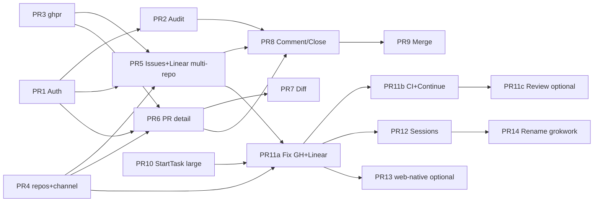

# Full Development Workflow Web UI (Discord Primary)

| Field | Value |
|-------|-------|
| **Status** | Draft (rev 5 — user decisions locked) |
| **Author** | — |
| **Date** | 2026-07-20 |
| **Repo** | `github.com/acoshift/grokwork` (renamed from `grok-discord` in PR 14) |
| **Audience** | Senior engineers familiar with this codebase |
| **Related** | `TODO.md` (P0 Safe team mode, P1 ship/review, non-goals), `Claude.md` |

---

## Overview

Today **grok-discord** is a single Go process that bridges Discord and the Grok CLI: users tag `@Grok <task>` in a mapped channel; the bot creates a Discord thread, isolates a git worktree (`grok/discord/<threadId>`), runs `grok -p … --cwd <worktree>`, and streams progress into the thread. A private-network admin web UI on `:8787` (hime + htmx + SSE, **no auth**) exposes dashboard, ship board, history, worktrees, and config.

This design elevates the web UI from “admin mirror” to a **first-class peer surface for the same development workflow**, so the team can often inspect issues/PRs/diffs, comment, merge/close, and start Grok fix sessions **without leaving to GitHub** — while **Discord remains the primary collaboration and run UX**. The core invariant stays:

> **One work unit = one git worktree = one managed branch = one Grok session.**

Web shares that unit; it does not invent a parallel execution model. Auth becomes mandatory before any write/merge/session-start; GitHub branch protection remains the real gate on merges; Grok never merges.

**TODO.md amendment:** This design **supersedes** the non-goal “put team UX in Discord” **for ship/review/ops surfaces only**. Discord remains primary for **run/chat**. Still a non-goal: public multi-tenant SaaS / auth-heavy public web. Operators should update `TODO.md` when implementing (out of this doc’s PR plan, but called out for consistency).

---

## Background & Motivation

### Current state (facts from the repo)

| Layer | Location | Behavior |
|-------|----------|----------|
| Wiring | `main.go` | `config.Load` → `sessionstore.New` → `history.New` → `bot.New` → `web.New`; Discord `dg` created **after** web, never stored on `Bot` |
| Discord pipeline | `internal/bot/bot.go` | `onMessage` → allowlist → `ParseMessage` → commands or `handleTask` |
| Thread create | `ensureThread` | `MessageThreadStartComplex(m.ChannelID, m.ID, …)` — **requires a parent user message** |
| Work unit | `sessionstore.Entry` | Keyed by Discord **thread ID** (history paths use `/history/{threadID}`); worktree path, branch, owner, goal, `Issues[]`, `PRs[]` |
| Worktrees | `internal/gitworktree` | `const BranchPrefix = "grok/discord/"`; `Ensure` always uses `BranchName(threadID)`; only managed branches may be deleted |
| PR status | `internal/ghpr`, `bot/pr_status.go` | Read-heavy: `gh pr view/checks/list`; ~90s poller; ship board is session-store driven |
| Issues | `sessionstore/issue.go`, `bot/issue.go` | GitHub `#N` + Linear `ENG-123` bind; PR body Fixes/Refs; **no issue list UI** |
| Web | `internal/web/web.go` | Routes: `/`, `/ship`, `/history`, `/worktrees`, `/config`, `/events` SSE + partials. **All POSTs unauthenticated** today: `/config/projects`, `/config/projects/remove`, `/config/projects/linear`, `/config/users*`, `/config/roles*`, `/config/channels*`, `/config/settings`, `/worktrees/prune`, `/worktrees/prune-idle` |
| Prompt contract | `remoteWorkPromptPrefix` | Wording assumes Discord; commit on thread branch, push, `gh pr create`, **do not merge** |
| Explicit non-goals today | `TODO.md` | “Auth-heavy public web app (keep web private; put team UX in Discord)”, “Bot auto-merge”, “Replacing GitHub PR review / branch protection” |

### Pain points

1. **Ship loop still forces GitHub hops** for issue lists, comments, full diffs, and merge — even though worktrees and PR metadata already live on the host running `gh`.
2. **Web can already mutate** allowlists, project paths, Linear keys, settings, and prune worktrees with zero identity. Unsafe once merge/comment/start-session exist (`TODO.md` P0).
3. **No web path to start work** — “Continue from web” is Later/P2 in `TODO.md`.
4. **Product moniker** is **Grok Work** (`grokwork`); repo/module may still be `grok-discord` until packaging rename (PR 14).
5. **Deep Discord coupling in `executeTask`** (status bar, stream, owner bind, `LastUser: m.Author.String()`, attachments, brief/PR cards) blocks a naïve “optional `*MessageCreate`” for web starts.

### What we are *not* doing

We are **not** replacing Discord chat/streaming as the daily run surface, not building a public multi-tenant SaaS, not auto-merging from Grok or the bot, and not reimplementing full GitHub code-review UI (file-level review threads, suggested edits UI, etc. stay deferred).

---

## Goals & Non-Goals

### Goals

1. **Dual-surface product**: Discord (chat + live runs) and Web (read ship surface + controlled writes) share one domain model and one host process.
2. **GitHub/Linear-less common reads**: multi-repo issue list/detail, Linear issues when enabled, PR detail (checks, review, timeline), unified diffs for PR or worktree.
3. **Controlled GitHub writes from web**: issue/PR comments, close PR, **human-only merge** (respect branch protection).
4. **Grok from web**: one-click “Fix with Grok” for **GitHub and Linear** / “Address CI” / continue → same session/worktree/branch model; deep-link Discord. (Address review is a **later** PR — see Phase C.)
5. **Auth + audit** before any mutating web action; **Discord OAuth** identity; roles (viewer / member / admin); CSRF; rate limits on Grok starts.
6. **Phased delivery** via ordered PRs; each phase independently useful. **Phase A alone** already cuts GitHub hops (see Alt 5).
7. **Rename evaluation** with a migration-friendly default recommendation.

### Non-Goals

- Public internet deployment without a private network (Tailscale/LAN remains default posture).
- SPA rewrite (React/Vue) unless a later phase proves htmx insufficient for diff browsing at scale.
- Full GitHub REST SDK as the primary client (prefer extending `gh` + `internal/ghpr`).
- Bot/Grok-initiated merge or bypass of required checks.
- Replacing Linear’s native GitHub automation (`issueUpdate` state machines).
- Multi-tenant hard isolation between hostile coworkers.
- In-chat project switching (channel→project map remains source of truth for Discord; web picks project from the same config map).
- Perfect parity with GitHub PR review UX (inline suggested patches, review request matrix, CODEOWNERS editor).
- **Token-level web stream of Grok output in v1** (status/phase chips only; full stream stays Discord).

---

## Product Positioning

```
                    ┌─────────────────────────────────────┐
                    │     Host process (one binary)        │
                    │  local checkouts · git · gh · grok   │
                    │                                      │
   Discord ◄───────►│  bot (gateway, threads, stream)     │
   (primary chat    │           ▲   holds *discordgo.Session│
    + run UX)       │           │ shared domain            │
                    │           ▼                          │
   Web ◄───────────►│  web (htmx/SSE workflow app)         │
   (peer ship /     │  auth · issues · PRs · sessions      │
    review surface) │                                      │
                    └──────────────┬──────────────────────┘
                                   │ gh / git
                                   ▼
                              GitHub.com
                         (source of truth for
                          PR protection, merge)
```

- **Discord hero path**: `@Grok fix …` → thread → stream → PR card → `/fix-ci`.
- **Web hero path**: Ship board / Issues → PR or issue detail → diff → Merge or “Fix with Grok”.
- Both surfaces **observe and act on the same** `sessionstore` / worktree / history artifacts.

---

## Identity & Product Rename

### Constraints

- Discord bot **display name** can stay “Grok” (independent of repo/binary name). Discord application name is **out of** the repo rename.
- Marketing/docs must not orphan Discord.
- Module path `github.com/acoshift/grok-discord`, binary `grok-discord`, image `grok-discord`, env `GROK_DISCORD_*` are already in the wild.

### Candidates

| Candidate | Decision |
|-----------|----------|
| **A. grokwork / Grok Work** | **LOCKED** — product moniker and eventual module/binary name |
| B. grok-bridge / C. grokdeck | Rejected |

**Locked:** product moniker **Grok Work** (`grokwork`); tagline **“Discord-first Grok workflow, with a full web ship surface.”** Brand strings first; packaging/module rename last (PR 14). Discord bot display name stays “Grok”.

### Migration strategy (gradual)

1. **Brand strings first** (any UI PR): `layout.tmpl` title (`… · Grok Work`), README headings, log line in `main.go` (“Grok Work bridge” / keep “Grok Discord” until rename PR), Docker comments.
2. **Dual env** in packaging PR: accept `GROK_WORK_CONFIG` / `GROK_WORK_HTTP_LISTEN` **and** legacy `GROK_DISCORD_*`.
3. **Binary / image**: build `-o grokwork` with symlink or dual tag `grok-discord` for one release cycle; `Dockerfile` `ENTRYPOINT` follows.
4. **Module path last** (`go.mod`) with release note — app not a library, but still disruptive.
5. Never require Discord bot re-invite solely for rename.

---

## Proposed Design

### 1. Dual-surface architecture

#### Domain ownership

Prefer **thin extraction**: web calls exported methods on `*bot.Bot` first; optional later `internal/workflow` if coupling hurts.

| Capability | Today | Target shared entry |
|------------|-------|---------------------|
| Project resolve | `Bot.resolveProject(channelID)` | `cfg.ProjectPath(name)` + preferred Discord channel (below) |
| Worktree ensure | `Bot.resolveRunCwd` → `gitworktree.Ensure` | same (Discord unit id = thread id) |
| Queue / run Grok | `claimOrEnqueue` / `executeTask` | `StartTask` / `StartTaskFromWeb` (PR 10) |
| Discord REST | per-handler `*discordgo.Session` | **`Bot` holds session** (see below) |
| PR poll/update | `applyPRInfo` | unchanged + web “refresh now” + **eager post-merge** |
| Ship board | `ListShipBoard` | already bot-shared |
| History | `history.Store` | already shared |

#### Discord session ownership on `Bot` (critical)

Today `Register(s)` only attaches handlers; `main.go` builds `dg` after `web.New` and does not store it.

**Required (PR 10):**

```go
// Bot fields
dg     *discordgo.Session // set when gateway is usable
dgMu   sync.RWMutex
guildID string            // from Ready or config.DiscordGuildID

func (b *Bot) Register(s *discordgo.Session) {
    b.setDiscord(s)
    // ... existing handlers ...
}

func (b *Bot) setDiscord(s *discordgo.Session) {
    b.dgMu.Lock()
    defer b.dgMu.Unlock()
    b.dg = s
}

func (b *Bot) Discord() *discordgo.Session {
    b.dgMu.RLock()
    defer b.dgMu.RUnlock()
    return b.dg
}

func (b *Bot) DiscordReady() bool {
    s := b.Discord()
    return s != nil && s.DataReady // or track onReady flag
}
```

- `onReady`: set `guildID` from first guild or `cfg.DiscordGuildID` override; mark ready.
- Web start routes when `!DiscordReady()`:
  - **Create** path (new Discord thread) → HTTP **503** with flash “Discord gateway not connected; cannot create thread.”
  - **Reuse** path (existing `threadID` from FindByIssue / Continue / Address CI on a known session) → **soft-degrade**: still enqueue/run Grok + history; skip Discord stream/status/cards; flash that Discord is offline (see create/reuse table in Phase C).
- Web may start before gateway open (process boot order unchanged); do not panic on nil session.
- Read-only GitHub and merge/comment via `gh` do **not** need Discord.

#### Core invariant: work unit identity (v1 locked)

| Origin | Unit ID | Branch | Discord thread |
|--------|---------|--------|----------------|
| Discord (today) | Discord thread snowflake | `grok/discord/<threadId>` | Same ID |
| Web Fix with Grok (v1) | Discord thread snowflake (created or reused) | **same prefix** `grok/discord/` | Required |

**v1 decision (locked):** **Discord thread required for web-started Grok runs.** No `grok/web/` units until optional PR 13. This avoids partial dual-prefix bugs and keeps cleanup/`Ensure` paths unchanged for Phase C.

| Failure | Behavior (v1) |
|---------|----------------|
| No preferred Discord channel for project | 400 on **create** only (“Set preferred Discord channel…”) |
| Gateway down / `Discord()==nil` | **Create:** 503 + retry. **Reuse:** soft-degrade (run continues; no Discord posts). See Phase C create/reuse table. |
| Queue full | Same as Discord: message / flash queue full |

Optional later (PR 13 only): web-native `w_<ulid>` + `grok/web/` — requires parameterizing `Ensure` (not only `IsManagedBranch`).

#### Project → Discord channel resolution

Config today is **channel → project only** (`channels`). Multiple channels can map to one project; reverse map is ambiguous.

**Required config (PR 4 / config page before PR 11):**

```go
// On ProjectConfig
DiscordChannelID string `json:"discordChannelId,omitempty"` // preferred channel for web-created threads
```

Resolution algorithm `PreferDiscordChannel(project string) (channelID string, err error)`:

1. If `projects[project].discordChannelId` set and non-empty:
   - **Hard requirement:** that channel ID **must** appear in `channels` with value **equal to this project** (case-sensitive project name match as stored).
   - If missing from `channels` or mapped to a different project → **error** (config validation on save/boot + 400 on Fix). **Never** “warn and still use” — unmapped channels break Discord follow-ups (`resolveProject(parentChannelID)`).
2. Else reverse-scan `channels`: collect all channelIDs with value `project`.
   - **Exactly one** → use it.
   - **Zero** → error `no Discord channel mapped for project %q`.
   - **More than one** → error `multiple channels map to %q; set projects.%s.discordChannelId`.
3. Config UI: dropdown on project row “Preferred Discord channel for web starts” — **only lists channels already mapped to that project** in `channels`. Setting preferred channel never invents a channel→project mapping; admins map channels first.
4. `config.AddProject` / set preferred channel / boot: reject invalid preferred IDs.

**PR 11 gates on this being resolvable** for the project being fixed.

#### FindByIssue — session reuse algorithm

Sessions are keyed by thread ID; there is no issue index. Implement:

```go
// FindByIssue returns candidate units for project + GitHub issue.
// Matching: same project, any Issues[] entry with same owner/repo/number
// (via TrackedIssue / sameIssue semantics). Linear: match Identifier when provider=linear.
func (b *Bot) FindByIssue(project, owner, repo string, number int) []IssueSessionHit
```

**Rules:**

1. Scan `sessions.List()` (or store iterator).
2. Filter `e.Project` equal (case-insensitive) and issue match.
3. Exclude labels `done` | `abandoned` (terminal) **unless** user force-new.
4. Prefer order: (a) currently running or queued (`isThreadBusy`), (b) has open worktree path, (c) newest `UpdatedAt`.
5. **UI:**  
   - 0 hits → create new thread/unit.  
   - 1 hit → reuse (queue follow-up) with flash “Continuing session …”.  
   - \>1 hits → **picker page/partial** (list thread id, goal, label, owner); no silent pick.  
6. Checkbox “Always start new thread” bypasses reuse.
7. Issues only mentioned in free text but not in `Issues[]` are **not** matched (must be bound).

#### Discord availability

| Action | Discord gateway required? |
|--------|---------------------------|
| Read issues/PRs/diffs via `gh` | No |
| Merge/close/comment via `gh` | No |
| List sessions/history/worktrees | No |
| Start Grok (v1) **create** path | **Yes** (create thread + post status); 503 if down |
| Start Grok (v1) **reuse** path | **Optional** — soft-degrade if down (run + history still; no Discord posts) |
| Live phase/status on web | No (bot in-memory + SSE) |
| Token stream on web | Deferred (not v1) |
| Full Grok stream on Discord | Yes |

**Web live run MVP (Phase C):** phase/activity must be **published on the running job**, not only local `thoughtTracker` inside `executeTask`.

- Today `runJob` is `{cancel, start, project}` and `ActiveRun` has no phase fields; `thoughtTracker` is stack-local in `executeTask`/`progressLoop`.
- **PR 10 (or 11a):** during a run, write **phase bitmask** (or current phase enum) + short **activity string** onto `runJob` (under `threadState` mutex). Clear when run ends.
- Extend `ActiveRun` / `StatusSnapshot` to read those fields so dashboard SSE and session detail can show phase chips.
- **Do not** port `stream.go` token edits to web in v1. Optional later: ring buffer per threadID + SSE `session_log` (auth required).

---

### 2. Auth model (mandatory for writes)

Current zero-auth is **unacceptable** once merge/close/comment/session-start land.

#### Locked approach: Discord OAuth first (v1)

| Mode | Status | Identity |
|------|--------|----------|
| **v1 Discord OAuth** | **LOCKED default** | User clicks “Log in with Discord”; OAuth2 code flow; session cookie stores Discord user id + display name + resolved web role |
| **v1.5 Password users** | Optional later / break-glass | Local `passwordHash` accounts if OAuth unreachable; not required for v1 ship |
| **Tailscale headers** | Optional later | Map header → Discord-linked user |

Private-network / Tailscale still assumed for network exposure; OAuth provides **multi-user identity and audit**, not public multi-tenant SaaS.

#### Discord OAuth flow (concrete)

```
GET  /login                    → page with "Log in with Discord" button
GET  /auth/discord             → 302 to Discord authorize URL
GET  /auth/discord/callback    → exchange code, load user, set session cookie, redirect /
POST /logout                   → clear session
```

**Discord application setup (operator):**

1. Developer Portal → OAuth2 → add redirect: `http://{host}:8787/auth/discord/callback` (and HTTPS if reverse-proxied).
2. Config: `discordClientId` (already exists / decode from bot token) + **`discordClientSecret`** (new; never log; prefer env `DISCORD_CLIENT_SECRET` / `GROK_WORK_DISCORD_CLIENT_SECRET`).
3. Scopes for **login** (user identity only — not bot install): `identify`. Optionally `guilds` if we later require guild membership proof without bot REST.
4. Bot token remains separate (`discordToken`); login uses client id/secret.

**Authorize URL params:**

- `client_id`, `response_type=code`, `scope=identify`, `redirect_uri`, `state` (CSRF: random, stored in short-lived cookie or server store).

**Callback:**

1. Validate `state`.
2. `POST https://discord.com/api/oauth2/token` (code + client_secret + redirect_uri).
3. `GET https://discord.com/api/users/@me` with access token → `{ id, username, global_name, avatar }`.
4. Resolve **web role** (below). If role is none / not allowed → 403 page “not authorized for this Grok Work instance”.
5. Create server-side session (`data/web-sessions.json` **0600**) or signed cookie: `{ discordUserId, displayName, role, exp }`.
6. Do **not** store Discord access/refresh tokens long-term unless needed later; identity is enough for v1.

**Public base URL:** config `webPublicBaseURL` (e.g. `https://grok.tailnet.ts.net:8787`) for redirect_uri construction when bind is `:8787` / `0.0.0.0`. Required when OAuth is enabled.

#### Role assignment (Discord id → viewer / member / admin)

Login always yields a Discord snowflake. Roles are **not** taken from Discord guild roles by default (would need Server Members Intent / guild fetch complexity). **Config-driven mapping:**

```text
resolveWebRole(discordUserId):
  1. if discordUserId ∈ webAuth.adminDiscordIds  → admin
  2. else if discordUserId ∈ webAuth.memberDiscordIds → member
  3. else if discordUserId ∈ webAuth.viewerDiscordIds → viewer
  4. else if isAllowedUser(discordUserId) per bot allowlist
       (allowedUserIds OR allowedRoleIds via GuildMember when DiscordReady)
       → member   // team default: allowlisted eng is web member
  5. else → deny (no session)
```

| Role | Read | Comment | Close PR | Merge | Start Grok | Config / prune |
|------|------|---------|----------|-------|------------|----------------|
| viewer | yes | no | no | no | no | no |
| member | yes | yes | yes if canControl session | no | yes* | no |
| admin | yes | yes | yes | yes | yes | yes |

\* Start Grok still requires allowlist parity (`isAllowedUser`) at **request** time (user **or** role); if role check cannot run (gateway down), fail closed for members — **admin** may still start.

**Bootstrap first admin (no password hash tool required for v1):**

- Config `webAuth.adminDiscordIds: ["YOUR_DISCORD_USER_ID"]` before enabling writes; **or**
- Env `GROK_WORK_BOOTSTRAP_ADMIN_DISCORD_ID=…` (also `GROK_DISCORD_…`) merged into admin list on boot if empty; log once.
- Document: operator finds Discord user id (Discord settings → Advanced → Developer Mode → copy ID).

**Identity matrix (OAuth v1)**

| Action | Policy |
|--------|--------|
| Web login | Discord OAuth only (v1) |
| Web **viewer** | role ≥ viewer after resolveWebRole |
| Web **member** start/comment/close | role ≥ member **and** `isAllowedUser` parity at action time |
| Web **admin** | `adminDiscordIds` (or explicit member list with admin) |
| Discord `@Grok` | Unchanged: bot allowlist only |
| Ownership on web start | `OwnerID` = Discord snowflake, `OwnerName` = display name; `CreatedBy` = same snowflake; `Origin=web` |
| Web cancel | Admin **OR** actor Discord id matches OwnerID/CoOwnerIDs **OR** CreatedBy |
| Discord cancel when web-started | Owner is already a snowflake when OAuth user started — normal canControl; only rare break-glass password users would use `web:` prefix (v1.5) |
| Close “own thread” | canControl session that tracks PR; else admin |
| Audit UserID | Always Discord snowflake when OAuth |

Never leave a web-created session with empty OwnerID/CreatedBy.

#### Config sketch

```json
{
  "discordToken": "...",
  "discordClientId": "",
  "discordClientSecret": "",
  "discordGuildId": "",
  "webPublicBaseURL": "http://100.x.y.z:8787",
  "webMergeMethod": "squash",
  "webAuth": {
    "enabled": true,
    "sessionSecret": "...",
    "adminDiscordIds": ["1234567890"],
    "memberDiscordIds": [],
    "viewerDiscordIds": [],
    "features": {
      "githubWrites": true,
      "merge": true,
      "startSessions": true
    }
  },
  "projects": {
    "app": {
      "path": "/abs/path",
      "discordChannelId": "DISCORD_CHANNEL_ID",
      "github": {
        "repos": [
          { "owner": "acme", "repo": "app" },
          { "owner": "acme", "repo": "app-api" }
        ]
      },
      "linear": { "enabled": true, "teamKey": "ENG" }
    }
  }
}
```

Legacy optional: `projects.*.github` as single `{owner,repo}` still accepted and treated as one-element `repos`.

**Single feature plane:** `webAuth.features.{githubWrites,merge,startSessions}` only.

**Request-time gates:** handlers registered; `requireFeature` + role from session on each request.

**Boot fatal:** `webAuth.enabled` and any write feature true requires: non-empty `sessionSecret`, resolvable client id, non-empty `discordClientSecret` (or env), non-empty `webPublicBaseURL`, and **≥1** `adminDiscordIds` (or bootstrap env). Old config without these → fatal with setup checklist. Do **not** leave merge open.

**Phase A read-only:** `enabled=false` and all features false — legacy open LAN admin for config only.

#### Mux / middleware wiring (PR 1 concrete)

```go
// public
mux.Handle("GET /login", hime.Handler(s.loginPage))
mux.Handle("GET /auth/discord", hime.Handler(s.oauthDiscordStart))
mux.Handle("GET /auth/discord/callback", hime.Handler(s.oauthDiscordCallback))
mux.Handle("POST /logout", s.withCSRF(hime.Handler(s.logout)))
mux.Handle("GET /static/", ...)

// authenticated
mux.Handle("GET /{$}", s.requireAuth(hime.Handler(s.dashboard)))
mux.Handle("GET /events", s.requireAuth(http.HandlerFunc(s.sse)))

// admin / feature-gated POSTs as before
mux.Handle("POST /config/settings", s.requireRole(roleAdmin, s.withCSRF(...)))
mux.Handle("POST /prs/.../merge", s.requireRole(roleAdmin, s.requireFeature("merge", s.withCSRF(...))))
mux.Handle("POST /projects/.../fix", s.requireRole(roleMember, s.requireFeature("startSessions", s.withCSRF(...))))
```

**Templates:** `login.tmpl` (“Log in with Discord”); inject `CSRF`, `User` (discord id + name), `Role` into `pageData`.

**Tests:** PR 1 updates `live_test.go` / `web_test.go` with fake OAuth session cookie + CSRF (mock callback or test helper `LoginAs(discordID, role)`).

**v1.5 password fallback (optional later):** not in PR 1 critical path; if added, `webAuth.users[]` with bcrypt + `cmd/hashpassword`.

#### Session cookies / CSRF / confirms / rate limits

- Cookie: `HttpOnly`, `SameSite=Lax`, `Secure` when configured; TTL 12h sliding.
- OAuth `state` cookie: short TTL (10m), `SameSite=Lax`.
- CSRF synchronizer for all POSTs after login.
- Merge: type `merge` confirm; close/prune: confirm.
- Grok start: 3 / user / 10 min; `webMaxConcurrentStarts` default 2; queue max 5.

---

### 3. Workflow features (phased)

#### Phase A — Issues / PR read surface (multi-repo from day one)

**Routes** (thread id terminology until sessions hub renames copy):

| Method | Path | Purpose |
|--------|------|---------|
| GET | `/projects/{project}/issues` | Issue list for **selected repo** (picker) |
| GET | `/projects/{project}/issues/{n}?owner=&repo=` | Issue detail + comments + **Fix with Grok** |
| GET | `/projects/{project}/linear` | Linear issue list (when Linear enabled for project) |
| GET | `/projects/{project}/linear/{identifier}` | Linear issue detail (e.g. `ENG-123`) + **Fix with Grok** |
| GET | `/prs/{owner}/{repo}/{n}` | PR detail |
| GET | `/prs/{owner}/{repo}/{n}/diff` | Diff browser |
| GET | `/sessions/{threadID}/diff` | Worktree diff when session known (canonical; see §5) |
| GET | `/ship` | Existing; link to PR detail |

**Multi-repo resolution (LOCKED — not primary-origin-only)**

1. Build **repo catalog** per project:
   - `projects.*.github.repos[]` if set (ordered list of `{owner,repo}`).
   - Else single `projects.*.github.{owner,repo}` (legacy) → one entry.
   - Else discover: `git remote get-url origin` (and optionally other remotes named `upstream`, etc.) → parse owner/repo; cache TTL 5 min.
2. **Issues UI must show a repo picker** (select or tabs) from day one of Phase A:
   - Query `?owner=&repo=` (or `?repo=owner/repo`) selects the active catalog entry.
   - Default: first catalog entry.
   - Banner always shows **which** owner/repo is listed.
3. Ship board / PR routes already use per-PR owner/repo — unchanged.
4. List/view issues always pass `--repo owner/repo` to `gh` for the selected entry.

**Linear list (Phase A when project Linear enabled):**

- Use existing `internal/linear` client + project API key / teamKey.
- List recent team issues (GraphQL filter by team); detail by identifier.
- No GitHub repo picker on Linear pages; Fix binds `TrackedIssue` provider=linear.

**`ghpr` read APIs**

```go
func ListIssues(ctx, repoDir string, opts IssueListOpts) ([]IssueInfo, error)
func ViewIssue(ctx, repoDir string, number int) (IssueInfo, error) // includes body, comments; body cap e.g. 32KiB stored for prompts
func ViewPRDetail(ctx, repoDir, selector string) (PRDetail, error)
func PRDiff(ctx, repoDir, selector string, opts DiffOpts) (Diff, error)
func WorktreeDiff(ctx, cwd, baseRef string) (Diff, error)
func ParseUnifiedDiff(patch []byte, caps DiffCaps) (Diff, error)
```

**Diff browser (PR 7) — clarify coupling**

- **Header summary only:** file counts / risk — either thin call into moved helper or duplicate small git stat; **`bot.CollectDiffSummary` is not a hunk source**. Prefer moving pure git stat/diff helpers to `internal/gitdiff` or `ghpr` so web does not import `bot` for read-only pages.
- **Body:** exclusively `PRDiff` / `WorktreeDiff` + `ParseUnifiedDiff` (file list + hunks). Caps: 200KB patch, 50 files, paginate “show more”.

#### Phase B — GitHub write surface

| Method | Path | Role | `gh` |
|--------|------|------|------|
| POST | `.../issues/{n}/comments` | member+ | `gh issue comment --body-file` |
| POST | `.../prs/.../comments` | member+ | `gh pr comment --body-file` |
| POST | `.../prs/.../close` | member+/admin | `gh pr close` |
| POST | `.../prs/.../merge` | **admin** | `gh pr merge` |

**Merge policy (complete)**

1. Human admin only (role). Grok never merges.
2. **Default method:** config `webMergeMethod` default **`squash`** (open question closed for implementers; UI can still override per-merge).
3. **cwd / repo for `gh`:** use project **main** path (`ProjectPath`) with `gh … --repo owner/repo` from the PR URL/route — **not** worktree. Multi-repo sessions: owner/repo always from the PR being merged (`ShipPRRow.GHOwner/GHRepo`).
4. **Preflight:** `gh pr view --json mergeable,state,statusCheckRollup,…` (or existing View + checks). Refuse if state not OPEN, or mergeable is CONFLICTING. If checks failing: refuse unless admin checks “attempt merge anyway” — then still run plain `gh pr merge` **without** `--admin` and **without** any flag that bypasses branch protection. Surface GitHub stderr on failure.
5. **Post-merge (eager, do not wait ~90s poller only):**
   - `FindByPR(owner, repo, n)`: scan `sessions.List()`, match any `TrackedPR` with same owner/repo/number (PRKey / samePR semantics). **Update every matching session** (multi-session same PR is rare but possible).
   - Per hit: set PR state MERGED via `applyPRInfo`-like path (export helper if needed).
   - Per hit: call `tryCleanupTerminalPR` / `cleanupWhenAllPRsDone` when **that thread’s** tracked PRs are all terminal (do not skip siblings).
   - Optional: if Discord ready, post one-line note in each thread “Merged via web by {actor}”; poller timeline still announces.
6. Audit event `pr.merge` (one event; detail may list affected thread IDs).

#### Phase C — Grok session from web

| Action | PR | Behavior |
|--------|-----|----------|
| **Fix with Grok** (GitHub **or** Linear) | **11a** | Same E2E; provider-specific bind + prompt (LOCKED same phase) |
| **Address CI** | **11b** | Scope to single PR on page |
| **Continue** | **11b** | Queue prompt on unit |
| **Address review** | **11c (later)** | Needs review-threads via `gh api`; **do not block** 11a/11b |

##### createWorkflowThread (not ensureThread)

`ensureThread` requires `MessageThreadStartComplex(channel, messageID)` — **unusable for web**.

```go
// createWorkflowThread creates a public thread in channel without a user message.
// Prefer ThreadStartWithoutMessage if discordgo supports it; else:
//   1) ChannelMessageSend(channel, starterContent) as bot
//   2) MessageThreadStartComplex(channel, starterMsg.ID, {Name: title, AutoArchiveDuration: 1440})
// Title: IssueTitlePrefix(issues) + threadNameFromPrompt(summary, actor.DisplayName); Discord 100-char cap.
// Permissions: bot needs Create Public Threads + Send Messages in parent channel.
// Returns threadID.
func (b *Bot) createWorkflowThread(channelID, title, starterContent string) (threadID string, err error)
```

Starter content example: `**Grok Work** · Fix #42 · started by Alice (web)\n{issue URL}`.

Do **not** route web through `ensureThread`.

##### Fix-with-Grok prompt templates (GitHub + Linear)

**Shared prefix:**

```text
{remoteWorkPromptPrefix(branch)}   // workflow-unit wording
{issueBindingPrompt(issues)}       // existing helper (GitHub + Linear lines)
```

**GitHub:**

```text
## Task (started from web by {actor.DisplayName})
Fix GitHub issue {owner}/{repo}#{n}: {title}
URL: {url}

### Issue body
{body truncated to e.g. 12_000 runes}

Implement the fix in this worktree, commit, push, and open/update a PR.
Use Fixes {owner}/{repo}#{n} in the PR body. Do not merge.
```

- Fetch body via `ViewIssue` (`--repo`); on failure title+URL only.
- Bind with **Fixes** (`UpsertIssue` force keyword). Owner/repo from issue page picker.

**Linear (same PR 11a):**

```text
## Task (started from web by {actor.DisplayName})
Fix Linear issue {identifier}: {title}
URL: {url}
State: {state}

### Description
{description truncated to e.g. 12_000 runes}

Implement the fix in this worktree, commit, push, and open/update a PR.
Put {identifier} in the PR title and body (Fixes {identifier}) so Linear's
GitHub integration can move state. Do not call Linear issueUpdate. Do not merge.
```

- Resolve via existing `linear.Client` + project key (`resolveLinearIssues` pattern in `bot/issue.go`).
- Bind `TrackedIssue{Provider: linear, Identifier, LinearID, URL, Title, State, Keyword: Fixes}`.
- `FindByIssue` for Linear: match `project` + identifier (case-insensitive) via same rules as GitHub (busy prefer, multi-hit picker).
- Preferred Discord channel / createWorkflowThread path **identical** to GitHub.
- If Linear not enabled for project → hide Fix button / 400.
- `remoteWorkPromptPrefix`: workflow-unit wording (not Discord-only).

##### E2E sequence (happy path)

**Branching rule:** reuse must **not** call `createWorkflowThread`. Only the zero-hit create path opens a Discord thread.

```mermaid
sequenceDiagram
  participant U as Web user
  participant W as web.Server
  participant B as Bot
  participant D as Discord API
  participant G as grok CLI

  U->>W: POST fix (GitHub issue or Linear ENG-123) (CSRF, OAuth session)
  W->>W: requireRole member; requireFeature startSessions; rate limit; isAllowedUser-parity check
  W->>B: FindByIssue / FindByLinearIssue
  alt hits greater than 1
    W-->>U: 302 picker (no create, no enqueue)
  else exactly 1 hit reuse
    Note over W,B: threadID = hit.ThreadID — no createWorkflowThread
    B->>B: UpsertIssue Fixes if needed
    B->>B: claimOrEnqueue StartTask on existing threadID
    alt queue full
      W-->>U: 409 flash
    else claimed or queued
      B->>G: grokrun.Run when claimed
      B->>D: status/stream/cards if DiscordReady else soft-degrade
      W-->>U: 302 /sessions/{threadID}?ok=started|queued
    end
  else zero hits create
    W->>B: PreferDiscordChannel(p)
    W->>B: DiscordReady? (required for create)
    alt not ready or no channel
      W-->>U: 503 or 400
    else
      B->>D: createWorkflowThread
      D-->>B: threadID
      B->>B: sessions Set Origin/CreatedBy/Owner; UpsertIssue Fixes
      B->>B: claimOrEnqueue StartTask
      B->>G: grokrun.Run(worktree)
      B->>D: status/stream/cards
      W-->>U: 302 /sessions/{threadID}?ok=started
    end
  end
```

**Reuse vs create Discord dependency:**

| Path | PreferDiscordChannel | DiscordReady | Behavior if gateway down |
|------|----------------------|--------------|---------------------------|
| **Create** (0 hits) | Required | Required | **503** — cannot create thread |
| **Reuse** (1 hit) | Not needed | Optional | **Soft-degrade:** still enqueue/run Grok + history; skip Discord stream/status/cards; flash “Discord offline — run continues; no live thread updates” |
| **Picker** (>1) | N/A | N/A | No run until user picks (then reuse path) |

##### Failure modes

| Mode | HTTP / UX |
|------|-----------|
| No preferred channel / invalid preferred (not in channels for project) / ambiguous multi-channel | 400 flash with config link |
| Gateway down on **create** | 503 |
| Gateway down on **reuse** | Soft-degrade (run continues; no Discord posts) |
| Queue full | 409 flash |
| Issue already bound to other sessions (picker) | stay on picker / issue until choice |
| Rate limited | 429 |
| Worktree ensure fails | session page error + Discord message if thread exists and gateway up |

##### Address CI from web (PR 11b)

1. Resolve session: scan `PRs` for matching owner/repo/number; if none → **create new unit** via `createWorkflowThread`, `UpsertPR` with that PR, then run — **do not** orphan a grok run without session.
2. Prompt: reuse `buildFixCIPrompt` family but **scope to this single PR** (not all failing PRs on a multi-PR thread).
3. If session busy → queue (same max 5).

##### Address review (PR 11c — later)

- Requires listing unresolved review comments (`gh api graphql` or REST). Not in `ghpr` today (only `ReviewDecision`).
- Split from 11a/11b so Fix/CI ship without blocking.

##### Discord deep links

- Require `discordGuildId` in config **or** cache from `onReady` first guild (single-guild deploy).
- URL: `https://discord.com/channels/{guildID}/{threadID}`.
- If guild unknown: show thread ID only + copy button.

##### StartTask API sketch

```go
type Actor struct {
    WebUserID     string
    DisplayName   string
    DiscordUserID string // may be empty for admin-only ops
}

type StartTaskOpts struct {
    Project   string
    UnitID    string // empty → create via createWorkflowThread
    ChannelID string // required when UnitID empty
    Prompt    string
    Actor     Actor
    BindIssues []sessionstore.TrackedIssue
    BindPRs    []sessionstore.TrackedPR
    Origin    string // "web"
}

func (b *Bot) StartTaskFromWeb(ctx context.Context, opts StartTaskOpts) (StartTaskResult, error)
```

#### Phase D — Admin surfaces re-nav

Nav: **Dashboard · Ship · Issues · Sessions · Worktrees · Config**. Config/prune admin-only. Optional early **read-only** `/sessions` list (thin history wrapper) can ship with PR 6 for value before Fix.

---

### 4. Data model changes

#### `sessionstore.Entry` extensions

```go
Origin        string `json:"origin,omitempty"` // "discord" | "web"
DiscordURL    string `json:"discordUrl,omitempty"`
CreatedBy     string `json:"createdBy,omitempty"`     // web:<id> or discord snowflake
CreatedByName string `json:"createdByName,omitempty"`
```

- v1 keys remain Discord thread snowflakes only.
- Session detail and worktree diff live under `/sessions/{threadID}` (and `/sessions/{threadID}/diff`). History remains `/history/{threadID}` for turn logs.

**Preservation on full `sessions.Set` (critical — PR 10):**

Today `executeTask` rebuilds a partial `Entry` and calls `preservePRFields` → `preserveOwnershipFields` / brief / labels / issues only. **New fields would be dropped** after the first completed run unless preserved.

```go
// Call from preservePRFields (same chain as ownership):
func preserveWorkflowFields(next *sessionstore.Entry, prev sessionstore.Entry) {
    if next.Origin == "" { next.Origin = prev.Origin }
    if next.CreatedBy == "" { next.CreatedBy = prev.CreatedBy }
    if next.CreatedByName == "" { next.CreatedByName = prev.CreatedByName }
    if next.DiscordURL == "" { next.DiscordURL = prev.DiscordURL }
}
```

- Apply on every full-replace `Set` path that rebuilds Entry from a run.
- Unit test: web-origin session with CreatedBy/Origin survives a completed run `Set`.

#### gitworktree / branch prefix

- **Phase C (v1):** **no** `Ensure` API change; continue `BranchPrefix = "grok/discord/"` + thread id.
- **PR 13 only:** parameterize:

```go
func Ensure(ctx, repo, dataDir, project, unitID string, opts EnsureOpts) (Tree, error)
// EnsureOpts{ BranchPrefix: "grok/discord/" | "grok/web/" }
```

Update `CleanupIfPRDone`, idle `collectAllWorktrees`, `Remove`, tests. Do not half-ship dual prefix.

#### Project config

```go
type ProjectConfig struct {
    Path             string
    Linear           *ProjectLinearConfig
    GitHub           *ProjectGitHubConfig `json:"github,omitempty"` // repos[] multi-repo catalog
    DiscordChannelID string               `json:"discordChannelId,omitempty"`
}

type ProjectGitHubConfig struct {
    // Preferred: multi-repo catalog for Issues UI picker.
    Repos []GitHubRepoRef `json:"repos,omitempty"`
    // Legacy single-repo fields (migrated to Repos of len 1).
    Owner string `json:"owner,omitempty"`
    Repo  string `json:"repo,omitempty"`
}

type GitHubRepoRef struct {
    Owner string `json:"owner"`
    Repo  string `json:"repo"`
}
```

#### Audit log

`internal/audit`, `data/audit/YYYY-MM-DD.jsonl` mode 0600; events for pr.merge, pr.close, issue.comment, session.start, config.*, worktree.prune, login.fail.

#### History

```go
Source string `json:"source,omitempty"` // "discord" | "web"
UserID string // already exists — web uses web:<id> or discord id
```

---

### 5. API / interface changes (web routes summary)

```
GET/POST /login   POST /logout

GET  /  /ship  /history  /history/{threadID}
GET  /worktrees  /config
GET  /sessions  /sessions/{threadID}  /sessions/{threadID}/diff
GET  /projects/{project}/issues[/{n}]          # ?owner=&repo= picker
GET  /projects/{project}/linear[/{identifier}]
GET  /prs/{owner}/{repo}/{n}  /prs/{owner}/{repo}/{n}/diff

POST .../comments  .../close  .../merge
POST .../issues/{n}/fix                       # GitHub Fix with Grok
POST .../linear/{identifier}/fix              # Linear Fix with Grok (11a)
POST .../prs/.../fix-ci
POST .../sessions/{id}/continue|cancel
POST /worktrees/prune*   POST /config/*   # admin

GET  /login  GET /auth/discord  GET /auth/discord/callback  POST /logout
GET  /events   GET /partials/...
```

All POST: CSRF + role. Write/start/merge: `requireFeature(...)` at **request time**.

---

### 6. Technical approach details

#### Prefer one process / htmx / `gh`

Unchanged: single binary; htmx partials; `gh` with injectable `Runner`; body-file for comments.

#### PR 10 — executeTask decoupling (acceptance criteria)

`executeTask` today always uses `s`/`m` for: `bindThreadOwner`, status+action bar, `progressLoop`, Discord attachments, referenced message, `LastUser`/`ensureSessionOwner`, stream, `recordTurn`, PR cards, completion, brief.

**Acceptance criteria for PR 10 (large — multi-day):**

1. **`taskItem` becomes Discord-optional:**
   ```go
   type taskItem struct {
       Prompt   string
       Actor    Actor
       Proj     projectRef
       ThreadID string
       Source   string // discord|web
       // Discord-only (nil for pure tests / future):
       DG *discordgo.Session
       // optional attachments already downloaded to paths
       AttachmentPaths []string
   }
   ```
2. **Messenger interface** (or nil checks) for post/edit/components; Discord adapter implements it; web-origin uses Discord messenger when `DG!=nil && thread exists`, else no-op posts (still run Grok).
3. **Nil-safe:** no `m.Author` without nil check; `LastUser` = Actor.DisplayName; owner bind uses Actor fields; `recordTurn` always writes history with Source.
4. **Split conceptually:** `runGrokInWorktree(ctx, item)` (worktree, prompt assembly, grokrun, history, session PR discover) vs `presentOnDiscord(...)` (stream, action bar, brief). Discord `handleTask` builds item from message then calls shared path.
5. **Unit tests:** web-origin run with mock messenger / `DG=nil` still produces history + session fields without panic.
6. **Store Discord session on Bot** (`setDiscord` in `Register`); expose `Discord()` / `DiscordReady()`.
7. **Implement `createWorkflowThread`** (bot-posted starter + thread) with tests against fake session if possible.
8. **Update `remoteWorkPromptPrefix`** wording to workflow-unit language.
9. **`preserveWorkflowFields`** (Origin, CreatedBy, CreatedByName, DiscordURL) chained from `preservePRFields` / every full `sessions.Set` rebuild; test web-origin fields survive a completed run.
10. **Publish phase + activity on `runJob`** (mutex-guarded) for StatusSnapshot / SSE phase chips; clear on run end.
11. Discord path regression: existing bot tests green; manual smoke `@Grok` still streams.

**Out of scope for PR 10:** HTTP Fix button (PR 11a); web-native units (PR 13).

---

## Alternatives Considered

### Alt 1 — Keep web admin-only; all ship UX in Discord

Rejected as sole strategy; Discord remains primary for chat/run only.

### Alt 2 — SPA + GitHub App (cloud)

Rejected for this product stage.

### Alt 3 — Web-native sessions only

Deferred to optional PR 13; v1 requires Discord thread.

### Alt 4 — Full go-github SDK

Rejected as primary client.

### Alt 5 — Read-only web + Discord for all writes/starts (MVP cut)

- **Pros:** Delivers issue/PR/diff without GitHub hop; only needs auth for config (or even open read on Tailscale); avoids PR 10–11 complexity; still closes much of the pain.
- **Cons:** Merge/comment/Fix still leave for GitHub/Discord.
- **Position:** Valid **MVP slice** — Phase A (+ auth for config) is intentionally shippable and valuable if PR 10–11 slip. Full design still targets B/C; schedule Alt 5 as “stop point” if needed.

---

## Security & Privacy Considerations

| Threat | Severity | Mitigation |
|--------|----------|------------|
| Anonymous merge/comment via LAN web | **Critical** | Discord OAuth + boot fatal if features on without secret/adminDiscordIds; handlers always registered + **request-time** `requireFeature` / role checks |
| CSRF on merge form | High | Synchronizer token; htmx header; SameSite |
| Session theft | High | HttpOnly; 0600 session file; short TTL |
| OAuth client secret leak | High | Config/env only; never log; 0600 config; private network still assumed |
| Shadow admin / unauthorized Discord login | Medium | `adminDiscordIds` + allowlist/`isAllowedUser` for member actions; deny non-mapped logins |
| OAuth redirect URI mismatch | Medium | `webPublicBaseURL` required when OAuth enabled; document Portal redirect setup |
| Host tool inheritance (yolo) from web-start | Medium | Same as Discord; **cross-link TODO P0 env filter** — prefer that before wide `webAuth.features.startSessions` enablement |
| Path leak to Discord | Medium | Unchanged: no absolute paths in Discord; web may show paths to operators |
| Prompt injection via issue body | Medium | Body size cap; rate limits |
| Audit gap | Medium | JSONL 0600 |
| Branch protection bypass | Low | Never pass `--admin` / bypass flags; surface GitHub errors |

---

## Observability

- Logs: `web:`, `audit:`, `workflow:`.
- Audit JSONL.
- SSE: status/phase only for session live MVP.
- **Tests:** `go test ./...`; PR 1 updates `live_test.go` / `web_test.go`; no load test required at 2–15 users.

---

## Rollout Plan

| Stage | Config | Surface |
|-------|--------|---------|
| 0–1 | OAuth + `adminDiscordIds` + secrets | Discord login; admin config/prune |
| 2 | features read | Phase A multi-repo issues + Linear list + PR/diff |
| 3 | `githubWrites` + `merge` | Comment/close/merge |
| 4 | `startSessions` + channel + gateway | Fix GitHub **and** Linear / Address CI |
| 5 | optional | Rename packaging; web-native; Address review; password break-glass |

**Rollback:** set `webAuth.features.merge|startSessions|githubWrites` false in config — **request-time** gates return 404/403 without restart. Auth stays. Binary revert OK. Additive session JSON fields backward compatible.

---

## Risks

| Risk | Severity | Mitigation |
|------|----------|------------|
| executeTask Discord coupling | High | PR 10 large with explicit AC; tests |
| Auth half-shipped with open merge | **Critical** | Boot fatal when features on without webAuth+admin; request-time feature gates (handlers stay registered) |
| Wrong 503 on Fix reuse when Discord down | Medium | Create path only 503; reuse soft-degrades |
| Dual branch prefix half-ship | Medium | v1 Discord-only branches; PR 13 complete or skip |
| Large diffs | Medium | Caps |
| Preferred channel not in channels map | Medium | Hard validation; config UI only lists mapped channels |
| Dropped Origin/CreatedBy on session Set | High | preserveWorkflowFields in PR 10 |

---

## Open Questions

**All product open questions resolved (user decisions locked rev 5):**

| # | Topic | Decision |
|---|--------|----------|
| 1 | Product name | **Grok Work / `grokwork`** — brand first; packaging rename last |
| 2 | Auth v1 | **Discord OAuth first** — not password-default; password optional later break-glass |
| 3 | Web-native without Discord | **v1 requires Discord thread** for create; reuse soft-degrades |
| 4 | Merge role | **Admin-only** |
| 5 | Default merge method | **Squash** |
| 6 | Guild ID | **`discordGuildId` + Ready fallback** |
| 7 | Multi-repo issues | **Multi-repo picker from day one** (`github.repos[]` + discover) |
| 8 | Linear Fix on web | **Same phase as GitHub Fix (PR 11a)** |

No remaining product blockers for implementation.

---

## References

- `Claude.md`, `TODO.md`
- `main.go`, `internal/web/web.go`, `live_test.go`
- `internal/bot/bot.go` (`ensureThread`, `executeTask`, `Register`, `remoteWorkPromptPrefix`)
- `ship_board.go`, `ci_triage.go`, `completion.go`, `ownership.go`
- `internal/ghpr`, `sessionstore`, `gitworktree`, `config`

---

## Key Decisions

1. **Discord primary for chat/live runs; web peer for ship/review/start** — not a replacement. Amends TODO “team UX in Discord” for ship/review only.

2. **One process, htmx + `gh` + `ghpr`** — no SPA, no primary go-github SDK.

3. **Auth v1 = Discord OAuth** — identity from OAuth; roles via `adminDiscordIds` / explicit lists / allowlist→member; request-time `requireFeature`; CSRF; audit. Password users are **v1.5 break-glass only**. Boot fatal without client secret, public base URL, session secret, and ≥1 admin Discord id when write features on.

4. **v1 web starts are Discord-thread units** (`grok/discord/`); **create** requires live gateway; **reuse** may soft-degrade if gateway down. No web-native units until PR 13.

5. **Human-only merge; admin role; default squash** — never `--admin` bypass; GitHub protection authoritative. Grok never merges.

6. **Ship board → PR detail hub; Issues + Linear top-level nav** (when Linear enabled).

7. **Product name locked: Grok Work / grokwork** — brand first; packaging/module rename last (PR 14). Discord bot display name independent.

8. **PR 10 is a large refactor** — Actor + messenger, nil-safe execute path, Bot holds Discord session, `createWorkflowThread`, `preserveWorkflowFields`, phase on `runJob`, remote prompt wording, tests — before any Fix-with-Grok UI.

9. **Multi-repo Issues UI from day one** — `github.repos[]` catalog + remote discovery; picker required; not primary-origin-only. PR routes always owner/repo. Worktree diff: `/sessions/{threadID}/diff`.

10. **Phased delivery; Alt 5 (read-only) is a valid stop** if start-session slips. OAuth → Read → Write → Start (11a/11b) → Polish.

11. **Project→channel: preferred ID must be in `channels` for that project; else unique reverse map; else error.** Config UI only lists mapped channels. Gate PR 11 on resolvable channel.

12. **Web actor = Discord snowflake after OAuth;** start still needs `isAllowedUser` parity (user or role); ownership uses snowflake OwnerID; cancel via admin/owner/co-owner.

13. **Guild ID: `discordGuildId` config with onReady fallback** for deep links.

14. **Fix with Grok includes Linear in PR 11a** (same phase as GitHub). Address CI = 11b; Address review = 11c later. Untracked PR creates new unit.

15. **Diff body from PRDiff/WorktreeDiff only; CollectDiffSummary is header-only; prefer moving pure git helpers out of bot.**

16. **Live web run = phase/activity on `runJob` → StatusSnapshot/SSE chips; not token stream in v1.**

17. **Feature flags only under `webAuth.features.*`; request-time gates; no top-level `webStartSessions`.**

---

## PR Plan

Each PR: `go test ./...` green; Discord path intact.

### PR 1 — Discord OAuth auth + admin gates

- **Title:** `web: Discord OAuth login, sessions, CSRF, admin-only config/worktree mutations`
- **Files:** `internal/web/*` (oauth start/callback, `login.tmpl`, middleware, pageData), `internal/config` (`webAuth`, `discordClientSecret`, `webPublicBaseURL`, `adminDiscordIds`), `config.example.json`, **`live_test.go` / `web_test.go`** (test helper `LoginAs`), README OAuth setup
- **Deps:** none
- **Notes:** scopes `identify`; state CSRF; session 0600; bootstrap `adminDiscordIds` / env; gate existing POSTs when enabled. **No** password/`hashpassword` required for v1. **No** GitHub write routes yet.

### PR 2 — Audit log

- **Title:** `audit: append-only JSONL`
- **Files:** `internal/audit/`, wire config/prune (and later writes)
- **Deps:** PR 1

### PR 3 — ghpr reads

- **Title:** `ghpr: issues, PR detail, unified diff parse`
- **Files:** `internal/ghpr/*`, tests
- **Deps:** none (parallel PR 1)

### PR 4 — Multi-repo catalog + preferred channel + guild

- **Title:** `config: github.repos catalog, discordChannelId, discordGuildId`
- **Files:** `config/project.go`, config UI (repos list + preferred channel), remote discover helper, `PreferDiscordChannel`, `ProjectRepoCatalog`
- **Deps:** none
- **Notes:** multi-repo `repos[]` + legacy single owner/repo; preferred channel hard-map validation; guild id.

### PR 5 — Issues UI multi-repo + Linear list (read-only)

- **Title:** `web: multi-repo issues list/detail and Linear issue pages`
- **Deps:** PR 1, 3, 4
- **Notes:** repo picker required; Linear pages when project Linear enabled; no Fix button yet (or disabled until 11a).

### PR 6 — PR detail + ship links

- **Title:** `web: PR detail and ship board deep links`
- **Deps:** PR 1, 3, **4** (slug for non-tracked links / project context)
- **Notes:** optional read-only sessions list here for early value.

### PR 7 — Diff browser

- **Title:** `web: PR and worktree diff browser`
- **Deps:** PR 3, 6
- **Notes:** header vs body sources clarified; avoid bot import if easy (`gitdiff` extract).

### PR 8 — Comment + close

- **Title:** `web+ghpr: comments and close PR`
- **Deps:** PR 1, 2, 5–6; features.githubWrites
- **Notes:** boot fatal if writes on without auth.

### PR 9 — Merge

- **Title:** `web+ghpr: admin merge (squash default, eager session update)`
- **Deps:** PR 8
- **Notes:** `--repo`; no bypass flags; post-merge cleanup helpers; audit.

### PR 10 — StartTask refactor (**large**, multi-day)

- **Title:** `bot: Discord session hold, createWorkflowThread, Discord-optional executeTask`
- **Files:** `bot.go`, ownership, stream call sites, remote prompt, `preserveWorkflowFields`, runJob phase fields, tests
- **Deps:** design freeze on Actor/ownership (this doc); not blocked on web UI
- **AC:** see §6 PR 10 list (messenger, nil-safe, setDiscord, createWorkflowThread, preserveWorkflowFields, phase on runJob, tests).

### PR 11a — Fix with Grok (GitHub + Linear)

- **Title:** `web: Fix with Grok from GitHub and Linear issue pages`
- **Deps:** PR 10, 5, 1–2, 4 (channel + guild + repos)
- **Notes:** FindByIssue + FindByLinearIssue; **reuse never createWorkflowThread**; Linear resolve via existing client; Fixes bind; dual prompt templates; rate limits; redirect `/sessions/{threadID}`.

### PR 11b — Address CI + Continue

- **Title:** `web: Address CI and session continue`
- **Deps:** PR 11a
- **Notes:** untracked PR → new unit; single-PR scope.

### PR 11c — Address review (optional later)

- **Deps:** PR 11b + ghpr review threads
- **Notes:** do not block 11a/11b.

### PR 12 — Sessions hub + brand polish

- **Title:** `web: sessions hub and Grok Work nav`
- **Deps:** PR 11a (or 6 if early sessions list expanded)

### PR 13 — Web-native units (optional)

- **Title:** `gitworktree: parameterized branch prefix + web-native units`
- **Deps:** PR 11; product yes on Discord-down mode
- **Notes:** full Ensure/cleanup update — no partial.

### PR 14 — Packaging rename (optional)

- **Title:** `chore: GROK_WORK_* dual env, binary, docs`
- **Deps:** name decision
- **Touch points:** layout, README, main log, Dockerfile, go.mod last.

### Merge order



---

*End of design document (rev 5 — user decisions locked).*
