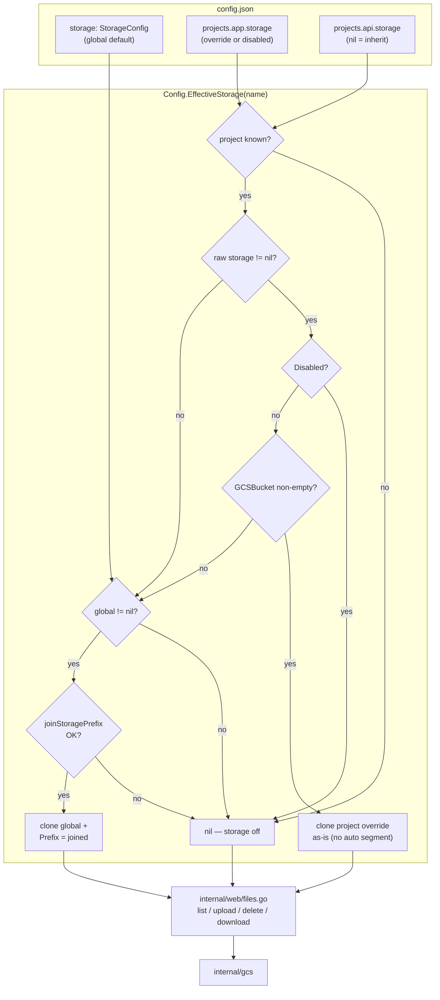
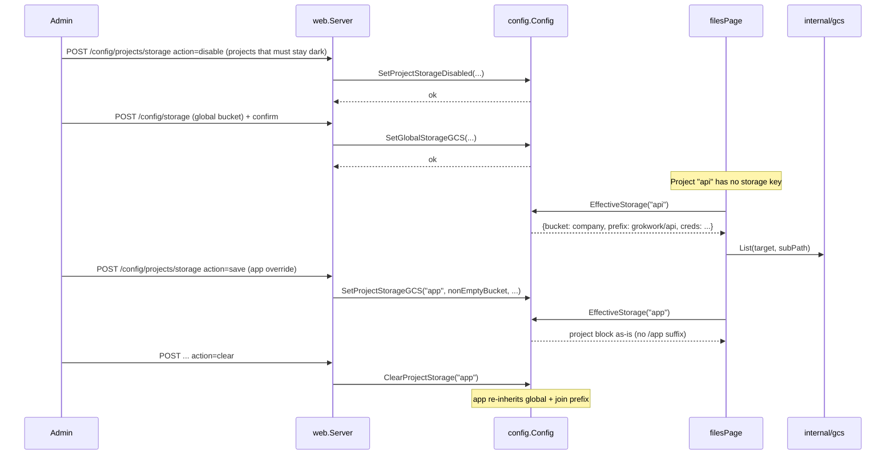

# Design: Global + project-scoped file storage config

| Field | Value |
|-------|--------|
| **Author** | — |
| **Date** | 2026-08-11 |
| **Status** | Draft |
| **Related** | [`docs/design-project-storage-gcs.md`](./design-project-storage-gcs.md) |
| **Revision** | 2026-08-11 — address design review (empty-bucket contract, prefix isolation, PR order, empty-state flags) |

## Overview

File storage (GCS) is currently **project-only**: each project must link its own bucket/prefix/credentials before the Files page works. Operators who share one company bucket across many projects must re-enter the same block on every project, and there is no single place to set a host-wide default.

This design adds a **global storage default** on top-level config, editable from the global `/config` hub. A project’s **effective** storage is the project’s whole-block override when present, otherwise the global default (with automatic per-project prefix isolation under a shared bucket). Call sites that read storage for the Files page switch to effective resolution so a project with no `storage` key still works when global is set. Clearing a project override re-inherits global; an explicit **disabled** override turns storage off for that project without wiping the global default.

**Strict write contract:** `SetProjectStorageGCS` always requires a non-empty bucket. Unlink / re-inherit is only `ClearProjectStorage`; opt-out is only `SetProjectStorageDisabled`. The web form never treats an empty bucket field as a clear signal.

## Background & Motivation

### Current state

| Piece | Location | Behavior today |
|-------|----------|----------------|
| Config type | `internal/config/storage.go` → `ProjectStorageConfig` | `{gcsBucket, prefix, credentialsFile}` on `ProjectConfig.Storage` |
| Read | `Config.ProjectStorage(name)` | Project block only; nil when unlinked |
| Write | `Config.SetProjectStorageGCS(...)` | Empty bucket nils the project block |
| Files page | `internal/web/files.go` | `s.cfg.ProjectStorage(project)` → `storageTarget` → `internal/gcs` (four call sites: page, upload, delete, download) |
| Settings UI | Integrations tab (`project_config_integrations.tmpl`) | Bucket / prefix / credentials; clear bucket unlinks |
| Feature flag | `webAuth.features.storage` | Gates upload/delete only |
| Audit | `ActionConfigSetProjectStorage`, upload/delete | Project-scoped config action only; `credentialsFileSet` bool, never path |
| Example | `config.example.json` → `projects.app.storage` | No top-level `storage` |

There is **no** global storage field on `Config`, no Snapshot projection for a host default, and no inheritance UI.

### Pain points

1. **Repetition** — multi-project hosts that share one GCS bucket/service account must paste the same triple into every project.
2. **Onboarding** — new projects have no Files page until an admin visits Integrations and fills the card, even when the host already has a working default.
3. **Unlink footgun (future)** — once a global default exists, “clear the bucket field” must **not** mean “use global accidentally” or “wipe global”; those are three different intents. Today empty bucket = unlink; with global that same post would become re-inherit unless the API is split.

### Precedent in this repo

Global → project fallback already exists for Discord guild deep links:

- Global: `Config.DiscordGuildID` / `SetDiscordGuildID` / `DiscordGuildIDValue`
- Resolved: `ProjectDiscordGuildID(project)` = project override if set, else global  
  (`internal/config/github.go`)

Storage is a richer block (three fields + auth), so resolution is whole-block rather than per-field empty-string fallthrough, but the **accessor split** (raw override vs effective) matches that pattern.

## Goals & Non-Goals

### Goals

1. Top-level global GCS default (bucket / prefix / credentials), crash-safe and round-tripped like every other config field.
2. Effective resolution: project override **or** global default, used by all Files I/O call sites.
3. Precise override semantics: whole-block override, clear-override (re-inherit or unlink), disable-for-this-project — each a distinct mutator and form action.
4. Safe multi-project sharing of one global bucket via automatic non-empty project-name prefix isolation when inheriting (hash fallback; join failure → effective nil).
5. Global `/config` UI + project Integrations UX that shows inherited vs override vs disabled, with conditional button labels when global is unset.
6. Migration that leaves existing `projects.*.storage` valid as overrides with **no** data rewrite.
7. Tests and audit coverage for the full resolution / sanitize / empty-state matrix and both write surfaces.

### Non-Goals

- Changing `internal/gcs` operation semantics (list/upload/download/delete stay as designed).
- Field-level merge of bucket from global + prefix from project.
- Signed URLs, bucket provisioning, IAM, object versioning (still out of scope from the original design).
- Per-team or per-user storage targets.
- Discord surface for files.
- Auto-migrating existing project storage into global (operators can set global and clear redundant project blocks manually if desired).
- Changing the `storage` feature flag or `CanStorageWrite` capability model.
- Rejecting exotic project names at `AddProject` solely for storage (hash fallback instead).

## Key Decisions

| Decision | Choice | Rationale |
|----------|--------|-----------|
| Override model | **Whole-block** | Bucket, prefix, and credentialsFile are coupled; field-level merge makes “empty credentials = host ADC or inherit global key?” ambiguous and error-prone. |
| Type | Rename `ProjectStorageConfig` → **`StorageConfig` in place** in PR 1 (no alias period) | Single module, no external importers; one validator/normalize/clone path. |
| Resolution API | New **`EffectiveStorage(project)`**; keep **`ProjectStorage`** as raw override; add **`GlobalStorage`** | Files page must not re-implement inheritance; settings UI needs raw vs effective separately (same split as guild ID). |
| Clear vs disable vs save | **Three mutators, no overload:** `SetProjectStorageGCS` requires non-empty bucket; `ClearProjectStorage` nils block; `SetProjectStorageDisabled` stores `{disabled:true}` | Empty bucket on Save must never re-inherit a shared bucket (data exposure). No one-release empty→clear back-compat once global exists. |
| Shared-bucket isolation | When **inheriting** global, effective prefix = `join(global.Prefix, storageProjectSegment(name))`; segment **never empty** (hash fallback); join/validate error → **`EffectiveStorage` returns nil** | Without isolation every project’s Files page lists the whole company bucket. Fail closed on bad join — never return unjoined global prefix. |
| Sanitize collisions (`foo!bar` vs `foo_bar`) | Document + pin in tests; escape hatch is a project override with a unique prefix. Do not invent live disambiguation that renames object namespaces under operators. | Fail-open to bare global root is worse; empty→hash covers the critical case. Path-safe project names avoid collisions. |
| Global UI placement | Dedicated sub-page **`/config/storage`** with hub drill (like worktrees/rates) | Storage form is multi-field + credentials path; not a one-toggle hub row. |
| Rollout order | Project disable/clear **UI before** global Save UI; Snapshot inheritance flags in PR 1 | Setting global activates inheritance for every unlinked project; operators need a UI path to `{disabled:true}` first. Global Save confirm shows **inheriting project count only** (no name list). |
| Global `disabled` | Not allowed on global block (load/setter error) | Global is “default on”; opt-out is per-project only. |
| Snapshot flags | **Required in PR 1** (`StorageInherited`, `StorageDisabled`, `StorageSource`, effective bucket/prefix) | PR for Integrations templates is template-only against stable Snapshot fields. |

## Proposed Design

### Architecture

Resolution algorithm (authoritative — implementers code from this list; the diagram is illustration only):

```
EffectiveStorage(name):
  1. if c == nil or name unknown in Projects → return nil
  2. raw := Projects[name].Storage
  3. if raw != nil && raw.Disabled → return nil
  4. if raw != nil && raw.GCSBucket != "" → return clone(raw)  // override as-is
  5. // raw is nil, or (defensive) non-disabled empty bucket — treat as inherit
  6. if GlobalStorage == nil → return nil
  7. prefix, err := joinStoragePrefix(global.Prefix, name)
  8. if err != nil → log once to stderr; return nil   // fail closed
  9. return clone(global) with Prefix = prefix
```

Normalize invariants: after load/mutate, a project block is either `nil`, `{Disabled:true}`, or a full override with non-empty bucket. Step 4–5 therefore only see full overrides or inherit; the empty-bucket branch is defensive for half-mutated / hand-edited JSON that skipped normalize.



### Config shape

```json
{
  "storage": {
    "gcsBucket": "acme-company-files",
    "prefix": "grokwork",
    "credentialsFile": "/etc/grokwork/gcs-key.json"
  },
  "projects": {
    "app": {
      "path": "/repos/app",
      "storage": {
        "gcsBucket": "acme-app-private",
        "prefix": "prod",
        "credentialsFile": "/etc/grokwork/app-key.json"
      }
    },
    "api": {
      "path": "/repos/api"
    },
    "legacy": {
      "path": "/repos/legacy",
      "storage": {
        "disabled": true
      }
    }
  }
}
```

| Project | Stored `projects.*.storage` | Effective target |
|---------|----------------------------|------------------|
| `app` | Full override | `gs://acme-app-private/prod/…` |
| `api` | nil (inherit) | `gs://acme-company-files/grokwork/api/…` |
| `legacy` | `{disabled: true}` | nil (Files explainer; storage off) |
| (any) with no global and no override | nil | nil |
| inherit + join error | nil raw | nil (fail closed; stderr log) |

### Type and normalize (`internal/config/storage.go`)

**Rename in place in PR 1** — `ProjectStorageConfig` → `StorageConfig`. Fix all compile sites in-module (`storageTarget`, Snapshot, tests). No type alias period.

```go
// StorageConfig is GCS file storage: the global default and/or a per-project
// override. Empty bucket after normalize yields nil (except disabled project
// blocks, which keep Disabled only).
type StorageConfig struct {
	GCSBucket string `json:"gcsBucket,omitempty"`
	Prefix    string `json:"prefix,omitempty"`
	// CredentialsFile is an optional absolute path to a service-account JSON key.
	CredentialsFile string `json:"credentialsFile,omitempty"`
	// Disabled is project-only: storage is off for this project even when a
	// global default exists. Forbidden on the global block (load + setter error).
	// When true, other fields are ignored and stripped on normalize.
	Disabled bool `json:"disabled,omitempty"`
}
```

Helpers (rename along with type):

```go
func cloneStorage(s *StorageConfig) *StorageConfig

// normalizeStorage trims and validates.
// projectContext: when true, Disabled is allowed and yields {Disabled:true}.
// when false (global), Disabled is a hard error if set.
func normalizeStorage(s *StorageConfig, projectContext bool) (*StorageConfig, error)
```

**Normalize rules:**

1. Trim all strings.
2. If `Disabled`:
   - If `!projectContext` → error (`storage: disabled is only valid on projects.*.storage`).
   - Return `&StorageConfig{Disabled: true}` (strip bucket/prefix/credentials).
3. If `GCSBucket == ""`: return `nil` (empty → omit).
4. Else validate bucket / prefix / credentialsFile with existing helpers (`validateGCSBucket`, `validateStoragePrefix`, `validateStorageCredentialsFile`).

**Load hook site (mandatory):** In `Load()` (`internal/config/config.go`), **immediately after** `json.Unmarshal(raw, &c)` succeeds and **before** channel/project path checks (or with the other post-parse validation block around the legacy warnings — either is fine as long as it runs before the config is returned), normalize global storage:

```go
// After json.Unmarshal — projects already normalized via ProjectsMap.UnmarshalJSON.
// Global storage has no UnmarshalJSON hook; must normalize here or any save
// that round-trips outObj would persist a bad block, and EffectiveStorage
// would see unvalidated fields.
st, err := normalizeStorage(c.Storage, false /* global */)
if err != nil {
    return nil, fmt.Errorf("storage: %w", err)
}
c.Storage = st
```

Project path continues through `ProjectsMap.UnmarshalJSON` → `normalizeStorage(pc.Storage, true)`.

### Resolution functions

```go
// GlobalStorage returns a copy of the host default, or nil.
func (c *Config) GlobalStorage() *StorageConfig

// ProjectStorage returns the project's raw stored block (override or disabled),
// or nil when the project inherits. Does NOT apply global fallback.
func (c *Config) ProjectStorage(name string) *StorageConfig

// EffectiveStorage is the single resolution entry for Files I/O.
// See algorithm above. On join/validate failure returns nil (fail closed);
// never returns global with an unjoined prefix.
func (c *Config) EffectiveStorage(name string) *StorageConfig
```

#### Prefix algorithm (inherit path only)

```go
// storageProjectSegment returns a single safe object-name segment for a project.
// Post-conditions (always):
//   - non-empty
//   - matches ^[a-zA-Z0-9]([a-zA-Z0-9._-]*[a-zA-Z0-9])?$  (single segment, no /)
//   - length ≤ 63 (fits comfortably under GCS object-name limits with a base prefix)
//   - passes as one segment of validateStoragePrefix
//
// Algorithm:
//  1. Trim space.
//  2. If the raw name already matches the charset regex and length ≤ 63, return it.
//  3. Else map each rune: [a-zA-Z0-9._-] keep; everything else → '_'.
//     Collapse consecutive '_', strip leading/trailing '_' and '.'.
//  4. If result is empty, too long, or still fails the charset regex →
//     return "p_" + first 16 hex chars of SHA-256(raw name UTF-8)
//     (always matches charset; non-empty; stable; different raw → different hash
//     except cryptographic collision).
//  5. Never return "".
func storageProjectSegment(project string) string

// joinStoragePrefix joins optional base prefix with storageProjectSegment(project).
// Re-validates the full string with validateStoragePrefix.
// Returns error if the joined prefix is invalid (should be rare after segment
// rules; still fail closed in EffectiveStorage).
func joinStoragePrefix(base, project string) (string, error)
```

Examples:

| Global prefix | Project | Segment | Effective prefix |
|---------------|---------|---------|------------------|
| `grokwork` | `api` | `api` | `grokwork/api` |
| `` | `api` | `api` | `api` |
| `team/files` | `app` | `app` | `team/files/app` |
| `grokwork` | `!!!` | `p_<hash16>` | `grokwork/p_<hash16>` |
| `grokwork` | `foo!bar` | `foo_bar` | `grokwork/foo_bar` |

**Collision note:** `foo!bar` and `foo_bar` both sanitize to `foo_bar` (same segment). That is a real cross-project collision if both project names exist. Mitigation:

- Document on the global storage page: “Project names should be path-safe (`[a-zA-Z0-9._-]`); exotic names share a sanitized segment or use a hash.”
- Prefer operators rename or set a **project override** with an explicit unique prefix when two names collide.
- Tests include the known pair so the behavior is pinned (same segment), not silently “fixed” later in a way that moves objects.
- Empty-after-sanitize names (`!!!`) **never** share the bare global root — they get `p_<hash>`.

**Override path** does not append the project name: if the operator sets `prefix: "prod"` on the project, objects live under `prod/…` only.

**Override shared-bucket warning (non-blocking):** On project `action=save`, if `GlobalStorage() != nil` and `bucket == global.GCSBucket` and the submitted prefix does **not** equal `joinStoragePrefix(global.Prefix, project)` and does **not** have that joined string as a path prefix (`joined + "/"`), the handler still saves but flash includes a warning, e.g.:

> Saved override. Warning: this project uses the same bucket as the global default without the isolated prefix `grokwork/app`. Other projects may see the same objects.

Integrations card static help (always visible on override form):

> An override replaces the global default entirely (bucket, prefix, and credentials). Prefix is used as-is — the project name is **not** appended. If you reuse the company bucket, set a unique prefix (e.g. `grokwork/app`) so this project does not share another project’s objects.

### Snapshot fields (required in PR 1)

```go
// Snapshot — global default (raw)
StorageBucket          string // global raw bucket (empty = no default)
StoragePrefix          string
StorageCredentialsFile string // host path OK in private UI; never Discord/audit
StorageConfigured      bool   // global non-nil after normalize

// ProjectItem — raw + effective for forms and Files chrome
StorageBucket, StoragePrefix, StorageCredentialsFile // raw override; empty when nil or disabled
StorageDisabled        bool   // project block has Disabled
StorageInherited       bool   // raw nil && global configured (will inherit if not disabled)
StorageEffectiveBucket string // from EffectiveStorage; empty when nil
StorageEffectivePrefix string
StorageSource          string // "override" | "global" | "disabled" | "none"
```

`StorageSource` derivation:

| Condition | Source |
|-----------|--------|
| raw.Disabled | `"disabled"` |
| raw with non-empty bucket | `"override"` |
| raw nil && global set | `"global"` |
| else | `"none"` |

Compute in `Snapshot()` under RLock via `effectiveStorageLocked` / `storageSourceLocked`.

### Mutators (strict contract)

```go
// SetGlobalStorageGCS sets or clears the host default.
// - Non-empty bucket: validate and set.
// - Empty bucket: clear (nil c.Storage). This is the global unlink; there is
//   no "disable" at global scope.
// - Disabled is never accepted (error if somehow passed — N/A on this signature).
func (c *Config) SetGlobalStorageGCS(bucket, prefix, credentialsFile string) error

// SetProjectStorageGCS sets a full override.
// REQUIRES non-empty bucket after trim. Empty bucket → error:
//   "gcsBucket is required; use ClearProjectStorage to re-inherit/unlink, or SetProjectStorageDisabled to turn Files off"
// Never clears, never disables, never re-inherits.
func (c *Config) SetProjectStorageGCS(project, bucket, prefix, credentialsFile string) error

// ClearProjectStorage nils projects[name].Storage.
// - If global is set → project re-inherits (isolated prefix).
// - If global is unset → project has no storage (same as today's unlink).
func (c *Config) ClearProjectStorage(project string) error

// SetProjectStorageDisabled stores {disabled: true}, turning Files off for
// this project regardless of global. Strips any previous override fields.
func (c *Config) SetProjectStorageDisabled(project string) error
```

**Web form contract** for `POST /config/projects/storage` (single route, `action` field):

| `action` | Behavior | Empty bucket field |
|----------|----------|--------------------|
| `save` (default) | `SetProjectStorageGCS` — **requires** non-empty `gcsBucket` | Reject with `err=` flash |
| `clear` | `ClearProjectStorage` | Ignored |
| `disable` | `SetProjectStorageDisabled` | Ignored |

There is **no** “clear the bucket name and press Save.” Update `TestSetProjectStoragePersistsAndRedirects` in the same PR as the form change: clear posts `action=clear`, not empty bucket.

Keep `mutateProjectStorage` as the write chokepoint for project blocks.

### Round-trip checklist (mandatory)

| Point | Change |
|-------|--------|
| `Config` struct | `Storage *StorageConfig \`json:"storage,omitempty"\`` |
| `Load()` after `json.Unmarshal` | `normalizeStorage(c.Storage, false)`; error on invalid / disabled (see hook site above) |
| `ProjectsMap.UnmarshalJSON` | `normalizeStorage(pc.Storage, true)` for disabled path |
| `saveLocked` `outObj` | **Must** include `Storage *StorageConfig \`json:"storage,omitempty"\`` and assign `cloneStorage(c.Storage)` — omitting it silently drops global on any config save (whitelist trap) |
| Snapshot | global fields + full `ProjectItem` inheritance flags (PR 1) |
| `config.example.json` | top-level `storage` example + note that project block overrides |

No full `Config.clone` exists today; global only needs `saveLocked` outObj + `cloneStorage`. Test: `SetGlobalStorageGCS` then unrelated `SetProjectVerifyCommands` → reload → global still present (mirror `TestProjectStorageRoundTrip`).

### Call-site migration

**Must switch to `EffectiveStorage` for I/O:**

- `filesPage`, `postFileUpload`, `postFileDelete`, `getFileDownload` in `internal/web/files.go`
- Grep `ProjectStorage` under `internal/web` when flipping so new readers are not missed

**Keep `ProjectStorage` / Snapshot flags for chrome:**

- Project Integrations page
- Files page empty-state branching
- Audit detail for project config writes (what was stored)
- Tests asserting raw persistence

#### Files page data (`pageData` / `files.tmpl`)

Handler sets chrome from **raw + effective**, I/O only from effective:

```go
eff := s.cfg.EffectiveStorage(project)
raw := s.cfg.ProjectStorage(project)
global := s.cfg.GlobalStorage()

d.StorageDisabled = raw != nil && raw.Disabled
d.StorageInherited = raw == nil && global != nil && !d.StorageDisabled
d.StorageNotConfigured = eff == nil && !d.StorageDisabled
// When disabled, eff is nil but StorageNotConfigured stays false so the
// template can show the disabled card instead of "not linked".

if eff != nil {
    d.StorageBucket = eff.GCSBucket
    d.StoragePrefix = eff.Prefix
    // list/upload/delete/download use storageTarget(eff)
} else {
    // no List/Describe/… calls — spy in tests
}
```

| Flags | Template |
|-------|----------|
| `StorageDisabled` | Card title **“Storage disabled for this project”**; admin link to Integrations |
| `StorageNotConfigured` | Card title **“No file storage linked”** (existing); admin links to Integrations **and** `/config/storage` |
| effective set + inherited | Normal listing; subline may note “via global default” (optional) |
| effective set + override | Normal listing |

`storageTarget` maps `*StorageConfig` → `gcs.Target` (bucket/prefix/credentials only; ignores `Disabled`). Signature updates with the rename.

### Sequence: inherit vs override



## API / Interface Changes

### Config package (public surface)

| Symbol | Change |
|--------|--------|
| `StorageConfig` | Rename from `ProjectStorageConfig` in place; add `Disabled bool` |
| `Config.Storage` | New field |
| `GlobalStorage` / `SetGlobalStorageGCS` | New |
| `EffectiveStorage` | New — **Files I/O must use this** |
| `ProjectStorage` | Unchanged meaning: **raw** override only |
| `ClearProjectStorage` | New — only clear/re-inherit/unlink path |
| `SetProjectStorageDisabled` | New — only disable path |
| `SetProjectStorageGCS` | **Requires non-empty bucket**; error otherwise |

### Web routes

| Method | Path | Gate | Handler |
|--------|------|------|---------|
| GET | `/config/storage` | `requireAdmin` | `storageConfigPage` |
| POST | `/config/storage` | `requireAdmin` | `setGlobalStorage` |
| POST | `/config/projects/storage` | `requireAdmin` | `setProjectStorage` (`action=save\|clear\|disable`) |

Named routes: `config.storage` → `/config/storage`; keep `config.setProjectStorage`.

**Global Save confirm** (`data-confirm` on the submit button, not `window.confirm`). Copy is **count only** — no project name list in the dialog or form:

> Set global file storage? 12 project(s) without an override will inherit `gs://{bucket}/{prefix}/{project}`. Projects with storage disabled stay off. Projects with an override are unchanged.

Render `N` from a simple count of projects with no storage override and not disabled (`StorageSource` would be `"global"` after save). The form does not need a server-rendered name list for confirm — only the integer. Audit may still record `inheritProjectCount` as that number.

Hub drill on `config.tmpl`:

```html
<a class="drill" href="{{route "config.storage"}}">
  <span class="drill-main">
    <span class="drill-t">File storage</span>
    <span class="drill-s">default GCS bucket for project Files pages</span>
  </span>
  {{if .Config.StorageConfigured}}
    <span class="drill-v mono">{{.Config.StorageBucket}}</span>
  {{else}}
    <span class="badge status-warn">not set</span>
  {{end}}
</a>
```

### Project Integrations UI — states and **conditional labels**

| State | Condition | Display | Primary actions |
|-------|-----------|---------|-----------------|
| **None** | `StorageSource == "none"` | Explainer; empty override form | **Link storage** (`action=save`); Disable hidden or de-emphasized |
| **Inheriting** | `StorageSource == "global"` | Read-only effective bucket + joined prefix “from global default” | **Override…** (`action=save` form); **Disable for this project** (`action=disable`, confirm) |
| **Override** | `StorageSource == "override"` | Editable raw fields | **Save override** (`action=save`); clear/unlink button (label below); optional Disable |
| **Disabled** | `StorageSource == "disabled"` | Badge “Files page is off for this project” | **Re-enable inheritance** if global set / **Clear disable** if not (`action=clear`); **Set custom storage…** (`action=save` form) |

**Clear button labels:**

| Context | Button label | `data-confirm` gist |
|---------|--------------|---------------------|
| Override + **no** global | **Unlink storage** | Removes project storage. Files page turns off. |
| Override + global | **Clear override (use global…)** | Re-inherits `gs://{bucket}/{joinedPrefix}`. |
| Disabled + global | **Re-enable inheritance** | Removes disable tombstone; inherits global under isolated prefix. |
| Disabled + no global | **Clear disable** | Removes tombstone; Files stays off until linked. |

Disable when global is unset: hide by default (or secondary “Advanced”) so operators do not plant a sticky `{disabled:true}` thinking it means unlink. API still allows `SetProjectStorageDisabled` for symmetry and hand-edited config.

## Data Model Changes

### JSON

```text
+ storage?: { gcsBucket, prefix?, credentialsFile? }   // top-level; disabled forbidden
  projects.<name>.storage?: {
      gcsBucket?, prefix?, credentialsFile?, disabled?: true
  }
```

No migration rewrite: existing project blocks remain valid full overrides. After deploy:

- Hosts with only project storage: behavior unchanged (`EffectiveStorage` == old `ProjectStorage` for overrides).
- Hosts that set global: projects without a block inherit automatically (after disable UX ships — see PR order).

### On-disk size

Negligible (one small object in `config.json`). No new files under `data/`.

## Alternatives Considered

### A. Field-level merge (bucket global, prefix project, …)

**Pros:** Flexible partial overrides.  
**Cons:** Empty string vs unset is already painful; credentials empty-vs-inherit is a security footgun; three independent inheritance axes explode the test matrix.  
**Rejected** in favor of whole-block.

### B. No “disable”; clear override only

**Pros:** Smaller API.  
**Cons:** A project that must not expose the company bucket has no fail-closed switch once global is set.  
**Rejected**; `disabled: true` is a one-bool addition with clear semantics.

### C. No auto project segment under global prefix

**Pros:** Operator controls exact prefix; simpler resolution.  
**Cons:** Default multi-project setup becomes a cross-project data leak on day one.  
**Rejected** as default; operators who want a shared flat namespace set the **same** override on each project deliberately (with warning when bucket matches global).

### D. Global settings only as hub inline form (no sub-page)

**Pros:** Fewer routes.  
**Cons:** Hub is drill-based; multi-field credentials forms live on sub-pages.  
**Rejected**.

### E. Rename Files resolution to keep `ProjectStorage` as effective

**Pros:** Fewer call-site renames.  
**Cons:** Settings UI loses raw reads; guild precedent uses a distinct resolved name.  
**Rejected**.

### F. Empty bucket on SetProjectStorageGCS means Clear (back-compat)

**Pros:** Fewer test updates.  
**Cons:** Once global exists, empty post = re-inherit — the exact High-severity exposure this design closes; two implementers will disagree if both paths are “preferred.”  
**Rejected.** Strict non-empty on set; explicit clear/disable only.

### G. Gate inheritance behind per-project opt-in

**Pros:** No surprise activation when global is set.  
**Cons:** Conflicts with goals 2 and 4 (default works without per-project config); reintroduces the repetition pain.  
**Rejected** in favor of PR order (disable UI first) + global Save confirm with inheriting **count only**.

## Security & Privacy Considerations

| Threat | Severity | Mitigation |
|--------|----------|------------|
| Project A lists Project B objects under shared global bucket | **High** | Auto-append non-empty `storageProjectSegment`; never list at bare global prefix for a project; join error → nil |
| Empty-bucket Save re-inherits global | **High** | `SetProjectStorageGCS` rejects empty; only `ClearProjectStorage` / `action=clear` |
| Global set before disable UI | **High** | PR order: project disable/clear UX before global UI; Save confirm shows inheriting project **count** (no name list) |
| Sanitize empty → bare global prefix | **High** | Hash fallback `p_<16 hex>`; never empty segment |
| Sanitize collisions (`foo!bar` / `foo_bar`) | Medium | Document; pin in tests; override escape hatch; prefer path-safe names |
| Override reuses global bucket without isolation | Medium | Non-blocking flash warning + static Integrations copy |
| Global `disabled` misread | Low | Forbidden on global; load error |
| Credentials path in audit / Discord | Medium (existing) | `credentialsFileSet` bool only; ScrubPaths; no Discord surface |
| Path traversal via project name in joined prefix | Medium | Segment charset + `validateStoragePrefix`; fail closed |
| Feature flag / capability bypass | — | Unchanged |
| Admin-only config writes | — | Global and project storage POSTs stay `requireAdmin` |

Object-name validation in `internal/gcs` remains the containment boundary for user-supplied `path` / `object` query params. Config-layer prefix policy is the first line; `Target.validate()` is defense in depth, not a substitute.

## Observability

- **Audit**
  - New: `ActionConfigSetGlobalStorage = "config.set_global_storage"`  
    Detail: `{bucket, prefix, credentialsFileSet, cleared bool, inheritProjectCount int}` — never credentials path; optional count of projects that will inherit.
  - Existing: `ActionConfigSetProjectStorage`  
    Detail: `{name, bucket, prefix, credentialsFileSet, action: "save"|"clear"|"disable"}`.
  - Upload/delete: `{project, bucket, object, size}` against **effective** target.
- **Logs:** `EffectiveStorage` join failure → `fmt.Fprintf(os.Stderr, "[warn] effective storage for project %q: %v\n", name, err)` once per call (acceptable; low QPS). gcloud stderr still inline on Files page.
- **Metrics:** none required.

## Rollout Plan

1. **Config + Snapshot flags + full test matrix** — strict mutators; Files still on `ProjectStorage` until PR 2.
2. **Files → `EffectiveStorage` + empty-state flags** — safe with no global set; ready for inherit when global appears.
3. **Project Integrations three-state + `action=save|clear|disable`** — **before** global UI so operators can disable dark projects.
4. **Global `/config/storage` + hub drill + inherit confirm** — activates inheritance with eyes open.
5. **Docs** cross-link (optional).

**Rollback:** empty top-level `storage` or revert binary. Project overrides continue. No data-dir migration.

**Feature flag:** none new; existing `webAuth.features.storage` gates writes only.

**Hand-edit pre-flight (if global is set via JSON before UI exists):** operators who must keep projects dark write `"storage": {"disabled": true}` on those projects before setting top-level `storage`. PR order makes the UI path available first for normal deploys.

## Tests

### `internal/config`

| Test | Asserts |
|------|---------|
| `TestGlobalStorageRoundTrip` | Set → **unrelated** `SetProjectVerifyCommands` → reload → `GlobalStorage` + Snapshot; `cloneStorage` detaches |
| `TestEffectiveStorageMatrix` | no global/no project; global only; project override; disabled; disabled+global; unknown project; prefix join `""`/`"pfx"`; join failure → nil |
| `TestStorageProjectSegment` | path-safe passthrough; `!!!` → `p_`+hash non-empty; unicode; slash names; never `""`; charset post-condition; `foo!bar` and `foo_bar` same segment (pinned collision) |
| `TestJoinStoragePrefixValidate` | invalid join path returns error; EffectiveStorage never returns unjoined global |
| `TestSetProjectStorageGCSRequiresBucket` | empty bucket errors; does not clear; does not disable |
| `TestClearProjectStorage` | with global → re-inherit joined; without global → nil effective |
| `TestSetProjectStorageDisabled` | effective nil; raw Disabled; Snapshot `StorageSource=="disabled"`; bucket fields empty on ProjectItem |
| `TestProjectStorageRawDoesNotFallback` | global set, raw still nil |
| `TestGlobalStorageRejectsDisabled` | Load error + normalize global |
| `TestLoadNormalizesGlobalStorage` | invalid global bucket is Load error; empty global object → nil |
| Existing project round-trip / validation | update for rename + Disabled |

### `internal/web`

| Test | Asserts |
|------|---------|
| Files **global only** | List under joined prefix; `StorageInherited` chrome |
| Files **disabled** | body contains `Storage disabled for this project`; **gcsRunner not called** for list |
| Files **unconfigured** | `No file storage linked`; admin sees `/config/storage` link |
| Files **override** | uses override prefix (not joined) |
| Project `action=save` empty bucket | `err=` redirect; config unchanged |
| Project `action=clear` vs `disable` under global | clear → inherit; disable → nil; **clear ≠ disable** |
| Override same bucket as global without isolated prefix | save succeeds; flash/warning contains isolation warning |
| `POST /config/storage` | persist + redirect + admin gate; confirm path optional |
| UI pins | `id="page-config-storage"`; hub drill; Integrations labels |
| Update `TestSetProjectStoragePersistsAndRedirects` | clear via `action=clear`, not empty bucket |

## Open Questions

1. ~~Sanitize vs reject exotic project names~~ — **Resolved:** hash fallback; do not reject at `AddProject`.
2. ~~Snapshot credentials path for global~~ — **Resolved:** yes, same as project (private UI).
3. **Optional later:** “Copy global into override” prefill — not v1; if added, prefill should use joined isolated prefix to avoid the shared-namespace footgun.
4. ~~Whether global Save confirm lists names or count~~ — **Resolved: count only.** Confirm copy is e.g. “N project(s) without an override will inherit `gs://{bucket}/{prefix}/{project}`…”. No name list in the dialog or hub form; audit `inheritProjectCount` remains a number.

## Risks

| Risk | Severity | Mitigation |
|------|----------|------------|
| Call site forgets `EffectiveStorage` | Medium | Grep `ProjectStorage` in `internal/web`; global-only Files test |
| Sanitize segment collisions | Medium | Document; pin tests; override escape |
| Operators set global via JSON before disable UI | Medium | PR order; pre-flight note; disabled blocks work from PR 1 APIs |
| Joined prefix too long | Low | Segment max 63; validateStoragePrefix; fail closed |
| Operators expect field-level merge | Low | UI copy: override replaces entirely |

## References

- [`docs/design-project-storage-gcs.md`](./design-project-storage-gcs.md) — original Files/GCS design
- `internal/config/storage.go` — current project storage
- `internal/config/config.go` — `Load`, `saveLocked` outObj whitelist (~757–850), Snapshot project storage (~1309–1312)
- `internal/config/project.go` — `ProjectsMap.UnmarshalJSON` project normalize
- `internal/config/github.go` — `ProjectDiscordGuildID` global fallback precedent
- `internal/web/files.go` — Files handlers (four `ProjectStorage` sites)
- `internal/web/templates/project_config_integrations.tmpl` — project storage card
- `internal/web/templates/config.tmpl` — config hub drills
- `internal/audit/audit.go` — action name constants
- `config.example.json` — example project storage block

---

## PR Plan

### PR 1 — Config: global storage + EffectiveStorage + Snapshot flags

**Title:** `config: global GCS storage default and EffectiveStorage resolution`

**Files/components:**

- `internal/config/storage.go` — rename `ProjectStorageConfig` → `StorageConfig` in place; `Disabled`; `cloneStorage` / `normalizeStorage(projectContext)`; `GlobalStorage`, `SetGlobalStorageGCS`, `EffectiveStorage`, `storageProjectSegment`, `joinStoragePrefix`, `ClearProjectStorage`, `SetProjectStorageDisabled`; **strict** `SetProjectStorageGCS` (non-empty bucket)
- `internal/config/config.go` — `Config.Storage`; `Load()` post-unmarshal normalize hook; `outObj` whitelist field; Snapshot global + **full ProjectItem flags** (`StorageDisabled`, `StorageInherited`, `StorageSource`, effective bucket/prefix)
- `internal/config/project.go` — comments; project normalize via `normalizeStorage(..., true)`
- `internal/config/storage_test.go` — full matrix including segment sanitize, join→nil, empty-bucket set error, global preserved across unrelated save
- `config.example.json` — top-level `storage` example

**Dependencies:** none

**Description:** Pure config layer. Files still call `ProjectStorage` (behavior unchanged with no global). Lands strict mutator contract and Snapshot fields so later UI PRs are thin.

---

### PR 2 — Files page uses EffectiveStorage + empty-state flags

**Title:** `web: resolve project Files storage via EffectiveStorage`

**Files/components:**

- `internal/web/files.go` — I/O via `EffectiveStorage`; chrome via raw/global flags (`StorageDisabled`, `StorageNotConfigured`, `StorageInherited`)
- `internal/web/web.go` / pageData fields as needed
- `internal/web/files_test.go` — global-only, disabled (no List call), unconfigured, override
- `internal/web/templates/files.tmpl` — three empty-state variants + string pins

**Dependencies:** PR 1

**Description:** Behavior-compatible when global unset. Ready for inheritance when global appears. Grep `ProjectStorage` under `internal/web` when flipping.

---

### PR 3 — Project Integrations: inherit / override / disable UX

**Title:** `web: project storage inherit, clear-override, and disable`

**Files/components:**

- `internal/web/templates/project_config_integrations.tmpl` — three/four-state card; **conditional button labels**; static isolation help; no empty-bucket-as-clear
- `internal/web/files.go` — `setProjectStorage` handles `action=save|clear|disable`; shared-bucket warning flash on save
- `internal/audit` — project storage audit detail `action`
- Web tests: clear ≠ disable under global; empty save rejected; label/redirect pins
- Update `TestSetProjectStoragePersistsAndRedirects`

**Dependencies:** PR 1 (Snapshot flags); PR 2 recommended so Files chrome matches Integrations

**Description:** Ships **before** global UI so operators can disable projects that must stay dark. Removes empty-bucket unlink footgun.

---

### PR 4 — Global config UI

**Title:** `web: /config/storage page for global GCS default`

**Files/components:**

- `internal/web/web.go` — routes, `config.storage`
- `internal/web/storage_config.go` (or `files.go`) — `storageConfigPage`, `setGlobalStorage`
- `internal/web/templates/config_storage.tmpl` — form + `data-confirm` with inheriting **count** (no name list)
- `internal/web/templates/config.tmpl` — hub drill
- `internal/audit/audit.go` — `ActionConfigSetGlobalStorage`
- Web tests: POST persist/redirect/admin; page marker `id="page-config-storage"`

**Dependencies:** PR 1; **PR 3 required before or with this PR** so disable UI exists before one-click global activation

**Description:** Admin sets/clears host default with confirm showing how many projects will inherit (count only). Audit on every write.

---

### PR 5 (optional) — Docs cross-link

**Title:** `docs: link global storage design from project-storage-gcs`

**Files/components:**

- `docs/design-project-storage-gcs.md` — “See also” for config layering
- `docs/design-global-project-storage.md` — this document

**Dependencies:** none (anytime after PR 1)

**Description:** Documentation only.
