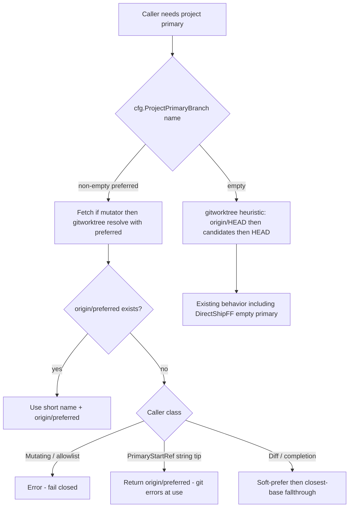
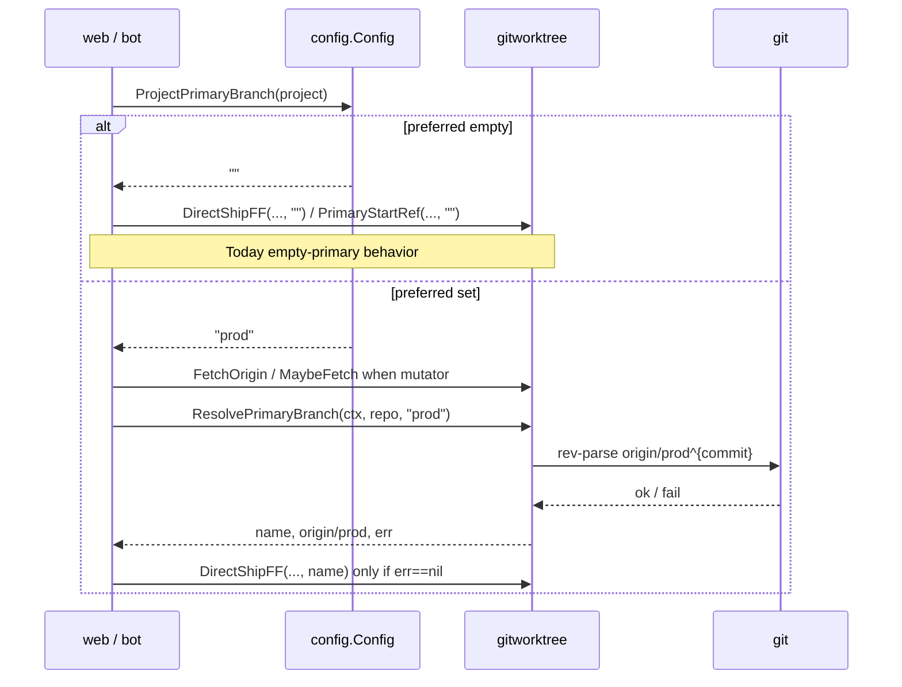

# Design: Project-scoped default git branch (primary override)

| Field | Value |
|-------|--------|
| **Status** | Implemented |
| **Author** | (agent) |
| **Date** | 2026-08-12 |
| **Module** | `github.com/acoshift/grokwork` |
| **Related** | [`docs/design-no-pr-mode.md`](docs/design-no-pr-mode.md), [`docs/design-deploy-pipeline.md`](docs/design-deploy-pipeline.md) |
| **Repo path (after ship)** | `docs/design-project-primary-branch.md` |

---

## Overview

Today grokwork’s notion of “project primary” is whatever git heuristics infer from the host checkout: `refs/remotes/origin/HEAD`, then a fixed list of common `origin/*` names, then local `HEAD`. That follows **GitHub’s / origin’s default branch**, not operator intent. Teams often need GitHub’s default to stay `main` (org policy, UI, branch protection UX) while worktrees, direct-to-primary ship, `/sync`, commits browser, empty deploy allowlists, and Actions YAML reads should target `prod`, `develop`, or another long-lived line.

This design adds an optional **per-project** config field (`projects.<name>.primaryBranch`) that, when set, is the single source of truth for “project primary.” When unset, mutator behavior is **byte-for-byte today’s heuristic** (including `DirectShipFF(..., "")`). Resolution is centralized in `internal/gitworktree` (plus a preferred-name parameter and **matching** candidate list on the `ghpr` Actions primary helper) so callers never re-implement “if config set … else heuristic.”

---

## Background & Motivation

### Current resolution

| API | Location | Behavior |
|-----|----------|----------|
| `resolveNewBranchStart` / `PrimaryStartRef` | `internal/gitworktree/fetch.go` | `origin/HEAD` → `origin/{main,master,prod,production,staging,develop,dev}` → `HEAD` |
| `ResolvePrimaryBranch` | `internal/gitworktree/direct_ship.go` | Wraps the above into short name + `origin/<name>`; `HEAD` falls back to local branch name |
| `resolveOriginPrimaryRef` / `ResolveOriginPrimaryRef` | `internal/ghpr/actions_yaml.go` | Narrower today: `origin/HEAD` → `origin/main` → `origin/master` only (no `prod`/`develop`) — **this design expands empty-preferred candidates to match gitworktree** |
| `DetectClosestBaseRef` / `ResolveDiffBaseRef` | `internal/ghpr/baseref.go` | Closest-base scoring over a larger candidate list; optional preferred short name; falls through to closest-base when preferred is unusable |
| `PreferOriginRef` | `internal/ghpr/baseref.go` | Short-circuits on any `/` and returns the name as-is (does **not** try `origin/<hierarchical>`) |

### Pain points

1. **Policy mismatch** — GitHub default must be `main`, but the team ships / reviews against `prod` or `develop`.
2. **Stale or missing `origin/HEAD`** — after a GitHub default rename, bare clone, or never-run `git remote set-head`, heuristics can pin the wrong branch or fall through to a dirty local `HEAD`.
3. **Silent wrong base** — new worktrees (`fetchBeforeCreate` → `worktree add -b`), direct ship (`DirectShipFF` with empty primary), deploy empty `allowedRefs`, and the commits browser all share the same guess and can disagree with operator mental model without any config surface to correct it.
4. **Split brains** — Actions YAML reads use a *shorter* candidate list than worktree create; a repo whose only long-lived branch is `prod` may create worktrees from `origin/prod` but fail Actions primary resolution. (A local `git remote set-head origin prod` already unifies both sides while config is empty — see Alternative F.)
5. **No durable product control** — a host-local `origin/HEAD` fix is a valid interim ops tip (~80% of the “wrong default” pain) but is not UI-visible, not fail-closed on typos, and does not drive PR `--base` or the direct-mode forbid-list. Renaming GitHub’s default is often blocked by org policy; that is a separate constraint from the local-set-head workaround.

### Existing related config

- `ProjectConfig.DirectToPrimary *bool` — ship *mode*, not *which* branch is primary.
- `sessionstore.Entry.PrimaryBranch` — **outcome stamp** after a direct ship (and used by `/sync` when present). Not project config; do not repurpose.
- Deploy `allowedRefs` empty → “project primary only” (`deploy.Engine.checkRef`).

---

## Goals & Non-Goals

### Goals

1. Per-project optional primary branch name, editable at runtime from Workflow settings (admin), persisted in `config.json`.
2. One resolution path: configured name (when set) else existing heuristic (with Actions empty-preferred candidates aligned to gitworktree).
3. All product surfaces that mean “primary” honor the same configured name when set (inventory below).
4. **Zero migration for empty config:** when `primaryBranch` is unset/empty, mutators keep **today’s** call shapes — notably `shipDirectAfterTask` still calls `DirectShipFF(..., "")` so local-only noop and existing empty-primary paths are unchanged. Actions empty-preferred gains the longer candidate list (behavior expansion only when origin/HEAD and main/master are absent — see §8).
5. **Fail-closed semantics are scoped by surface class** (see Key Decisions and §5):
   - **Mutating / allowlist paths** (worktree create, direct ship, `/sync`, deploy empty `allowedRefs`): when preferred is set and the ref is missing **after fetch**, **error** — never silently substitute `main` or `HEAD`.
   - **String tip APIs** (`PrimaryStartRef`): return `origin/<preferred>` even if missing; callers surface git “unknown revision” (or empty list). Deploy *default ref* for Trigger uses this string tip; the allowlist gate is the fail-closed half.
   - **Diff / completion**: **soft-prefer** configured primary via `ResolveDiffBaseRef` (existing fallthrough to closest-base when preferred is unusable). Documented; does **not** claim fail-closed.
6. Validation rejects `origin/` prefix, path separators (`/`), empty-with-whitespace, literal `HEAD`, and a documented `check-ref-format --branch` subset (including leading `.`).
7. Tests pin precedence, validation, empty-config parity (including `DirectShipFF(..., "")`), configured resolve-then-ship, fetch-before-resolve on ship when preferred set, and no create-branch-on-push for configured primary.

### Non-goals

- Changing GitHub’s repository default branch or syncing config ↔ GitHub.
- Forcing the host main checkout’s checked-out branch to match.
- Per-repo primary override for multi-repo catalogs (v1 is **project-level only**; document workaround).
- Rewriting closest-base scoring for PR diffs beyond “prefer configured primary when no PR base is known.”
- Hierarchical primary names (`release/x`) in v1.
- Sticky per-session override independent of project config (sessions keep `Entry.PrimaryBranch` only as ship/sync history).
- Env vars (`GROK_WORK_*`) for this setting.
- Auto-correcting a PR base after the agent omits `--base`.
- Changing `sortBranchesPrimaryFirst` Actions dropdown ordering (cosmetic; stays `main`/`master` first unless a follow-up wants configured primary first).

---

## Key Decisions

| Decision | Choice | Rationale |
|----------|--------|-----------|
| **JSON / field name** | `primaryBranch` string on `ProjectConfig` | Matches session stamp vocabulary; empty = unset (same pattern as `caseKey`). |
| **Where logic lives** | Config stores + validates; `gitworktree` resolves with an optional preferred short name; callers pass `cfg.ProjectPrimaryBranch(project)` | Config must not import gitworktree; gitworktree must not import config. Keeps packages acyclic. |
| **API shape** | Add `preferred string` to `PrimaryStartRef` / `ResolvePrimaryBranch` / `resolveNewBranchStart` / `fetchBeforeCreate` / `EnsureOpts` | Required empty-string parameter (not varargs); greppable call sites. PR2 updates **all** in-repo sites to `""`. |
| **Fail-closed scope** | Mutating/allowlist: fail closed when preferred set. `PrimaryStartRef`: return `origin/<pref>`. Diff/completion: soft-prefer with fallthrough | Goal #5 must not overclaim. Silent wrong-base is catastrophic for ship/create/deploy allowlist; diffs already use closest-base for backports. |
| **DirectShipFF contract** | **Resolve-first only when `pref != ""`.** Empty config → keep today’s `DirectShipFF(..., "")` (internal heuristic resolve; local-only noop preserved). Configured preferred → fetch, then `ResolvePrimaryBranch(ctx, repo, pref)`, then `DirectShipFF(..., name)` only on success. Never pass unresolved preferred into `DirectShipFF`. | “Always resolve first” would feed a non-empty name into the refuse-missing-origin check and break Goal #4 empty-config parity. Scoping to configured preferred keeps zero migration honest. |
| **DirectShipFF defense in depth** | When `primary` argument is non-empty, refuse push if `origin/<primary>` is still missing after best-effort fetch (no create-on-push). When `primary == ""`, **no new existence gate** — today’s empty-primary path. | Blocks typo-create when a caller passes a concrete name; does not change empty-config production path. |
| **Fetch before resolve on direct ship** | When `pref != ""`, `shipDirectAfterTask` fetches (e.g. `FetchOrigin` / throttled `MaybeFetch`) **before** `ResolvePrimaryBranch` | Worktree create, deploy trigger, and `/sync` already fetch first. Without this, mid-flight config set or a newly pushed `prod` fail-closes with “fetch origin” while the bot could have fetched. |
| **Hierarchical names** | **Reject `/` in v1** (single path component) | Avoids `PreferOriginRef` short-circuit on `/` (`baseref.go:40–42`) which would soft-fall session diffs to closest-base. Covers prod/main/develop use cases. |
| **Load invalid disk value** | **Warn once at Load** (name project + point at Workflow); keep raw on `pc.PrimaryBranch`; `ProjectPrimaryBranch` validates-on-read and returns `""` silently for invalid; form shows raw; setter never persists invalid | Single rule (no parallel “effective” field). Matches soft legacy warnings (e.g. unmapped team templates); UI is the repair path. |
| **Worktree create on missing preferred** | When preferred set: pre-check `origin/<preferred>` after fetch (or fail `worktree add` without HEAD retry) and surface a configured-primary error. When preferred empty: keep today’s “retry HEAD if start vanished” fallback. | HEAD fallback is fine for heuristics; with explicit primary it would base the session on the wrong line. |
| **Multi-repo** | Project-level only in v1 | Same short name applied to every catalog checkout. Fail-closed if a secondary lacks `origin/<name>`. |
| **Actions empty-preferred** | Preferred-first; empty preferred uses **the same candidate list as gitworktree** | Closes split-brain. Prefer exporting `gitworktree.PrimaryBranchCandidates` (or equivalent ordered short names) and using it from `ghpr`, **or** a cross-package equality test — repo culture already pins this shape (`TestModelOptionsMatchInference`). No new shared package required; cycle-free either way (`gitworktree` imports only stdlib). |
| **PR create `--base`** | Inject into remote-work prompt when configured | No bot-owned `gh pr create` today; prompt is the control plane. Mismatches after create are operator-visible on GitHub and **not** auto-corrected. |
| **Direct-mode forbid-list** | When primary non-empty, forbid commit/push to that branch **by name** (not only main/master) | Closes agent-shaped hole `git push origin HEAD:prod` that bypasses bot-owned DirectShipFF. |
| **Diff / closest-base** | Soft-prefer config primary as `ResolveDiffBaseRef` preferred when no PR base; keep fallthrough | Closest-base remains correct for backports. |
| **Completion base** | **Required** in the wire-up PR: pass project primary as preferred into completion base detection when project is known | Same soft-prefer as session diffs; keeps completion card base consistent with config when usable. |
| **`Entry.PrimaryBranch` vs config** | Stamp after ship; `/sync` prefers stamp then config preferred | Shipped threads keep sync target; new worktrees pick up config immediately. |
| **Ship design into repo** | `docs/design-project-primary-branch.md` | Matches other design docs. |

---

## Proposed Design

### High-level flow



### 1. Config field

```go
// ProjectConfig (internal/config/project.go)
//
// PrimaryBranch is the short git branch name grokwork treats as this project's
// primary (worktree base, direct ship target, /sync merge base, commits default,
// deploy empty allowedRefs, Actions primary tip). Empty = git heuristic
// (origin/HEAD + common names). Never include "origin/" or refs/ prefixes.
// Single path component only (no '/').
PrimaryBranch string `json:"primaryBranch,omitempty"`
```

**Accessors** (mirror `ProjectCaseKey` / `SetProjectCaseKey`):

```go
func (c *Config) ProjectPrimaryBranch(name string) string // effective: "" if empty or invalid
func (c *Config) SetProjectPrimaryBranch(name, branch string) error
```

**Load / effective / raw (single rule):**

1. Keep raw string on `pc.PrimaryBranch` always (including invalid hand-edits).
2. At `Load`, for each project whose trimmed `PrimaryBranch` is non-empty and fails `ValidatePrimaryBranchName`: `log.Printf` once naming the project and pointing at Workflow settings. Do **not** clear the raw field.
3. `ProjectPrimaryBranch(name)` — RLock; trim; empty → `""`; invalid → `""` (no second warn storm on every call).
4. `ProjectItem.PrimaryBranch` for the Workflow form = **raw** `pc.PrimaryBranch` (so invalid disk values remain visible for repair). Optional: `PrimaryBranchInvalid bool` UI hint.
5. `SetProjectPrimaryBranch` — trim; empty clears; non-empty must pass validation or return error (never persist invalid).
6. Wire through: `ProjectsMap.MarshalJSON` `outObj`, `cloneProjectsMap`, `ProjectItem` + snapshot/list builder, README row next to `directToPrimary`.

### 2. Validation

Shared pure helper in `internal/config` (setter + Load/accessor):

```go
const MaxPrimaryBranchLen = 128

// ValidatePrimaryBranchName is a documented best-effort subset of
// `git check-ref-format --branch`. Config has no repo cwd at set time.
func ValidatePrimaryBranchName(branch string) error
```

**Rules (v1) — single path component:**

| Rule | Accept | Reject |
|------|--------|--------|
| Trim; empty after trim | clear override | whitespace-only when setting non-empty |
| Single path component — **no `/`** | `main`, `prod`, `develop`, `release-1` | `release/2026.08`, `origin/main`, `refs/heads/main` |
| No leading `-` | `main` | `-main` |
| No leading `.` | `main` | `.hidden` (check-ref-format component rule) |
| No trailing `.` | `main` | `main.` |
| No ending `.lock` | `main` | `main.lock` |
| Not lone `@` | — | `@` |
| No ASCII control, DEL, space, `~`, `^`, `:`, `?`, `*`, `[`, `\`, `@{`, `..` | normal names | git-disallowed shapes |
| Max length | ≤ 128 runes | longer |
| Not literal `HEAD` | — | `HEAD` (case-sensitive as git ref name) |

Managed session prefixes (`grokwork/…`, `grok/discord/…`, `grok/web/…`) cannot appear as configured primaries because `/` is rejected; no separate managed-prefix branch in the validator is required.

Pin an explicit table test listing every rejected shape above (document as “subset of check-ref-format --branch”). Optional later: `git check-ref-format --branch` at resolve time when a repo is available — not required for v1.

### 3. Single resolution API (`gitworktree`)

#### Signature changes

```go
// PrimaryStartRef is the tip new managed worktrees are based on, and the
// default ref for the commits browser / deploy board tip.
// preferred is a short branch name (no origin/, no '/'); empty keeps the heuristic.
// When preferred is non-empty, always returns "origin/<preferred>" (may not exist)
// so string callers get a deterministic ref for git to reject.
func PrimaryStartRef(ctx context.Context, repo, preferred string) string

// ResolvePrimaryBranch returns short name + origin remote ref.
// When preferred is non-empty, requires origin/<preferred> to exist
// (local-only is NOT enough for success — see below). Error if missing.
// When preferred is empty, preserves today's heuristic path (including HEAD→local name).
func ResolvePrimaryBranch(ctx context.Context, repo, preferred string) (name, remoteRef string, err error)

func resolveNewBranchStart(ctx context.Context, repo, preferred string) string
func fetchBeforeCreate(ctx context.Context, repo, preferred string) string
```

#### Shared empty-preferred candidates

```
origin/HEAD (symbolic-ref → strip), then:
origin/main, origin/master, origin/prod, origin/production,
origin/staging, origin/develop, origin/dev
```

**Drift pin:** export the ordered short-name list from `gitworktree` (e.g. `PrimaryBranchCandidateNames`) and use it in `ghpr` for empty-preferred Actions resolution, **or** keep two copies with a cross-package test that the slices equal. Prefer export if the import is clean; either way is cycle-free.

#### Algorithm `resolveNewBranchStart(ctx, repo, preferred)`

```
preferred = trim(preferred)
if preferred != "":
    return "origin/" + preferred   // may not exist; string API contract

// existing heuristic unchanged (HEAD fallback at end)
```

#### Algorithm `ResolvePrimaryBranch(ctx, repo, preferred)` — fail-closed when preferred set

```
if preferred != "":
    if commitRefExists(repo, "origin/"+preferred):
        return preferred, "origin/"+preferred, nil
    // Local-only preferred is NOT success:
    // ship must not invent or push to a remote that was never fetched.
    return "", "", fmt.Errorf(
        "configured primary branch %q not found as origin/%s (fetch origin or fix projects.*.primaryBranch)",
        preferred, preferred)

// preferred empty: today's code path via resolveNewBranchStart(..., "")
```

**Note:** Requiring `origin/<preferred>` (not merely local) aligns ship, sync, and deploy with remote-tracking truth after fetch. If local exists but remote tracking does not, fail with the same error — operator (or the call site) should fetch.

#### `EnsureOpts` / create path

```go
type EnsureOpts struct {
    BranchPrefix       string
    PreferredPrimary   string // short name; empty = heuristic
}
```

`EnsureWith` → `fetchBeforeCreate(ctx, repo, opts.PreferredPrimary)` → `worktree add -b … start`.

When `PreferredPrimary != ""`:

- After fetch, if `!commitRefExists(repo, "origin/"+PreferredPrimary)`, return a clear configured-primary error (same wording family as `ResolvePrimaryBranch`) — do **not** fall through to `HEAD`.
- If add still fails, do not retry `HEAD`.

When preferred is empty: keep today’s “retry HEAD if start vanished” fallback.

#### Concrete bot Ensure wiring

`ensureOptsForUnit` today only sets `BranchPrefix` (`bot.go` ~1166–1174). At every call site that has `proj` (or project name) before `EnsureWith`:

```go
opts := b.ensureOptsForUnit(threadID)
if b.cfg != nil {
    opts.PreferredPrimary = b.cfg.ProjectPrimaryBranch(proj.Name)
}
tr, err := gitworktree.EnsureWith(ctx, mainRepo, worktreesRoot, proj.Name, threadID, opts)
```

Pin a bot or gitworktree test that preferred is threaded into create (integration-level is fine).

#### `DirectShipFF` — resolve-first **only when configured**; empty config unchanged

**Contract (mandatory):**

1. **Empty preferred (`pref == ""`)** — production keeps today’s shape:

```go
res, err := gitworktree.DirectShipFF(ctx, mainRepo, worktree, wtBranch, "")
```

No pre-resolve. Internal `DirectShipFF` path with empty `primary` uses `ResolvePrimaryBranch(ctx, mainRepo, "")` and preserves local-only noop / existing empty-primary semantics. **Do not** add a new “origin must exist” gate on this path.

2. **Configured preferred (`pref != ""`)** — fetch, resolve, then ship:

```go
pref := ""
if b.cfg != nil {
    pref = b.cfg.ProjectPrimaryBranch(proj.Name)
}
if pref == "" {
    res, err := gitworktree.DirectShipFF(ctx, mainRepo, worktree, wtBranch, "")
    // ... existing handling
    return
}
// Fetch first so mid-flight config or a newly pushed primary is visible.
if _, err := gitworktree.FetchOrigin(ctx, mainRepo); err != nil {
    log.Printf("direct ship: fetch before primary resolve: %v", err) // best-effort; resolve still runs
}
name, _, err := gitworktree.ResolvePrimaryBranch(ctx, mainRepo, pref)
if err != nil {
    // user-visible ship failure; do not call DirectShipFF
    return false
}
res, err := gitworktree.DirectShipFF(ctx, mainRepo, worktree, wtBranch, name)
```

Reference call site: `shipDirectAfterTask` (`internal/bot/direct_ship.go`). **Never** `DirectShipFF(..., pref)` with unresolved preferred.

3. **`DirectShipFF` defense in depth** — only when the `primary` **argument** is non-empty:

   - After trim and its existing best-effort fetch, if `origin/<primary>` does **not** exist, **return error** — do not push. Rationale: `git push origin <sha>:refs/heads/<primary>` **creates** the remote branch when missing; that must never be a typo path for a concrete primary name.
   - When `primary == ""`, no new existence gate (Goal #4).

4. Remove any design ambiguity about “always resolve first” or “pass preferred into DirectShipFF.”

### 4. Config → caller wiring pattern



**Never** read `config.json` inside `gitworktree`. Every call site that knows the project name loads preferred once and passes it.

### 5. Fallback & operator UX (by surface class)

| Surface class | Surfaces | Preferred set & ref missing | Preferred empty |
|---------------|----------|----------------------------|-----------------|
| **Mutating / allowlist** | Worktree create (`EnsureWith` pre-check), direct ship (resolve-first), `/sync`, deploy empty `allowedRefs` (`checkRef` → `ResolvePrimaryBranch`) | **Error** after fetch with configured-primary message family | Heuristic (+ HEAD fallback only where already true for create); ship keeps `DirectShipFF(..., "")` |
| **String tip** | Commits browser, search commits, deploy board tip, deploy generate, **deploy Trigger default ref** | `PrimaryStartRef` → `origin/<pref>`; page / git layer shows unknown revision or empty list — **not** heuristic substitute. Deploy Trigger still fails closed later via `checkRef` / `ResolveRefSHA` if the tip is unusable. | Heuristic |
| **Diff / completion** | Session diff base, completion summary base | Soft-prefer via `ResolveDiffBaseRef` / preferred in `detectBaseRef`; **fallthrough** to closest-base if unusable | Unchanged closest-base |
| **Actions YAML** | Workflow file at primary | Preferred-first; fail if missing (like Resolve) | **Expanded** candidate list matching gitworktree |

**Configured-primary error wording** (used by `ResolvePrimaryBranch`, Ensure pre-check, and ship path):  
“Configured primary `prod` not found as `origin/prod`. Fetch the main checkout or fix Workflow → Primary branch.”

String-tip surfaces may surface raw git “unknown revision” instead; that is acceptable and still not a silent heuristic substitute.

**Fetch first (mutators):**

| Path | Already / new |
|------|----------------|
| Worktree create | Already (`fetchBeforeCreate`) |
| Deploy trigger | Already (`engine.go` fetch before resolve) |
| `/sync` | Already (fetch before primary resolve) |
| **Direct ship when `pref != ""`** | **New** — fetch in `shipDirectAfterTask` before `ResolvePrimaryBranch` |
| Commits manual fetch | Optional / existing UI action |

After fetch, re-resolve; still missing → fail closed on mutating/allowlist paths.

### 6. UI (Workflow settings)

**Location:** `/config/projects/{name}/workflow` — Shipping card in `project_config_workflow.tmpl`, adjacent to PR vs direct-to-primary.

**Form:** separate POST form (like case key), not mixed into the radio ship-mode form:

- Route: `config.setProjectPrimaryBranch` → `POST /config/projects/primary-branch`
- Fields: `name`, `primaryBranch` (text)
- `maxlength="128"`; pattern for single component e.g. `[A-Za-z0-9._-]+` (server remains authoritative)
- Placeholder: “origin/HEAD heuristic (empty)”
- Help copy:

  > **Primary branch** is grokwork’s default line for this project: new worktree base, direct-to-primary ship target, `/sync` merge base, commits browser default, deploy “primary only” allowlist, and Actions tip. It may **differ** from GitHub’s repository default branch. Leave empty to follow `origin/HEAD` and common names (`main`, `master`, `prod`, …). Single branch name only (no `/`, no `origin/` prefix).
  >
  > **Interim without this field:** on the host checkout, `git remote set-head origin <branch>` retargets every heuristic that starts at `origin/HEAD` (local only; does not change GitHub). Prefer this field for a durable, UI-visible control and for PR `--base` / direct-mode forbid wording.
  >
  > If any catalog repo lacks this branch name on origin, surfaces that open that checkout will error when primary is set.
  >
  > Sessions that already stamped a primary at ship keep that name for `/sync` until reset; new worktrees use the configured primary immediately.

- Update Shipping radio “direct to primary” blurb to reference this field: e.g. “fast-forwards the **Primary branch** below (or origin default when empty).”
- Success/error flash via `projectConfigTabRedirect(..., "workflow", …)`
- Audit: constant `audit.ActionConfigSetProjectPrimaryBranch`; detail `{name, primaryBranch}` (no paths)
- Admin-only (`requireAdmin`), CSRF
- `ProjectItem.PrimaryBranch` = **raw** stored value
- Pin `name="primaryBranch"` in `web_test.go`

Optional: overview badge “Primary: `prod` (configured)” — deferred.

### 7. PR create base and direct-mode forbid-list

**Today:** remote-work prompt tells the agent to `gh pr create` with no `--base`. Direct mode forbids push to `main`/`master` only. GitHub uses the repo default for PR base. There is **no** bot-owned `gh pr create` path.

**Design:**

1. Extend `remoteWorkPromptPrefixMode(branch string, direct bool, primary string)` (or equivalent).
2. **PR mode**, primary non-empty:

   ```
   4. Open a pull request with `gh pr create --base <primary>` (or push to update an existing PR for this branch).
   ```

3. **PR mode**, primary empty: keep current wording (no `--base`).
4. **Direct mode**, primary non-empty:

   ```
   Ship mode: direct-to-primary (no pull request for this project's repository).
   Project primary branch: <primary>
   When you make code changes you MUST:
   …
   2. Commit on this branch only (never commit to <primary> yourself).
   …
   4. Do NOT open a pull request for this project's repository (`gh pr create` for this repo is forbidden).
   5. Do NOT push to <primary> and do NOT run `git push origin HEAD:<primary>` (or similar).
   6. Do NOT merge anything.
   After a successful run the bot will fast-forward integrate this branch onto <primary> and push.
   ```

5. **Direct mode**, primary empty: keep today’s main/master forbid wording.
6. **If the agent omits `--base`, grokwork does not rewrite the PR base after the fact.** Operators see the wrong base on GitHub and may close/reopen or edit base there. Same compliance class as today’s prompt instructions.
7. Future bot-owned create must hard-pass `--base` from the same config source.
8. Tests: `remote_prompt_test.go` pins `--base prod`, forbids `HEAD:prod` / “never commit to prod” when primary set; empty primary has no `--base` and keeps main/master language.

#### Diff / completion (soft-prefer)

- `sessionDiffBase`: when no PR base, preferred = `cfg.ProjectPrimaryBranch(ent.Project)` into `ResolveDiffBaseRef` (existing fallthrough if unusable).
- `detectBaseRef` / completion: **required wire-up** — when project is known, pass the same preferred into closest-base resolution (prefer configured tip when merge-base works; else fallthrough). Do not hard-fail the completion card.

### 8. `ghpr` Actions primary

**Decision:** preferred-first **and** expand empty-preferred candidates to match gitworktree, with a **drift pin** (exported list or equality test — see Key Decisions).

```go
func ResolveOriginPrimaryRef(ctx context.Context, run Runner, repoDir, preferred string) (string, error)
```

```
preferred = trim(preferred)
if preferred != "":
    try rev-parse origin/<preferred>
    if ok return ref
    return error ("configured primary …")

// empty preferred — same order as gitworktree:
try origin/HEAD, origin/main, origin/master, origin/prod, origin/production,
    origin/staging, origin/develop, origin/dev
return error if none
```

`internal/web/actions.go` passes `s.cfg.ProjectPrimaryBranch(project)`.

### 9. Multi-repo projects

- Config is **project-scoped**. Every catalog repo uses the same preferred short name via `ResolveLocalRepo` per checkout.
- Fail-closed / string-tip errors on a secondary that lacks `origin/<preferred>` is intentional.
- Operator help (UI + PR6): “If any catalog repo lacks this branch name on origin, surfaces that open that checkout will error when primary is set.”
- Workarounds when catalogs disagree: leave primary empty; set deploy `allowedRefs` explicitly; split into two grokwork projects.
- Future: `projects.*.github.repos[].primaryBranch` only if demand appears.

`ResolveLocalRepo` containment for `?repo=` is unchanged.

---

## Call-site inventory

Every consumer that must honor preferred primary when set:

| # | Call site | File | Change |
|---|-----------|------|--------|
| 1 | New worktree base | `gitworktree/worktree.go` `EnsureWith` / `fetchBeforeCreate` | `EnsureOpts.PreferredPrimary`; pre-check + no HEAD retry when set |
| 2 | Bot worktree ensure | `bot` ensure path with `proj` | `opts.PreferredPrimary = cfg.ProjectPrimaryBranch(proj.Name)` before `EnsureWith` |
| 3 | Direct ship | `bot/direct_ship.go` `shipDirectAfterTask` | **If pref set:** fetch → resolve → `DirectShipFF(..., name)`. **If pref empty:** keep `DirectShipFF(..., "")` |
| 4 | `/sync` merge base | `bot/sync_cmd.go` | When `e.PrimaryBranch == ""`, `ResolvePrimaryBranch(ctx, main, cfg.ProjectPrimaryBranch(e.Project))` |
| 5 | Commits browser default ref | `web/commits.go` | `PrimaryStartRef(ctx, repoPath, pref)` |
| 6 | Search commits window | `web/search.go` | same |
| 7 | Deploy default ref | `deploy/engine.go` Trigger empty ref | `PrimaryStartRef(..., pref)` via `e.cfg` (string tip; allowlist/checkRef is fail-closed) |
| 8 | Deploy empty allowlist | `deploy/engine.go` `checkRef` | `ResolvePrimaryBranch(ctx, path, pref)` |
| 9 | Deploy board tip | `web/deploys.go` | `PrimaryStartRef` + pref |
| 10 | Deploy generate | `web/deploy_generate.go` | same |
| 11 | Actions YAML primary | `web/actions.go` + `ghpr/actions_yaml.go` | preferred param + expanded empty candidates + drift pin |
| 12 | Remote-work prompt | `bot/bot.go` `remoteWorkPromptPrefixMode` | primary for `--base`, direct forbid-list, ship wording |
| 13 | Session diff base (no PR) | `web/workflow.go` `sessionDiffBase` | soft-prefer config primary |
| 14 | Completion base | `bot/completion.go` | soft-prefer config primary when project known (**required** in wire-up) |
| 15 | Tests | config, gitworktree, bot, web, deploy, ghpr | see Tests |

**Out of inventory (explicit non-changes):**

- `DetectClosestBaseRef` candidate list — unchanged (diff fallthrough still uses it).
- GitHub PR base of an **existing** PR — still authoritative for that PR’s diff.
- `Entry.PrimaryBranch` stamp fields — unchanged meaning; `/sync` prefers stamp.
- `ghpr.sortBranchesPrimaryFirst` — Actions dispatch dropdown still prefers `main`/`master` first; not driven by `primaryBranch` in v1 (cosmetic follow-up if needed).

---

## API / Interface Changes

### Before

```go
func PrimaryStartRef(ctx context.Context, repo string) string
func ResolvePrimaryBranch(ctx context.Context, repo string) (name, remoteRef string, err error)
func DirectShipFF(ctx, mainRepo, worktreePath, sessionBranch, primary string) (DirectShipResult, error)
// primary empty → ResolvePrimaryBranch without preference
// primary non-empty → push even if origin/<primary> missing (creates branch)
```

### After

```go
func PrimaryStartRef(ctx context.Context, repo, preferred string) string
func ResolvePrimaryBranch(ctx context.Context, repo, preferred string) (name, remoteRef string, err error)
// DirectShipFF signature unchanged, but:
// - empty primary: today's behavior (no new origin-existence gate)
// - non-empty primary: error if origin/<primary> missing (no create-on-push)
// - production ship: DirectShipFF(..., "") when config empty;
//   resolve-first only when ProjectPrimaryBranch is set

func (c *Config) ProjectPrimaryBranch(name string) string // effective
func (c *Config) SetProjectPrimaryBranch(name, branch string) error
func ValidatePrimaryBranchName(branch string) error

type EnsureOpts struct {
    BranchPrefix       string
    PreferredPrimary   string
}

func ResolveOriginPrimaryRef(ctx context.Context, run Runner, repoDir, preferred string) (string, error)
// optional: gitworktree.PrimaryBranchCandidateNames for drift pin
```

**PR2** changes signatures and updates **every** in-repo call site to pass `""` (compile-green, empty-path parity). **PR3** substitutes config preferred, scoped resolve-first ship + fetch, EnsureOpts, Actions expansion + drift pin.

---

## Data Model Changes

### `config.json`

```json
{
  "projects": {
    "payments": {
      "path": "/srv/repos/payments",
      "directToPrimary": true,
      "primaryBranch": "prod"
    }
  }
}
```

| Field | Type | Default | Notes |
|-------|------|---------|-------|
| `projects.*.primaryBranch` | string | `""` (omit) | Single-component short branch name |

### Session store

No schema change. `Entry.PrimaryBranch` remains ship/sync metadata.

### Migration

**None.** Absent field = heuristic, including empty `DirectShipFF` production path. Invalid on-disk values: warn once at Load + effective empty for resolve; raw shown in Workflow UI for repair.

---

## Alternatives Considered

### A. Only soft-prefer configured name, then heuristic (all surfaces)

- **Pros:** Typo never breaks worktrees.
- **Cons:** Reintroduces silent wrong base on ship/create/deploy.
- **Verdict:** Rejected for mutators; retained only for diff/completion soft-prefer.

### B. Put full resolution inside `config` package

- **Pros:** Callers write `cfg.ResolvePrimary(ctx, project)`.
- **Cons:** config would need git exec / import gitworktree.
- **Verdict:** Rejected.

### C. Global host-level primary (not per-project)

- **Verdict:** Rejected; multi-project hosts mix policies.

### D. Per-repo override map in v1

- **Verdict:** Non-goal; leave room for `repos[].primaryBranch` later.

### E. Sticky stamp of primary at session create (like ShipMode)

- **Verdict:** Do not stamp at create. Live config + post-ship stamp is enough. Document `/sync` stamp stickiness.

### F. Ops-only: local `git remote set-head` / rename GitHub default

- **Pros:** Zero code. **Local** `git remote set-head origin <branch>` retargets every resolver that starts at `origin/HEAD` (gitworktree, Actions primary, `ResolvePrimaryBranch`) without touching GitHub — enough for ~80% of “wrong default on host” pain and already closes the Actions split-brain while config is empty.
- **Cons:** Not durable in product UI; not fail-closed on typos; does not inject PR `--base` or direct-mode forbid-list by name; checkouts still drift after renames / bare clones; renaming **GitHub’s** default is often org-blocked and is a different lever.
- **Verdict:** Valid **interim ops tip** (document in UI help + PR6). Insufficient as the sole product answer — config still earns its keep for durable control, typo fail-closed, and prompt contract.

### G. Always resolve-first then pass non-empty name into DirectShipFF (even when config empty)

- **Pros:** One ship code path.
- **Cons:** Breaks Goal #4: empty config would hit the new refuse-missing-origin check; local-only noop and HEAD-fallback ship corners change.
- **Verdict:** Rejected. Resolve-first only when `pref != ""`.

---

## Security & Privacy Considerations

| Risk | Severity | Mitigation |
|------|----------|------------|
| Configured primary is a managed session branch | **High** | Validation rejects `/` (managed prefixes unreachable); DirectShipFF still only ships *from* managed session branches |
| Typo preferred → remote branch **created** by push | **High** | When preferred set: resolve-first + `DirectShipFF` refuses missing `origin/<primary>` when primary arg non-empty |
| Path-like or ref injection (`-o`, leading `-`/`.`, `../`) | **Medium** | Validation subset of check-ref-format; argv-style git only |
| Agent pushes to configured primary in direct mode | **Medium** | Prompt forbid-list names the primary; bot is the only integrator |
| Privilege to set primary | **Medium** | Admin-only web config |
| Cross-project write via primary name | **Low** | Ref name only inside ACL’d checkout |
| Path leakage in Discord/audit | **Low** | Errors name branch only; audit scrubbers |

---

## Observability

- **Logs:** `primary=prod source=config` vs `source=heuristic`; fetch-before-resolve failures; missing configured ref + ship/create failures.
- **Audit:** `ActionConfigSetProjectPrimaryBranch` with name + new value; validation failures `OK=false`.
- **UI:** flash on save; mutating errors operator-visible.

---

## Rollout Plan

1. Land design doc in `docs/design-project-primary-branch.md` (this document) with PR1.
2. Implement PR stack below; each PR green on `go test ./...` / `go vet ./...`.
3. **No feature flag** — empty default keeps today’s mutator shapes; Actions empty-preferred candidate expansion is a small alignment fix (only matters when HEAD/main/master are all absent).
4. **Staging:** project with GitHub default `main`, set `primaryBranch: "prod"`; verify worktree base, commits, deploy allowlist, direct ship (including fetch-before-resolve), prompt `--base` / forbid-list. Also verify clearing the field restores `DirectShipFF(..., "")` path.
5. **Rollback:** clear field in UI; runtime-mutable; next ensure/ship/sync without stamp uses heuristic. Shipped sessions keep `Entry.PrimaryBranch` for `/sync` until reset.
6. **Docs:** README, CLAUDE.md pointer, cross-links from design-no-pr-mode and design-deploy-pipeline; document local `set-head` interim tip.

### Should this design live in `docs/`?

**Yes.** Ship as `docs/design-project-primary-branch.md` in PR1.

---

## Tests

| Area | Cases |
|------|--------|
| `ValidatePrimaryBranchName` | accept `main`, `prod`, `develop`, `release-1`; reject `/`, `origin/main`, leading `-`, leading `.`, trailing `.`, `.lock`, `@`, empty space, `..`, too long, `HEAD` |
| `Set` / marshal / clone / `ProjectItem` | round-trip; clear; unknown project; setter rejects invalid |
| `Load` invalid value | warn once; `ProjectPrimaryBranch` effective `""`; form raw still shows bad value |
| preferred hits | only `origin/prod` + preferred `prod` → resolve ok even if HEAD → main |
| preferred misses | `ResolvePrimaryBranch` errors; `PrimaryStartRef` returns `origin/missing` |
| DirectShipFF non-empty primary | missing `origin/<primary>` refuses push (no branch create) |
| DirectShipFF empty primary | existing local-only noop / empty-primary tests still pass |
| ship path empty vs set | empty → `DirectShipFF(..., "")`; set → fetch + resolve-first |
| Ensure no HEAD fallback | preferred set, missing ref → clear error |
| Deploy `checkRef` | empty allowlist + preferred `prod` allows only prod |
| Actions | preferred prod; empty preferred finds `origin/prod` without main; candidate list drift pin |
| Web form | admin POST; non-admin refused; `name="primaryBranch"` |
| Prompt | `--base prod`; direct forbids `HEAD:prod`; empty keeps main/master language |
| Ensure opts threaded | preferred reaches create path |

---

## Risks

| Risk | Severity | Mitigation |
|------|----------|------------|
| Signature churn misses a call site | Medium | PR2 updates all sites to `""`; compile fails on arity |
| Typo creates remote branch (configured path) | High | Resolve-first when pref set + DirectShipFF existence check on non-empty primary arg |
| Empty-config behavior change via “always resolve first” | High | **Rejected** — resolve-first only when pref set (Goal #4) |
| Operator sets typo, creates fail | Medium | Clear error + UI help; shape validation at set |
| Mid-flight config / stale origin without fetch | Medium | Fetch before resolve on direct ship when pref set |
| Multi-repo secondary missing branch | Medium | Document fail-closed; workarounds in help |
| Agent ignores `--base` | Medium | No post-create rewrite; operator-visible on GitHub |
| Agent pushes to primary in direct mode | Medium | Prompt forbid by name + bot-owned ship only on success path |
| `/sync` keeps old stamp after config change | Low | UI help documents stamp stickiness |
| Candidate list drift (gitworktree vs ghpr) | Low | Export or equality test |
| Hierarchical names needed later | Low | Future Option B + PreferOriginRef fix |

---

## Open Questions

_None blocking implementation._ Resolved:

1. Hierarchical names → **reject `/` in v1**.
2. Load invalid → **warn once at Load; accessor returns `""`; raw in UI**.
3. Stamp at first run → **no** (unchanged).
4. Completion → **required soft-prefer wire-up**, not optional cosmetic.
5. DirectShipFF resolve-first → **only when `pref != ""`** (advisor Major 1).
6. Direct ship fetch → **yes when `pref != ""`** before resolve (advisor Major 2).
7. Alternative F → local `set-head` is a valid interim tip; config still justified.

---

## References

- Code: `internal/gitworktree/fetch.go`, `direct_ship.go`, `worktree.go`
- Code: `internal/config/project.go` (`DirectToPrimary`, `CaseKey` patterns)
- Code: `internal/bot/sync_cmd.go`, `direct_ship.go`, `bot.go` (`remoteWorkPromptPrefixMode`, `ensureOptsForUnit`)
- Code: `internal/web/commits.go`, `search.go`, `deploys.go`, `deploy_generate.go`, `actions.go`, `workflow.go` (`sessionDiffBase`)
- Code: `internal/deploy/engine.go` (`checkRef`, Trigger ref default)
- Code: `internal/ghpr/actions_yaml.go`, `baseref.go` (`PreferOriginRef`, `ResolveDiffBaseRef`), `actions.go` (`sortBranchesPrimaryFirst`)
- Docs: `docs/design-no-pr-mode.md`, `docs/design-deploy-pipeline.md`
- UI: `internal/web/templates/project_config_workflow.tmpl`

---

## PR Plan

Each PR is independently reviewable and mergeable. Prefer landing on `main` via worktree + scrutinize.

### PR1 — Design doc + config field + validation + accessors

- **Title:** `config: add projects.*.primaryBranch override`
- **Files:** `docs/design-project-primary-branch.md`, `internal/config/project.go`, `config.go` (`ProjectItem`/snapshot), marshal/clone, tests (including Load invalid + leading `.`), `README.md` row
- **Dependencies:** none
- **Description:** Field, `ValidatePrimaryBranchName` (no `/`, leading `.`, check-ref-format subset), `ProjectPrimaryBranch` effective vs raw UI, `SetProjectPrimaryBranch`, Load warn-once, round-trip tests. **No git call-site behavior yet.**

### PR2 — gitworktree signatures + all call sites pass `""`

- **Title:** `gitworktree: preferred primary parameter (empty = heuristic)`
- **Files:** `fetch.go`, `direct_ship.go`, `worktree.go`, **and every external caller** (`deploy/engine.go`, `bot/sync_cmd.go`, `bot` ensure if arity changes, `web/commits.go`, `search.go`, `deploys.go`, `deploy_generate.go`, tests)
- **Dependencies:** none strictly; preferably after PR1 for design cross-ref only
- **Description:** Change `PrimaryStartRef` / `ResolvePrimaryBranch` / create path signatures; preferred-first + fail-closed resolve when preferred set; `DirectShipFF` refuses missing `origin/<primary>` **only when primary arg non-empty**; empty primary path unchanged; EnsureOpts field; **all in-repo call sites pass `""`**. This is **not** gitworktree-internal-only.

### PR3 — Wire config preferred across ship, ensure, sync, web, deploy, actions, completion

- **Title:** `use project primaryBranch at all primary resolution call sites`
- **Files:** `bot/direct_ship.go` (empty → `DirectShipFF("",)`; set → fetch + resolve-first), bot ensure (`PreferredPrimary`), `sync_cmd.go`, web commits/search/deploys/deploy_generate/actions/workflow sessionDiff, `deploy/engine.go`, `ghpr/actions_yaml.go` (preferred + expanded candidates + drift pin), `bot/completion.go`, tests
- **Dependencies:** PR1 + PR2
- **Description:** Replace `""` with `cfg.ProjectPrimaryBranch` where appropriate; **scoped** resolve-first ship; fetch-before-resolve when pref set; Actions alignment. No Workflow form required (JSON / Set works).

### PR4 — Workflow settings UI + audit

- **Title:** `web: primary branch field on project workflow settings`
- **Files:** `project_config_workflow.tmpl` (field + ship blurb + help including set-head interim tip, multi-repo, `/sync` stamp), `web.go` routes/handlers, `audit` constant, `web_test.go`
- **Dependencies:** PR1
- **Description:** Form, POST, CSRF, admin, flash, `ActionConfigSetProjectPrimaryBranch`. Parallelizable with PR2/PR3.

### PR5 — Remote-work prompt `--base` + direct forbid-list

- **Title:** `bot: configured primary in PR base and direct-mode ship contract`
- **Files:** `bot.go` (`remoteWorkPromptPrefixMode` + executeTask), `remote_prompt_test.go`
- **Dependencies:** **PR1** (read config) **and PR3** (same preferred source as ensure/ship so prompt and ship cannot disagree mid-stack)
- **Description:** PR mode `--base <primary>`; direct mode forbids push/commit to primary by name; empty keeps main/master language; pin tests. Document no post-create base rewrite.

### PR6 — Docs polish + cross-links

- **Title:** `docs: primaryBranch operator notes and design cross-links`
- **Files:** `README.md`, `CLAUDE.md`, `docs/design-no-pr-mode.md`, `docs/design-deploy-pipeline.md`
- **Dependencies:** PR3–PR5 behavior live
- **Description:** Operator summary, multi-repo caveat, `/sync` stamp stickiness, fail-closed UX, local `set-head` interim tip.

**Optional squash:** PR2+PR3 may merge as one “resolve + wire” PR if the empty-string intermediate is not worth a separate land; keep PR1 and PR4 independent.

---

## Revision Summary

**Design-review pass (Issues 1–16):** surface-class fail-closed, hierarchical names rejected, Actions expansion, Ensure wiring, prompt honesty, etc.

**Advisor scrutinize pass (fix-then-ship → applied):**

1. **Major 1:** Resolve-first only when `pref != ""`; empty config keeps `DirectShipFF(..., "")` (Goal #4 honest). Rejected “always resolve first” (Alternative G).
2. **Major 2:** Fetch before `ResolvePrimaryBranch` on direct ship when preferred set; direct ship added to fetch-first table.
3. **Nits:** Alternative F / pain point 5 corrected (local `set-head` interim); string-tip vs allowlist error sources clarified for deploy/worktree; candidate-list drift pin; `sortBranchesPrimaryFirst` explicit non-change; validation adds leading `.` and drops managed-prefix waffle; Load rule is single (warn once + validate-on-read); `resolveNewBranchStart` preferred branch simplified.
