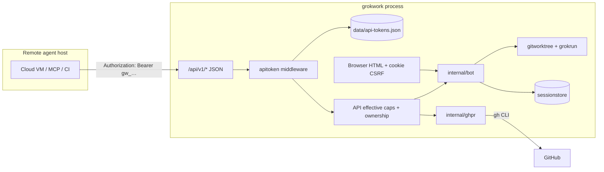
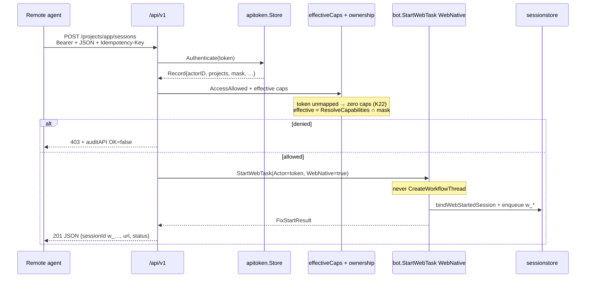

# Remote agent machine API (web surface for non-browser clients)

| Field | Value |
|-------|-------|
| **Status** | Draft (rev. 4 — post scrutinize) |
| **Author** | — |
| **Date** | 2026-08-12 |
| **Repo** | `github.com/acoshift/grokwork` |
| **Audience** | Senior engineers familiar with this codebase |
| **Related** | `AGENTS.md`, `TODO.md` (design principles), `docs/design-web-primary.md`, `docs/design-agent-sandbox.md`, `docs/design-agentic-team-runtime.md`, `docs/design-deploy-pipeline.md` (package-boundary style), `internal/web/auth.go`, `internal/bot/web_task_start.go`, `internal/identity`, `internal/sessionstore/ownership.go` |

---

## Overview

Remote coding agents (cloud VMs, CI runners, MCP hosts, another laptop) cannot use grokwork today: the web UI is form-encoded, cookie+CSRF gated, and returns HTML redirects; Discord requires a human mention. This design adds a **minimal machine-to-machine HTTP API** on the existing private web listener (`:8787`) so an external agent can create GitHub issues, start/continue/cancel sessions, and poll status — without becoming the host coding CLI.

Authentication is **first-class API tokens** (PATs): opaque bearer secrets, stored hashed, scoped to projects and a capability mask, mapped to a new actor namespace `token:<id>`. Tokens never impersonate humans. Handlers stay thin: they authenticate, **enforce effective caps and session ownership in the API layer**, then call existing `bot.*` / `ghpr.*` paths. API starts **must not** go through today’s Discord-preferring `StartWebTask` as-is — they pass `WebNative: true` so the unit is always `w_*` (K24). Unmapped `token:` actors get **zero** capabilities, never the human builder default (K22). The browser surface stays unchanged (dual surface). Default off; enable with an explicit config flag.

---

## Background & Motivation

### Current state

| Path | Entry | Auth | Response |
|------|--------|------|----------|
| Discord | `@Grok <task>` → `handleTask` | per-project membership | Discord stream |
| Web start | `POST /projects/{p}/start` → `postStart` → `bot.StartWebTask` | cookie session + CSRF + `requireFeature("startSessions")` + member | 302 to session page |
| Web issue | `POST /projects/{p}/issues/new` → `postIssueNew` → `ghpr.CreateIssueWith` | cookie + CSRF + githubWrites feature + per-project `GithubWrites` | 302 |
| Web continue | `POST /sessions/{id}/continue` → `bot.StartContinue` | project ACL only (soft-open for humans) | 302 |
| Web cancel | `POST /sessions/{id}/cancel` → `bot.CancelRun` | ownership / web admin | 302 |

There is **no** bearer/API-token path. When `webAuth.enabled` is false the UI is open LAN (legacy); write features still fail closed (`Feature*` false without auth — `internal/config/webauth.go` `featureFlag`). Neither mode offers a JSON contract a cloud agent can call.

### Pain points

1. A remote agent cannot open a grokwork session without a human browser or Discord account.
2. Stealing a browser cookie to "automate" the UI is operationally fragile and a security anti-pattern (CSRF, session TTL, HTML parsing).
3. Machine actions would be mis-attributed if forced through a human OAuth identity (spend, concurrency caps, ownership, audit).
4. Complementary to `docs/design-agent-sandbox.md`: that design confines *coding agent children on the host*; this design lets agents *outside* the host call *into* the control plane.

### What stays true

- One unit = one worktree = one branch = one agent session (`TODO.md` principle 1).
- Bot owns deterministic git/gh; judgment stays with the host coding CLI (or the remote agent's own judgment for *its* work). The remote agent **dispatches**; it does not replace `grokrun`.
- Human authority is explicit — tokens are a new actor class with fail-closed scopes, not silent admin.
- Never merge GitHub PRs from the bot.
- Local project paths must not leak into Discord; API JSON may include session URLs built from `webPublicBaseURL`.
- `config.json` secrets never appear in API responses or audit detail.

---

## Goals & Non-Goals

### Goals (v1)

1. Authenticate non-browser clients with revocable, project-scoped API tokens.
2. Map each token to a stable **machine actor id** that plugs into membership, capabilities, spend, concurrency caps, ownership, and audit.
3. JSON API for: whoami, list projects, create issue, start session, get session status, continue session, cancel run.
4. Thin handlers over existing bot/ghpr methods — no second start/issue implementation — **with API-layer authz** for mask and ownership (K3, K13).
5. Operator UX to mint/list/revoke tokens (web admin page when webAuth is on; bootstrap for open-LAN; shown once; stored hashed).
6. Explicit enable flag; default off; independent of browser auth being on.
7. Full audit of machine actions and denials (`detail.source=api`, `Event.Actor=token:…`).
8. API-started units are **web-native only** (`w_*`, no Discord thread) so a cloud agent does not post into a mapped channel.
9. Machine capability default is fail-closed: `token:` + no named template → **zero** flags (not builder).

### Non-goals (v1)

| Non-goal | Why |
|----------|-----|
| Public multi-tenant SaaS API | Product is private-network / Tailscale admin; no open signup |
| Full parity with every web form | Deploy, ship merge, config edit, case board, PR review rails — later if needed |
| Streaming run output over the API | Browser already has SSE (`/events`); v1 is poll-status only |
| Replacing Discord or the HTML UI | Dual surface; form POSTs stay |
| Remote agent *is* the host coding CLI | Remote agent dispatches work; `grokrun` still runs on the host |
| OAuth device flow / mTLS as the only auth | Optional later; PAT covers the user examples with less ops |
| Impersonating human actors | Machine identity first-class; avoids confused deputy and spend laundering |
| Thin official client library | curl/Python snippets in docs; library later |
| OpenAPI code generation | Hand-written `docs/api-v1.md` is enough for v1 |
| Attachments / image upload on API start | v1.1; text prompt only first |
| **API start targeting a secondary multi-repo checkout** | Start uses `ProjectPath(project)` primary checkout only; multi-repo `owner/repo` selection is **issues-only** in v1 |
| **API start opening a Discord thread** | `StartWebTask` today prefers Discord when the gateway is up (`canCreateDiscordThread`); API always sets `WebNative` (K24) |
| **Case intake via API** | Freeform start cannot open cases (`ensureCaseShell` is a separate funnel); cases stay Discord/web UI |
| **Project-wide session list / read-any-session** | Tokens only read/continue/cancel sessions they own (or co-own); no lateral observation of human cases |

---

## Proposed Design

### High-level architecture





### Deployment matrix

| `webAuth.enabled` | `api.enabled` | Browser writes (`Feature*`) | API writes (token) | Mint / list / revoke UI |
|-------------------|---------------|-----------------------------|--------------------|-------------------------|
| false | false | off (404) | off | n/a (API off) |
| false | true | **still off** | **on** (bearer required) | **refused** — use bootstrap (K14) |
| true | false | per feature flags | off | n/a (or page hidden) |
| true | true | per feature flags | on | admin + CSRF only |

**Invariant:** enabling the API never flips browser `Feature*` and never opens form POSTs. Open-LAN browser stays fail-closed for writes even when API is on.

---

### A. Authentication for non-browser clients

#### Choice: opaque API tokens (PATs)

| Option | Verdict | Notes |
|--------|---------|-------|
| **Opaque bearer PAT** | **Adopt** | Mint once, show once, store hash; revoke instantly; fits private admin surface |
| Signed JWT (self-issued) | Reject for v1 | Needs key rotation, clock skew, harder revoke without denylist (which becomes a store) |
| OAuth device flow | Reject for v1 | Still browser-oriented; adds OAuth app complexity for a private host |
| mTLS client certs | Reject for v1 | Excellent for fixed VMs; ops-heavy; can layer later as transport auth *in addition* to token |
| Steal browser cookie | Forbidden | CSRF, TTL, HTML; not an API |

#### Token format (wire)

```
gw_<publicId>_<secret>
```

- Prefix `gw_` for grep-ability and accidental-paste detection.
- `publicId`: 8–12 char `[a-z0-9]` lookup key (not secret).
- `secret`: ≥ 32 bytes from `crypto/rand`, base64url or hex (≥ 256 bits entropy).
- Wire example: `gw_k7m2p9qx_8f3a…` (full string is the bearer credential).

Lookup: parse publicId → load record → constant-time compare `SHA-256(full_token)` to stored hash (or `HMAC-SHA256(serverPepper, full_token)` if we add pepper later — PR7). Unknown publicId still runs a dummy compare (constant-time).

#### Storage

New system-of-record file (not `config.json`):

```
data/api-tokens.json
```

Persisted via `internal/atomicfile.Write` (same crash-safe pattern as sessions/identity). Reasons:

1. Tokens are secrets-adjacent metadata that rotate more often than project config.
2. `config.json` is already load-bearing for boot; bloating it with hashes is unnecessary.
3. Audit/admin can rewrite tokens without rewriting every project path.

Schema (conceptual):

```go
// internal/apitoken/store.go
package apitoken

type Record struct {
    ID         string    `json:"id"`           // publicId
    Label      string    `json:"label"`        // operator-facing, e.g. "cloud-agent-prod-vm"
    TokenHash  string    `json:"tokenHash"`    // hex SHA-256 of full wire token
    ActorID    string    `json:"actorId"`      // NormalizeActorID("token:"+id) — immutable after mint
    Projects   []string  `json:"projects"`     // allowlist; empty = none (fail-closed)
    Caps       CapsMask  `json:"capabilities"` // max flags this token may exercise
    CreatedAt  time.Time `json:"createdAt"`
    CreatedBy  string    `json:"createdBy"`    // admin actor who minted (or "bootstrap")
    ExpiresAt  time.Time `json:"expiresAt,omitzero"`
    LastUsedAt time.Time `json:"lastUsedAt,omitzero"`
    RevokedAt  time.Time `json:"revokedAt,omitzero"`
    // Idempotency keyed by client Idempotency-Key; pruned TTL-first then cap.
    Idempotency map[string]IdemRecord `json:"idempotency,omitempty"`
}

type IdemRecord struct {
    BodyHash  string    `json:"bodyHash"`  // SHA-256 of canonical request body
    Status    int       `json:"status"`    // HTTP status to replay
    Response  []byte    `json:"response"`  // exact JSON body bytes
    CreatedAt time.Time `json:"createdAt"`
}

type CapsMask struct {
    // Investigate is **not a v1 control**. Omitted from mint UI. If present in
    // stored JSON (hand-edited / forward-compat), Intersect ignores it for
    // gating: freeform start with mode=investigate|explain is allowed whenever
    // effective.StartSessions is true. Shell risk is team-template-only
    // (CanInvestigateShell), not a mask bit — see K20.
    Investigate   bool `json:"investigate,omitempty"` // reserved; unused for v1 gates
    StartSessions bool `json:"startSessions,omitempty"`
    GithubWrites  bool `json:"githubWrites,omitempty"`
    // Deliberately never mintable in v1 UI / mint API:
    // Merge, Approve, AdminProject, FileEscalation, SafeOps, DraftCustomerReply, RequestChange
}
```

File mode `0600`. Never log `TokenHash` inputs or wire tokens.

**Auth path must not write** on every request: `LastUsedAt` updates are best-effort and **throttled** (at most once per minute per token), under the store lock, after a successful auth. Idempotency writes happen only on creating POSTs, not on GET/whoami.

#### Mapping to actor id

```
token:<publicId>
```

- New known kind in `internal/config/actor.go`: `ActorKindToken = "token"`.
- **Mint path always sets**  
  `ActorID = config.NormalizeActorID("token:" + publicId)`  
  and **never** re-derives actor id from the display label. Only this normalized string is stored, stamped on sessions, and used in `CanControl` comparisons.
- `sessionstore.Entry.CanControl` / `IsOwner` use **raw string equality** (`ownership.go`), not `config.SameActor`. Therefore kind registration (case-fold on normalize) is load-bearing: `Token:x` vs `token:x` would fail cancel if mint skipped normalize.
- Canonical-at-mint / `identity` linking does **not** apply: tokens are not OAuth logins.
- **`identity.Link` / `sanitize` must refuse** `ActorKindToken` (and keep refusing inventing token aliases) as either alias or canonical — a hand-edited `identity-links.json` must not bind a token to a human account. `RewriteActorID` is never pointed at tokens by mint UI.
- Display name for `bot.Actor`: token `Label` (e.g. `cloud-agent-prod-vm`), never the secret.

This plugs into:

| Concern | Behavior |
|---------|----------|
| Project membership | Operator adds `token:<id>` to a team `members` list (preferred) or `allowedUserIds`. **Access ≠ capabilities** for tokens (K22) |
| Capabilities | `ResolveCapabilities` for an **unmapped** `token:` actor is **zero**, never builder. Then `effective := Intersect(that, token.Caps)` at the API layer (K3, K22) |
| Ownership | Session owner becomes the exact `ActorID` string; API continue/cancel/GET require `ent.CanControl(actorID)` (K13) |
| Concurrency caps | `maxConcurrentRunsUser` keys on actor id → per-token |
| Spend | History turns stamp token actor → `/spend` attributes machine spend separately |
| Audit | `Event.Actor = token:<id>` via `auditAPI` only — never cookie `auditAction` |

#### Interaction with `webAuth.enabled` (K4 locked)

| Mode | Browser UI | API |
|------|------------|-----|
| Auth off (open LAN) | No cookie; **write features stay off** | When `api.enabled`, **bearer required**; writes allowed per token authz only |
| Auth on | Cookie + CSRF + `Feature*` | Bearer only; **no CSRF**; cookie sessions **ignored** on `/api/v1` |

Rules (locked — not an open question):

1. `api.enabled` defaults **false**. No routes registered (or all 404) until on.
2. When `api.enabled` is true, every `/api/v1/*` route except `GET /health` requires a valid non-revoked non-expired token.
3. `api.enabled` does **not** require `webAuth.enabled`.
4. **When the caller authenticated via API token, `api.enabled` is the sole deployment-level write gate** for start / continue / cancel / create-issue. Handlers use a single helper `apiWritesEnabled()` (= `cfg.APIEnabled()`) and **must not** call `FeatureStartSessions()` / `FeatureGitHubWrites()` for token routes.
5. **Never** flip browser `Feature*` when enabling API. Pin with tests: `webAuth` off + `api` on → API start succeeds (authz permitting); browser `POST /projects/…/start` still 404 from `requireFeature`.

#### Minting, rotation, revocation (K14)

| Action | Who | How |
|--------|-----|-----|
| Mint / list / revoke (UI) | Requires **`WebAuthEnabled() && WebRoleAdmin`** + CSRF | `POST/GET /config/api-tokens` |
| Mint when auth off | **Refused** (403/404 clear error: enable webAuth to mint, or use bootstrap) | Never open-LAN mint |
| Bootstrap (open-LAN) | Operator | One-shot: env `GROK_WORK_API_BOOTSTRAP_TOKEN` (full wire token) **or** documented offline hash recipe / future `grokwork` subcommand — see below |
| Rotate | web admin | mint new + revoke old |

**Bootstrap procedure (open-LAN + API):**

1. Generate wire token offline: `publicId` + secret; compute `SHA-256(full_token)` hex.
2. Either:
   - **Env bootstrap (preferred for first token):** on process start, if `GROK_WORK_API_BOOTSTRAP_TOKEN` is set **and no record with that `publicId` exists in the store at all** (including **revoked** and expired rows), insert a record with `CreatedBy=bootstrap`, projects/caps from companion env vars *or* a single ultra-narrow default (projects from `GROK_WORK_API_BOOTSTRAP_PROJECTS`, caps **startSessions-only**). Store is keyed uniquely by `publicId` — never two rows for one id.
   - **Hand-written `data/api-tokens.json`:** document exact JSON shape + hash recipe in `docs/api-v1.md` so operators can mint without UI.
3. Add `token:<id>` to project team; set `api.enabled=true`; restart if needed.

**Bootstrap must not resurrect revoked secrets (K14 / K21):**

| Situation after revoke of bootstrap publicId `k7…` | Env still set? | On restart |
|----------------------------------------------------|----------------|------------|
| Row exists with `RevokedAt` set | yes | **No insert, no un-revoke** — auth for that wire token stays 401 |
| Row deleted by hand (not the revoke path) | yes | Would re-insert — operators must not delete revoked rows if env remains; revoke keeps the tombstone |
| Need a new automation secret | — | Mint a **new** publicId (UI or new bootstrap token string), never reuse the revoked wire secret via env |

Optional belt (not required for correctness of the absent-publicId rule): after first successful bootstrap insert, write `data/api-tokens.bootstrap-done` or log once; process still cannot unset env. Runbooks still say clear the env after first boot.

**PR2 unit test (required):** bootstrap insert → authenticate OK → revoke → re-run bootstrap load path with same env → **no** active record / auth still **401** for that wire token; store still has exactly one row (revoked).

**PR3 tests:** `webAuth` off → mint POST 403/404; never 200 with a secret.

Optional: max token lifetime default 90 days; warn if no expiry at mint. Expired tokens → 401.

---

### B. Authorization model for machine actors

#### Not a separate "robot web role"

Web roles (`viewer` / `member` / `admin`) are **browser** RBAC over the whole host UI. Machine tokens do not get a web role. They:

1. Authenticate as `token:<id>` (normalized).
2. Must pass `config.AccessAllowed(project, actorID)` (fail-closed when project has neither allowlist nor team members — unchanged).
3. Get `caps := cfg.ResolveCapabilities(project, actorID)` — **for `ActorKindToken`, the unmapped default is zero, not builder** (K22).
4. Apply `effective := Intersect(caps, token.CapsMask)`.
5. Endpoint checks the relevant **effective** flag **in the API layer before any bot/ghpr call**.

**K22 — `ResolveCapabilities` change** (`internal/config/capabilities.go`, unmapped block after the named/broken-mapping returns):

```go
// Unmapped
if config.ActorKind(uid) == ActorKindToken {
    return Capabilities{} // never builder / safeTeam default
}
if safe {
    // existing investigator-default path for humans
}
return BuiltinCapabilityTemplates["builder"]
```

`executeTask` / `resolveRunPolicy` already feed `ResolveCapabilities(project, item.actor.ID)` into `BuildRunPolicy` (`internal/bot/bot.go`). With K22, an allowlisted-only token cannot ship or get `CanInvestigateShell` even if the API mask check is forgotten. A token on an explicit `builder` team still can — that is an operator choice.

Pin: `ResolveCapabilities(project, "token:abc")` with the id only on `allowedUserIds` and `safeTeamMode` off → all flags false. Same id on team `automation` → `automation-runner` template.

```go
// internal/apitoken or internal/web — pure, unit-tested
func Intersect(c config.Capabilities, m CapsMask) config.Capabilities {
    return config.Capabilities{
        // Investigate mask bit is ignored for v1 gating (K20). Pass through
        // team Investigate for whoami honesty about shell-adjacent templates,
        // but start mode=investigate only requires effective.StartSessions.
        Investigate:   c.Investigate,
        StartSessions: c.StartSessions && m.StartSessions,
        GithubWrites:  c.GithubWrites && m.GithubWrites,
        // Merge / Approve / AdminProject / FileEscalation / SafeOps always false
        // for API token effective caps in v1 regardless of team template.
    }
}

func (c CapsMask) CanShip() bool {
    return c.StartSessions && c.GithubWrites // same composition as config.Capabilities.CanShip
}
// effective.CanShip() uses the Intersect result's CanShip().
```

#### Why API-layer enforcement is mandatory (not bot-internal)

Verified against `internal/bot/web_task_start.go` and agent gates:

| Check | What bot does today | Gap for tokens |
|-------|---------------------|----------------|
| StartSessions | **Not checked** inside `StartWebTask` (browser uses `requireFeature` + member) | Without API pre-check, any token that passes membership could start |
| Fix mode | `requireCanStartFix` → `ResolveCapabilities(…).CanShip()` only | **Ignores CapsMask** — builder team + mask without `githubWrites` still ships |
| Model select | `requireCanSelectModel` → same CanShip on ResolveCapabilities only | Same hole |
| Issue create | web checks `ResolveCapabilities.GithubWrites` | Must use **effective** GithubWrites |

**Pre-call rules (PR5 write tests / PR4 read tests must pin):**

1. Compute `effective := Intersect(ResolveCapabilities(project, actorID), rec.Caps)`.
2. Refuse start unless `effective.StartSessions` — covers freeform, investigate, explain, and empty mode (whatever default resolves to still needs StartSessions first).
3. Refuse `mode=fix` (or empty mode that resolves to fix via `ProjectDefaultMode` / `wantsFixStartMode`) unless `effective.CanShip()`.
4. Refuse non-empty `model` unless `effective.CanShip()` (mirror `requireCanSelectModel`).
5. Refuse issue create unless `effective.GithubWrites`.
6. **Do not** gate `mode=investigate` / `mode=explain` on a mask Investigate bit (K20) — StartSessions is sufficient; shell/tool policy remains team template + bot RunPolicy.
7. Continue: `effective.StartSessions` **and** `ent.CanControl(actorID)` (K13).
8. Cancel: `ent.CanControl(actorID)` (no StartSessions required — runaway stop).
9. Session GET: project access **and** `ent.CanControl(actorID)` (K15) → else 404.

Do **not** thread the mask into bot for v1; keep handlers thin and gates local + tested. K22 is the bot-side floor so a missed API check cannot promote an unmapped token to builder.

Test matrix (team=`automation-runner` = `startSessions` only, mask=`startSessions` only):

| Call | Expected |
|------|----------|
| start `mode=investigate` | 201 |
| start `mode=fix` | 403 (no CanShip on template or mask) |
| start with `model` set | 403 |

Test matrix (team=builder, mask=`startSessions` only, no `githubWrites`):

| Call | Expected |
|------|----------|
| start `mode=investigate` | 201 (StartSessions only; Investigate mask N/A) |
| start `mode=explain` | 201 (same) |
| start `mode=fix` | 403 |
| start with `model` set | 403 |
| create issue | 403 |
| continue own session | 200/201 |
| continue other owner's session | 404 |
| GET other owner's session | 404 |

Test matrix (token **only** on `allowedUserIds`, no team template, `safeTeamMode` off):

| Call | Expected |
|------|----------|
| `ResolveCapabilities` | zero (K22) — not builder |
| start any mode | 403 (`effective.StartSessions` false) |
| create issue | 403 |

#### Scoping defaults (fail-closed)

| Dimension | Default at mint | Hard rules |
|-----------|-----------------|------------|
| Projects | empty list | Empty → no project access; must name ≥1 project |
| Caps mask | **startSessions only** (githubWrites **unchecked**; **no investigate checkbox** in v1) | v1 mint UI **never** offers Merge, AdminProject, Approve, or Investigate |
| Host-wide | none | No "all projects" wildcard in v1 |
| Impersonation | none | No `actAs` / `onBehalfOf` field |

#### Can a token impersonate a human?

**No.** Rationale:

- Spend, concurrency, ownership, and audit would all launder under the human's id.
- A compromised cloud VM would inherit a person's team memberships permanently until someone noticed.
- `identity` linking is human-login shaped; folding tokens into it confuses "who signed in" with "which automation key".

#### Membership still required

Minting a token does **not** auto-add it to any project. The admin must place `token:<id>` on a team (or `allowedUserIds`).

**`allowedUserIds` alone is not enough to start work.** That path is unmapped. Humans get the builder default when `safeTeamMode` is off; **tokens get zero** (K22). Paste the actor onto a team that names a template.

**Operator recipe (least privilege):**

1. Create a **custom** capability template on the project, e.g. `automation-runner` with **only** `startSessions: true` (add `investigate: true` only if bot policy should treat the actor as investigator-class for shell — that is **team**, not token mask). **Do not** use builtin `builder` — that grants `GithubWrites` and `CanInvestigateShell`.
2. Create team `automation` with `capabilities: "automation-runner"`.
3. Mint token with projects=`[app]` (**exact config project name**, case-sensitive), mask defaults (**startSessions** only; githubWrites off unless issues required). No investigate checkbox.
4. Add the **exact** `token:<publicId>` string (from mint UI) to that team — not only `allowedUserIds`.
5. Effective start/issue/ship gates = template ∩ mask. Mask ∩ builder still yields `CanShip` if the operator later checks both mask flags **and** leaves the actor on a builder team — the mask is a ceiling, not a substitute for a tight template.

#### Session ownership model for machines (K13, K15)

Browser continue is project-ACL soft-open (any member may enqueue on any thread). **Machine tokens are a different trust class** (cloud VM / CI secret). Therefore:

| Action | Human web | API token (v1) |
|--------|-----------|----------------|
| Start | member + feature | effective.StartSessions (+ CanShip for fix/model) |
| Continue | any project member | **`CanControl` only** (owner/co-owner) |
| Cancel | owner/co/web-admin | **`CanControl` only** (no web-admin bypass for tokens) |
| GET status | project member (today) | **`CanControl` only** |

v1 machine agents only drive sessions **they started** (owner stamp from `bindWebStartedSession`). A future explicit cap like `projectAutomationContinue` could reopen soft-open; it is not the default.

Unowned sessions: `CanControl` returns false (`ownership.go`). API does not soft-open unowned units for tokens — 404.

**K23 — token collaborators survive `/claim`:** `ClaimThread` (`internal/bot/web_control.go`) wipes `CoOwnerIDs` and keeps only the previous primary. One claim leaves the token as co-owner; a **second** claim drops it, after which API GET/continue/cancel 404. After the wipe, **re-add every `token:` id that was owner, co-owner, or `CreatedBy`**. Humans may still claim the unit and work it in the UI; they cannot evict the machine. Same rule on any other full-takeover path. `HandOff` already keeps other co-owners — no change there.

Pin: start as `token:abc` → human A claims → human B claims → `CanControl("token:abc")` still true.

---

### C. HTTP API surface (v1)

#### Path prefix

```
/api/v1/...
```

- Clear versioning; no collision with project routes (`/projects/...`) or auth (`/auth/...`).
- Avoid `/agent/...` (ambiguous with coding agent / sandbox).
- Dedicated routes only — **no** content negotiation on HTML paths.

#### Common conventions

| Item | Spec |
|------|------|
| Content-Type | `application/json; charset=utf-8` request and response |
| Auth | `Authorization: Bearer <token>` (only); cookies ignored |
| Body limit | 1 MiB for JSON |
| Timeouts | Start is enqueue-fast, not run-to-completion |
| Idempotency | `Idempotency-Key` on creating POSTs (start, continue, issue create); see §I |
| Rate limit | Sliding window keyed by **token actor id** via new `checkStartRateActor(actorID)` — **never** `checkStartRate(ctx)` (that uses cookie `auditActor` and would lump every token into `anonymous` or the browser user) |
| Errors | See below |
| Audit | `auditAPI` only — never `auditAction` |

#### Error shape

```json
{
  "error": {
    "code": "forbidden",
    "message": "not allowed to create GitHub issues for this project"
  }
}
```

| HTTP | code (examples) |
|------|-----------------|
| 400 | `invalid_request`, `validation` |
| 401 | `unauthorized` (missing/bad/expired/revoked token) |
| 403 | `forbidden` (capability mask / effective caps) |
| 404 | `not_found` (unknown session, cross-project, **or not owner** — same body; no probe) |
| 409 | `conflict` (queue full, idempotency replay with different body hash) |
| 429 | `rate_limited` |
| 500 | `internal` (no path, no config secret, no stack) |
| 503 | `disabled` when `api.enabled` false (if routes exist) |

#### Endpoints

##### 1. Health (unauthenticated)

```
GET /api/v1/health
```

Response `200`: `{ "ok": true, "api": true }` — no project data, no auth confirmation.

##### 2. Whoami

```
GET /api/v1/whoami
```

```json
{
  "actorId": "token:k7m2p9qx",
  "label": "cloud-agent-prod-vm",
  "projects": ["app", "api"],
  "capabilities": {
    "app": { "investigate": true, "startSessions": true, "githubWrites": false }
  },
  "expiresAt": "2026-11-01T00:00:00Z"
}
```

Per-project map is **effective** start/ship/write gates (ACL ∩ template ∩ mask on StartSessions/GithubWrites). The `investigate` field in whoami is **team-template informational** only (K20 — not a token-mask gate). Projects listed only if in token list **and** `AccessAllowed`.

##### 3. List projects

```
GET /api/v1/projects
```

Same visibility as whoami project list. No local paths.

##### 4. Create GitHub issue

```
POST /api/v1/projects/{project}/issues
Idempotency-Key: …
```

Request:

```json
{
  "owner": "acme",
  "repo": "app",
  "title": "Flaky checkout on mobile",
  "body": "Repro steps…",
  "kind": "bug"
}
```

**Gates (order):** `apiWritesEnabled` → authenticate → project in token list (**exact config name**) → `AccessAllowed` → `effective.GithubWrites` → **`kind` is `feature` or `bug` (required, same as `postIssueNew`)** → resolve repo → `ghpr.CreateIssueWith` with `Labels: []string{kind}`.

Empty / unknown `kind` → **400** `validation`. Do not default; do not call `gh` without a label.

**Repo resolution (pure helper — K16):**

Extract from session-bound `resolveCatalogRepoAccess` a pure function usable by both web and API:

```go
// internal/web or internal/config — no *hime.Context, no cookie identity
func ResolveProjectRepo(ctx context.Context, cfg *config.Config, project, owner, repo, actorID string) (
    ref config.GitHubRepoRef, cwd string, err error,
) {
    // 1. AccessAllowed(project, actorID) — fail closed
    // 2. ProjectRepoCatalogWith(ctx, project, nil)
    // 3. ResolveRepoPicker(catalog, owner, repo)
    //    - multi-repo: owner+repo required (empty → 400 validation)
    //    - single-repo: may default when catalog has exactly one entry
    // 4. Map ref to local cwd (same path rules as resolveCatalogRepo)
}
```

Error mapping:

| Condition | HTTP |
|-----------|------|
| Not AccessAllowed / project not on token | 404 (or 403 if project name must not leak — prefer **404** for unknown project names not on token list; **403** only when project is on token list but membership failed — rare if ops keep them in sync) |
| `kind` missing or not `feature`/`bug` | 400 |
| Missing owner/repo when multi-repo | 400 |
| Not in catalog | 400 |
| gh failure | 502/500 with short message |

Body attribution: prefix with machine label (`On behalf of automation "cloud-agent-prod-vm"`). Tokens do **not** use `identity.GitHubFor`.

Response `201`: `{ "number", "url", "owner", "repo" }`.

##### 5. Start task / session

```
POST /api/v1/projects/{project}/sessions
Idempotency-Key: …
```

```json
{
  "prompt": "Add retry with backoff to the checkout client",
  "title": "Checkout retry",
  "mode": "fix",
  "model": ""
}
```

| Field | Notes |
|-------|--------|
| `prompt` | required |
| `title` | optional sticky goal |
| `mode` | `""` \| `fix` \| `investigate` \| `explain` — empty follows project default via same `wantsFixStartMode` logic as web; API must re-evaluate effective CanShip for that resolution |
| `model` | optional; curated via `RequestedAgentCLI`; requires `effective.CanShip()` **in API layer** |

**Limitation:** uses project **primary** checkout only (`cfg.ProjectPath`). No secondary multi-repo worktree selection in v1.

**K24 — always web-native.** `StartWebTask` today opens a Discord thread when `canCreateDiscordThread()` is true (`DiscordReady() || threadAPI != nil`) and a channel is mapped (`internal/bot/web_task_start.go`, `fix_start.go`). That is the production bot. The `w_*` + empty `discordUrl` sample is the *fallback*, not the default. API starts must pass a new flag:

```go
// internal/bot/web_task_start.go
type StartWebTaskOpts struct {
    // …
    // WebNative forces a w_* unit on grok/web/. When true, skip
    // canCreateDiscordThread / CreateWorkflowThread entirely —
    // even if the gateway is up and a channel is mapped.
    WebNative bool
}
```

```go
res, err := s.bot.StartWebTask(bot.StartWebTaskOpts{
    Project:   project,
    Prompt:    body.Prompt,
    Title:     body.Title,
    Mode:      body.Mode,
    Model:     body.Model,
    Actor:     bot.Actor{ID: rec.ActorID, DisplayName: rec.Label},
    WebNative: true, // required for every API start
})
```

Browser `postStart` leaves `WebNative` false (unchanged Discord-prefer). Pin: Discord ready + mapped channel + `WebNative: true` → `gitworktree.IsWebUnitID(res.ThreadID)` and `res.DiscordURL == ""`. Tests that inject `threadAPI` must still honor the flag (otherwise they mint snowflake ids with the gateway down).

Rate limit: `checkStartRateActor(rec.ActorID)` only (K25).  
Concurrency: existing caps inside claim path (`runActorID` = token actor).

Response `201` — `sessionId` is always `w_<32hex>` for API starts:

```json
{
  "sessionId": "w_a1b2c3…",
  "status": "started",
  "queuePos": 0,
  "created": true,
  "url": "https://grokwork.tailnet/sessions/w_a1b2c3…",
  "discordUrl": ""
}
```

No worktree path, no main checkout path. `url` is `webPublicBaseURL` + `/sessions/` + id — the cloud VM must already be able to reach `httpListen` (typically Tailscale / private bind). Enabling `api.enabled` does not punch a hole through the firewall.

##### 6. Get session status

```
GET /api/v1/sessions/{sessionId}
```

**Authorization (K15):** load entry; if missing → 404. If project not on token / not `AccessAllowed` → 404. If `!ent.CanControl(tokenActorID)` → **404** (same shape; no probe). Tokens cannot observe human/case sessions they do not own.

**Data sources:**

| Field | Source |
|-------|--------|
| sessionId, project, goal, mode, label, ownerId, prs, url | `sessionstore.Entry` (NormalizePRs) |
| running, queueLen, activity | **`bot.SessionRuntime(threadID)`** (new helper) — **not** full `StatusSnapshot` |

```go
// internal/bot — Load only (never LoadOrStore); single threadState
type SessionRuntimeInfo struct {
    Running  bool
    QueueLen int
    Activity string // job activity chip; empty if idle
}

func (b *Bot) SessionRuntime(threadID string) SessionRuntimeInfo {
    // mirror queueLen / getJob Load-only patterns; do not scan all runs
}
```

Do **not** return `Prompt` / `LiveText` in v1 (no `?include=live`).

**Idle detection for pollers:** terminal idle for "run finished" is `running == false && queueLen == 0` (equivalent spirit to `!IsThreadBusy`). **Do not** wait for label `done` — labels often stay `in_progress` until a human marks done. PR state is orthogonal.

Response `200` (illustrative):

```json
{
  "sessionId": "w_a1b2c3…",
  "project": "app",
  "goal": "Checkout retry",
  "mode": "fix",
  "label": "in_progress",
  "ownerId": "token:k7m2p9qx",
  "running": true,
  "queueLen": 0,
  "activity": "editing internal/checkout/client.go",
  "prs": [{ "number": 99, "url": "https://github.com/acme/app/pull/99", "state": "OPEN" }],
  "url": "https://grokwork.tailnet/sessions/w_a1b2c3…"
}
```

##### 7. Continue session

```
POST /api/v1/sessions/{sessionId}/continue
Idempotency-Key: …
```

```json
{ "prompt": "Also add unit tests for the backoff helper" }
```

**Gates:** session exists → project ACL/token list → **`ent.CanControl(actorID)`** → `effective.StartSessions` → rate limit → `bot.StartContinue`. Closed case refusal mirrors web. Not owner → **404**.

##### 8. Cancel run

```
POST /api/v1/sessions/{sessionId}/cancel
```

**Gates:** session exists → project access → **`ent.CanControl(actorID)`** → `bot.CancelRun`. Not rate-limited. Not owner → 404. No web-admin bypass for tokens (tokens have no web role).

Response `200`: `{ "ok": true, "message": "…" }`.

##### Out of scope for v1 endpoints

Reset/abandon, claim/hand-off, deploy, merge, config mutation, case intake, PR review, file storage, bulk fix, list-all-sessions, attachments.

#### Dual surface

Browser form POSTs and HTML redirects stay. API is additive. Shared business logic remains in `bot` / `ghpr`; web and API are two adapters. **Authz policy may differ** (ownership on continue) — that is intentional for machine trust class, not a bug.

---

### D. Implementation architecture

#### Packages

| Package | Responsibility |
|---------|----------------|
| `internal/apitoken` | Store, hash, authenticate, mint/revoke, idempotency records, CapsMask, Intersect |
| `internal/config` | `ActorKindToken`, `api.enabled`, `APIEnabled()`; **K22** unmapped-token zero caps |
| `internal/bot` | `SessionRuntime(threadID)`; `StartWebTaskOpts.WebNative`; `ClaimThread` keeps `token:` collaborators |
| `internal/identity` | Refuse `token:` in Link/sanitize |
| `internal/web` | Routes, pure repo resolve, thin JSON handlers, `auditAPI`, admin mint UI (auth-on only), bootstrap load |
| `internal/audit` | Reuse existing action constants; Actor set by `auditAPI` |

#### Middleware placement

```go
if cfg.APIEnabled() {
    api := http.NewServeMux()
    api.Handle("GET /health", http.HandlerFunc(s.apiHealth))
    api.Handle("GET /whoami", s.requireAPIToken(http.HandlerFunc(s.apiWhoami)))
    // …
    mux.Handle("/api/v1/", http.StripPrefix("/api/v1", api))
}
```

`requireAPIToken`:

1. Parse `Authorization: Bearer` (reject other schemes).
2. Authenticate via `apitoken.Store` (no write on hot path except throttled LastUsedAt).
3. Put `APIPrincipal` on context (record copy **without** hash).
4. **Skip** `requireAuth`, `checkCSRF`, cookie session entirely; ignore session cookie if present.
5. Body `MaxBytesReader` 1 MiB before JSON decode on mutating methods.
6. On failure: 401 + `auditAPI(nil, ActionAccessDeny, err, detail)` with sentinel actor e.g. `api:anonymous` or `audit.ActorAnonymous` and `detail.reason=bad_token` (never the presented secret).

Do **not** wrap API routes in `requireMember`.

#### Effective-cap helper (single place)

```go
func (s *Server) apiEffective(rec *apitoken.Record, project string) (config.Capabilities, error) {
    // Exact config project name (case-sensitive), same as Projects map keys.
    if !slices.Contains(rec.Projects, project) { /* not in token scope */ }
    if !s.cfg.AccessAllowed(project, rec.ActorID) { … }
    return apitoken.Intersect(s.cfg.ResolveCapabilities(project, rec.ActorID), rec.Caps), nil
}

// internal/web — do not call checkStartRate from /api/v1
func (s *Server) checkStartRateActor(actorID string) error {
    if !s.startLimiter().AllowN(actorID, 1) {
        return errRateLimit
    }
    return nil
}
```

#### auditAPI (never auditAction)

```go
// API routes must not call auditAction — that uses cookie auditActor.
func (s *Server) auditAPI(principal *APIPrincipal, action string, err error, detail map[string]any) {
    if detail == nil {
        detail = map[string]any{}
    }
    detail["source"] = "api"
    actor := audit.ActorAnonymous
    if principal != nil {
        actor = principal.ActorID
        detail["tokenId"] = principal.ID
        detail["tokenLabel"] = principal.Label
    }
    ev := audit.Event{
        Action: action,
        Actor:  actor,
        Role:   "api", // not a WebRole; marks surface
        Detail: detail,
        OK:     err == nil,
    }
    if err != nil {
        ev.Error = err.Error()
    }
    _ = s.audit.Append(ev)
}
```

Tests: request with **both** a valid browser session cookie and a bearer token attributes audit Actor to `token:…`, not the cookie user.

#### Handler sketch (start)

```go
func (s *Server) apiStartSession(w http.ResponseWriter, r *http.Request) {
    rec := apiPrincipal(r.Context())
    project := r.PathValue("project")
    if !s.apiWritesEnabled() {
        writeAPIError(w, errAPIDisabled)
        return
    }
    effective, err := s.apiEffective(rec, project)
    if err != nil {
        s.auditAPI(rec, audit.ActionSessionStart, err, map[string]any{"project": project})
        writeAPIError(w, err) // 404/403
        return
    }
    var body startBody
    if err := decodeAPIJSON(r, &body); err != nil { … }

    if !effective.StartSessions {
        err := errForbidden("startSessions")
        s.auditAPI(rec, audit.ActionSessionStart, err, map[string]any{"project": project})
        writeAPIError(w, err)
        return
    }
    if wantsFix(body.Mode, s.cfg.ProjectDefaultMode(project)) && !effective.CanShip() {
        err := errForbidden("fix requires ship-class effective caps")
        s.auditAPI(rec, audit.ActionSessionStart, err, map[string]any{"project": project, "mode": body.Mode})
        writeAPIError(w, err)
        return
    }
    if strings.TrimSpace(body.Model) != "" && !effective.CanShip() {
        err := errForbidden("model selection requires ship-class effective caps")
        s.auditAPI(rec, audit.ActionSessionStart, err, map[string]any{"project": project, "model": body.Model})
        writeAPIError(w, err)
        return
    }

    if key := r.Header.Get("Idempotency-Key"); key != "" {
        if cached, ok := s.apiTokens.IdempotencyGet(rec.ID, key, hashBody(body)); ok {
            writeAPIJSON(w, cached.Status, cached.Response)
            return
        }
        // different body hash → 409 handled inside Get
    }

    if err := s.checkStartRateActor(rec.ActorID); err != nil {
        writeAPIError(w, errRateLimit)
        return
    }

    res, startErr := s.bot.StartWebTask(bot.StartWebTaskOpts{
        Project: project, Prompt: body.Prompt, Title: body.Title,
        Mode: body.Mode, Model: body.Model,
        Actor:     bot.Actor{ID: rec.ActorID, DisplayName: rec.Label},
        WebNative: true,
    })
    detail := map[string]any{"project": project, "mode": body.Mode, "model": body.Model}
    if startErr == nil {
        detail["threadId"] = res.ThreadID
        detail["status"] = string(res.Status)
        detail["created"] = res.Created
    }
    s.auditAPI(rec, audit.ActionSessionStart, startErr, detail)
    if startErr != nil {
        writeAPIError(w, mapBotErr(startErr))
        return
    }
    out := sessionCreatedJSON(res)
    // store idempotency with body hash + status 201 + out bytes
    writeAPIJSON(w, http.StatusCreated, out)
}
```

#### Docs

Hand-written `docs/api-v1.md` with curl examples, bootstrap recipe, deployment matrix. OpenAPI optional later.

---

### E. Operator UX

#### Admin page: `/config/api-tokens`

- Global config hub; **only when `WebAuthEnabled()`**.
- Requires `WebRoleAdmin` + CSRF.
- If webAuth off: page 404 or redirects with flash "enable web auth to manage API tokens"; mint POST hard-refuses (K14).
- Table: label, id, actor id, projects, caps, expires, last used, revoke.
- Mint form: label, multi-select projects, checkboxes (**defaults: startSessions on; githubWrites off**; **no Investigate checkbox** — K20), optional expiry.
- After mint: **show secret once**; cannot retrieve again.
- Never display `tokenHash`.

#### config.json surface

```json
{
  "api": {
    "enabled": false
  }
}
```

Token records stay in `data/api-tokens.json`.

#### Bootstrap (open-LAN)

Documented in `docs/api-v1.md`: env `GROK_WORK_API_BOOTSTRAP_TOKEN` (+ projects env) and/or hand-hash JSON recipe. No open-LAN mint UI.

---

### F. Client ergonomics

#### curl — start a session

```bash
export GROKWORK_URL="https://grokwork.tailnet.ts.net"
export GROKWORK_TOKEN="gw_k7m2p9qx_…"

curl -sS -X POST "$GROKWORK_URL/api/v1/projects/app/sessions" \
  -H "Authorization: Bearer $GROKWORK_TOKEN" \
  -H "Content-Type: application/json" \
  -H "Idempotency-Key: $(uuidgen)" \
  -d '{
    "prompt": "Fix the nil panic in checkout when cart is empty",
    "title": "Checkout nil panic",
    "mode": "investigate"
  }'
```

#### curl — create issue

```bash
curl -sS -X POST "$GROKWORK_URL/api/v1/projects/app/issues" \
  -H "Authorization: Bearer $GROKWORK_TOKEN" \
  -H "Content-Type: application/json" \
  -H "Idempotency-Key: $(uuidgen)" \
  -d '{
    "title": "Mobile checkout flaky",
    "body": "Seen in prod logs …",
    "kind": "bug",
    "owner": "acme",
    "repo": "app"
  }'
```

#### Python sketch (agent loop)

```python
import os, uuid, time, requests

BASE = os.environ["GROKWORK_URL"].rstrip("/")
H = {
    "Authorization": f"Bearer {os.environ['GROKWORK_TOKEN']}",
    "Content-Type": "application/json",
}

def start(project, prompt, mode="investigate"):
    r = requests.post(
        f"{BASE}/api/v1/projects/{project}/sessions",
        headers={**H, "Idempotency-Key": str(uuid.uuid4())},
        json={"prompt": prompt, "mode": mode},
        timeout=60,
    )
    r.raise_for_status()
    return r.json()

def wait(session_id, timeout=3600):
    """Idle = not running and empty queue. Label may still be in_progress."""
    deadline = time.time() + timeout
    while time.time() < deadline:
        s = requests.get(f"{BASE}/api/v1/sessions/{session_id}", headers=H, timeout=30)
        s.raise_for_status()
        body = s.json()
        if not body.get("running") and body.get("queueLen", 0) == 0:
            return body
        time.sleep(5)
    raise TimeoutError(session_id)
```

#### MCP / cloud agent wiring

- Token in secret manager, not in prompts or repos.
- Tools: start / status / cancel / create_issue.
- Prefer **investigate** + startSessions-only mask for untrusted VMs; ship-capable tokens only on trusted builders.
- Note: investigate mode with a builder/investigator **team** template can still get shell via `CanInvestigateShell`. The token mask does **not** gate investigate mode or shell in v1 (K20). Operators who need no-shell should use a team template that is startSessions-only without FileEscalation/SafeOps/CanShip.

---

### G. Security & Privacy Considerations

#### Threat model

| ID | Threat | Severity | Mitigation |
|----|--------|----------|------------|
| T1 | Stolen token → start ship tasks (RCE-equivalent) | **Critical** | Project scope; **API-enforced** cap mask; no Merge/AdminProject; short expiry; rate limits; revoke; audit; investigate-only defaults |
| T2 | Token exfil from cloud VM | **High** | Secret manager; never log Authorization; rotate; least privilege |
| T3 | Host coding agent SSRFs into `:8787` API | **High** | Sandbox net-enforce; do not put API tokens in child-readable env; separate tokens for host vs cloud |
| T4 | Replay of successful POST | **Medium** | TLS; Idempotency-Key + body hash |
| T5 | CSRF | **N/A** | Bearer not cookie; cookies ignored on `/api/v1` |
| T6 | Confused deputy / human impersonation | **High if allowed** | No impersonation; machine actor only; no identity link for tokens |
| T7 | Over-privileged tokens | **High** | Fail-closed empty projects; mint defaults; hard ban AdminProject/Merge; custom team template recipe |
| T8 | Session id enumeration / lateral read | **Medium** | Cross-project and **non-owner** → 404; no list-all-sessions |
| T8b | Lateral **continue** into human sessions | **High** | **CanControl required** on continue (K13) |
| T9 | Timing attack on token verify | **Low** | Constant-time hash compare; dummy work on unknown id |
| T10 | Audit blind spot / wrong actor | **Medium** | `auditAPI` with token Actor; denials audited; cookie never attributes API |
| T11 | Token in browser XSS | **Low** | Server-side agents only |
| T12 | Open LAN + api.enabled | **High** | Default off; always require token; **mint not open on LAN** (K14) |
| T13 | Open-LAN mint abuse | **Critical if open** | Mint requires WebAuthEnabled+admin; bootstrap is operator-controlled env/file |
| T14 | Bootstrap env re-activates revoked secret | **High** | K21: insert only if publicId absent (revoked tombstone blocks); PR2 test |
| T15 | API start becomes a Discord thread humans `@Grok` / `/claim` | **High** | K24 `WebNative: true`; `discordUrl` empty |
| T16 | Unmapped token inherits builder at `executeTask` | **Critical** | K22 zero caps for unmapped `token:` |
| T17 | Second human `/claim` evicts the token from `CanControl` | **High** | K23 sticky `token:` owner/co-owner/`CreatedBy` |
| T18 | `checkStartRate` attributes every API start as anonymous or the cookie user | **Medium** | K25 `checkStartRateActor` only |

#### Data handling

- Never return: worktree paths, `MainCwd`, config secrets, token hashes, live prompts.
- Audit: no prompt text, no paths (`audit.ScrubPaths`).
- Issue/session bodies may contain customer data — API errors stay short.

#### Complementary controls

`docs/design-agent-sandbox.md` S6: coding children can `curl localhost:8787`. Enabling this API increases the value of that target if a high-privilege token is readable from the child. Prefer sandbox net-enforce; never place high-priv tokens in bot env inherited by children.

---

### H. Observability

| Signal | How |
|--------|-----|
| Audit JSONL | Mutations + denials via `auditAPI`; `detail.source=api`, `tokenId`, `tokenLabel`; Actor=`token:…` or anonymous for 401 |
| Process logs | mint/revoke/auth failures by id only |
| Operator UI | LastUsedAt (throttled); spend by `token:…` actor |
| Metrics | optional PR7 |

---

### I. Data model, idempotency & config

#### New file: `data/api-tokens.json`

See §A. RWMutex; atomic write. Auth reads under RLock; mint/revoke/idempotency under Lock.

#### Idempotency semantics (K9)

For `POST` start, continue, issue create when `Idempotency-Key` is present:

1. Canonicalize body → `bodyHash = SHA-256(raw body bytes)` (or stable JSON re-encode — pick **raw body bytes as received** after MaxBytesReader for simplicity).
2. Lookup `(tokenId, key)`:
   - missing → process; on success **or** deterministic client error (4xx except 401/429?), store `{bodyHash, status, response, createdAt}`; v1 stores **successful and conflict responses** at minimum after handler completes with a stable body.
   - hit + same bodyHash → replay stored status + response bytes (no second StartWebTask).
   - hit + different bodyHash → **409** `conflict` with message idempotency key reuse.
3. **Prune:** on write, drop entries with `CreatedAt` older than **24h first**, then if still over **256 keys per token**, drop oldest by CreatedAt.
4. TTL wins over cap (expire first, then cap).

Auth GET paths never touch idempotency map.

#### `config.json`

```go
type APIConfig struct {
    Enabled bool `json:"enabled"`
}
// Config.API *APIConfig `json:"api,omitempty"`
```

#### Migration

None. Empty store = no tokens. Flag default off = no behavior change.

---

## Alternatives Considered

### Alt 1 — Long-lived browser session cookie export

- **Reject:** CSRF breaks; human privilege; mis-attribution.

### Alt 2 — Per-request HMAC with shared host secret

- **Reject as sole auth:** one secret = host-wide privilege; no per-agent revoke.

### Alt 3 — mTLS only

- **Defer** as optional transport.

### Alt 4 — Reuse Discord bot token or gh token

- **Reject:** wrong privilege domain.

### Alt 5 — Thread CapsMask into bot.ResolveCapabilities

- **Reject for v1:** couples bot to apitoken; API-layer pre-check is sufficient and testable without expanding bot surface. Revisit only if Discord gains machine actors.

---

## Rollout Plan

1. **Flag default off** — `api.enabled=false`.
2. **PR train** (mint/bootstrap **before** mutations) — see PR Plan.
3. **Dogfood** — bootstrap or mint startSessions-only token; put `token:<id>` on a custom-template team (not `allowedUserIds` alone); non-prod project; verify audit + spend + ownership 404s; confirm start returns `w_*` with Discord up.
4. Optional ship-capable token for trusted CI (explicit builder-class template + mask).
5. **Network:** the VM must already reach `httpListen` (Tailscale / private bind). `webPublicBaseURL` is the origin in JSON `url` fields. This API does not change the listen address.
6. **Rollback** — `api.enabled=false` and/or revoke tokens. Browser unaffected.

Latency: auth + whoami &lt; 50ms local; start enqueue same order as web POST.

---

## Open Questions

1. ~~K4 feature flags when webAuth off~~ — **Resolved:** `api.enabled` gates API token writes only; never browser Feature* (K4).
2. Should `GET /api/v1/health` be completely open? **Yes** — locked; no data.
3. Default token TTL: 90 days vs required explicit expiry? Soft default 90d warning if unset is fine; not blocking.
4. v1.1 priority: attachments vs live transcript vs list owned sessions?
5. OpenAPI file for MCP generators in v1.1?
6. Bootstrap env var exact schema (`GROK_WORK_API_BOOTSTRAP_PROJECTS` comma-list vs JSON) — implementer choice in PR2/PR3 docs; both acceptable.
7. ~~Force Discord vs web-native for API start?~~ — **Resolved:** always web-native (K24).
8. ~~Unmapped token builder default?~~ — **Resolved:** zero caps (K22).
9. ~~Claim evicts token?~~ — **Resolved:** sticky `token:` collaborators (K23).

---

## Key Decisions

| ID | Decision | Rationale |
|----|----------|-----------|
| **K1** | Opaque bearer PATs (`gw_<id>_<secret>`), hashed at rest in `data/api-tokens.json` | Revocable, scoped, simple; atomicfile SoR pattern |
| **K2** | First-class machine actor `token:<id>` — no human impersonation; identity.Link refuses token kind | Spend/caps/ownership/audit stay honest |
| **K3** | Effective caps = membership template ∩ token mask; **enforced in API layer before bot/ghpr**; bot ResolveCapabilities alone is insufficient | StartWebTask does not check StartSessions; fix/model gates ignore mask |
| **K4** | `api.enabled` default off; API always requires bearer; **`api.enabled` alone enables v1 write features for token callers**; **never** flip browser `Feature*` | Open LAN browser stays fail-closed; agents work with OAuth off |
| **K5** | Dual surface: `/api/v1` JSON only; no CSRF; cookies ignored on API | CSRF is cookie-specific |
| **K6** | Thin handlers call bot/ghpr after API authz | One implementation of start/git; mask/ownership stay at edge |
| **K7** | v1 endpoints: health, whoami, projects, issue create, start, status, continue, cancel | Covers user examples; poll not stream |
| **K8** | Hard-ban Merge / AdminProject on tokens in v1 mint | Human authority for blast-radius admin actions |
| **K9** | Idempotency-Key with body hash; TTL 24h then cap 256; 409 on key reuse with different body | Agent retries without double sessions |
| **K10** | Admin mint UI show-once; config only holds `api.enabled` | Secrets out of config.json |
| **K11** | Cross-project session access → 404 | Containment parity with cases/search |
| **K12** | Complementary to agent sandbox, not a substitute | Remote dispatch vs host child confinement |
| **K13** | API continue **and** cancel require `ent.CanControl(tokenActor)`; no human soft-open for machines | Tokens are cloud secrets; lateral drive of human sessions is in-scope threat |
| **K14** | Mint/list/revoke require `WebAuthEnabled && admin`; open-LAN mint refused; bootstrap via env/file | `requireAdmin` no-ops when auth off — must not leave mint open on LAN |
| **K15** | Session GET restricted to CanControl (owner/co-owner); not all project members | Least-privilege machines must not poll human/case goals |
| **K16** | Pure `ResolveProjectRepo(project, owner, repo, actorID)` shared by web and API | `resolveCatalogRepoAccess` is hime/session-bound today |
| **K17** | `bot.SessionRuntime(threadID)` for status; never scan full StatusSnapshot / leak LiveText | O(1) per session; safe fields only |
| **K18** | ActorID = `NormalizeActorID("token:"+id)` at mint only; ownership uses raw `==` | Matches sessionstore CanControl |
| **K19** | `auditAPI(principal, …)` sets Event.Actor from token; never `auditAction` on API routes | Cookie auditActor would mis-attribute |
| **K20** | v1 CapsMask gates only `StartSessions` and `GithubWrites`; **Investigate is reserved/ignored** (no mint checkbox; not required for `mode=investigate`) | Avoid a false control; shell risk is team template + RunPolicy, not a mask bit |
| **K21** | Env bootstrap inserts only when `publicId` is **absent entirely** (revoked tombstones block re-insert); never un-revoke or re-activate the same wire secret | Revoke + leftover env must not resurrect automation secrets |
| **K22** | Unmapped `ActorKindToken` → **zero** capabilities in `ResolveCapabilities` (never builder / safeTeam default) | `executeTask` ignores the mask; allowlist-only tokens would otherwise ship/shell |
| **K23** | `ClaimThread` re-adds every `token:` owner, co-owner, and `CreatedBy` after the co-owner wipe | A second human claim must not 404 the machine off its own session |
| **K24** | API starts set `StartWebTaskOpts.WebNative = true`; never `CreateWorkflowThread` | Production `StartWebTask` prefers Discord whenever the gateway is up |
| **K25** | API start/continue rate-limit via `checkStartRateActor(actorID)`; never `checkStartRate(ctx)` | Cookie `auditActor` would share one anonymous bucket or a human's |
| **K26** | Issue create `kind` is required `feature` \| `bug` (400 otherwise); passed as the GitHub label | Same contract as `postIssueNew` |

---

## References

- `internal/web/start.go` — `postStart` → `StartWebTask`
- `internal/web/issue_new.go` — `postIssueNew` → `CreateIssueWith`
- `internal/web/address.go` — `postSessionContinue` (human soft-open — **not** copied for API)
- `internal/web/session_control.go` — cancel ownership
- `internal/web/auth.go`, `writes.go` — cookie CSRF / requireMember; **requireAdmin no-op when auth off**
- `internal/web/workflow.go` — `resolveCatalogRepo` (extract pure path)
- `internal/bot/web_task_start.go` — `StartWebTaskOpts`; Discord-prefer unless `WebNative`
- `internal/bot/fix_start.go` — `canCreateDiscordThread` (`DiscordReady` or `threadAPI != nil`)
- `internal/bot/web_control.go` — `ClaimThread` co-owner wipe (K23)
- `internal/bot/bot.go` — `resolveRunPolicy` uses `ResolveCapabilities` only (K22 floor)
- `internal/web/fix.go` — `checkStartRate` / `auditActor` (do not reuse)
- `internal/web/issue_new.go` — `kind` must be `feature` or `bug`
- `internal/sessionstore/ownership.go` — `CanControl` raw equality
- `internal/config/actor.go`, `capabilities.go`, `webauth.go` — Feature* fail-closed; K22 unmapped token
- `internal/audit`, `internal/atomicfile`
- `docs/design-web-primary.md`, `docs/design-agent-sandbox.md`, `docs/design-agentic-team-runtime.md`

---

## PR Plan

Each PR is independently reviewable and mergeable to `main` with tests. **Mint/bootstrap before write endpoints** so dogfood does not require hand-rolling hashes after the fact.

### PR1 — Actor kind + API config + identity refuse + token cap floor

- **Title:** `config: ActorKindToken + api.enabled; token unmapped = zero caps; identity: refuse token links`
- **Files:** `internal/config/actor.go`, `capabilities.go`, `config.go`, tests; `internal/identity` Link/sanitize refuse `token:`; `config.example.json` snippet
- **Deps:** none
- **Changes:** Register `token` namespace; `APIEnabled()`; load/save `api` block; identity cannot link token actors; NormalizeActorID tests for `token:`; **K22** `ResolveCapabilities` returns zero for unmapped `token:` (pin vs builder default).

### PR2 — `internal/apitoken` store (+ bootstrap hook)

- **Title:** `apitoken: hashed token store, mint/revoke/auth, idempotency, bootstrap env`
- **Files:** `internal/apitoken/*.go`, tests with temp dir + atomicfile
- **Deps:** PR1
- **Changes:** `data/api-tokens.json`; constant-time auth (no write); throttled LastUsedAt; idempotency get/put with body hash + TTL/cap prune; mint sets `ActorID = NormalizeActorID("token:"+id)`; bootstrap only if publicId **absent** (incl. revoked — K21); **test:** bootstrap → revoke → bootstrap again → auth 401; `MintForTest` for other packages' tests.

### PR3 — Admin UI mint/list/revoke (+ open-LAN refuse)

- **Title:** `web: /config/api-tokens admin page (auth required)`
- **Files:** `internal/web` handlers/templates/nav; wire store in `web.New` / `main.go`; tests auth-off mint 403/404, admin show-once, revoke
- **Deps:** PR1, PR2
- **Changes:** Operator UX; **WebAuthEnabled && admin** only; defaults startSessions-only (no Investigate checkbox — K20); auth-off mint 403/404 tests; display actor id for roster paste; no API routes required yet (store usable for dogfood bootstrap/UI).

### PR4 — API middleware + read endpoints

- **Title:** `web: /api/v1 health, whoami, projects, session GET (owner-scoped)`
- **Files:** `internal/web/api_*.go`, `internal/bot` `SessionRuntime`, tests
- **Deps:** PR1, PR2 (PR3 optional but recommended)
- **Changes:** Routes when enabled; bearer middleware; cookies ignored; `auditAPI`; whoami/projects; session GET with CanControl + 404 containment; no mutations.

### PR5 — API mutations: start, continue, cancel, create issue

- **Title:** `web: /api/v1 sessions + issues writes with effective-cap gates`
- **Files:** `internal/web/api_write.go`, `internal/bot/web_task_start.go` (`WebNative`), `internal/bot/web_control.go` (K23), pure `ResolveProjectRepo`, `checkStartRateActor`, tests
- **Deps:** PR4
- **Changes:** All pre-call effective-cap and ownership checks; `WebNative: true` (Discord up still yields `w_*`); sticky token co-owners on claim; `checkStartRateActor` (cookie + bearer do not share a window); issue `kind` required; Idempotency-Key; `apiWritesEnabled` only; thin bot/ghpr calls; multi-repo issue tests; K4 webAuth-off browser still 404; K22 allowlist-only token start 403.

### PR6 — Docs + examples

- **Title:** `docs: machine API v1 reference, bootstrap, deployment matrix`
- **Files:** `docs/api-v1.md`, README/TODO pointer (this design already lives at `docs/design-remote-agent-api.md`)
- **Deps:** PR5
- **Changes:** Endpoint table, threat notes, operator recipe (custom template **team**, not allowlist-only), bootstrap, reachability, curl/Python, idle poll semantics.

### PR7 (optional) — Hardening

- **Title:** `apitoken: optional pepper, metrics hooks`
- **Deps:** PR2+
- **Changes:** Defence in depth; not required for dogfood.

---

## Revision Summary

**Rev. 2 (2026-08-12)** addresses design review:

- Cap mask and StartSessions/CanShip/GithubWrites enforced in **API layer** before bot (K3).
- Continue + cancel + GET require **CanControl** for tokens (K13, K15).
- **K4 locked:** `api.enabled` gates token writes only; never browser Feature*.
- **K14:** mint requires webAuth+admin; open-LAN bootstrap env/file; never open mint on LAN.
- Pure **ResolveProjectRepo**; **SessionRuntime** helper; **auditAPI**; NormalizeActorID at mint.
- Idempotency body hash + TTL-then-cap; operator recipe uses custom template not builder.
- identity refuses token links; multi-repo start non-goal; idle poll semantics.
- PR order: mint UI (PR3) before writes (PR5).
- New Key Decisions K13–K19; deployment matrix; resolved open questions.

**Rev. 3 (2026-08-12)** addresses re-review:

- **K21:** bootstrap only when publicId is **absent entirely** (revoked rows block re-insert); PR2 test revoke+restart → 401.
- **K20:** CapsMask.Investigate reserved/ignored in v1; no mint checkbox; investigate mode needs StartSessions only.
- Doc nits: mint refuse tests cited as **PR3**; ResolveProjectRepo labeled **K16** (not “K7 fix”).

**Rev. 4 (2026-08-12)** addresses `/scrutinize` against real call paths:

- **K24:** API start is `WebNative: true` — production `StartWebTask` prefers Discord when the gateway is up; the `w_*` sample is now a guarantee, not a fallback.
- **K23:** `ClaimThread` keeps `token:` owner/co-owner/`CreatedBy` after the co-owner wipe so a second human claim cannot lock the machine out.
- **K22:** unmapped `token:` → zero caps in `ResolveCapabilities` (allowlist-only is access, not builder).
- **K25:** `checkStartRateActor`; never reuse cookie `checkStartRate`.
- **K26:** issue `kind` required `feature`/`bug`.
- Rollout notes Tailscale/`httpListen` reachability; project names are exact config keys.
